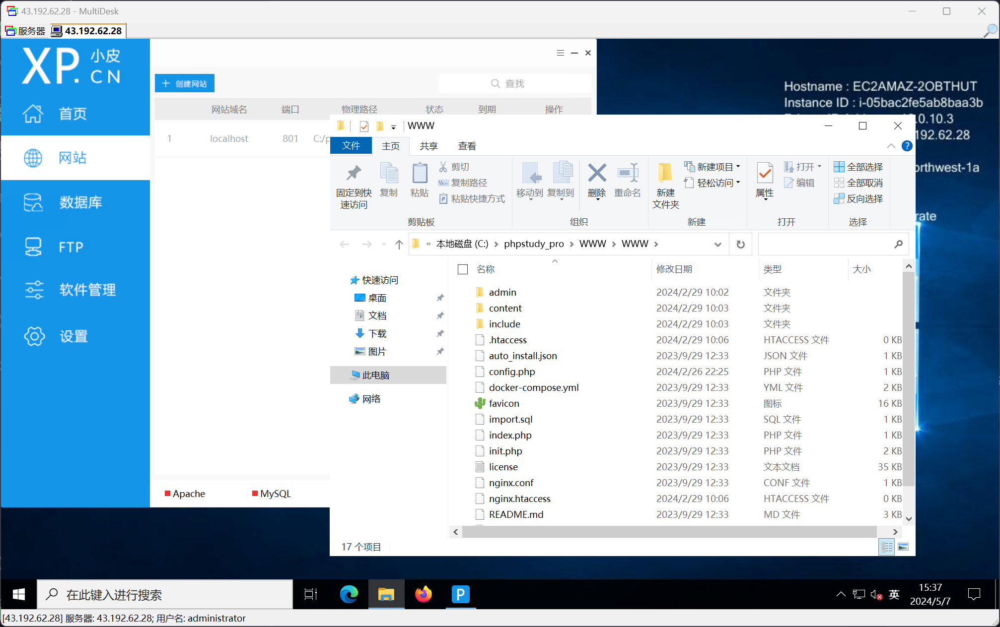
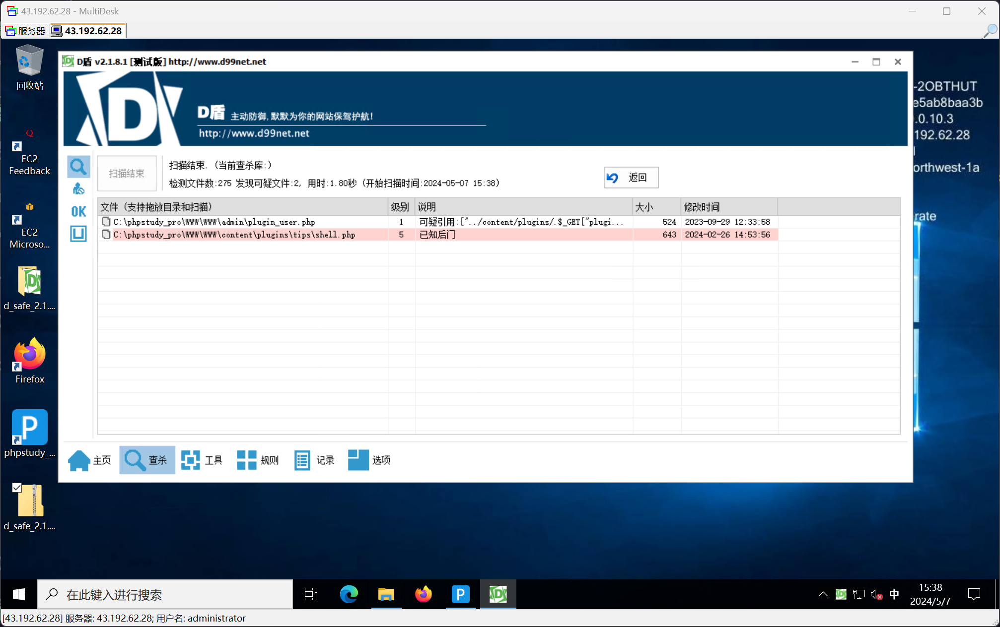
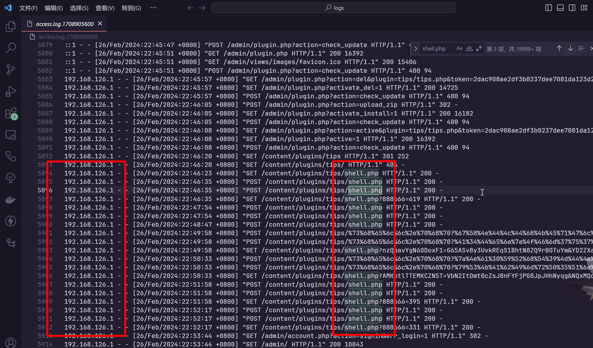
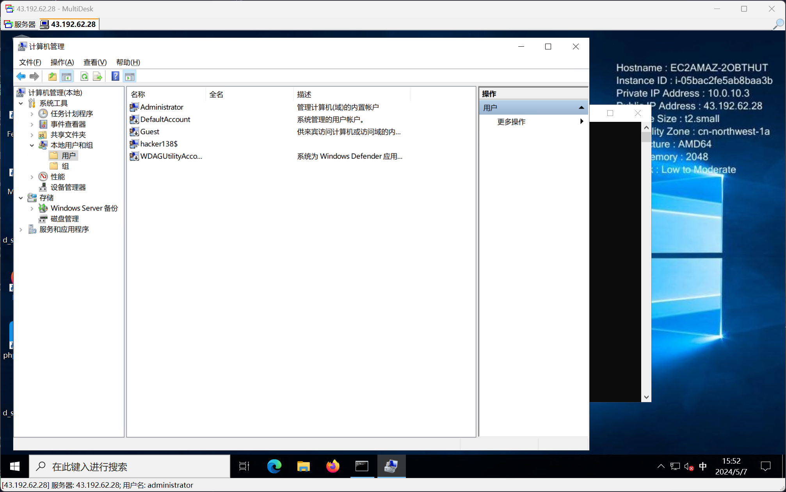

# 第四章 windows 实战 - emlog

## 1

> 通过本地 PC RDP 到服务器并且找到黑客植入 shell, 将黑客植入 shell 的密码 作为 FLAG 提交;

通过 RDP 连接到服务器


在桌面发现 PHPStudy，启动，并进入到 WWW 目录



上传 D 盾进行自动化分析



找到 shell.php 文件，查看文件内容


```plaintext
flag{rebeyond}
```

## 2

> 通过本地 PC RDP 到服务器并且分析黑客攻击成功的 IP 为多少, 将黑客 IP 作为 FLAG 提交;

找到以下 log 文件路径

```plaintext
C:\phpstudy_pro\Extensions\Apache2.4.39\logs
C:\phpstudy_pro\Extensions\Nginx1.15.11\logs
```

注意到 Nginx 日志大小为 0，所以重点关注 apache2 的日志数据

将日志文件传回本地，进行分析



```plaintext
flag{192.168.126.1}
```

## 3

> 通过本地 PC RDP 到服务器并且分析黑客的隐藏账户名称, 将黑客隐藏账户名称作为 FLAG 提交;

以管理员权限执行

```shell
C:\Users\Administrator>net user

\\EC2AMAZ-2OBTHUT 的用户帐户
-------------------------------------------------------------------------------
Administrator            DefaultAccount           Guest
WDAGUtilityAccount

命令成功完成。  
```

在计算机管理中查找所有用户，包括服务账户



```plaintext
flag{hacker138}
```

## 4

> 通过本地 PC RDP 到服务器并且分析黑客的挖矿程序的矿池域名, 将黑客挖矿程序的矿池域名称作为 (仅域名)FLAG 提交;

在攻击者植入的账户的用户目录中，得到


将Python Pyinstaller 打包的程序进行反编译，即可在源码中得到矿池地址

```plaintext
flag{wakuang.zhigongshanfang.top}
```
