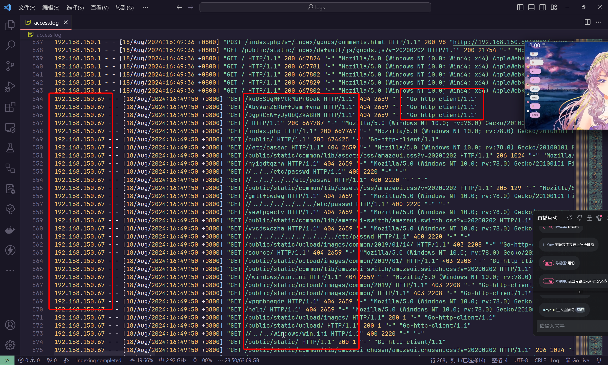

# 第四章 - windows 日志分析

## 1

> 审计桌面的 logs 日志，定位所有扫描 IP，并提交扫描次数

桌面上的 `logs` 文件夹快捷方式，其实际指向 `C:\phpstudy_pro\Extensions\Nginx1.15.11\logs`

将 `logs` 文件夹传回本地，对其中的 `Nginx` 日志进行分析

根据畸形请求包


可以确定 `192.168.150.33` 这个 ip 属于扫描器

根据非常见 User-Agent，以及常见扫描请求路径



可以确定 `192.168.150.67` 这个 ip 也属于扫描器

对 `access.log` 文件中的访问次数进行统计

```shell
┌──(randark ㉿ kali)-[~/tmp]
└─$ cat access.log | awk '{print $1}' | sort -n | uniq -c
    169 127.0.0.1
    524 192.168.150.1
     54 192.168.150.33
      1 192.168.150.60
   6331 192.168.150.67
```

对 `192.168.150.33` 和 `192.168.150.67` 两个 ip 的访问次数进行统计，即可得到结果

```flag
flag{6385}
```

## 2

> 审计相关日志，提交 rdp 被爆破失败次数

服务器上已经提供了一份 `FullEventLogView` 工具，可以直接使用


根据登陆失败的日志


确认事件 id 为 `4625` 之后，筛选事件 id 为 `4625` 的事件


即可得到登陆失败的事件数量，即可得到答案

```flag
flag{2594}
```

## 3

> 审计相关日志，提交成功登录 rdp 的远程 IP 地址，多个以 & 连接, 以从小到大顺序排序提交

确定登陆成功的事件 id 为 `4624` 之后，筛选事件得到


将得到的结果导出为 txt 数据文件，导出到本地进行分析

```python
with open("./a.txt", "r", encoding="utf-16-le") as f:
    log_data = f.read().split("\n")


log_data_ip = [i.strip().replace("源网络地址:\t", "") for i in log_data if" 源网络地址 " in i]

log_data_ip = [i for i in log_data_ip if i != "-" and i != "127.0.0.1"]

log_data_ip_uniq = []

for i in log_data_ip:
    if i not in log_data_ip_uniq:
        log_data_ip_uniq.append(i)

log_data_ip_uniq.sort()

print(log_data_ip_uniq)
```

排除掉本次 RDP 连接 ip 地址之后，得到以下结果

```plaintext
['192.168.150.1', '192.168.150.128', '192.168.150.178', '192.168.150.33']
```

还需要排除掉 `192.168.150.33` 这个 ip 地址


即可得到答案

```plaintext
flag{192.168.150.1&192.168.150.128&192.168.150.178}
```

## 4

> 提交黑客创建的隐藏账号

使用 `net user` 进行查看


并没有发现额外账户，那么可以联想到常见的账户隐藏方式，比如添加 `$` 伪造为服务用户

在用户目录和控制面板中，也未能发现隐藏账户


在 `lusrmgr.msc` 中可以查询到所有用户，包括隐藏账户


即可得到答案

```flag
flag{hacker$}
```

## 5

> 提交黑客创建的影子账号

影子账户理论上在 `lusrmgr.msc` 中也是隐藏的，但是在注册表中还是会有记录

```plaintext
HKEY_LOCAL_MACHINE\SAM\SAM\Domains\Account\Users\Names
```


```flag
flag{hackers$}
```

## 6

> 提交远程 shell 程序的连接 IP + 端口，以 IP:port 方式提交

:::info

做到这里的时候，建议重启一下远程服务器

在 cmd 中执行 `shutdown /r` 即可

:::

执行`netstat -ano`查看结果

```shell

活动连接

  协议  本地地址          外部地址        状态           PID
  TCP    0.0.0.0:135            0.0.0.0:0              LISTENING       860
  TCP    0.0.0.0:445            0.0.0.0:0              LISTENING       4
  TCP    0.0.0.0:3306           0.0.0.0:0              LISTENING       1596
  TCP    0.0.0.0:3389           0.0.0.0:0              LISTENING       1152
  TCP    0.0.0.0:5357           0.0.0.0:0              LISTENING       4
  TCP    0.0.0.0:8088           0.0.0.0:0              LISTENING       1920
  TCP    0.0.0.0:8088           0.0.0.0:0              LISTENING       1972
  TCP    0.0.0.0:8088           0.0.0.0:0              LISTENING       1772
  TCP    0.0.0.0:8088           0.0.0.0:0              LISTENING       1872
  TCP    0.0.0.0:49152          0.0.0.0:0              LISTENING       580
  TCP    0.0.0.0:49153          0.0.0.0:0              LISTENING       912
  TCP    0.0.0.0:49154          0.0.0.0:0              LISTENING       448
  TCP    0.0.0.0:49164          0.0.0.0:0              LISTENING       672
  TCP    0.0.0.0:49165          0.0.0.0:0              LISTENING       2436
  TCP    0.0.0.0:49167          0.0.0.0:0              LISTENING       680
  TCP    10.0.10.6:139          0.0.0.0:0              LISTENING       4
  TCP    10.0.10.6:3389         218.106.157.104:50468  ESTABLISHED     1152
  TCP    10.0.10.6:49172        23.49.60.111:80        SYN_SENT        1152
  TCP    10.0.10.6:49173        23.49.60.96:80         SYN_SENT        2076
  TCP    10.0.10.6:49174        185.117.118.21:4444    SYN_SENT        2976
  TCP    10.0.10.6:49177        23.49.60.96:80         SYN_SENT        2076
  TCP    127.0.0.1:9000         0.0.0.0:0              LISTENING       1612
  TCP    127.0.0.1:9002         0.0.0.0:0              LISTENING       1628
  TCP    127.0.0.1:9004         0.0.0.0:0              LISTENING       1636
  TCP    [::]:135               [::]:0                 LISTENING       860
  TCP    [::]:445               [::]:0                 LISTENING       4
  TCP    [::]:3306              [::]:0                 LISTENING       1596
  TCP    [::]:3389              [::]:0                 LISTENING       1152
  TCP    [::]:5357              [::]:0                 LISTENING       4
  TCP    [::]:49152             [::]:0                 LISTENING       580
  TCP    [::]:49153             [::]:0                 LISTENING       912
  TCP    [::]:49154             [::]:0                 LISTENING       448
  TCP    [::]:49164             [::]:0                 LISTENING       672
  TCP    [::]:49165             [::]:0                 LISTENING       2436
  TCP    [::]:49167             [::]:0                 LISTENING       680
  UDP    0.0.0.0:500            *:*                                    448
  UDP    0.0.0.0:3702           *:*                                    1488
  UDP    0.0.0.0:3702           *:*                                    1488
  UDP    0.0.0.0:4500           *:*                                    448
  UDP    0.0.0.0:5355           *:*                                    1152
  UDP    0.0.0.0:65288          *:*                                    1488
  UDP    10.0.10.6:137          *:*                                    4
  UDP    10.0.10.6:138          *:*                                    4
  UDP    [::]:500               *:*                                    448
  UDP    [::]:3702              *:*                                    1488
  UDP    [::]:3702              *:*                                    1488
  UDP    [::]:4500              *:*                                    448
  UDP    [::]:5355              *:*                                    1152
  UDP    [::]:65289             *:*                                    1488
  UDP    [fe80::ed19:384:ef72:64a8%14]:546  *:*                                    912
```

对外连进行排查，即可定位到

```plaintext
TCP    10.0.10.6:49174        185.117.118.21:4444    SYN_SENT        2976
```

即可得到答案

```plaintext
flag{185.117.118.21:4444}
```

## 7

> 黑客植入了一个远程 shell，审计相关进程和自启动项提交该程序名字

对上文得到的结果进行排查

```shell
> tasklist | findstr "2976"
xiaowei.exe                   2976 RDP-Tcp#0                  2      2,684 K

> wmic process get name,executablepath,processid | findstr 2976
C:\Windows\system64\systemWo\xiaowei.exe  xiaowei.exe             2976       
```

即可得到答案

```flag
flag{xiaowei.exe}
```

## 8

> 黑客使用了计划任务来定时执行某 shell 程序，提交此程序名字

对计划任务库进行排查


其启动程序为`C:\Windows\zh-CN\download.bat`

即可确定答案

```flag
flag{download.bat}
```
