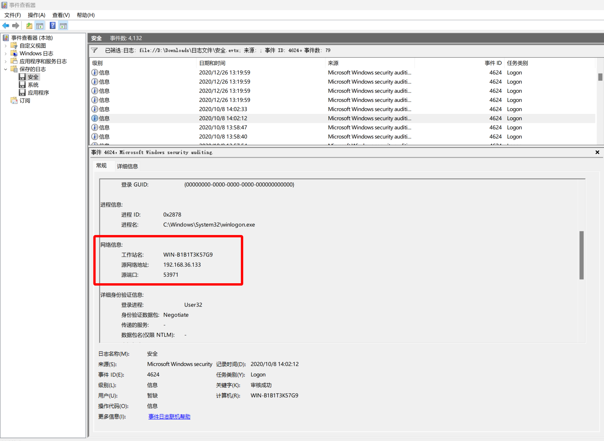
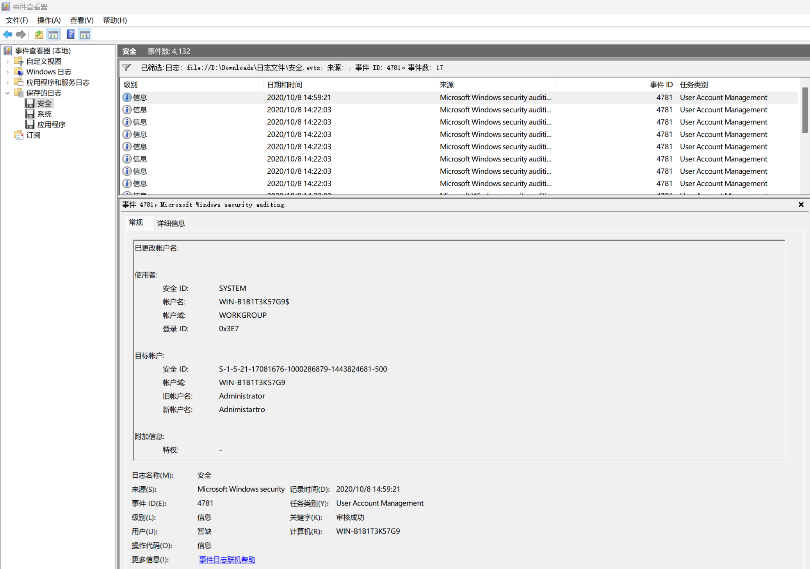
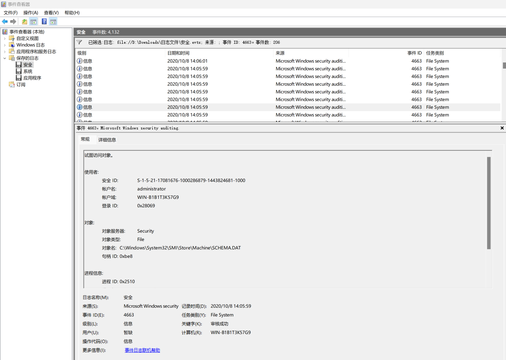
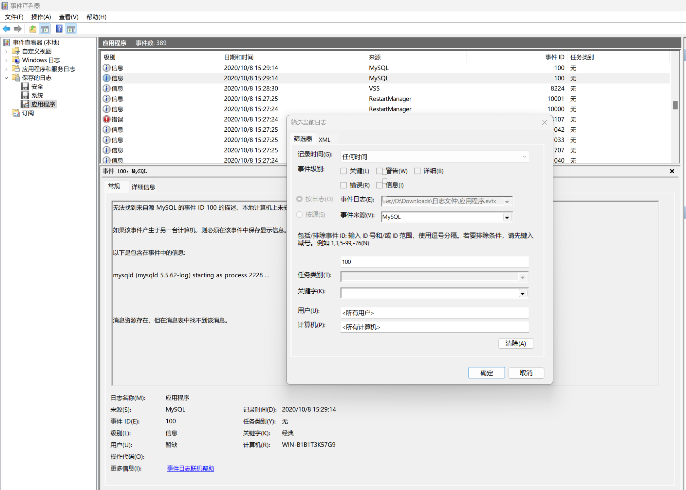
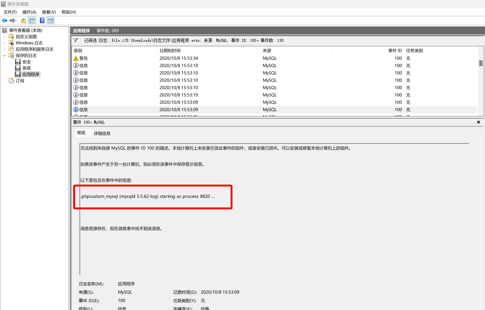
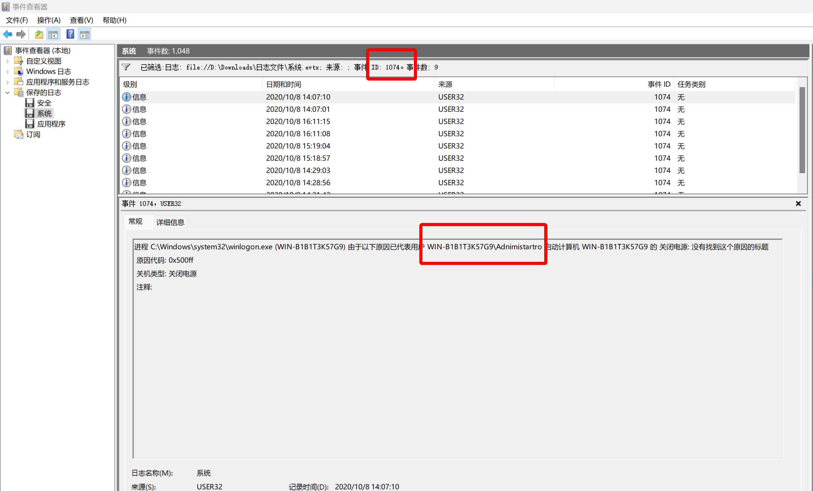

# 第五章 Windows 实战 - evtx 文件分析

## 1

>
> 将黑客成功登录系统所使用的 IP 地址作为 Flag 值提交；

在 Security 的日志中，筛选时间 id 为 4624 的记录



```xml
- <Event xmlns="http://schemas.microsoft.com/win/2004/08/events/event">
- <System>
  <Provider Name="Microsoft-Windows-Security-Auditing" Guid="{54849625-5478-4994-a5ba-3e3b0328c30d}" />
  <EventID>4624</EventID>
  <Version>0</Version>
  <Level>0</Level>
  <Task>12544</Task>
  <Opcode>0</Opcode>
  <Keywords>0x8020000000000000</Keywords>
  <TimeCreated SystemTime="2020-10-08T06:02:12.9152872Z" />
  <EventRecordID>2749</EventRecordID>
  <Correlation />
  <Execution ProcessID="468" ThreadID="832" />
  <Channel>Security</Channel>
  <Computer>WIN-B1B1T3K57G9</Computer>
  <Security />
  </System>
- <EventData>
  <Data Name="SubjectUserSid">S-1-5-18</Data>
  <Data Name="SubjectUserName">WIN-B1B1T3K57G9$</Data>
  <Data Name="SubjectDomainName">WORKGROUP</Data>
  <Data Name="SubjectLogonId">0x3e7</Data>
  <Data Name="TargetUserSid">S-1-5-21-17081676-1000286879-1443824681-500</Data>
  <Data Name="TargetUserName">Adnimistartro</Data>
  <Data Name="TargetDomainName">WIN-B1B1T3K57G9</Data>
  <Data Name="TargetLogonId">0x1530b9</Data>
  <Data Name="LogonType">10</Data>
  <Data Name="LogonProcessName">User32</Data>
  <Data Name="AuthenticationPackageName">Negotiate</Data>
  <Data Name="WorkstationName">WIN-B1B1T3K57G9</Data>
  <Data Name="LogonGuid">{00000000-0000-0000-0000-000000000000}</Data>
  <Data Name="TransmittedServices">-</Data>
  <Data Name="LmPackageName">-</Data>
  <Data Name="KeyLength">0</Data>
  <Data Name="ProcessId">0x2878</Data>
  <Data Name="ProcessName">C:\Windows\System32\winlogon.exe</Data>
  <Data Name="IpAddress">192.168.36.133</Data>
  <Data Name="IpPort">53971</Data>
  </EventData>
  </Event>
```

```plaintext
flag{192.168.36.133}
```

## 2

> 黑客成功登录系统后修改了登录用户的用户名，将修改后的用户名作为 Flag 值提交；

在 Security 的日志中，筛选时间 id 为 4781 的记录



```xml
- <Event xmlns="http://schemas.microsoft.com/win/2004/08/events/event">
- <System>
  <Provider Name="Microsoft-Windows-Security-Auditing" Guid="{54849625-5478-4994-a5ba-3e3b0328c30d}" />
  <EventID>4781</EventID>
  <Version>0</Version>
  <Level>0</Level>
  <Task>13824</Task>
  <Opcode>0</Opcode>
  <Keywords>0x8020000000000000</Keywords>
  <TimeCreated SystemTime="2020-10-08T06:59:21.8627206Z" />
  <EventRecordID>702</EventRecordID>
  <Correlation />
  <Execution ProcessID="464" ThreadID="3068" />
  <Channel>Security</Channel>
  <Computer>WIN-B1B1T3K57G9</Computer>
  <Security />
  </System>
- <EventData>
  <Data Name="OldTargetUserName">Administrator</Data>
  <Data Name="NewTargetUserName">Adnimistartro</Data>
  <Data Name="TargetDomainName">WIN-B1B1T3K57G9</Data>
  <Data Name="TargetSid">S-1-5-21-17081676-1000286879-1443824681-500</Data>
  <Data Name="SubjectUserSid">S-1-5-18</Data>
  <Data Name="SubjectUserName">WIN-B1B1T3K57G9$</Data>
  <Data Name="SubjectDomainName">WORKGROUP</Data>
  <Data Name="SubjectLogonId">0x3e7</Data>
  <Data Name="PrivilegeList">-</Data>
  </EventData>
  </Event>
```

```plaintext
flag{Adnimistartro}
```

## 3

> 黑客成功登录系统后成功访问了一个关键位置的文件，将该文件名称（文件名称不包含后缀）作为 Flag 值提交；

在 Security 的日志中，筛选时间 id 为 4663 的记录



```xml
- <Event xmlns="http://schemas.microsoft.com/win/2004/08/events/event">
- <System>
  <Provider Name="Microsoft-Windows-Security-Auditing" Guid="{54849625-5478-4994-a5ba-3e3b0328c30d}" />
  <EventID>4663</EventID>
  <Version>0</Version>
  <Level>0</Level>
  <Task>12800</Task>
  <Opcode>0</Opcode>
  <Keywords>0x8020000000000000</Keywords>
  <TimeCreated SystemTime="2020-10-08T06:05:59.7708857Z" />
  <EventRecordID>3142</EventRecordID>
  <Correlation />
  <Execution ProcessID="4" ThreadID="196" />
  <Channel>Security</Channel>
  <Computer>WIN-B1B1T3K57G9</Computer>
  <Security />
  </System>
- <EventData>
  <Data Name="SubjectUserSid">S-1-5-21-17081676-1000286879-1443824681-1000</Data>
  <Data Name="SubjectUserName">administrator</Data>
  <Data Name="SubjectDomainName">WIN-B1B1T3K57G9</Data>
  <Data Name="SubjectLogonId">0x28069</Data>
  <Data Name="ObjectServer">Security</Data>
  <Data Name="ObjectType">File</Data>
  <Data Name="ObjectName">C:\Windows\System32\SMI\Store\Machine\SCHEMA.DAT</Data>
  <Data Name="HandleId">0xbe8</Data>
  <Data Name="AccessList">%%1538</Data>
  <Data Name="AccessMask">0x20000</Data>
  <Data Name="ProcessId">0x2510</Data>
  <Data Name="ProcessName">C:\Windows\explorer.exe</Data>
  </EventData>
  </Event>
```

```plaintext
flag{SCHEMA}
```

## 4

> 黑客成功登录系统后重启过几次数据库服务，将最后一次重启数据库服务后数据库服务的进程 ID 号作为 Flag 值提交；

筛选来自 Mysql 服务的事件 id 为 100 的记录



找到相关记录即可



```xml
- <Event xmlns="http://schemas.microsoft.com/win/2004/08/events/event">
- <System>
  <Provider Name="MySQL" />
  <EventID Qualifiers="49152">100</EventID>
  <Level>4</Level>
  <Task>0</Task>
  <Keywords>0x80000000000000</Keywords>
  <TimeCreated SystemTime="2020-10-08T07:53:09.0000000Z" />
  <EventRecordID>313</EventRecordID>
  <Channel>Application</Channel>
  <Computer>WIN-B1B1T3K57G9</Computer>
  <Security />
  </System>
- <EventData>
  <Data>.phpcustom_mysql (mysqld 5.5.62-log) starting as process 8820 ...</Data>
  </EventData>
  </Event>
```

```plaintext
flag{8820}
```

## 5

> 黑客成功登录系统后修改了登录用户的用户名并对系统执行了多次重启操作，将黑客使用修改后的用户重启系统的次数作为 Flag 值提交。

参考这篇资料：[How to check shutdown and reboot logs in Windows servers?](https://manage.accuwebhosting.com/knowledgebase/3897/How-to-check-shutdown-and-reboot-logs-in-Windows-servers.html)



```plaintext
flag{3}
```
