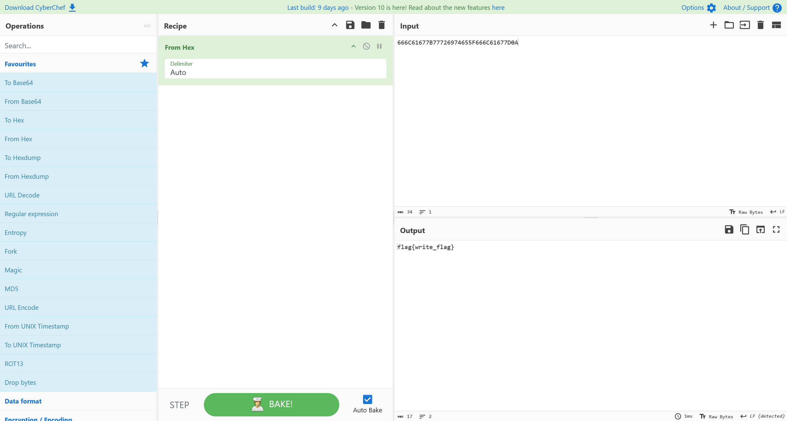

# 第六章 流量特征分析 - 蚁剑流量分析

流量文件不大，直接手动分析就可以

## 1

> 木马的连接密码是多少


很明显可以看到，php 载荷是通过 `1` 这个变量进行传递的

```flag
flag{1}
```

## 2

> 黑客执行的第一个命令是什么

将第一个数据包进行提取，得到以下参数

```plaintext
e5d0dbe94954b3=SR
ma569eedd00c3b=38L2Jpbi9zaA==
ucc3f8650c92ac=AkY2QgIi92YXIvd3d3L2h0bWwiO2lkO2VjaG8gZTEyNGJjO3B3ZDtlY2hvIDQzNTIz
```

基于蚁剑会在Base64编码的头部加上干扰数据，手动判断一下即可


就可以得到具体的参数

```plaintext
ma569eedd00c3b=/bin/sh
ucc3f8650c92ac=cd "/var/www/html";id;echo e124bc;pwd;echo 43523
```

如法炮制，提取所有的交互记录

```plaintext
cd "/var/www/html";id;echo e124bc;pwd;echo 43523
cd "/var/www/html";ls;echo e124bc;pwd;echo 43523
cd "/var/www/html";cat /etc/passwd;echo e124bc;pwd;echo 43523
/var/www/html/flag.txt
/var/www/html/
/var/www/html/config.php
```

```flag
flag{id}
```

## 3

> 黑客读取了哪个文件的内容，提交文件绝对路径

上一题中就有

```flag
flag{/etc/passwd}
```

## 4

> 黑客上传了什么文件到服务器，提交文件名

上文也有

```flag
flag{flag.txt}
```

## 5

> 黑客上传的文件内容是什么

查看流量


拖进Cyberchef做解码，将其中的十六进制载荷进行解码，得到



```flag
flag{write_flag}
```

## 6

> 黑客下载了哪个文件，提交文件绝对路径

在交互记录中，可以看到最后一条

```flag
flag{/var/www/html/config.php}
```
