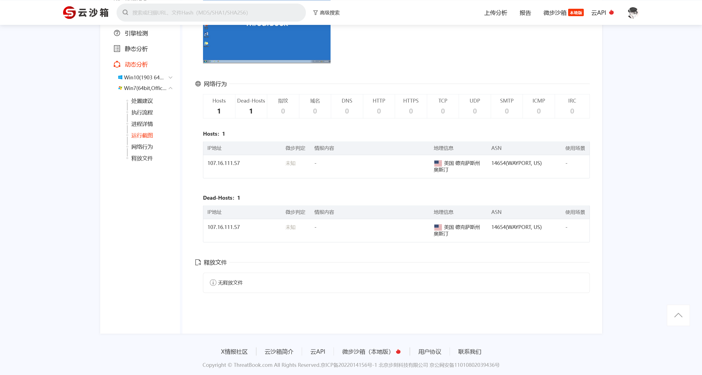

# 第七章 常见攻击事件分析 - 钓鱼邮件

## 1

> 请分析获取黑客发送钓鱼邮件时使用的 IP，flag 格式： flag\{11.22.33.44\}

对 `.eml` 文件进行分析

```plaintext
X-RM-TagInfo: emlType=1
X-RM-SPAM:
X-RM-SPAM-FLAG:00010000
Received:from mail.ffcs.cn (unknown [61.154.14.126])
    by rmmx-cloud_rmmx_9_04-12063 (RichMail) with SMTP id 2f1f61512e47e91-1c7b5;
    Mon, 27 Sep 2021 10:36:55 +0800 (CST)
X-RM-TRANSID:2f1f61512e47e91-1c7b5
X-Magicmail-Tracer: ok
Received: (qmail 191289 invoked by uid 0); 27 Sep 2021 02:36:54 -0000
Received: from 127.0.0.1 by mail.ffcs.cn (envelope-from <ffnic@ffcs.cn>, uid 0) with qmail-scanner-1.24
 (clamdscan: 0.98.4/26074.
 Clear:RC:1 (127.0.0.1):.
 Processed in 0.248744 secs); 27 Sep 2021 02:36:54 -0000
X-MMQ-ID: 191225-3c0c9bf80fa7326cf9859c656a0a8930
X-MMQ-Recipts: none
X-Smtpd-From-Origin: ffnic@ffcs.cn
X-Smtpd-Saved: yes
Received: from unknown (HELO localhost) (ffnic@[127.0.0.1])
          (envelope-sender <ffnic@ffcs.cn>)
          by 0 (magicmail) with SMTP
          for <139xxxx7085@139.com>; 27 Sep 2021 02:36:54 -0000
X-Smtpd-Remotehost: unknown
X-Smtpd-Helo: localhost
X-Smtpd-IP: 127.0.0.1
X-Smtpd-From: ffnic@ffcs.cn
X-Smtpd-To: 139xxxx7085@139.com
X-Smtpd-Sender: ffnic@ffcs.cn
From: "=?UTF-8?B?Y2hlbmxpbmNoZW5nMTM5?=" <ffnic@ffcs.cn>
Sender: "=?UTF-8?B?Y2hlbmxpbmNoZW5nMTM5?=" <ffnic@ffcs.cn>
To: "139xxx" <139xxx@139.com>,
    "136xxx" <136xxx@139.com>,
    "134xxx" <134xxx@139.com>,
    "158xxx" <158xxx@139.com>,
    "139xxx" <139xxx@139.com>,
    "157xxx" <157xxx@139.com>,
    "136xxx" <136xxx@139.com>,
    "135xxx" <135xxx@139.com>
Subject: =?utf-8?B?57uI56uv5a6J5YWo6Ieq5p+l5bel5YW3?=
Date: Mon, 27 Sep 2021 10:36:54 +0800
X-Mailer: MagicMail WebMail (from: 121.204.224.15)
X-Priority: 3
Reply-To: ffnic@ffcs.cn
Message-ID: <975d9479d1be244ee63834d8b775214e@MagicMail>
MIME-Version: 1.0
Content-Type: multipart/mixed;
    boundary="--MagicMail--9f0ea65ae0f1a637"
```

在其中定位到 `X-Mailer: MagicMail WebMail (from: 121.204.224.15)`，即可定位到发送钓鱼邮件时使用的 IP

```flag
flag{121.204.224.15}
```

## 2

> 请分析获取黑客钓鱼邮件中使用的木马程序的控制端 IP，flag 格式：flag\{11.22.33.44\}

对邮件的内容进行解码，得到以下信息

```plaintext
您好！

近期微软高危漏洞爆发，已出现新型勒索病毒，为做好安全防护需对所有员工电脑进行安全自查，附件为安全检测程序。
烦请在电脑上执行此程序，若检测无问题，请回复，感谢！

请勿外传本程序！

解压密码为 2021@123456
```

并且在邮件附件内得到一个 `zip` 压缩文件，解压后得到 终端自查工具. exe，使用 [微步云沙箱](https://s.threatbook.com/report/file/6eef328c3779ec2a6df5a12570bd6a52ed8a4be006279241afeee4d09c68bab4) 进行分析



```flag
flag{107.16.111.57}
```

## 3

> 黑客在被控服务器上创建了 webshell，请分析获取 webshell 的文件名，请使用完整文件格式，flag 格式：flag\{/var/www/html/shell.php\}

使用 D 盾进行分析即可


```flag
flag{/var/www/html/admin/ebak/ReData.php}
```

## 4

> 黑客在被控服务器上创建了内网代理隐蔽通信隧道，请分析获取该隧道程序的文件名，请使用完整文件路径，flag 格式：flag\{/opt/apache2/shell\}

```flag
flag{/var/tmp/proc/mysql}
```
