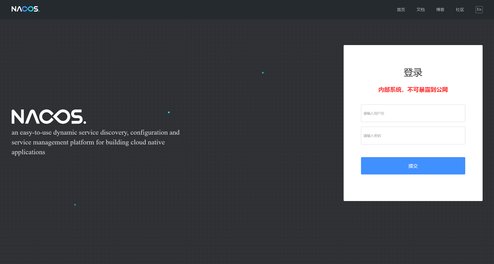

# 内存马分析 - java01 - nacos

## 1

> nacos 用户密码的密文值作为 flag 提交 flag\{密文 \}

运行 `history` 查询命令历史，看到以下记录

```shell
226  vim /etc/systemd/system/nacos.service
```

查看 `nacos` 服务的配置文件

```plaintext title="/etc/systemd/system/nacos.service"
[Unit]
Description=nacos
After=network.target

[Service]
Type=forking
LimitNOFILE=infinity
Environment="JAVA_HOME=/usr/java/jdk1.8.0_202/"
ExecStart=/var/local/autorun_nacos.sh
#ExecReloa=/var/local/nacos/bin/shutdown.sh
#ExecStop=/var/local/nacos/bin/shutdown.sh
PrivateTmp=true

[Install]
WantedBy=multi-user.target
```

继续跟踪

```shell title="/var/local/autorun_nacos.sh"
#!/bin/bash


rm -rf /var/local/nacos
cd /var/local/ && unzip nacos-server-2.0.1.zip
cd /var/local/nacos/bin/ && ./startup.sh -m standalone
```

尝试启动服务

```shell
(remote) root@vulntarget:/root# systemctl restart nacos
(remote) root@vulntarget:/root# systemctl status nacos
● nacos.service - nacos
     Loaded: loaded (/etc/systemd/system/nacos.service; enabled; vendor preset: enabled)
     Active: active (running) since Tue 2024-10-15 10:16:57 UTC; 2s ago
    Process: 1455 ExecStart=/var/local/autorun_nacos.sh (code=exited, status=0/SUCCESS)
      Tasks: 10 (limit: 2253)
     Memory: 170.1M
     CGroup: /system.slice/nacos.service
             └─1492 /usr/java/jdk1.8.0_202//bin/java -Xms512m -Xmx512m -Xmn256m -Dnacos.standalone=true -Dnacos.member.list= -Djava.ext.dirs=/usr/java/jdk1.8.0_202//jre/lib/ext:/usr/java/jdk1.8.0_202//lib/ex>

Oct 15 10:16:56 vulntarget autorun_nacos.sh[1468]:   inflating: nacos/conf/schema.sql
Oct 15 10:16:56 vulntarget autorun_nacos.sh[1468]:   inflating: nacos/LICENSE
Oct 15 10:16:56 vulntarget autorun_nacos.sh[1468]:   inflating: nacos/nacos_config_export_20231206050259.zip
Oct 15 10:16:56 vulntarget autorun_nacos.sh[1468]:   inflating: nacos/NOTICE
Oct 15 10:16:56 vulntarget autorun_nacos.sh[1468]:    creating: nacos/target/
Oct 15 10:16:57 vulntarget autorun_nacos.sh[1468]:   inflating: nacos/target/nacos-server.jar
Oct 15 10:16:57 vulntarget autorun_nacos.sh[1473]: /usr/java/jdk1.8.0_202//bin/java  -Xms512m -Xmx512m -Xmn256m -Dnacos.standalone=true -Dnacos.member.list= -Djava.ext.dirs=/usr/java/jdk1.8.0_202//jre/lib/ex>
Oct 15 10:16:57 vulntarget autorun_nacos.sh[1473]: nacos is starting with standalone
Oct 15 10:16:57 vulntarget autorun_nacos.sh[1473]: nacos is starting，you can check the /var/local/nacos/logs/start.out
Oct 15 10:16:57 vulntarget systemd[1]: Started nacos.
```

成功访问到 Nacos 服务



在 Nacos 数据库配置文件中寻找用户密码部分

```shell
(remote) root@vulntarget:/var/local/nacos/conf# cat nacos-mysql.sql | grep password
        `password` varchar(500) NOT NULL,
INSERT INTO users (username, password, enabled) VALUES ('nacos', '$2a$10$EuWPZHzz32dJN7jexM34MOeYirDdFAZm2kuWj7VEOJhhZkDrxfvUu', TRUE);
```

即可确认答案

```flag
flag{$2a$10$EuWPZHzz32dJN7jexM34MOeYirDdFAZm2kuWj7VEOJhhZkDrxfvUu}
```

## 2

> shiro 的 key 为多少 shiro 的 key 请记录下来 （请记录下来，会有用）

在 Nacos 的目录下，存在有一个配置文件的备份文件

```shell
(remote) root@vulntarget:/var/local/nacos# ls -lh
total 52K
drwxr-sr-x 4 root staff 4.0K Oct 15 10:17 bin
drwxr-sr-x 2 root staff 4.0K Jan  1  1970 conf
drwxr-sr-x 7 root staff 4.0K Oct 15 10:17 data
-rw-r--r-- 1 root staff  17K Jan  1  1970 LICENSE
drwxr-sr-x 2 root staff 4.0K Oct 15 10:17 logs
-rw-r--r-- 1 root staff 4.4K Dec  6  2023 nacos_config_export_20231206050259.zip
-rw-r--r-- 1 root staff 1.3K Jan  1  1970 NOTICE
drwxr-sr-x 2 root staff 4.0K Jan  1  1970 target
```

查看备份文件的内容

```shell
(remote) root@vulntarget:/var/local/nacos# unzip -l nacos_config_export_20231206050259.zip
Archive:  nacos_config_export_20231206050259.zip
  Length      Date    Time    Name
---------  ---------- -----   ----
      152  2023-12-06 05:02   DEFAULT_GROUP/GATEWAY
     3686  2023-12-06 05:02   DEFAULT_GROUP/ADMIN_CONFIG
     3243  2023-12-06 05:02   DEFAULT_GROUP/ADMIN_API
---------                     -------
     7081                     3 files
```

将其中的文件解压出来，在其中 `ADMIN_CONFIG` 文件中找到 shiro 配置文件

```plaintext title="ADMIN_CONFIG"
#权限认证
shiro:
  enabled: true
  set-login-uri: /login
  key: KduO0i+zUIMcNNJnsZwU9Q==
```

即可确认答案

```flag
flag{KduO0i+zUIMcNNJnsZwU9Q==}
```

## 3

> 靶机内核版本为 flag\{\}

借助 `uname` 查看内核版本信息

```shell
(remote) root@vulntarget:/tmp/DEFAULT_GROUP# uname -r
5.4.0-164-generic
```

即可得到答案

```flag
flag{5.4.0-164-generic}
```

## 4

> 尝试应急分析，运行 get_flag 然后尝试 check_flag 通过后提交

:::info

此题已下架

:::

找一下程序的位置

```shell
(remote) root@vulntarget:/root# find / -name "get_flag"
/home/vulntarget/get_flag

(remote) root@vulntarget:/home/vulntarget# ls -lh
total 19M
-rwxrwxrwx 1 vulntarget vulntarget 9.3M Oct 13  2023 check_flag
-rwxrwxrwx 1 vulntarget vulntarget 9.3M Oct 13  2023 get_flag
```

根据指纹信息，确认为 `pyinstaller` 打包的 Python 项目，提取其 pyc 文件并反编译得到

```python title="get_flag"
#!/usr/bin/env python
# visit https://tool.lu/pyc/ for more information
# Version: Python 3.8

import time
import hashlib
import subprocess


def Get_FLag():
    current_time = str(int(time.time()))
    hash_object = hashlib.md5(current_time.encode())
    hash_hex = hash_object.hexdigest()
    print(f"""[+] current time: {time.ctime()}""")
    print("[-] flag{" + hash_hex + "}")


def Get_flag():
    part1 = "vuln"
    part2 = "tar"
    part3 = "get-m-01"
    text = part1 + part2 + part3
    hash_object = hashlib.md5(text.encode())
    hash_hex = hash_object.hexdigest()
    print("[+] flag{" + hash_hex + "}")


def Check_process():
    keyword = "nacos"
    command = f"""ps aux | grep \'{keyword}\'"""
    output = subprocess.getoutput(command)
    if "nacos-server" in output:
        print("[+] info nacos 程序存在...")
        return True
    None("[-] ERROR")
    return False


def Check_User():
    keyword = "adrla7IBSf"
    command = f"""cat /etc/passwd | grep \'{keyword}\'"""
    output = subprocess.getoutput(command)
    if "adrla7IBSfTZQ" in output:
        print("[-] ERROR")
        return False
    None("[+] info 后门用户已清除...")
    return True


def Check_flag():
    if Check_User() and Check_process():
        Get_flag()
    else:
        Get_FLag()


if __name__ == "__main__":
    Check_flag()
```

```python title="check_flag"
# Visit https://www.lddgo.net/string/pyc-compile-decompile for more information
# Version : Python 3.8

import re
import hashlib

def Get_flag():
    part1 = 'vuln'
    part2 = 'tar'
    part3 = 'get-m-01'
    text = part1 + part2 + part3
    hash_object = hashlib.md5(text.encode())
    hash_hex = hash_object.hexdigest()
    flag = 'flag{' + hash_hex + '}'
    return flag


def check():
    pass
# WARNING: Decompyle incomplete

if __name__ == '__main__':
    check()
```

以及

那也就意味着，只需要在 `/etc/passwd` 中删除 `bt` 后门用户，并保证 `nacos` 服务处于运行状态即可

```shell
(remote) root@vulntarget:/home/vulntarget# nano /etc/passwd
(remote) root@vulntarget:/home/vulntarget# ./get_flag
[+] info 后门用户已清除...
[+] info nacos 程序存在...
[+] flag{6c3742aaf26a6dea7fe9d7731de59517}
(remote) root@vulntarget:/home/vulntarget# ./check_flag
[+] please input your flag: lag{6c3742aaf26a6dea7fe9d7731^C
(remote) root@vulntarget:/home/vulntarget# ./check_flag
[+] please input your flag: flag{6c3742aaf26a6dea7fe9d7731de59517}
[+] 恭喜，当前机器应急成功！
```

即可得到 flag

```flag
flag{6c3742aaf26a6dea7fe9d7731de59517}
```

## 5

> 尝试修复 nacos 并且自行用 poc 测试是否成功 此题无 flag

漏洞点存在于 `nacos` 的默认密码，`shiro` 服务存在有反序列化点

只需要将 `nacos` 的用户密码进行修改，并对 `shiro` 的 key 进行修改即可
