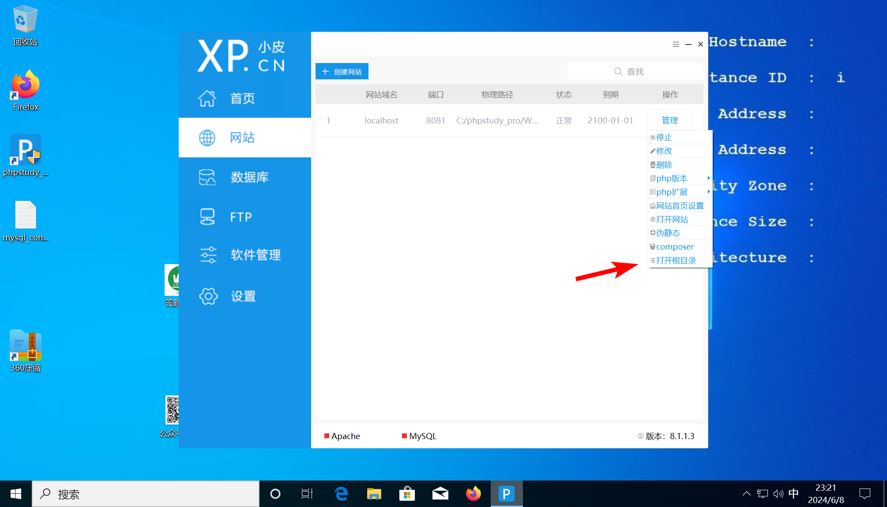
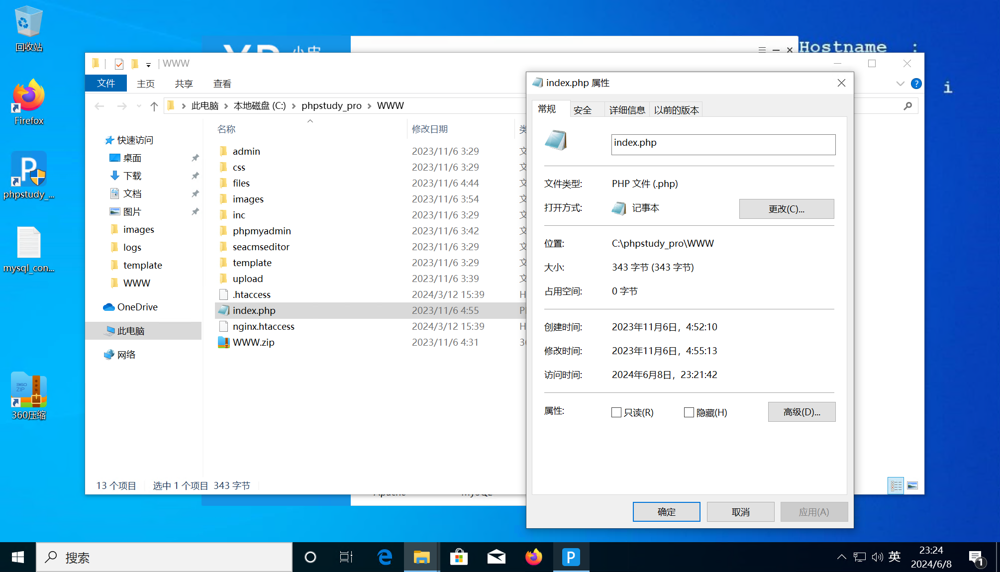
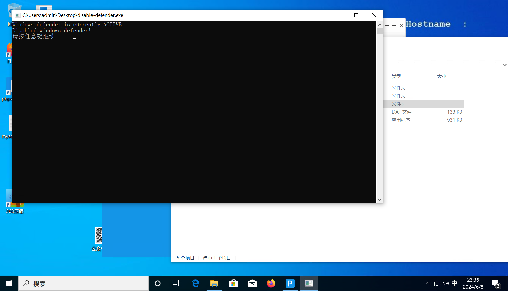

# 第九章 - Where-1S-tHe-Hacker

## 1

> 通过本地 PC RDP 到服务器并且找到黑客 ID 为多少, 将黑客 ID 作为 FLAG 提交

通过 RDP 连接到靶机之后，在桌面发现 PHPStudy 环境，启动环境，并打开网站目录



在其中发现 `index.php` 文件

```html
<html>
<center><br>

    <HEAD>
        <title>hacked</title><br>
    </HEAD>

    <body bgcolor="#000000">
        <center>
            <div style="border: 2px solid;overflow: auto; color: black; background-color: black; width: 80%;">
                <h2>
                    <center> <br />
                        <FONT face="Monotype Corsiva" size="6" color="#ffffff">hacker by:X123567X <br>
                    </center>
    </body>
```

在其中定位到 `hacker by:X123567X`

```flag
flag{X123567X}
```

## 2

> 通过本地 PC RDP 到服务器并且找到黑客在什么时间修改了网站主页, 将黑客修改了网站主页的时间 作为 FLAG 提交（y-m-d-4:22:33）

右键查看文件属性



得知文件的修改时间为 `2023 年 11 月 6 日，  4:55:13`

```flag
flag{2023-11-6-4:55:13}
```

## 3

> 通过本地 PC RDP 到服务器并且找到黑客第一个 webshell 文件名是, 将第一个 webshell 文件名 作为 FLAG 提交

首先，使用 [Defender Control - Github](https://github.com/qtkite/defender-control/) 将靶机上的 Microsoft Defender 禁用，以防止靶机的杀毒软件破坏环境



将网站的目录压缩为 zip 文件


然后将 zip 文件传输到本地解压后，使用 D 盾进行分析


TODO 还没写完

```flag
flag{SystemConfig.php}
```

## 4

> 通过本地 PC RDP 到服务器并且找到黑客第二个 webshell 文件名是, 将第二个 webshell 文件名 作为 FLAG 提交

直接使用杀毒软件进行查杀，在查杀记录中得到

```flag
flag{syscon.php}
```

## 5

> 通过本地 PC RDP 到服务器并且找到黑客第二个 webshell 的连接密码是, 将第二个 webshell 的连接密码 作为 FLAG 提交

```flag
flag{pass}
```

## 6

> 通过本地 PC RDP 到服务器并且找到黑客新建的隐藏账户, 将新建的隐藏账户名字 作为 FLAG 提交

```flag
flag{admin$}
```

## 7

> 通过本地 PC RDP 到服务器并且找到黑客隐藏账户创建时间是, 将隐藏账户创建时间是 作为 FLAG 提交（答案格式：2024/12/3 9:16:23）

```flag
flag{2023/11/6 4:45:34}
```

## 8

> 通过本地 PC RDP 到服务器并且找到黑客添加隐藏账户进管理员组的时间, 将添加隐藏账户进管理员组的时间 作为 FLAG 提交（答案格式：2024/12/3 9:16:23）

```flag
flag{2023/11/6 4:46:07}
```

## 9

> 通过本地 PC RDP 到服务器并且找到黑客在什么时间从文件中读取保留的密钥, 将读取保留的密钥的时间 作为 FLAG 提交（答案格式：2024/12/3 9:16:23）

```flag
flag{2023/11/6 4:46:58}
```

## 10

> 通过本地 PC RDP 到服务器并且找到黑客通过隐藏账户通过 (PTH) 哈希传递攻击登录的时间是, 将 (PTH) 哈希传递攻击登录的时间 作为 FLAG 提交

```flag
flag{2023/11/6 4:47:28}
```

## 11

> 通过本地 PC RDP 到服务器并且找到黑客上传的两个 CobaltStrike 木马文件名, 将上传的两个 CobaltStrike 木马文件名 作为 FLAG 提交（答案格式："A.exe,B.exe"）

```flag
flag{SystemTemp.exe,SysnomT.exe}
```
